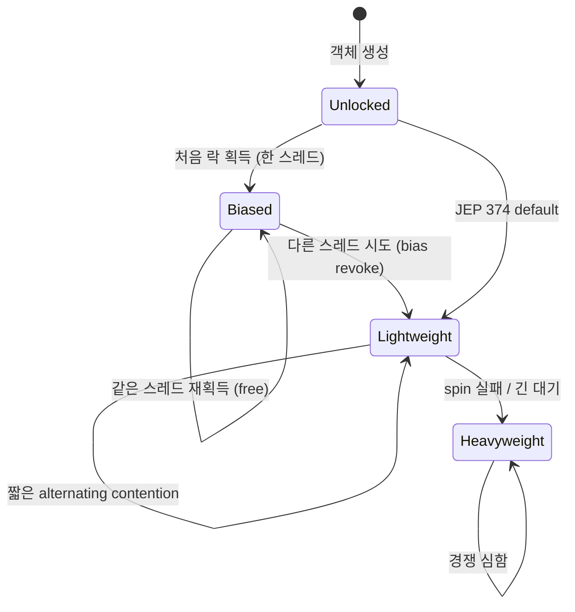

# 10. synchronized 내부

## 핵심 한 줄

`synchronized` 는 contention 에 따라 **Biased → Lightweight → Heavyweight** 3단계로 inflation 한다. JIT (Just-In-Time compilation, 즉시 컴파일) 가 contention 패턴을 보면서 자동으로 단계 조정. JDK 15 부터 Biased Lock 은 deprecate, JDK 18+ default off (JEP 374). 이 진화 메커니즘 이해는 thread dump / async-profiler 분석에 필수.

## 객체 헤더 — Mark Word

모든 Java 객체는 헤더 (8B 또는 12B) 를 가지고, 그 안의 **Mark Word** (보통 64-bit JVM 에서 8B) 가 락 상태 + GC 정보 + identity hash 를 인코딩한다.

```
64-bit JVM, normal object Mark Word (단순화):

| 25b unused | 31b identity_hash | 1b cms_free | 4b age | 1b biased_lock | 2b lock_state |

lock_state:
  01 = unlocked / biased
  00 = lightweight locked (stack-locked)
  10 = heavyweight locked (monitor-inflated)
  11 = marked for GC

biased_lock 비트 + lock_state=01:
  - biased_lock=0 → unlocked
  - biased_lock=1 → biased to thread X (Mark Word 에 thread id 저장)
```

상태에 따라 Mark Word 의 비트 의미가 *재해석* 된다 — 같은 8B 가 unlocked, biased, lightweight, heavyweight 별로 다른 정보를 담는다.

## 단계 1: Biased Lock (편향 락)

**가정**: 락은 *대부분 한 스레드만* 잡는다 (실측 통계). 그렇다면 그 스레드가 다음 번 락 획득 시 CAS 도 안 하고 그냥 진입 가능.

### 동작
1. 스레드 T1 이 처음 락 획득 → Mark Word 에 T1 의 thread ID 기록 (CAS 1회)
2. T1 이 같은 락 다시 획득 → Mark Word 검사만, **CAS 없음** → 거의 무료
3. 다른 스레드 T2 가 시도 → Bias Revocation (편향 취소) → safepoint 에서 Lightweight Lock 으로 승격

### JEP 374 (JDK 15+ deprecate, JDK 18+ default off)

이유:
- 현대 JVM 의 일반적 워크로드는 *경합이 자주 일어남* (스레드 풀 + concurrent collections) — biased lock 의 가정이 깨짐
- bias revocation 자체가 safepoint 발동 → 응답 시간 튐
- HotSpot 코드 복잡도 ↑

→ 신규 JDK 25 환경에선 사실상 **Lightweight 부터 시작** 으로 단순화.

## 단계 2: Lightweight Lock (경량 락)

**가정**: contention 이 있어도 *교대로 (alternating)* 락 잡음. 한 스레드가 락 들고 critical section 도는 동안 다른 스레드는 짧은 시간만 대기.

### 동작
1. T1 이 진입 시도 → 자기 stack 에 **Lock Record** 할당 (Mark Word 복사)
2. CAS 로 Mark Word 를 Lock Record 의 포인터로 교체 → 성공하면 락 보유
3. T2 가 진입 시도 → CAS 실패 → **spin** 잠깐 (수십 µs) → 그래도 안 풀리면 Heavyweight 로 inflation
4. T1 이 unlock → Mark Word 복원

### 비용
- CAS 1회 + stack 의 Lock Record (수십 바이트)
- **OS mutex 안 씀** — 사용자 공간에서 끝남
- spin 비용은 contention 짧을 때만 효율적

## 단계 3: Heavyweight Lock (중량 락)

**가정**: 락이 *오래* 걸리고 *경쟁* 이 심함. spin 으로 답 안 나옴 → OS 에 위임.

### 동작
1. ObjectMonitor 객체 (네이티브 자료구조) 할당 → Mark Word 가 ObjectMonitor 포인터로 교체
2. 락 획득 못 한 스레드는 OS 의 wait queue 로 들어가서 BLOCKED → 컨텍스트 스위칭
3. 락 풀리면 OS 가 wait queue 의 스레드 깨움

### 비용
- ObjectMonitor 할당 (영구적, 객체 GC 시 같이)
- 컨텍스트 스위칭 (수 µs ~ 수십 µs)
- 캐시 invalidation 비용

→ **lock inflation** 은 thread dump / JFR 분석에서 잡히는 핵심 신호. JFR 의 `jdk.JavaMonitorEnter` 이벤트가 lightweight → heavyweight 전이 시점을 기록.

## 진화 다이어그램



## 락 inflation 신호 — thread dump

```
"http-nio-8080-exec-3" #42 daemon
   java.lang.Thread.State: BLOCKED (on object monitor)
        at com.kgd.foo.Service.method(Service.java:30)
        - waiting to lock <0x000000076a3b9c80> (a com.kgd.foo.Service)
        at ...

"http-nio-8080-exec-7" #46 daemon
   java.lang.Thread.State: RUNNABLE
        at com.kgd.foo.Service.method(Service.java:30)
        - locked <0x000000076a3b9c80> (a com.kgd.foo.Service)
```

- `0x076a3b9c80` 가 ObjectMonitor 주소
- 여러 스레드가 BLOCKED 상태로 같은 monitor 주소를 기다리면 **heavyweight inflation 확정 + contention hot spot**

## JIT 의 락 최적화 4가지

JIT 는 단순히 inflation 단계만 조정하는 게 아니라, 더 적극적으로 락을 *제거*/*확장* 한다.

### 1. Lock Elision (락 제거)
스레드 외부로 escape 안 한 객체에 대한 락은 제거. *escape analysis* 결과에 의존.

```kotlin
fun foo() {
    val sb = StringBuilder()    // 로컬, escape 안 함
    sb.append("a")              // StringBuilder 의 synchronized 메서드들
    return sb.toString()
}
```

→ JIT 가 `sb` 가 escape 안 함을 증명하면 모든 synchronized 제거.

### 2. Lock Coarsening (락 확장)
연속된 작은 lock/unlock 을 하나로 합침.

```java
synchronized (lock) { x = 1; }
synchronized (lock) { y = 1; }
// → JIT 가 합칠 수 있음
synchronized (lock) { x = 1; y = 1; }
```

오버헤드 감소.

### 3. Adaptive Spinning
Heavyweight 단계에서도 OS wait 직전에 잠깐 spin. 직전 spin 성공률에 따라 spin 횟수 조정.

### 4. ObjectMonitor 캐싱
ObjectMonitor 인스턴스 풀링.

## ReentrantLock 과 비교

| 측면 | `synchronized` | `ReentrantLock` |
|---|---|---|
| 단계적 inflation | Yes (biased→light→heavy) | 항상 AQS-기반 (heavyweight 와 유사) |
| JIT 최적화 강도 | 매우 강 (elision, coarsening) | 약함 (일반 메서드 호출) |
| Wait queue 구현 | OS-level (heavyweight) | AQS CLH queue |
| 표현력 | wait/notify 1개 | tryLock, fair, multi-Condition |

→ 단순한 동기화는 `synchronized` 가 도리어 빠른 경우가 많다. JIT 가 더 많은 카드를 가짐.

## 면접 단골

**Q. `synchronized` 가 어떻게 진화하나?**

비편향 (unlocked) → 편향 락 (biased, 한 스레드 재획득에 최적화) → 경량 락 (lightweight, CAS + stack 의 Lock Record) → 중량 락 (heavyweight, OS mutex + ObjectMonitor). contention 이 늘어날수록 단계가 올라간다. 단 JDK 15+ 에선 biased lock 이 default off (JEP 374) 라 lightweight 부터 시작.

**Q. `synchronized` 와 `ReentrantLock` 의 성능?**

JIT 가 `synchronized` 에 더 많은 최적화를 적용 (elision, coarsening, adaptive spinning). contention 낮은 일반 코드는 `synchronized` 가 빠르거나 동등. ReentrantLock 의 진가는 표현력 (`tryLock`, `lockInterruptibly`, fairness) 에서 나온다. 성능만 보고 ReentrantLock 으로 갈 이유 없음.

**Q. lock inflation 을 어떻게 진단하나?**

JFR 의 `jdk.JavaMonitorEnter` 이벤트가 heavyweight 진입을 기록. async-profiler 의 `--lock` 옵션도 contended monitor 통계를 표시. thread dump 에서 다수의 BLOCKED 가 같은 monitor 주소를 기다리면 그 락이 heavyweight inflation 됐고 hot spot 임을 강하게 시사.

**Q. JEP 374 (Biased Lock 제거) 의 동기?**

(1) 현대 워크로드는 멀티스레드 access 가 일반적이라 biased lock 가정이 안 맞음. (2) bias revocation 이 safepoint 를 발동시켜 응답 시간 튀게 만듦. (3) HotSpot 코드 유지비용. JDK 15 deprecate, JDK 18+ default off. 신규 코드에선 biased lock 의 존재를 가정하지 않는 게 맞다.

**Q. lock elision 이 가능한 조건?**

JIT 의 escape analysis 가 락 객체가 *현재 스레드를 벗어나지 않음* 을 증명할 때. 로컬 변수의 `StringBuilder`, `synchronized List` 등이 메서드 안에서만 쓰이고 다른 스레드에 노출되지 않으면 모든 synchronized 가 사라진다. JIT compile log (`-XX:+PrintCompilation -XX:+PrintInlining`) 또는 JITWatch 로 확인.

## 다음 학습

- [11-concurrenthashmap-internals.md](11-concurrenthashmap-internals.md) — bin 단위 synchronized 활용
- [20-thread-dump-analysis.md](20-thread-dump-analysis.md) — lock inflation 진단
- [21-profiling-tools.md](21-profiling-tools.md) — JFR Lock Inflation 이벤트
