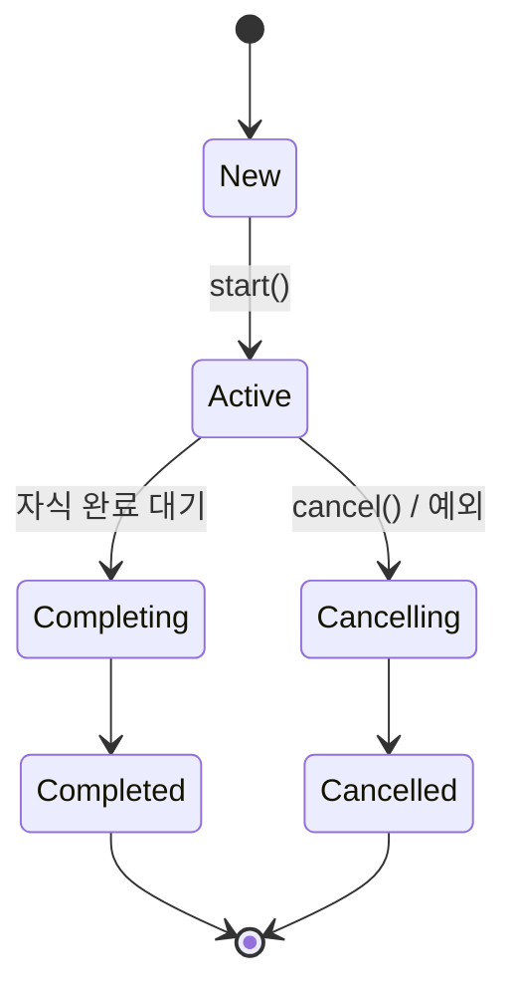

# 16. Structured Concurrency

## 핵심 한 줄

**구조적 동시성** = "비동기 작업의 lifetime 이 코드 구조 (scope) 에 종속된다." `CoroutineScope` 가 상위 함수 종료 전 자식 coroutine 의 *완료 또는 cancel 을 보장* 한다. 이게 callback 지옥 + leak 의 가장 큰 해독제.

## 문제: unstructured concurrency

```kotlin
// 전통적 패턴 — 어디서 끝나는지 안 보임
fun process(req: Request) {
    Thread { fetchA() }.start()      // 어디 lifetime?
    Thread { fetchB() }.start()      // process 끝나도 살아있음
    return "OK"                       // 자식 잡 leak
}
```

문제:
- process 가 return 후에도 Thread 들이 살아있음 (leak)
- 한쪽이 실패해도 다른 쪽 계속
- 부모 cancel 시 자식 자동 cancel 안 됨
- 예외가 이상한 곳에서 터짐 (부모는 모름)

## 해결: structured

```kotlin
suspend fun process(req: Request): String = coroutineScope {
    val a = async { fetchA() }
    val b = async { fetchB() }
    "${a.await()}:${b.await()}"
}
// process 끝날 땐 a, b 자식 coroutine 도 *반드시* 끝나거나 취소된 상태
```

규칙:
- `coroutineScope { }` 안의 모든 자식 coroutine 은 *블록이 끝나기 전* 완료 또는 cancel
- 자식 한 명 실패 → 형제 자동 cancel (하나 빼고 나머진 무의미)
- 부모 cancel → 자식 cascade cancel
- 예외는 부모로 전파

## Job 트리

```
CoroutineScope (root Job)
  ├── launch (Job1)
  │    ├── launch (Job1.1)
  │    └── async (Job1.2)
  ├── launch (Job2)
  │    └── async (Job2.1)
  └── coroutineScope (innerJob)
       ├── async (innerJob.1)
       └── async (innerJob.2)
```

각 coroutine 은 부모 Job 의 *자식*. 부모 cancel ⇒ 모든 자식 cancel. 자식 실패 ⇒ 부모 cancel ⇒ 형제 cancel (cascade).

## CoroutineScope vs coroutineScope

```kotlin
val scope: CoroutineScope = CoroutineScope(Dispatchers.IO + SupervisorJob())
scope.launch { ... }

// vs

suspend fun foo() = coroutineScope {     // builder, suspend 함수 안에서
    launch { ... }
    async { ... }.await()
}
```

| | `CoroutineScope(...)` | `coroutineScope { }` |
|---|---|---|
| 위치 | top-level (e.g., bean) | suspend block 안 |
| lifetime | 명시적 cancel 까지 | 블록 종료까지 |
| 부모 | 없음 (root) | 호출자의 scope 자식 |
| 사용 | service-level (long-lived) | function-level (request-scoped) |

## Job, SupervisorJob, supervisorScope

### Job — 일반 자식 (실패 cascade)

```kotlin
coroutineScope {
    launch { delay(100); throw RuntimeException("a fails") }
    launch { delay(1000); println("b") }   // 절대 출력 안 됨 (a 실패로 cancel)
}
```

### SupervisorJob / supervisorScope — 자식 격리

```kotlin
supervisorScope {
    launch { delay(100); throw RuntimeException("a fails") }
    launch { delay(1000); println("b") }   // 출력됨 (a 실패 격리)
}
```

→ 한 자식의 실패가 다른 형제에 영향 없음. 단 부모 cancel 은 여전히 cascade.

```kotlin
// 서비스 빈 — long-running scope, 자식 격리 권장
val scope = CoroutineScope(SupervisorJob() + Dispatchers.IO)
```

> **언제 SupervisorJob?**
> - 여러 독립 background worker (NotificationDispatcher, OutboxRelay 등)
> - HTTP request handler 의 부수 효과 (logging, audit)
> - 한 자식 실패가 다른 자식에 무관할 때

> **언제 일반 Job?**
> - "다 같이 성공해야 의미 있는" 작업 (multi-call zip)
> - failure-fast 가 정답인 경우

## 예외 전파 규칙

| 빌더 | 자식 예외 어디로? |
|---|---|
| `launch` | 부모 Job 으로 *즉시* 전파 (CoroutineExceptionHandler 또는 cancel) |
| `async` | `Deferred` 에 저장, `await()` 호출 시에만 throw |
| `coroutineScope` | 자식 어느 한 명이라도 실패 → 즉시 다른 자식 cancel + 블록에 throw |
| `supervisorScope` | 자식 실패 격리, 자식이 직접 처리하지 않으면 sliently lost |

### `async` + 예외의 함정

```kotlin
val def = scope.async { throw RuntimeException("oops") }
// 여기선 아무 일도 안 일어남
delay(1000)
def.await()    // ← 여기서 throw (호출 안 했으면 silent)
```

→ `async` 는 결과를 받을 의도. await 안 부르면 예외 silent. **CoroutineExceptionHandler** 로 root scope 에서 보강.

## CoroutineExceptionHandler

```kotlin
val handler = CoroutineExceptionHandler { _, e ->
    log.error(e) { "uncaught coroutine exception" }
}
val scope = CoroutineScope(SupervisorJob() + Dispatchers.IO + handler)

scope.launch { throw RuntimeException("x") }   // handler 가 잡음
```

- `launch` 의 uncaught 예외만 처리 (`async` 는 await 까지 보유)
- root scope 에 한 번 두면 모든 자식의 default handler

## 취소 (Cancellation)

```kotlin
val job = scope.launch {
    try {
        repeat(100) {
            delay(100)
            println("$it")
        }
    } finally {
        // cleanup
        withContext(NonCancellable) {       // cancel 무시
            cleanup()
        }
    }
}

delay(500)
job.cancel()    // 또는 job.cancelAndJoin()
```

- `cancel()` 은 *신호*. suspend 함수가 자동 throw `CancellationException`.
- CPU bound 코드는 `yield()` / `ensureActive()` 명시
- `finally` 안에서 suspend 호출하려면 `withContext(NonCancellable)` 로 wrap

### `CancellationException` 은 정상 종료

다른 예외와 달리 부모로 전파 안 됨. *해당 coroutine 만* cancel.

```kotlin
launch {
    try {
        delay(1000)
    } catch (e: CancellationException) {
        // 정리만 하고 rethrow
        log.debug { "cancelled" }
        throw e        // 반드시 rethrow!
    }
}
```

→ `CancellationException` 을 흡수하면 cancel 신호가 묻혀서 coroutine 이 cancel 안 된 채 진행. 무한 루프나 unstoppable worker 의 흔한 원인.

## NonCancellable + withTimeout

```kotlin
withTimeout(5_000) {
    fetchSlowApi()    // 5초 안 걸리면 TimeoutCancellationException throw
}

withTimeoutOrNull(5_000) { fetchSlowApi() }   // null 반환 (예외 X)
```

- 내부적으로 timeout job 생성 후 일정 시간 뒤 cancel
- TimeoutCancellationException 은 CancellationException 의 하위 — coroutine 정상 종료 시그널

## Job 라이프사이클



- `isActive`, `isCompleted`, `isCancelled` flags 로 상태 query
- `join()` 은 Completed 또는 Cancelled 까지 대기

## 실무 패턴: long-running service scope

```kotlin
@Component
class OutboxRelay(private val repo: OutboxRepository) {
    private val scope = CoroutineScope(
        Dispatchers.IO +
        SupervisorJob() +
        CoroutineName("outbox-relay") +
        CoroutineExceptionHandler { _, e -> log.error(e) { "scope error" } }
    )
    private var job: Job? = null

    @PostConstruct
    fun start() {
        job = scope.launch {
            while (isActive) {
                try {
                    repo.poll().forEach { publish(it) }
                    delay(1000)
                } catch (ce: CancellationException) {
                    throw ce
                } catch (e: Exception) {
                    log.error(e) { "poll loop error" }
                    delay(5000)   // backoff
                }
            }
        }
    }

    @PreDestroy
    fun stop() = runBlocking {
        runCatching { job?.cancelAndJoin() }
        runCatching { scope.cancel() }
    }
}
```

- 빈 라이프사이클에 묶음 (PostConstruct/PreDestroy)
- `SupervisorJob` 으로 자식 실패 격리
- `CoroutineName` 으로 thread dump 식별
- `CoroutineExceptionHandler` 로 fallback
- `cancelAndJoin` 으로 graceful shutdown

→ msa 의 `quant/NotificationDispatcher.kt`, `BithumbWebSocketSubscriber.kt`, `MarketTickKafkaCollector.kt` 가 모두 이 패턴.

## msa 코드 사례

```kotlin
// quant/BithumbWebSocketSubscriber.kt
private val scope = CoroutineScope(Dispatchers.IO + SupervisorJob())
private var connectionJob: Job? = null

@PostConstruct
fun start() {
    if (connectionJob != null) return
    connectionJob = scope.launch { connectionLoop() }
}

@PreDestroy
fun stop() {
    runCatching { connectionJob?.cancel() }
    runCatching { scope.cancel() }
}

private suspend fun connectionLoop() {
    var backoffMs = INITIAL_BACKOFF_MS
    while (currentCoroutineContext().isActive) {
        // ...
        try {
            connectAndSubscribe()
        } catch (ce: CancellationException) {
            throw ce                    // 반드시 rethrow
        } catch (e: Exception) {
            // log + backoff
        }
    }
}
```

좋은 패턴:
- `currentCoroutineContext().isActive` — 명시적 cancel 체크
- `CancellationException` rethrow
- 빈 lifecycle 에 묶음

## 면접 단골

**Q. Structured concurrency 가 뭔가?**

비동기 작업의 lifetime 을 코드 구조 (scope) 에 묶는 패러다임. `coroutineScope { }` 블록은 안에서 시작된 모든 자식 coroutine 이 *블록 종료 전* 완료/취소되도록 보장. 자식 실패 시 형제 자동 cancel, 부모 cancel 시 cascade. callback 지옥 + lifecycle leak 을 동시에 해결.

**Q. `Job` 과 `SupervisorJob` 차이?**

`Job` 은 자식 한 명 실패 → 형제 + 부모 cascade cancel. `SupervisorJob` 은 자식 실패 격리 — 한 명이 죽어도 다른 형제 + 부모 영향 없음. 다만 부모 cancel 은 양쪽 다 cascade. 일반적 service-level scope 는 SupervisorJob 권장 (한 worker 죽었다고 전체 죽으면 안 됨).

**Q. `coroutineScope { }` 와 `supervisorScope { }` 차이?**

전자는 일반 Job — 자식 실패 시 형제 cancel + 블록 throw. 후자는 SupervisorJob 으로 자식 격리 — 자식이 직접 try-catch 하지 않으면 silent loss (CoroutineExceptionHandler 로 보강). multi-call zip (다 성공해야 의미 있음) 은 coroutineScope, 독립 background tasks 는 supervisorScope.

**Q. `async` 의 예외가 silent 로 보일 수 있는 이유?**

`async` 는 결과를 `Deferred` 에 저장. await 호출 안 하면 예외도 trigger 되지 않음. supervisorScope 안에서 await 안 하면 영원히 silent. 그래서 fire-and-forget 은 `launch`, 결과 받을 거면 `async + await`.

**Q. coroutine 의 `CancellationException` 을 catch 하면 어떻게 되나?**

cancel 신호가 묻혀서 coroutine 이 cancel 안 된 채 계속 진행. 무한 루프, unstoppable worker, graceful shutdown 실패의 흔한 원인. `try-catch` 안에서 일반 예외만 잡고 CancellationException 은 *반드시 rethrow*. msa 코드에서 거의 모든 `launch { while(isActive) { try { ... } catch (ce: CancellationException) { throw ce } catch (e: Exception) { ... } } }` 패턴이 이 이유.

## 다음 학습

- [17-virtual-threads.md](17-virtual-threads.md) — Virtual Threads
- [18-reactor-vs-coroutine.md](18-reactor-vs-coroutine.md) — Reactor 비교
