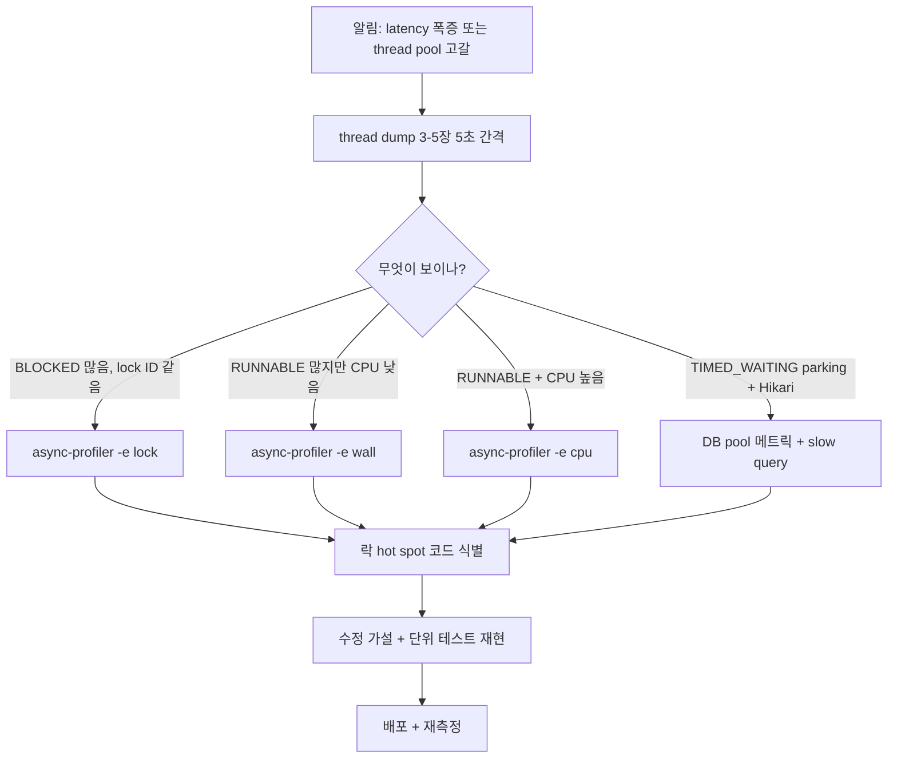

# 21. 동시성 프로파일링 도구

## 핵심 한 줄

thread dump 가 *순간 사진* 이라면 프로파일러는 *지속 영상*. **async-profiler** 가 lock contention/CPU/allocation 을 lightweight 하게 샘플링하고, **JFR** 이 JVM 내장 이벤트 (lock inflation, GC, IO) 를 기록한다. msa 운영에선 dump 로 1차 가설 → profiler 로 정량 확인 의 순서.

## async-profiler — 가장 자주 쓸 것

low-overhead sampling profiler. AsyncGetCallTrace API 사용으로 safepoint 편향 없음 (JVisualVM 의 단점 보완).

### 설치

```bash
# release tarball 다운로드 (https://github.com/async-profiler/async-profiler)
wget https://github.com/async-profiler/async-profiler/releases/download/v3.0/async-profiler-3.0-linux-x64.tar.gz
tar xzf async-profiler-*.tar.gz
cd async-profiler-3.0-linux-x64
```

### CPU 프로파일

```bash
./profiler.sh -d 30 -f cpu.html <pid>
# 30초 동안 CPU 샘플링 → HTML flame graph
```

### Lock contention 프로파일 (✨ 핵심)

```bash
./profiler.sh -e lock -d 60 -f locks.html <pid>
# 60초 동안 contended lock 이벤트 샘플링
```

- `synchronized` 의 contention 자동 캡처
- ReentrantLock/Semaphore/CountDownLatch 등 AQS lock 도 포함
- flame graph 로 *어떤 stack 에서 lock 경합* 이 일어나는지 시각화

```
[Top 5 contended monitors]:
  com.kgd.order.service.OrderService.processOrder   42% (총 lock 대기)
  com.kgd.foo.Cache.get                              18%
  ...
```

### Allocation 프로파일

```bash
./profiler.sh -e alloc -d 30 -f alloc.html <pid>
# 객체 할당 hot path
```

### Wall-clock (모든 스레드 time)

```bash
./profiler.sh -e wall -d 30 -f wall.html <pid>
# CPU 안 쓰고 sleep/wait 하는 시간도 포함 — IO bound 분석
```

### kubectl 환경

```bash
kubectl cp async-profiler-3.0/ <pod>:/tmp/ap/
kubectl exec -it <pod> -- /tmp/ap/profiler.sh -e lock -d 60 -f /tmp/locks.html 1
kubectl cp <pod>:/tmp/locks.html ./
```

→ 보안 정책 확인 후. 최근 컨테이너 이미지에 미리 포함 가능.

## JFR (Java Flight Recorder) — JVM 내장

JDK 11+ 부터 free, JDK 17+ 에서 매우 안정. `jcmd` 로 시작/중지.

### 시작

```bash
# 짧은 윈도우 (1분 녹화)
jcmd <pid> JFR.start duration=60s filename=/tmp/recording.jfr

# 연속 (default profile, suspended at filesize)
jcmd <pid> JFR.start filename=/tmp/recording.jfr settings=profile

# 중지
jcmd <pid> JFR.dump filename=/tmp/recording.jfr name=<recordingId>
jcmd <pid> JFR.stop
```

### 분석

JDK Mission Control (`jmc`) 또는 `jfr` CLI:

```bash
jfr print --events jdk.JavaMonitorEnter recording.jfr
jfr summary recording.jfr
```

### 동시성 관련 핵심 이벤트

| 이벤트 | 의미 |
|---|---|
| `jdk.JavaMonitorEnter` | `synchronized` 진입 (대기 시간 포함) |
| `jdk.JavaMonitorWait` | `Object.wait()` 호출 |
| `jdk.JavaMonitorInflate` | **lock inflation** (lightweight → heavyweight) |
| `jdk.ThreadPark` | `LockSupport.park()` (ReentrantLock 등 AQS) |
| `jdk.ThreadStart` / `jdk.ThreadEnd` | 스레드 lifecycle |
| `jdk.ThreadAllocationStatistics` | 스레드별 할당량 |
| `jdk.ContendedLock` (실험적) | 경합 lock 이벤트 |
| `jdk.GCPhasePause` | GC pause |
| `jdk.SocketRead` / `jdk.SocketWrite` | IO 이벤트 |

→ **`jdk.JavaMonitorInflate` 이벤트가 많으면 → contention hot spot** ([10-synchronized-internals.md](10-synchronized-internals.md)). lightweight lock 으로 처리 못 한 락이 OS mutex 로 escalate 했다는 의미.

### JFR 의 장점

- **always-on** 으로 1% 미만 오버헤드 (default profile)
- production 에 항상 켜둘 수 있음
- 사고 발생 시 직전 N분의 데이터 확보 가능
- Mission Control 시각화 강력

## IntelliJ Concurrency Profiler — 개발 시점

IntelliJ Ultimate 에 내장 (JFR 기반).

```
Run → Profiling → Concurrency Profiler
```

특징:
- 코드와 직접 연결 — IDE 에서 thread dump 의 stack 라인 클릭 → 소스로 점프
- 통합 시각화 — thread timeline, lock contention, 분포 그래프
- 단점: development 환경 한정 (production 안 됨)

## CPU profile vs lock profile — 어떻게 선택하나

| 증상 | 도구 |
|---|---|
| CPU 100% 인데 throughput 안 나옴 | `async-profiler -e cpu` |
| CPU 낮은데 latency 높음 | `async-profiler -e wall` (IO bound 추적) |
| thread dump 가 BLOCKED 많음 | `async-profiler -e lock` 또는 JFR `jdk.JavaMonitorEnter` |
| 메모리 폭증 | `async-profiler -e alloc` |
| GC 자주 | JFR `jdk.GCPhasePause` |

## 통합 워크플로우 — 동시성 사고 진단



## msa 운영 적용

### 1. 매 서비스에 async-profiler 사이드 로드

```dockerfile
# 또는 base image 에
RUN curl -L https://github.com/async-profiler/async-profiler/releases/download/v3.0/async-profiler-3.0-linux-x64.tar.gz | \
    tar xz -C /opt/ && ln -s /opt/async-profiler-3.0-linux-x64 /opt/async-profiler
```

```bash
kubectl exec -it <pod> -- /opt/async-profiler/profiler.sh -e lock -d 60 -f /tmp/locks.html 1
```

### 2. JFR continuous recording (production 권장)

```bash
# Deployment env or args
JAVA_TOOL_OPTIONS=-XX:StartFlightRecording=disk=true,maxsize=256m,maxage=2h,settings=profile,filename=/tmp/recording.jfr
```

→ 항상 직전 2시간의 JFR 가 디스크에 있음. 사고 발생 시 즉시 확보.

### 3. Micrometer 의 lock contention 메트릭

JFR 의 `jdk.JavaMonitorEnter` 이벤트를 Micrometer 가 wrapping → Prometheus 로 export 가능.

```kotlin
@Bean
fun jfrMeterBinder(): JfrMeterBinder = JfrMeterBinder()
```

→ alarm: lock contention duration p99 > X ms.

## msa 코드와 lock contention 가설

```bash
$ grep -rn "synchronized\b" --include="*.kt" /Users/gideok-kwon/IdeaProjects/msa | grep -v "test/\|build/" | wc -l
# 거의 없음 — analytics/EventIngestionConsumer.kt:27 정도
```

명시적 `synchronized` 사용이 적어 lock contention 핫스팟 가능성 낮음. 다만:

- **Hikari pool** — DB connection 대기는 `parking` 으로 잡힘
- **JPA EntityManager** — 내부적 단일 connection 락
- **Kafka producer batch buffer** — 단일 send queue lock
- **`ConcurrentHashMap.computeIfAbsent` 람다** — bin lock 안에서 무거운 람다

→ 이런 곳들은 코드 grep 으로 안 보이지만 lock profile 에서 잡힌다. **production JFR 이 진단 1순위**.

## 함정

### 1. async-profiler 의 보안

`perf_event_open` 시스템 콜 사용 → 컨테이너에 `SYS_ADMIN` cap 또는 `kernel.perf_event_paranoid=-1` 필요.

```yaml
# k8s securityContext
securityContext:
  capabilities:
    add: ["SYS_ADMIN"]
```

→ production 에선 보안팀 협의 필수. 또는 attach 모드 (jvmti only) 사용.

### 2. JFR 의 disk overhead

`disk=true,maxsize=256m` 정도 두면 안전. 큰 maxsize 는 IO 사용 + heap 영향.

### 3. 프로파일링은 *부하 있을 때* 떠야 함

idle 상태에선 hot spot 도 없음. 부하 발생 시점 또는 stress test 환경에서 측정.

## 면접 단골

**Q. 동시성 사고 분석에서 thread dump 와 profiler 의 역할 차이?**

thread dump 는 *그 순간의 사진* — 어떤 스레드가 어디서 BLOCKED/WAITING 인지 1차 가설. profiler 는 *시간 누적의 정량* — 어떤 lock 에서 얼마나 시간을 쓰는지, 어떤 메서드가 CPU 를 얼마나 쓰는지. dump 로 가설 → profiler 로 검증 + 정량화.

**Q. async-profiler 의 lock 모드가 잡는 것?**

`synchronized` 의 contended monitor 진입, ReentrantLock 등 AQS-기반 lock 의 park 시간을 sampling. flame graph 로 어떤 call path 에서 lock 대기가 누적되는지 시각화. lock inflation hot spot 직접 식별.

**Q. JFR 의 `jdk.JavaMonitorInflate` 이벤트가 의미하는 것?**

`synchronized` 락이 lightweight (사용자 공간 CAS) 에서 heavyweight (OS mutex + ObjectMonitor) 로 escalate 한 시점. 이 이벤트가 빈번하면 그 락은 contention 이 심해서 spin 으로 처리 못 했다는 신호. 1순위 최적화 후보.

**Q. production 에서 JFR 을 항상 켜도 되나?**

default profile setting 은 약 1% 미만 overhead 라 일반적으로 OK. continuous recording (`disk=true,maxsize=256m,maxage=2h`) 으로 직전 2시간 JFR 가 항상 보존되어, 사고 발생 시 즉시 확보 가능. msa 같은 Spring Boot 서비스의 표준 권장사항.

**Q. perf vs async-profiler 차이?**

perf 는 OS-level 도구로 hardware event (cache miss, branch miss 등) 까지 잡지만 JVM stack symbolize 가 어렵다. async-profiler 는 JVM 친화 — `AsyncGetCallTrace` 로 안전한 stack 캡처 + perf event 결합. 일반적 JVM 동시성 문제는 async-profiler 가 더 즉시 활용 가능. perf 는 bare-metal 또는 cache miss 같은 미시 분석.

## 다음 학습

- [22-msa-concurrency-patterns.md](22-msa-concurrency-patterns.md) — msa 코드 적용 점검
- [20-thread-dump-analysis.md](20-thread-dump-analysis.md) — 1차 진단
