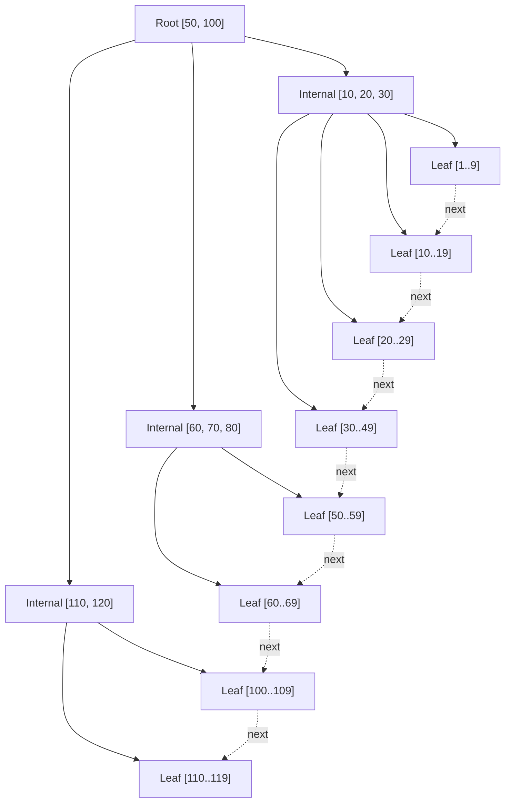

# 02. B-Tree / B+Tree 자료구조

## 핵심 정의

- **B-Tree**: 한 노드에 **여러 키 + 자식 포인터** 를 담는 자가 균형 다진 트리. 모든 leaf 까지 깊이 동일.
- **B+Tree**: B-Tree 변형. **데이터(또는 PK 포인터) 는 leaf 에만**, internal 노드는 키만. **leaf 끼리 연결 리스트(double linked)**.

대부분 RDBMS (InnoDB, PostgreSQL, Oracle, SQL Server) 의 인덱스는 **B+Tree**. "B-Tree 인덱스" 라는 용어는 관습적이고 실체는 B+Tree.

## 왜 binary search tree 가 아닌가

| 후보 | 노드 키 수 | depth (1억 행) | 노드당 페이지 IO | 총 IO |
|---|---|---|---|---|
| AVL/Red-Black | 1 | log₂(10⁸) ≈ 27 | 1 | 27 |
| B+Tree (fanout 1000) | ~1000 | log₁₀₀₀(10⁸) ≈ 3 | 1 | 3 |

같은 1억 행 lookup 인데 IO 9 배 차이. depth 가 짧으면:
- 디스크 seek 횟수 ↓
- 상위 internal 노드는 buffer pool 에 거의 항상 cache → 실제 IO 는 leaf 1번뿐.

## fanout 결정 — 페이지 크기 × 키 길이

InnoDB 페이지 16 KiB. internal 노드 한 페이지에 담을 수 있는 (key + pointer) 쌍 개수 ≈ fanout.

```
fanout ≈ page_size / (key_size + pointer_size)
       ≈ 16,384 / (8 + 6)   // BIGINT key, 6B page pointer
       ≈ 1,170
```

→ depth 3 이면 1170³ ≈ **16억** 키. depth 4 면 1.6 조. 즉 실제 OLTP 테이블의 모든 인덱스는 depth 3-4 이내.

### key 길이가 길면 fanout 이 떨어진다

- VARCHAR(255) 인덱스: fanout 60 정도 → depth 5-6.
- UUID(36 char) 인덱스: 비슷.
- → "**짧은 PK**" 가 모든 secondary index 도 작게 만든다 (clustered index 특성, 03 에서).

## 구조 다이어그램



- Internal 노드는 "분기 키" 만. 실제 데이터는 leaf.
- leaf 는 next pointer 로 연결 → **범위 스캔이 O(K) for K matches** (트리 재탐색 없이 다음 leaf 로 이동).

## 탐색 (lookup)

`SELECT * FROM t WHERE id = 25`

```
1. Root [50, 100] 에서 25 < 50 → A 로
2. A [10, 20, 30] 에서 20 ≤ 25 < 30 → L3 로
3. L3 [20..29] 안에서 25 직접 찾기 (페이지 내 binary search)
```

페이지 IO 3번. depth 와 같다.

## 범위 스캔 (range scan)

`WHERE id BETWEEN 25 AND 65`

```
1. Lookup id=25 → L3 도달
2. L3 안에서 25..29 읽고 next → L4 (30..49) 전부 읽기
3. next → L5 (50..59) 전부, next → L6 (60..69) 의 60..65
4. 끝
```

leaf 연결 리스트로 옆으로 쭉 읽는 비용 = O(K). 범위 쿼리가 빠른 이유.

> B-Tree (B+Tree 아닌) 에선 internal 에도 데이터가 있어 범위 스캔 시 트리 in-order traversal 필요 → IO 패턴 random. B+Tree 가 OLTP 에 압도적으로 유리한 결정적 이유.

## 삽입과 분할 (page split)

leaf 가 가득 찼을 때:

1. 새 페이지 할당.
2. 절반을 새 페이지로 옮김.
3. parent 에 분기 키 추가.
4. parent 도 가득 차면 재귀 분할.
5. root 까지 차면 root 위에 새 root → **트리 깊이 +1** (드물지만 발생).

### 단조 증가 PK (BIGINT AUTO_INCREMENT) 가 왜 좋은가

- 마지막 leaf 페이지에만 추가 → 분할이 거의 발생 안 함 (한 페이지 가득 차면 그 페이지를 닫고 새 페이지를 끝에 추가).
- 페이지 사용률 거의 100%, 단편화 적음.

### UUIDv4 (랜덤) PK 가 나쁜 이유

- 매 INSERT 가 트리 중간 어딘가에 떨어짐 → 임의 leaf 분할.
- 페이지 사용률 50-70% 로 하락 (분할 직후 두 페이지가 반반).
- random IO 위주 → buffer pool hit rate 하락.
- → **UUIDv7** 같이 시간 prefix 가진 변형이 권장 (단조 증가 효과).

## 삭제와 병합 (page merge)

- DELETE 가 leaf 페이지를 너무 비우면 (보통 50% 미만) **이웃 페이지와 병합** (merge) 시도.
- 실제로는 InnoDB 가 적극적으로 병합하지 않고 빈 슬롯만 표시 → **`OPTIMIZE TABLE`** 로 재구성 필요.
- → 삭제 빈도 높은 테이블은 단편화 증가 → 주기적 정리 (online DDL, 13 에서).

## 다른 자료구조 비교

| 자료구조 | 평균 lookup | 범위 스캔 | 디스크 친화 | 사용처 |
|---|---|---|---|---|
| B+Tree | O(log N) | O(K) | O (페이지 단위) | RDBMS 인덱스 표준 |
| Hash | O(1) | X | X (random) | 메모리 인덱스, NoSQL key-value |
| LSM-Tree | O(log N) | O(K) | O (sequential write) | RocksDB, Cassandra, MongoDB |
| Skip List | O(log N) | O(K) | △ | Redis sorted set |

LSM 은 **쓰기 amplification 낮음** + 시퀀셜 IO 친화 → 쓰기 위주 시스템 (시계열, 로그) 에 강함. 그러나 **읽기 amplification (여러 sstable 검색)** 이 있어 OLTP 에는 B+Tree 가 여전히 표준.

## 채우기 율 (fill factor) 과 단편화

- InnoDB 는 **MERGE_THRESHOLD** (기본 50%) — leaf 페이지 사용률이 이 이하로 떨어지면 병합 후보.
- bulk insert 후엔 페이지 거의 100% 채워짐. 이후 random update/delete 로 빈 공간 발생.
- 운영 팁:
  - bulk import 시 PK 정렬 후 INSERT
  - `INNODB_FILE_PER_TABLE` (기본 ON) 로 테이블별 .ibd → 개별 OPTIMIZE 가능.

## 코드 예 — fanout 직접 계산

```kotlin
// 1억 행 테이블의 인덱스 depth 추정
fun estimateBPlusTreeDepth(
    rowCount: Long,
    pageSize: Int = 16 * 1024,
    keySize: Int = 8,        // BIGINT
    pointerSize: Int = 6,    // InnoDB 내부 page pointer
    leafFillRate: Double = 0.7
): Int {
    val fanout = pageSize / (keySize + pointerSize)
    val rowsPerLeaf = (pageSize / 50.0 * leafFillRate).toLong() // row size 50B 가정
    var pages = (rowCount + rowsPerLeaf - 1) / rowsPerLeaf
    var depth = 1
    while (pages > 1) {
        pages = (pages + fanout - 1) / fanout
        depth++
    }
    return depth
}

// estimateBPlusTreeDepth(100_000_000) → 4
```

## InnoDB 의 추가 디테일

- **adaptive hash index**: 자주 쓰는 인덱스 page 의 hash table 을 자동 생성 → O(1) 조회. `innodb_adaptive_hash_index` 로 끄고 켤 수 있음. write 부하 높으면 mutex 경합 → 끄는 게 빠를 때 있음.
- **change buffer**: secondary index 에 random write 가 많으면 일단 buffer 에 모았다가 페이지 flush 시 한꺼번에 적용. `innodb_change_buffering`.
- **doublewrite buffer**: 페이지 partial write 방지 (torn page) — crash safety.

## 핵심 포인트

- **B+Tree**: internal 키만, leaf 데이터/PK + 연결 리스트.
- depth = log_fanout(N), 1억 row 도 depth 3-4. → 인덱스 lookup 은 사실상 IO 1-2 번.
- fanout 은 페이지 크기 / 키 크기 → **PK 짧게 + 단조 증가** 가 최강.
- B+Tree 의 **leaf 연결 리스트** 가 범위 쿼리 효율의 비결.
- LSM 은 쓰기 위주 시스템에서 대안. OLTP 는 여전히 B+Tree.
- 단편화는 random delete/update 가 누적되며 발생 → 주기적 OPTIMIZE / online DDL 고려.

## 다음 학습
- [03-clustered-vs-secondary.md](03-clustered-vs-secondary.md) — InnoDB 의 clustered / secondary 의 결정적 차이
- [04-index-types.md](04-index-types.md) — Hash / Bitmap / Spatial / Fulltext
