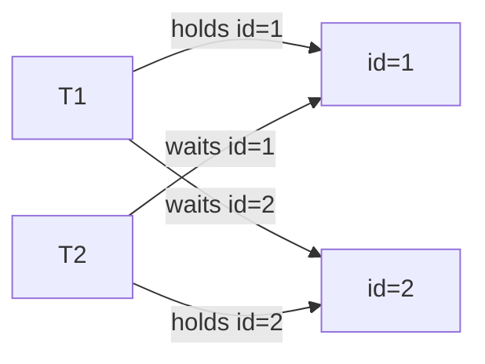

# 08. Deadlock + MDL + AUTO-INC 디테일

## 핵심 정의

- **Deadlock**: 두 TX 가 서로 상대방이 잡은 lock 을 기다리며 영원히 대기.
- **InnoDB 의 Deadlock 감지**: 매 lock 요청 시 wait-for graph 의 cycle 검출 → 즉시 한쪽 abort.
- **MDL (Metadata Lock, 메타데이터 락)**: DDL (Data Definition Language)/DML (Data Manipulation Language) 이 테이블의 metadata (스키마) 일관성 보장을 위해 잡는 lock.

이 문서는 deadlock 재현 + 진단 + MDL 사슬 + AUTO-INC 모드를 다룬다. 운영 장애의 큰 비중이 이 셋.

## Deadlock — 가장 흔한 패턴

### 패턴 1: 반대 순서 UPDATE

```sql
-- T1
BEGIN;
UPDATE orders SET ... WHERE id = 1;  -- X-lock id=1
                                       -- (T2 가 이 사이 id=2 잡음)
UPDATE orders SET ... WHERE id = 2;  -- X-lock id=2 wait

-- T2
BEGIN;
UPDATE orders SET ... WHERE id = 2;  -- X-lock id=2
UPDATE orders SET ... WHERE id = 1;  -- X-lock id=1 wait
                                       -- → CYCLE → InnoDB 가 한쪽 abort
```



### 패턴 2: 인덱스 vs Lookup 순서 차이

```sql
-- T1: secondary index 로 update (idx_orders_user_id 먼저 lock)
UPDATE orders SET status='PAID' WHERE user_id='alice';

-- T2: PK 직접 update (clustered 먼저 lock)
UPDATE orders SET status='REFUND' WHERE id = 5;  -- alice 의 row
```

같은 row 인데 **lock 획득 순서가 다름** → cycle 가능.

### 패턴 3: Gap Lock 충돌

```sql
-- T1
BEGIN;
SELECT * FROM orders WHERE id BETWEEN 5 AND 10 FOR UPDATE;
-- gap lock 보유

-- T2
BEGIN;
INSERT INTO orders VALUES (8, ...);  -- insert intention, gap lock 과 충돌, wait

-- T1
INSERT INTO orders VALUES (9, ...);  -- 자기 gap 안이지만 T2 와 wait 그래프 형성
                                      -- (gap lock 끼리 호환 + insert intention 끼리 충돌 패턴)
                                      -- → deadlock 가능
```

### 패턴 4: FK Cascade

```sql
-- parent → child FK 가 있고 ON DELETE CASCADE
DELETE FROM parent WHERE id = 1;
-- → child 의 모든 row 도 X-lock
-- 동시에 다른 TX 가 child row 만 update 중이면 cycle 가능
```

## InnoDB 의 자동 감지

- 매 lock wait 시 wait-for graph 갱신 → cycle 검사.
- cycle 발견 시 **rollback 비용이 적은 쪽** abort (rollback할 row 수 기준).
- 클라이언트는 `Deadlock found when trying to get lock; try restarting transaction` 에러 (SQLSTATE 40001).

### 비용

- cycle 감지는 wait 그래프가 클수록 비싸짐. 동시 TX 수십개 + lock 수만개 시 mutex 부담.
- `innodb_deadlock_detect = OFF` 옵션 (8.0+) — 감지 끄고 timeout 으로만 대응. 초고동시성 (수천 conn) 에서만 검토.

## 감지 로그 — `SHOW ENGINE INNODB STATUS`

```
LATEST DETECTED DEADLOCK
------------------------
2026-05-01 12:00:00 ...
*** (1) TRANSACTION:
TRANSACTION 12345, ACTIVE 0.5 sec
mysql tables in use 1, locked 1
LOCK WAIT 3 lock struct(s), heap size 1136, 2 row lock(s)
MySQL thread id 7, OS thread handle ...
INSERT INTO orders ...
*** (1) WAITING FOR THIS LOCK TO BE GRANTED:
RECORD LOCKS space id ... index PRIMARY of table `commerce`.`orders` ...
*** (2) TRANSACTION:
...
*** (2) HOLDS THE LOCK(S):
RECORD LOCKS space id ... index PRIMARY of table `commerce`.`orders` ...
*** (2) WAITING FOR THIS LOCK TO BE GRANTED:
RECORD LOCKS space id ... index idx_orders_user_id ...
*** WE ROLL BACK TRANSACTION (2)
```

### 읽는 법

1. ***** (1) / (2)**: 두 TX.
2. **WAITING FOR**: 기다리는 lock — 어떤 인덱스, 어떤 record.
3. **HOLDS THE LOCK(S)**: 이미 보유 중인 lock.
4. **WE ROLL BACK TRANSACTION (X)**: 죽은 쪽.

→ 운영 시 이 로그를 **필수로 alarming** (slack/pagerduty). "deadlock 자동 감지 + 어플리케이션 retry" 가 표준 대응.

## Application 재시도 패턴

```kotlin
@Retryable(
    value = [DeadlockLoserDataAccessException::class],
    maxAttempts = 3,
    backoff = Backoff(delay = 50, multiplier = 2.0, random = true)
)
@Transactional
fun transferAmount(from: Long, to: Long, amount: BigDecimal) { ... }
```

- exponential backoff + jitter (재시도 폭발 방지).
- 재시도는 멱등해야 함 (ADR-0012 의 idempotent consumer 와 같은 사상).

## Deadlock 회피 전략

| 전략 | 설명 |
|---|---|
| 일관된 lock 순서 | 항상 PK 작은 순으로 update — 패턴 1 차단 |
| TX 짧게 | lock 보유 시간 최소화 — ADR-0020 의 외부 IO 분리 |
| `SELECT FOR UPDATE` 와 같은 명시 lock | 묵시적 lock 순서를 명시화 |
| 인덱스 | row lock 의 정확한 범위로 |
| RC 격리 + SKIP LOCKED | gap lock 줄여 INSERT 충돌 감소 |
| 낙관락 (`@Version`) | row lock 자체 회피, 충돌 시 retry |
| FK cascade 회피 | application 에서 명시 처리 |

## Lock Wait Timeout — Deadlock 과 차이

- **Deadlock**: cycle. 한쪽 즉시 abort.
- **Lock Wait Timeout**: cycle 은 아니지만 너무 오래 기다린 경우. `innodb_lock_wait_timeout` (기본 50s).
- 둘 다 SQLSTATE 가 다름 (deadlock 40001, timeout HY000) — application 처리 분기 가능.

## MDL (Metadata Lock)

### 정의

테이블의 **스키마 일관성** 을 위한 lock. DML/DDL 모두 테이블에 MDL 을 잡는다.

| 작업 | MDL 모드 |
|---|---|
| `SELECT/INSERT/UPDATE/DELETE` | **MDL_SHARED_READ** / **MDL_SHARED_WRITE** |
| `CREATE/DROP/ALTER TABLE` | **MDL_EXCLUSIVE** |

→ DDL 의 X-MDL 은 모든 SHARED 와 충돌. **TX 가 살아 있는 동안 SHARED MDL 도 보유** (TX 끝나야 release).

### MDL 사슬 — 운영 장애의 단골

```
T1 (오래 걸리는 SELECT, ROLLBACK 안 됨):
  → orders 에 SHARED_READ MDL 보유

T2 (운영자가 DDL): ALTER TABLE orders ADD INDEX idx_x (...);
  → EXCLUSIVE MDL 시도 → T1 끝날 때까지 wait

T3 (정상 트래픽 SELECT * FROM orders):
  → SHARED_READ MDL 시도 → T2 (X-MDL waiter) 뒤에서 wait
  → T2 가 못 끝나면 T3 도 못 들어감 → 모든 후속 쿼리 hang
```

→ **DDL 한 줄이 서비스 전체 정지**의 시나리오. Real MySQL 8.0 책의 단골.

### 회피

1. **`innodb_lock_wait_timeout` 짧게** + DDL 전 long TX 확인.
2. **pt-online-schema-change** / **gh-ost** — 그림자 테이블 생성 + 트리거 동기화 + rename. (13 에서)
3. MySQL 8.0.12+ 의 **INSTANT** ALGORITHM — 일부 ALTER 는 metadata 만 변경, MDL EXCLUSIVE 시간이 ms 단위.
4. DDL 직전 `SELECT * FROM information_schema.innodb_trx` 로 long TX 강제 종료.

### 진단

```sql
-- MDL 대기자
SELECT * FROM performance_schema.metadata_locks
WHERE LOCK_STATUS = 'PENDING';

-- DDL 한 사람 + 그를 막은 자
SELECT * FROM performance_schema.metadata_locks
WHERE LOCK_TYPE = 'EXCLUSIVE';
```

## AUTO-INC 디테일

### autoinc_lock_mode 0 / 1 / 2 (재방문)

| 모드 | mutex/lock | bulk INSERT | 안정성 (ID 연속성) |
|---|---|---|---|
| 0 | table lock 끝까지 | block | 항상 연속 |
| 1 | mutex (단일) / table (bulk) | bulk 만 block | 단일 연속, bulk 도 연속 |
| 2 | mutex 만 | 안 block | **연속 보장 X** (interleaved) |

→ 8.0 기본 = 2. 가장 빠르지만 멀티 TX INSERT 시 ID 가 비연속 (1, 4, 5, 7, ...). 이걸 어플리케이션이 의존하면 안 됨.

### `auto_increment_increment` / `_offset`

- 멀티 마스터 replication 에서 ID 충돌 회피용.
- master A: increment=2, offset=1 → 1, 3, 5, ...
- master B: increment=2, offset=2 → 2, 4, 6, ...

### "ID 가 연속이어야 한다" 가 요구되면

- AUTO-INC 대신 **별도 sequence 테이블** + `SELECT FOR UPDATE` 후 `+1`. 직렬화돼서 throughput 낮음.
- 또는 **외부 ID generator** (Twitter Snowflake, UUIDv7).

## msa 사례

### Order / Wishlist 의 deadlock 가능성

`OrderRepositoryAdapter.save` + `OrderItem cascade`:
- order INSERT + items INSERT 묶음. PK 순으로만 실행되면 deadlock 거의 없음.
- 위험: 두 사용자가 같은 product 를 동시에 주문 → product.stock 차감 시 cycle. 현재 msa 는 product 서비스에 분리돼 있어 직접 cycle 은 없지만, retry 로 대응.

### MDL 위험

- 11개 서비스 각 DB 가 분리되어 있어 단일 서비스의 DDL 이 다른 서비스를 막진 않음. 단일 서비스 안에선 위험.
- Flyway 가 startup 시 MDL EXCLUSIVE 를 잠시 잡음 → 운영 트래픽 중에는 long-running TX 모니터링 필수.

### AUTO-INC

- 모든 서비스가 `BIGINT AUTO_INCREMENT` PK + MySQL 8 → mode 2.
- ID 연속성에 의존하는 코드 없음 (확인됨).

## Deadlock 재현 스크립트 (학습용)

```bash
# 세션 1
mysql -u root -p commerce -e "
CREATE TABLE IF NOT EXISTS dl_test (
  id INT PRIMARY KEY,
  v INT
);
INSERT INTO dl_test VALUES (1,0), (2,0);
"

# 세션 1
mysql -u root -p commerce
> START TRANSACTION;
> UPDATE dl_test SET v=v+1 WHERE id=1;

# 세션 2 (다른 터미널)
mysql -u root -p commerce
> START TRANSACTION;
> UPDATE dl_test SET v=v+1 WHERE id=2;
> UPDATE dl_test SET v=v+1 WHERE id=1;  -- wait

# 세션 1 (돌아가서)
> UPDATE dl_test SET v=v+1 WHERE id=2;  -- DEADLOCK!
```

→ 한쪽이 즉시 `ERROR 1213 (40001): Deadlock found ...`.

## 멘탈 모델

> Deadlock 은 **두 사람이 좁은 복도에서 마주쳐 서로 비키지 않는 상황**. InnoDB 는 즉시 누가 짐 적게 들었나 보고 그쪽을 뒤로 보낸다 (rollback).
> MDL 은 **테이블의 출입문 자물쇠** — DML 들이 동시에 들고 있는 동안엔 ALTER 가 못 들어가고, ALTER 가 줄 서면 그 뒤의 모든 SELECT 도 같이 줄 서야 한다.

## 핵심 포인트

- Deadlock 은 InnoDB 가 **자동 감지** (cycle in wait-for graph) → 한쪽 즉시 abort.
- 진단: `SHOW ENGINE INNODB STATUS` 의 LATEST DETECTED DEADLOCK.
- 회피: **일관 lock 순서 + 짧은 TX + 명시 lock + retry**. 재시도는 멱등해야 함.
- MDL EXCLUSIVE 는 모든 SHARED 와 충돌. **DDL 직전 long TX 가 있으면 모든 후속 쿼리 hang**.
- AUTO-INC 모드 2 는 빠르지만 ID 비연속.
- pt-online-schema-change / gh-ost / INSTANT ALGORITHM 으로 MDL 차단 시간 단축.

## 다음 학습
- [09-explain.md](09-explain.md) — EXPLAIN 으로 lock 발생 양을 가늠하는 법
- [13-online-ddl.md](13-online-ddl.md) — Online DDL 의 정확한 동작
