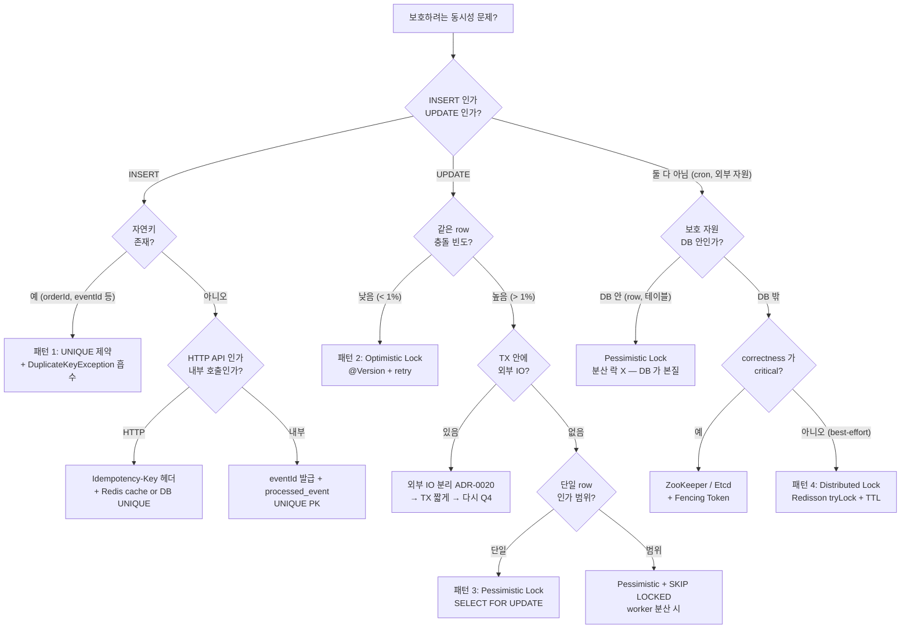

# 19. 동시성 제어 패턴 Cookbook — 9 시나리오 × 4 패턴 decision matrix

> 이 문서의 한 줄 — "어떤 lock 을 써야 하나" 의 답은 **시나리오 5W (어디서, 무엇을, 얼마나, 누구와, 얼마나 자주)** 가 결정한다. 4개 패턴을 외우는 게 아니라 **9 시나리오에 대한 매핑** 을 외운다.
>
> 본 문서는 본 학습 [07-lock-types.md](07-lock-types.md), [08-deadlock-mdl.md](08-deadlock-mdl.md), [16-msa-tx-routing.md](16-msa-tx-routing.md), 그리고 #5 / #7 / #9 의 분산 락 / 멱등성 / 격리 자료를 **시나리오 중심으로 재배치** 한 cookbook 이다.

---

## §1. 4 패턴 정의 + 빠른 참조표

### 1.1 4 패턴 한 줄 정의

| # | 패턴 | 한 줄 정의 | 보호 범위 |
|---|---|---|---|
| 1 | **UNIQUE 제약** | DB 의 unique index 가 중복 INSERT 를 거부 | 단일 row, INSERT race |
| 2 | **Optimistic Lock** | `WHERE version=?` 로 충돌 검출, 충돌 시 retry (`@Version`) | 단일 row, UPDATE race |
| 3 | **Pessimistic Lock** | `SELECT ... FOR UPDATE` 로 row 에 X-lock | 단일 row 또는 범위, lock 보유 |
| 4 | **Distributed Lock** | Redis SETNX / Redisson / ZooKeeper 등 외부 coordinator | 자원 자체에 락이 안 잡히는 cross-service mutex |

### 1.2 적합 / 부적합 빠른 참조

| 패턴 | 적합 | 부적합 |
|---|---|---|
| UNIQUE | 자연키가 있는 INSERT race, dedup, 멱등 consumer | UPDATE collision, 차감/증가 |
| Optimistic | UPDATE 충돌이 **드물고** retry 비용이 작은 경우, hot 안 됨 | 충돌이 **잦으면 retry 폭주**, 중첩 update |
| Pessimistic | 충돌이 잦고 retry 비싸고, **TX 가 짧은** 경우 (lock 보유 ms 단위) | 외부 IO 포함 TX, long-running |
| Distributed | 자원이 DB 가 아니거나 (cron, 외부 API), cross-service mutex | DB row 보호 (DB lock 이 더 안전), correctness 가 critical 한 결제 (DB UNIQUE 가 본질) |

### 1.3 의사 결정 한 줄 룰

> **자연키가 있으면 UNIQUE → 충돌이 드물면 Optimistic → 잦으면 Pessimistic → DB 밖이면 Distributed**.
>
> 그리고 **분산 락은 마지막 수단이다** (#9-13).

---

## §2. 시나리오별 Decision Tree



### 2.1 실전 사용법

이 트리는 **PR 리뷰 시 머리에 떠야 한다**. "동시성 보호 어디 들어갔나?" 질문이 나오면 위 트리를 따라 답한다.

---

## §3. 시나리오 9개 상세

각 시나리오 동일 구조:
- **문제 정의** — 무엇이 깨질 수 있나
- **1순위 패턴** + **대안**
- **선택 근거**
- **안티패턴** — 다른 패턴이 왜 부적합
- **코드 스킬레톤** (Kotlin)
- **실 회사 사례**
- **msa 코드베이스 적용 위치**
- **트레이드오프 박스**

---

### 3.1 시나리오 ① — INSERT race + 자연키 존재 (멱등 dedup)

**문제 정의**

같은 비즈니스 이벤트가 두 번 들어와도 row 가 하나만 생겨야 한다.
- Kafka consumer 가 같은 메시지를 두 번 받음 (at-least-once).
- 클라이언트가 timeout 으로 재시도 → 같은 주문이 두 번 INSERT 시도.
- 외부 webhook 이 retry 정책으로 같은 이벤트를 재발송.

**1순위 패턴**: **UNIQUE 제약 + DuplicateKeyException 흡수**

**대안**:
- (D) 분산 락으로 INSERT 전에 dedup 검사 — **부적합** (가용성 / 속도 / 안전성 모두 DB UNIQUE 가 우월).
- 사전 SELECT 로 dedup 후 INSERT — race window 존재, **부적합**.

**선택 근거**

DB UNIQUE 는:
- **단일 atomic 연산** (INSERT 자체가 unique check + write).
- **TTL (Time To Live, 생존 시간) 무한** (메모리/캐시와 달리 사라지지 않음).
- **DB 가용성에 종속** — 메시지 큐와 DB 가 동일 가용성 영역이면 추가 의존성 X.

**안티패턴**

```kotlin
// ❌ Check-then-Insert race (Lost Update의 INSERT 버전)
if (!repo.existsByOrderId(orderId)) {
    repo.save(Order(orderId, ...))   // 두 worker 가 동시에 통과 가능
}

// ❌ @Version 으로 INSERT race 보호 시도
// @Version 은 UPDATE 충돌 검출용. 새 row 의 version=0 이라 dedup 못 함.

// ❌ Redis SETNX 로만 보호
redis.setIfAbsent("order:$orderId", "1")   // Redis 죽으면 dedup 깨짐
repo.save(Order(orderId, ...))
```

**코드 스킬레톤**

```kotlin
@Entity
@Table(
    name = "processed_event",
    uniqueConstraints = [UniqueConstraint(name = "uk_event_id", columnNames = ["event_id"])]
)
class ProcessedEventJpaEntity(
    @Id val eventId: String,
    val topic: String,
    val processedAt: Instant = Instant.now(),
)

// Consumer
@KafkaListener(topics = ["order.completed"])
fun on(event: OrderCompletedEvent) {
    try {
        // 비즈니스 로직 + processed_event INSERT 같은 TX
        process(event)
        processedEventRepo.save(ProcessedEventJpaEntity(event.eventId, "order.completed"))
    } catch (e: DataIntegrityViolationException) {
        // UNIQUE 위반 = 이미 누가 처리했음 → 멱등 skip
        log.info { "duplicate event skipped: ${event.eventId}" }
    }
}
```

**실 회사 사례**

| 회사 / 시스템 | 패턴 |
|---|---|
| **Stripe Idempotency-Key** | (key, response) 영속 저장 + UNIQUE — 24h TTL. PUT-like POST 의 표준. |
| **Amazon Order de-dupe** | (customerId, orderToken) UNIQUE 로 중복 주문 차단. 클라이언트가 token 발급. |
| **Shopify Webhook** | webhook event_id UNIQUE — 같은 webhook 재시도 흡수. |
| **PayPal IPN** | txn_id 자연키 UNIQUE 로 결제 알림 dedup. |
| **MSA (Microservices Architecture, 마이크로서비스 아키텍처) Outbox 표준** | (event_id) UNIQUE 가 inbox 패턴의 핵심. Eventuate / Debezium / Axon 모두 동일. |

**msa 적용 위치**

- `order/app/.../ProcessedEventEntity.kt` — `event_id PRIMARY KEY` (= UNIQUE).
- `inventory/.../InventoryEventConsumer.kt` — `existsById` + `save` 조합 (현재는 try-catch 대신 pre-check 사용 — race window 작지만 존재).
- ADR (Architecture Decision Record, 아키텍처 결정 기록)-0012 가 표준 정책.

**트레이드오프**

```
+ 단순, 강한 보장, 영속, 단일 의존성
- pre-check 안 하면 매번 DB 왕복 (try-catch 패턴이라 정상 케이스 비용 0)
- 자연키 정의가 어려운 경우 → eventId(UUID) 발급 필수
- processed_event 테이블 무한 누적 → 보관 정책 필요 (msa 7일)
```

---

### 3.2 시나리오 ② — 같은 row UPDATE collision (낙관/비관 선택 기준)

**문제 정의**

같은 row 를 동시에 여러 TX 가 수정하려 한다. 한쪽의 수정이 다른 쪽 위에 덮어써지면 안 된다 (Lost Update).
- 사용자 프로필 동시 수정.
- 게시글 좋아요 수 증가.
- 재고 차감.

**1순위 패턴**:
- **충돌 빈도가 낮으면** → **Optimistic Lock** (`@Version`)
- **충돌 빈도가 높으면** → **Pessimistic Lock** (`@Lock(PESSIMISTIC_WRITE)`)

**선택 기준 (정량)**

| 충돌율 | 권장 패턴 | 이유 |
|---|---|---|
| < 1% | Optimistic | retry 비용 < lock 보유 비용 |
| 1% ~ 10% | 측정 후 결정 | 둘 다 acceptable, 응답 latency 우선 시 Optimistic |
| > 10% | Pessimistic | retry 폭주 → 사용자 실패율 ↑ |
| > 30% | **재설계 검토** | hot row → sharding / counter table / Redis INCR 로 분산 |

**선택 근거**

Optimistic:
- read 단계에서 lock 안 잡음 → throughput ↑.
- 충돌 시 retry 필요 → 재시도 비용 (네트워크 + 트랜잭션 재실행).
- **충돌이 잦으면 retry 폭주 → throughput 역전**.

Pessimistic:
- read 단계부터 lock → 직렬화 → 충돌 0.
- lock 보유 시간 = 트랜잭션 길이 → **외부 IO (Input/Output, 입출력) 절대 금지** (ADR-0020).
- deadlock 위험 ↑ (lock 순서 일관 필요).

**안티패턴**

```kotlin
// ❌ @Version 없이 read-modify-write
val acc = repo.findById(id)
acc.balance -= amount        // T2 가 동시에 같은 작업 → Lost Update
repo.save(acc)

// ❌ Pessimistic Lock + 외부 IO
@Transactional
@Lock(PESSIMISTIC_WRITE)
fun chargeAccount(id: Long, amount: BigDecimal) {
    val acc = repo.findByIdForUpdate(id)
    paymentGateway.charge(acc, amount)   // 5초 — 그 동안 다른 TX 모두 대기
    acc.balance -= amount
}

// ❌ 분산 락으로 DB row 보호
val lock = redisson.getLock("account:$id")
lock.tryLock()
try { repo.update(...) } finally { lock.unlock() }
// → DB 가 이미 X-lock 을 자동으로 잡는데 분산 락이 한 겹 더 → 의미 없음 + 장애점만 추가
```

**코드 스킬레톤**

Optimistic:
```kotlin
@Entity
class InventoryJpaEntity(
    @Id val id: Long,
    var availableQty: Int,
    @Version
    @Column(nullable = false)
    var version: Long = 0,
)

@Service
class InventoryService(private val repo: InventoryJpaRepository) {
    @Retryable(
        value = [OptimisticLockingFailureException::class],
        maxAttempts = 3,
        backoff = Backoff(delay = 50, multiplier = 2.0, random = true),
    )
    @Transactional
    fun decrease(id: Long, qty: Int) {
        val inv = repo.findById(id).orElseThrow()
        require(inv.availableQty >= qty) { "out of stock" }
        inv.availableQty -= qty
        // save 시 UPDATE WHERE id=? AND version=? → affected=0 이면 OptimisticLockingFailureException
    }
}
```

Pessimistic:
```kotlin
interface AccountJpaRepository : JpaRepository<AccountJpaEntity, Long> {
    @Lock(LockModeType.PESSIMISTIC_WRITE)
    @QueryHints(QueryHint(name = "javax.persistence.lock.timeout", value = "3000"))
    @Query("SELECT a FROM AccountJpaEntity a WHERE a.id = :id")
    fun findByIdForUpdate(@Param("id") id: Long): AccountJpaEntity?
}

@Transactional
fun transfer(fromId: Long, toId: Long, amount: BigDecimal) {
    // 데드락 회피: 항상 작은 ID 부터 lock
    val (a, b) = if (fromId < toId) fromId to toId else toId to fromId
    val first = repo.findByIdForUpdate(a)!!
    val second = repo.findByIdForUpdate(b)!!
    // 비즈니스 로직 — 외부 IO 없음
    if (fromId == a) { first.balance -= amount; second.balance += amount }
    else { second.balance -= amount; first.balance += amount }
}
```

**실 회사 사례**

| 회사 | 패턴 | 비고 |
|---|---|---|
| **Shopify Inventory** | Optimistic (`updated_at` 기반) + retry | 소량 충돌, retry 비용 < 락 비용 |
| **GitHub PR / Issue 수정** | Optimistic (ETag / If-Match 헤더) | conflict 시 사용자에게 reload 요청 |
| **JIRA 이슈 수정** | Optimistic (Confluence 문서도 동일) | 충돌 시 merge UI 제시 |
| **은행 잔액 차감** | Pessimistic (`SELECT FOR UPDATE`) | 정합성 절대, retry 위험 (이중 차감 가능성) |
| **Toss / KakaoPay 송금** | Pessimistic + 단계 분리 (조회 → 인증 → 차감) | TX 짧게, 외부 IO 분리 |
| **Cassandra (LWT)** | Optimistic (Paxos 기반 IF-clause) | 분산 DB 의 Optimistic 구현 |

**msa 적용 위치**

- `inventory/.../InventoryJpaEntity.kt` — `@Version` 사용. 재고 동시 차감의 표준.
- `quant/.../ExchangeCredentialEntity.kt` — `@Version` 사용 (자격증명 회전 동시 시도 보호).
- Pessimistic lock 사용처 **없음** — msa 의 모든 동시 update 는 Optimistic + 자연키 UNIQUE 로 처리. (자금 이체 도메인 부재)

**트레이드오프**

| 차원 | Optimistic | Pessimistic |
|---|---|---|
| Lock 보유 | 0 | TX 길이만큼 |
| 충돌 시 비용 | retry (TX 재실행) | 대기 |
| 충돌율 영향 | 높을수록 비용 ↑ | 영향 적음 |
| Deadlock | 거의 없음 | 가능 (lock 순서 주의) |
| 외부 IO 허용 | 가능 (TX 짧게만) | 절대 금지 |
| 구현 복잡도 | retry 필요 | lock 순서 / timeout 필요 |

---

### 3.3 시나리오 ③ — 긴 트랜잭션의 단일 row 보호

**문제 정의**

비즈니스 로직 안에 외부 API 호출 / 큰 계산 / 사용자 confirm 대기가 있어 TX 가 수 초 ~ 수십 초.
- 결제 게이트웨이 호출 (3-10초).
- ML 모델 추론.
- 사용자 OTP 입력 대기.

**1순위 패턴**: **TX 분리 (ADR-0020) + Optimistic Lock + 상태 머신**

**대안**:
- Pessimistic Lock 으로 row 보호 — **부적합**. lock 보유 시간 폭증 → 다른 모든 TX block.
- 분산 락으로 보호 — TTL 안에 끝나야 하는 부담 + critical section 안에 외부 IO 라는 안티패턴.

**선택 근거**

핵심: **lock 보유 시간 = TX 길이 = 외부 IO 시간** (#5-09). lock 을 잡지 않는 게 답.

해법:
1. **TX 를 단계로 쪼갠다** — read 단계, IO 단계, write 단계 각자 짧은 TX.
2. **상태 컬럼** 으로 직렬화 — `status` 가 `PENDING → PROCESSING → COMPLETED` 같은 머신.
3. **Optimistic Lock** + status 전이 — `WHERE status='PENDING'` 가 동시 진입 차단.

**안티패턴**

```kotlin
// ❌ Pessimistic Lock + 긴 외부 IO
@Transactional
fun processOrder(orderId: Long) {
    val order = repo.findByIdForUpdate(orderId)   // X-lock 시작
    paymentGateway.charge(order)                  // 5초 — 모든 동시 TX block
    notificationService.send(order)               // 1초
    order.markPaid()
    repo.save(order)
}                                                  // 6초 + COMMIT — 그 동안 lock 보유

// ❌ 분산 락 안에 외부 IO
val lock = redisson.getLock("order:$id")
lock.tryLock(0, 30, SECONDS)
try {
    paymentGateway.charge(...)   // 35초 걸리면 TTL 만료 → 다른 holder 가 락 → 동시 진입
} finally { lock.unlock() }
```

**코드 스킬레톤**

```kotlin
// 1단계: PENDING 상태 INSERT (짧은 TX)
@Transactional
fun startOrder(orderId: Long): Order {
    return repo.save(Order(orderId, status = PENDING))
}

// 2단계: 외부 IO (TX 밖)
fun chargeOrder(orderId: Long) {
    val order = repo.findById(orderId).orElseThrow()
    val charge = paymentGateway.charge(order)  // 5초 — TX 밖, lock 0
    completeOrder(orderId, charge.id)
}

// 3단계: 상태 전이 (짧은 TX, Optimistic with status)
@Transactional
fun completeOrder(orderId: Long, chargeId: String) {
    val updated = repo.transitionStatus(
        orderId,
        from = PENDING,
        to = COMPLETED,
        chargeId = chargeId,
    )
    if (updated == 0) {
        // 다른 worker 가 이미 처리 / 또는 취소됨 → 보상 트랜잭션
        compensate(chargeId)
    }
}

// repository — UPDATE WHERE status=? 가 핵심 (단일 atomic 전이)
@Modifying
@Query("""
    UPDATE OrderJpaEntity o
    SET o.status = :to, o.chargeId = :chargeId, o.updatedAt = CURRENT_TIMESTAMP
    WHERE o.id = :orderId AND o.status = :from
""")
fun transitionStatus(
    @Param("orderId") orderId: Long,
    @Param("from") from: OrderStatus,
    @Param("to") to: OrderStatus,
    @Param("chargeId") chargeId: String,
): Int
```

**실 회사 사례**

| 회사 | 패턴 |
|---|---|
| **Uber Trip 상태 머신** | `requested → accepted → in_progress → completed`. 각 전이가 짧은 TX + 외부 IO 분리. |
| **Airbnb Reservation** | `inquiry → request → accepted → paid → confirmed`. saga + 상태 컬럼 + Optimistic. |
| **Stripe PaymentIntent** | `requires_payment_method → requires_confirmation → processing → succeeded`. status 머신 + idempotency-key. |
| **Toss 결제** | 결제 승인 → 정산 분리. 승인 단계 짧은 TX, 정산은 비동기. |
| **MSA Saga 표준** | 각 단계 commit + 다음 단계는 새 TX (or async). 보상 트랜잭션 가능. |

**msa 적용 위치**

- `order/app/.../service/` — Order 처리 시 OrderTransactionalService 와 외부 호출 분리 (ADR-0020).
- `quant/.../OrderExecutionService.kt` — 거래 주문 실행 시 거래소 API 호출과 DB 기록 단계 분리.
- ADR-0020 (외부 IO 와 트랜잭션 분리) 가 표준.

**트레이드오프**

```
+ Lock 보유 시간 0, throughput 보호
+ 외부 IO 자유롭게
- 보상 트랜잭션 / saga 구현 복잡도 ↑
- 중간 상태 (PROCESSING) 의 long-running 감지 / 회수 별도 필요 (timeout watchdog)
- 비즈니스 invariant 가 단일 TX 가 아니라 분산 → 정합성 검증 어려움
```

---

### 3.4 시나리오 ④ — 크로스 서비스 mutex

**문제 정의**

여러 인스턴스 / 서비스가 동시에 같은 작업을 하면 안 된다. 보호 자원이 DB 가 아니거나 (외부 시스템, 파일 시스템, 외부 API rate limit), DB 락으로는 표현 불가능.
- Outbox relay 가 N개 인스턴스에서 같은 메시지 두 번 publish 하면 안 됨.
- Reconciliation 배치가 1개만 돌아야.
- 외부 API 동시 호출 제한.

**1순위 패턴**: **Distributed Lock** (Redisson `tryLock` + TTL)

**대안**:
- K8s (Kubernetes) Deployment replicas=1 — 가장 단순. **가용성 손실** trade-off.
- DB row 를 leader 마커로 사용 (`leader_election` 테이블 + heartbeat) — DB 의존, 단순.
- ZooKeeper / Etcd — correctness 가 critical 한 경우만.

**선택 근거**

자원이 DB 안이 아니라면 DB 락으로 표현 불가. Redis 분산 락이 가장 실용적:
- TTL 로 holder 죽음 자동 회수.
- watchdog (Redisson) 로 자동 갱신.
- ms latency.

correctness 가 critical 하지 않으면 (best-effort efficiency) Redis 충분. critical 이면 ZooKeeper / Etcd.

**안티패턴**

```kotlin
// ❌ TTL 없는 lock (holder 죽으면 영원히 잠김)
val lock = redisson.getLock("outbox-publisher")
lock.lock()                  // ← infinite TTL
try { publish() } finally { lock.unlock() }

// ❌ 동기 외부 호출 + 짧은 TTL
lock.tryLock(0, 5, SECONDS)  // 5초 TTL
try {
    externalApi.call()       // 6초 — TTL 만료 + 다른 holder 진입
} finally { lock.unlock() }   // ← 다른 holder 의 락 풀어버림 (token 검증 없으면)

// ❌ in-memory lock (JVM 한 대에서만 의미)
val lock = ReentrantLock()
lock.lock()                  // 다른 인스턴스는 무시
```

**코드 스킬레톤**

```kotlin
@Component
class OutboxPublishingScheduler(
    private val redisson: RedissonClient,
    private val outboxRepository: OutboxRepository,
    private val kafkaTemplate: KafkaTemplate<String, String>,
) {
    private val log = KotlinLogging.logger {}

    @Scheduled(fixedDelay = 1000)
    fun publish() {
        val lock = redisson.getLock("outbox-publisher-lock")
        // tryLock(waitTime=0, leaseTime=30s, ...)
        // waitTime=0: 못 잡으면 즉시 양보 (다른 인스턴스가 가졌음)
        // leaseTime=30s: 30초 후 자동 해제, watchdog 자동 갱신
        if (!lock.tryLock(0, 30, TimeUnit.SECONDS)) {
            log.debug { "lock held by another instance, skipping" }
            return
        }
        try {
            outboxRepository.findPending(limit = 100).forEach { event ->
                kafkaTemplate.send(event.topic, event.key, event.payload)
                outboxRepository.markPublished(event.id)
            }
        } finally {
            if (lock.isHeldByCurrentThread) lock.unlock()
        }
    }
}
```

`SKIP LOCKED` 가 더 나은 선택일 수도 있다 — DB 락 + 멀티 worker 동시 처리 (시나리오 ⑧ 참조).

**실 회사 사례**

| 회사 | 패턴 |
|---|---|
| **Netflix Conductor** | leader election with ZooKeeper for workflow coordinator. |
| **K8s Controller** | Lease object + leader election (etcd 기반). 모든 controller 가 표준 패턴. |
| **Airflow Scheduler** | DB row lock (`scheduler_job` 테이블) + heartbeat. K8s 모드는 Lease. |
| **Kafka Streams** | rebalance + group coordinator (Kafka 자체가 leader election). |
| **Spring Cloud Task** | lock provider (JDBC / Redis / Hazelcast) 로 단일 실행. |

**msa 적용 위치**

- 현재 msa 는 Outbox relay 가 단일 worker 가정 (분산 락 미사용).
- replica > 1 시 도입 필요 — `study/4-db-index-transaction/17-improvements.md` 의 ADR 후보.
- 대안으로 `SKIP LOCKED` (시나리오 ⑧) 가 더 단순 + DB 의존성만 추가.

**트레이드오프**

```
+ DB 외 자원도 보호 가능
+ 가용성 (Redis 가용 시 모든 인스턴스가 stand-by, 1개만 active)
- Redis 가용성에 종속 (Redis 죽으면 락 깨짐 — fencing token 없으면 위험)
- correctness 보장 X (clock drift, GC pause — Kleppmann)
- 짧은 critical section 만 안전 (외부 IO 절대 금지)
```

---

### 3.5 시나리오 ⑤ — 티켓팅 high-contention 재고 차감

**문제 정의**

수만 명이 동시에 같은 row (콘서트 좌석 / 한정판 상품) 에 차감 요청.
- 인터파크 BTS 콘서트 티켓 오픈.
- Naver 한정판 운동화 드랍.
- 한정 수량 쿠폰 발급.

**1순위 패턴**: **Redis INCR / Lua atomic + 상태 컬럼 + Outbox 비동기 확정**

**대안**:
- Optimistic Lock — **부적합**. 충돌율 90%+ → retry 폭주 → DB 마비.
- Pessimistic Lock — 직렬화 → throughput 1 TPS (Transactions Per Second, 초당 트랜잭션 수) 수준 → 사용자 timeout 폭발.
- Distributed Lock — 직렬화 + Redis 부하 집중.

**선택 근거**

high-contention 의 본질은 **단일 hot row** 가 병목. 해법은 둘 중 하나:
1. **Redis INCR** 같은 single-thread atomic 으로 차감 (Redis 의 단일 스레드가 직렬화 보장 + 메모리 속도).
2. **분산 / sharding** — counter 를 여러 row 로 쪼갬 (사실상 다른 시나리오).

티켓팅은 (1) 가 표준:
- Redis 의 `DECRBY` 가 atomic.
- 메모리 latency (µs) → 수만 TPS 가능.
- DB 는 비동기로 확정 (Outbox 패턴) → DB 부하 분산.

**안티패턴**

```kotlin
// ❌ DB Pessimistic Lock 으로 hot row 보호
@Transactional
fun reserveSeat(seatId: Long) {
    val seat = repo.findByIdForUpdate(seatId)  // 모든 요청이 직렬화
    if (seat.available) seat.available = false
}
// → 1만 TPS 요청이 1 TPS 처리 → 99.99% timeout

// ❌ Optimistic Lock + retry
fun decrease(id: Long) {
    repeat(100) {                              // retry 100번
        try {
            val inv = repo.findById(id)
            inv.qty -= 1
            return                              // ← 1만 TPS 중 1만 번의 retry storm
        } catch (e: OptimisticLockingFailureException) { Thread.sleep(10) }
    }
    throw OutOfStockException()
}
// → DB CPU 100%, lock wait timeout 폭발
```

**코드 스킬레톤**

```kotlin
// reserve-stock.lua (Redis Lua)
// KEYS[1] = stock counter key
// ARGV[1] = qty to decrease
// returns: 1 = success, 0 = out of stock
val SCRIPT = """
    local current = tonumber(redis.call('GET', KEYS[1]) or '0')
    local need = tonumber(ARGV[1])
    if current >= need then
        redis.call('DECRBY', KEYS[1], need)
        return 1
    else
        return 0
    end
"""

@Service
class TicketReservationService(
    private val redis: StringRedisTemplate,
    private val outboxAppender: OutboxAppender,
) {
    fun reserve(eventId: Long, userId: Long, qty: Int): ReserveResult {
        val key = "ticket:stock:$eventId"
        val script = DefaultRedisScript(SCRIPT, Long::class.java)
        val ok = redis.execute(script, listOf(key), qty.toString()) == 1L
        if (!ok) return ReserveResult.OutOfStock

        // 성공 → DB 확정은 Outbox 로 비동기
        val reservationId = UUID.randomUUID().toString()
        outboxAppender.append(
            topic = "ticket.reserved",
            key = reservationId,
            payload = mapper.writeValueAsString(
                TicketReservedEvent(reservationId, eventId, userId, qty)
            ),
        )
        return ReserveResult.Success(reservationId)
    }
}

// 별도 consumer 가 DB 에 reservation INSERT (UNIQUE on reservationId)
// → DB 는 자기 페이스로 따라옴, 사용자 응답은 Redis ms 안에 끝남
```

추가 보강:
- **Pre-warm**: 오픈 직전 Redis 에 stock 적재.
- **Queue-based fairness**: Redis Stream / Kafka 로 요청 순서 보장 + worker N 개가 처리.
- **Anti-bot**: WAF + rate limit + CAPTCHA — 이걸 안 하면 1초에 100만 TPS 들어옴.
- **Fallback**: Redis 다운 시 "잠시 후 다시" — DB fallback 하면 즉시 폭발.

**실 회사 사례**

| 회사 | 패턴 |
|---|---|
| **Interpark / Yes24 콘서트 티켓팅** | Redis 기반 stock + queue. DB 는 비동기. 대기열 시스템 별도. |
| **Naver Limited Drop** | Redis INCR + queue + WAF rate limit. |
| **Kakao 카카오톡 선물 한정판** | Redis stock + Kafka queue. |
| **Ticketmaster Verified Fan** | 사전 등록 + 추첨 (lottery) — high-contention 자체 회피. |
| **Amazon Lightning Deal** | Pre-allocated quota + per-user rate limit. |
| **Shopify BFCM Flash Sale** | Edge cache + queue + write batching. |

**msa 적용 위치**

- `inventory/.../InventoryCacheAdapter.kt` + `reserve-stock.lua` — Redis Lua atomic 으로 차감 (이미 적용).
- `inventory/.../InventoryEventConsumer.kt` — `OrderCompletedEvent` 수신 → Lua 차감 → 결과를 다음 이벤트로 발행.
- 단, msa 는 티켓팅 도메인 부재 — 일반 ecommerce 수준의 contention. 진짜 hot row 시나리오 발생 시 추가 sharding 필요.

**트레이드오프**

```
+ µs 단위 latency, 수만 TPS 처리
+ DB 부하 분산 (비동기 확정)
- Redis 가 SSOT 의 일부 → 가용성 critical (Redis 죽으면 stock 잃음, RDB/AOF 필수)
- 비동기 확정 시 Redis-DB sync 지연 → 사용자 "예약했는데 마이페이지에 안 뜸"
- 환불/취소 시 Redis 복구 로직 필요
- 스코프 작은 도메인엔 over-engineering
```

---

### 3.6 시나리오 ⑥ — 결제 / 송금 (강한 일관성)

**문제 정의**

이중 결제 / 이중 인출 / 잔액 음수 — 어떤 상황에서도 발생하면 안 된다.
- 클라이언트가 timeout 으로 재시도 → 두 번 결제될 위험.
- 두 사용자가 동시에 같은 잔액에서 출금 시도.
- 송금 도중 시스템 장애 → 한쪽만 차감되고 한쪽 입금 안 됨.

**1순위 패턴**: **Defense-in-Depth — Idempotency-Key + DB UNIQUE + Pessimistic Lock**

**대안**:
- Optimistic Lock — 충돌 시 retry 위험 (이중 결제 가능성). **부적합** for 차감.
- Distributed Lock — Redis 가용성 의존 (correctness 문제). **부적합 단독 사용**.

**선택 근거**

결제는 **correctness > performance**. 단일 패턴으로 부족하므로 **여러 layer 결합**:

1. **Idempotency-Key** (사용자 → 시스템) — 사용자가 timeout 으로 재시도해도 같은 key.
2. **DB UNIQUE on (charge_id)** — 결제 자체의 dedup.
3. **Pessimistic Lock on account row** — 잔액 차감 직렬화 (TX 짧게).
4. **상태 머신** (`PENDING → AUTHORIZED → CAPTURED`) — 단계별 검증.
5. **외부 PG 와 reconciliation** — 비동기 정합성 검증 (별도 batch).

**안티패턴**

```kotlin
// ❌ Optimistic Lock 만으로 결제 처리
@Retryable
@Transactional
fun charge(userId: Long, amount: BigDecimal) {
    val account = repo.findById(userId)
    require(account.balance >= amount)
    account.balance -= amount
    paymentGateway.charge(amount)        // ← retry 시 PG 가 두 번 호출 + 사용자 두 번 차감 가능
}

// ❌ Distributed Lock 만으로 보호
val lock = redisson.getLock("user:$userId:charge")
lock.tryLock()
try {
    paymentGateway.charge(...)            // Redis 가용성에 결제 정합성 종속 — 위험
} finally { lock.unlock() }

// ❌ Idempotency-Key 없는 POST /charge
// → 클라이언트 timeout = 재시도 = 이중 결제. 막을 방법 없음.
```

**코드 스킬레톤**

```kotlin
@RestController
class PaymentController(
    private val paymentService: PaymentService,
    private val redis: StringRedisTemplate,
) {
    @PostMapping("/charge")
    fun charge(
        @RequestHeader("Idempotency-Key") key: String,
        @RequestBody req: ChargeRequest,
    ): ResponseEntity<ChargeResponse> {
        // Layer 1: Idempotency-Key cache (Stripe 식)
        redis.opsForValue().get("idem:charge:$key")?.let {
            return ResponseEntity.ok(mapper.readValue(it, ChargeResponse::class.java))
        }
        // SETNX in-progress lock
        val locked = redis.opsForValue()
            .setIfAbsent("idem:charge:$key:lock", "1", Duration.ofSeconds(30)) ?: false
        if (!locked) return ResponseEntity.status(HttpStatus.CONFLICT).build()

        try {
            val resp = paymentService.charge(key, req)
            redis.opsForValue().set("idem:charge:$key", mapper.writeValueAsString(resp), Duration.ofHours(24))
            return ResponseEntity.ok(resp)
        } finally {
            redis.delete("idem:charge:$key:lock")
        }
    }
}

@Service
class PaymentService(
    private val accountRepo: AccountJpaRepository,
    private val chargeRepo: ChargeJpaRepository,        // UNIQUE on idempotency_key
    private val paymentGateway: PaymentGateway,
) {
    // 단계별 분리 — 외부 IO 와 DB lock 분리 (ADR-0020)
    fun charge(idempotencyKey: String, req: ChargeRequest): ChargeResponse {
        // 1. PENDING charge 기록 (Layer 2: DB UNIQUE)
        val charge = createPendingCharge(idempotencyKey, req)
        // 2. PG 호출 (TX 밖)
        val result = paymentGateway.authorize(charge)
        // 3. 잔액 차감 + status 전이 (짧은 TX, Layer 3: Pessimistic Lock)
        return capture(charge.id, result)
    }

    @Transactional
    fun createPendingCharge(key: String, req: ChargeRequest): ChargeJpaEntity {
        return try {
            chargeRepo.save(ChargeJpaEntity(
                idempotencyKey = key,
                userId = req.userId,
                amount = req.amount,
                status = PENDING,
            ))
        } catch (e: DataIntegrityViolationException) {
            // 이미 같은 key 로 charge 존재 → 재사용
            chargeRepo.findByIdempotencyKey(key)!!
        }
    }

    @Transactional
    fun capture(chargeId: Long, pgResult: PgResult): ChargeResponse {
        val charge = chargeRepo.findByIdForUpdate(chargeId)!!
        if (charge.status == CAPTURED) return charge.toResponse()  // 멱등 재호출
        require(charge.status == PENDING)

        val account = accountRepo.findByIdForUpdate(charge.userId)!!  // X-lock, TX 짧음
        require(account.balance >= charge.amount) { "insufficient balance" }
        account.balance -= charge.amount
        charge.markCaptured(pgResult.transactionId)
        return charge.toResponse()
    }
}
```

송금 (transfer) 의 경우:
```kotlin
@Transactional
fun transfer(fromId: Long, toId: Long, amount: BigDecimal, key: String) {
    // dedup
    if (transferRepo.existsByIdempotencyKey(key)) return
    // deadlock 회피: 항상 작은 ID 부터 lock
    val (a, b) = listOf(fromId, toId).sorted().let { it[0] to it[1] }
    val first = accountRepo.findByIdForUpdate(a)!!
    val second = accountRepo.findByIdForUpdate(b)!!
    val (from, to) = if (fromId == a) first to second else second to first
    require(from.balance >= amount)
    from.balance -= amount
    to.balance += amount
    transferRepo.save(TransferJpaEntity(key, fromId, toId, amount))
}
```

**실 회사 사례**

| 회사 | 패턴 |
|---|---|
| **Stripe** | Idempotency-Key (24h) + DB UNIQUE + status state machine. PaymentIntent. |
| **Toss Payments** | orderId 자연키 UNIQUE + 결제 상태 machine. 멱등 보장. |
| **국내 은행 자금 이체** | 거래번호 UNIQUE + Pessimistic Lock + 2-phase commit (계좌 ↔ 한은 BOK-Wire). |
| **PayPal** | (sender_txn_id) UNIQUE + state machine + reconciliation batch. |
| **Square** | Idempotency-Key 10분 ~ 24시간 보관, key 재사용 시 같은 결과 보장. |
| **KakaoPay 송금** | 거래ID dedup + 잔액 X-lock + 외부 PG/은행 호출 분리. |

**msa 적용 위치**

- 현재 msa 는 결제 도메인 부재 (`order` 가 외부 결제 모킹).
- `study/7-distributed-systems/19-improvements.md` 의 ADR 후보: order → payment 동기 호출에 Idempotency-Key 도입.

**트레이드오프**

```
+ 모든 layer 깨져도 한 layer 가 막아줌 (defense-in-depth)
+ correctness 의 진짜 답
- 구현 복잡도 ↑ (idempotency cache + DB UNIQUE + lock + state machine)
- 모든 layer 의 일관성 유지가 운영 부담
- 외부 PG 와 reconciliation 별도 batch 필수
```

→ **자세한 layer 결합은 §4 Defense-in-Depth 참조**.

---

### 3.7 시나리오 ⑦ — 주문 멱등성 (HTTP idempotency-key)

**문제 정의**

POST /orders 가 timeout 으로 재시도되면 같은 주문이 두 번 생성되면 안 된다. 시나리오 ⑥ 의 결제 부분 집합이지만 분리해서 다룸 — 모든 mutation API 에 적용되는 일반 패턴.

**1순위 패턴**: **Idempotency-Key 헤더 + Redis cache + DB UNIQUE 보강**

**대안**:
- 자연키 (orderId) UNIQUE 만 — 사용자가 매번 같은 orderId 보낼 수 있어야 함 (UI (User Interface, 사용자 인터페이스)/UX (User Experience, 사용자 경험) 제약).
- 분산 락만 — Redis 가용성 + race window.

**선택 근거**

HTTP 의 표준 패턴. RFC draft (`draft-ietf-httpapi-idempotency-key-header`) 가 진행 중이지만 사실상 표준.

핵심 디자인:
- **클라이언트가 key 발급** (UUID v4) — 재시도 시 같은 key.
- **서버는 (key → response) 캐싱** — 같은 key 재요청 시 캐시 응답.
- **TTL 24시간** (Stripe 표준).
- **body hash 비교** — 같은 key + 다른 body 시 422 reject.
- **In-progress lock** — 동시 두 요청 시 둘째는 409 또는 polling.

**안티패턴**

```kotlin
// ❌ Idempotency-Key 없이 POST 멱등 시도
@PostMapping("/orders")
fun create(@RequestBody req: OrderRequest): Order {
    return orderService.create(req)  // 재시도 시 두 번 생성
}

// ❌ key 만 보고 body 안 비교
val cached = redis.get("idem:$key")
if (cached != null) return cached      // 다른 body 로 같은 key 쓴 경우 잘못된 응답

// ❌ 영속 저장 없이 in-memory 캐시
val cache = ConcurrentHashMap<String, Response>()  // 재시작 시 사라짐 + 다중 인스턴스 비호환
```

**코드 스킬레톤**

```kotlin
@PostMapping("/orders")
fun create(
    @RequestHeader("Idempotency-Key") key: String,
    @RequestBody req: OrderRequest,
): ResponseEntity<OrderResponse> {
    val cacheKey = "idem:order:$key"
    val bodyHash = sha256(mapper.writeValueAsString(req))

    // 1. 캐시 hit?
    redis.opsForHash<String, String>().entries(cacheKey).let { cached ->
        if (cached.isNotEmpty()) {
            if (cached["body_hash"] != bodyHash) {
                return ResponseEntity.unprocessableEntity().build()  // 422 — key 재사용 + body mismatch
            }
            return ResponseEntity.ok(mapper.readValue(cached["response"]!!, OrderResponse::class.java))
        }
    }

    // 2. In-progress lock (race 방지)
    val locked = redis.opsForValue()
        .setIfAbsent("$cacheKey:lock", "1", Duration.ofSeconds(30)) ?: false
    if (!locked) return ResponseEntity.status(HttpStatus.CONFLICT).build()

    try {
        val resp = orderService.create(req)
        // 3. 캐시 저장 (24h)
        redis.opsForHash<String, String>().putAll(cacheKey, mapOf(
            "body_hash" to bodyHash,
            "response" to mapper.writeValueAsString(resp),
        ))
        redis.expire(cacheKey, Duration.ofHours(24))
        return ResponseEntity.ok(resp)
    } finally {
        redis.delete("$cacheKey:lock")
    }
}
```

**실 회사 사례**

| 회사 | 패턴 |
|---|---|
| **Stripe** | `Idempotency-Key` 헤더 + 24h + body match. POST 의 표준화. |
| **Square** | 10분 ~ 24시간, key + endpoint 단위 dedup. |
| **AWS API (대부분 mutating API)** | `ClientToken` 또는 `Idempotency-Token` 파라미터. EC2 RunInstances, S3 multipart 등. |
| **GitHub API (issues create)** | issue 자체엔 없지만 webhook 은 X-GitHub-Delivery UUID 로 dedup. |
| **Adyen Payments** | reference 자연키 UNIQUE — Idempotency-Key 효과. |
| **PayPal Orders v2** | PayPal-Request-Id 헤더. |

**msa 적용 위치**

- 현재 msa 의 모든 POST endpoint 에 미적용.
- `study/7-distributed-systems/19-improvements.md` 의 ADR 후보로 등록.
- gateway 레이어에서 공통 필터로 도입하면 모든 서비스 보호 가능.

**트레이드오프**

```
+ HTTP 표준, 사용자 친화 (재시도 안전)
+ 모든 mutation endpoint 에 일관 적용 가능
- Redis 의존성 (다운 시 fallback 필요)
- 클라이언트 협조 필수 (key 발급 + 재시도 시 같은 key)
- 24h 캐시 비용 (대용량 응답이면 메모리 부담)
- key + body 가 같은데 응답이 시간 의존적 (예: balance) 인 경우 stale response
```

---

### 3.8 시나리오 ⑧ — Outbox pattern de-dupe (multi-worker polling)

**문제 정의**

Outbox 테이블의 미발행 row 를 polling 해서 Kafka 로 publish. worker 가 N 개일 때 같은 row 를 두 번 publish 하면 안 된다.
- worker A 와 B 가 같은 row 를 SELECT → 둘 다 publish → consumer 가 중복 처리.
- (consumer 측 멱등이 있어도) 메시지 큐 비용 + log noise.

**1순위 패턴**: **`SELECT ... FOR UPDATE SKIP LOCKED`** (MySQL 8.0+)

**대안**:
- Distributed Lock 으로 한 worker 만 active — 단순하지만 단일 worker → throughput 낮음.
- partition 컬럼 + worker별 modulo — DB 안에서 sharding. 복잡.
- Debezium CDC (Change Data Capture, 변경 데이터 캡처) — outbox 테이블의 binlog 를 Kafka 로 직접 → polling 자체 불필요.

**선택 근거**

`SKIP LOCKED` 가 multi-worker outbox 의 표준:
- DB 가 직접 행별로 X-lock + 다른 worker 는 그 row 건너뜀.
- 추가 인프라 (Redis, ZK) 불필요.
- worker N 개 모두 active → throughput N 배.

```sql
SELECT * FROM outbox
WHERE published_at IS NULL
ORDER BY occurred_at
LIMIT 100
FOR UPDATE SKIP LOCKED;   -- 다른 TX 가 잡은 row 는 skip
```

**안티패턴**

```sql
-- ❌ SELECT FOR UPDATE 만 (SKIP LOCKED 없음)
SELECT * FROM outbox WHERE published_at IS NULL ORDER BY occurred_at LIMIT 100 FOR UPDATE;
-- → worker A 가 100 row lock → worker B 가 같은 100 row 대기 → 직렬화 → throughput 1배

-- ❌ SELECT 후 UPDATE published_at (lock 없이)
SELECT * FROM outbox WHERE published_at IS NULL LIMIT 100;  -- A 와 B 가 같은 row 받음
UPDATE outbox SET published_at = NOW() WHERE id IN (...);    -- 둘 다 publish

-- ❌ 분산 락으로 outbox 전체 mutex
val lock = redisson.getLock("outbox-publisher")
lock.tryLock()                                                -- worker N 명 중 1명만 active
try { publishAll() } finally { lock.unlock() }               -- throughput 1배
```

**코드 스킬레톤**

```kotlin
interface OutboxJpaRepository : JpaRepository<OutboxJpaEntity, Long> {
    @Lock(LockModeType.PESSIMISTIC_WRITE)
    @QueryHints(QueryHint(name = AvailableHints.HINT_NATIVE_LOCK_MODE, value = "SKIP_LOCKED"))
    @Query("""
        SELECT o FROM OutboxJpaEntity o
        WHERE o.publishedAt IS NULL
        ORDER BY o.occurredAt ASC
    """)
    fun findPendingForUpdateSkipLocked(pageable: Pageable): List<OutboxJpaEntity>
}

// 또는 native query 로 명시:
@Query(
    value = """
        SELECT * FROM outbox
        WHERE published_at IS NULL
        ORDER BY occurred_at ASC
        LIMIT :batchSize
        FOR UPDATE SKIP LOCKED
    """,
    nativeQuery = true,
)
fun findPendingNative(@Param("batchSize") batchSize: Int): List<OutboxJpaEntity>

@Component
class OutboxRelay(
    private val outboxRepo: OutboxJpaRepository,
    private val kafkaTemplate: KafkaTemplate<String, String>,
) {
    @Scheduled(fixedDelay = 1000)
    @Transactional
    fun publish() {
        val pending = outboxRepo.findPendingForUpdateSkipLocked(PageRequest.of(0, 100))
        pending.forEach { event ->
            kafkaTemplate.send(event.topic, event.aggregateId, event.payload).get()
            event.markPublished()
        }
        // TX commit 시 lock 해제
    }
}
```

**실 회사 사례**

| 회사 / 시스템 | 패턴 |
|---|---|
| **Eventuate Tram** | outbox 패턴의 reference 구현. SKIP LOCKED 사용. |
| **Debezium** | binlog CDC → Kafka. polling 아예 안 함. outbox 테이블도 CDC. |
| **Axon Framework** | event store + tracking processor + token store (DB lock). |
| **Stripe Webhook 큐** | Postgres `SELECT FOR UPDATE SKIP LOCKED` + N worker. |
| **Sidekiq Pro / Resque** | Redis BLMOVE + lock — multi-worker queue 의 표준. |
| **K8s Job Controller** | etcd 기반 leader → 대신 단일 worker. |

**msa 적용 위치**

- `quant/.../OutboxJpaRepository.findTop100ByPublishedAtIsNullOrderByOccurredAtAsc` — 현재 SKIP LOCKED 미사용. **단일 worker 일 때만 안전**.
- `order/`, `inventory/`, `fulfillment/` — 동일 패턴. multi-worker 도입 시 SKIP LOCKED 필수.
- ADR 후보: `study/4-db-index-transaction/17-improvements.md`.

**트레이드오프**

```
+ DB 만 사용 (추가 인프라 X)
+ worker N 개 모두 active → throughput N 배
+ TX commit 시 자동 lock 해제 (관리 부담 X)
- MySQL 8.0+ 필요 (5.7 미지원)
- 같은 aggregate 의 이벤트 순서 보장 X (worker 마다 다른 row) → consumer 측에서 순서 처리 필요
- batch size 너무 크면 lock 보유 시간 ↑ → 다른 worker 의 wait
```

---

### 3.9 시나리오 ⑨ — Rate Limit (TPS 제한)

**문제 정의**

API 호출량 제한 (per-user, per-IP, per-key, per-tenant).
- 무료 사용자 100 RPM, 유료 1000 RPM.
- 외부 의존 API (Slack, OpenAI) 의 quota 보호.
- DDoS 방어.

**1순위 패턴**: **Redis INCR + TTL** (sliding window 또는 fixed window) — 또는 Redis sorted set (sliding log)

**대안**:
- DB 기반 rate limit — TPS 측정 자체가 DB 부하 → **부적합**.
- in-memory (Bucket4j 단일 인스턴스) — 다중 인스턴스 비호환.
- Distributed Lock — overkill, 매 요청 lock 획득 → latency 폭증.

**선택 근거**

Rate limit 의 본질은 **카운터** + **시간 윈도우**. lock 이 아닌 **atomic counter** 가 맞는 자료구조.

알고리즘:
- **Fixed Window**: 1분당 100. 단순. 윈도우 경계 burst 약점.
- **Sliding Window Log**: 정확하지만 메모리 비용 (요청마다 timestamp).
- **Sliding Window Counter**: 두 윈도우 가중 평균. 메모리 효율 + 정확.
- **Token Bucket**: burst 허용 + 평균 rate 제한. AWS / Stripe / Kong 표준.
- **Leaky Bucket**: 일정 속도로만 처리. 큐 모델.

**안티패턴**

```kotlin
// ❌ in-memory rate limit (다중 인스턴스 비호환)
val buckets = ConcurrentHashMap<String, Bucket>()
fun allow(userId: String) = buckets.computeIfAbsent(userId) { ... }.tryConsume(1)

// ❌ DB count 로 rate limit
val count = repo.countByUserIdAndTimestampAfter(userId, now.minusMinutes(1))
if (count >= 100) reject()
// → 매 요청 DB count → DB 부하 폭발

// ❌ Distributed Lock 으로 카운터 보호
val lock = redisson.getLock("ratelimit:$userId")
lock.tryLock()
try { increment() } finally { lock.unlock() }
// → lock 획득 latency > 카운터 자체. INCR 이 atomic.
```

**코드 스킬레톤**

Fixed Window:
```kotlin
fun allow(userId: String, limit: Int): Boolean {
    val key = "rl:$userId:${Instant.now().epochSecond / 60}"  // minute bucket
    val count = redis.opsForValue().increment(key)!!
    if (count == 1L) redis.expire(key, Duration.ofMinutes(2))  // TTL 안전 마진
    return count <= limit
}
```

Sliding Window Counter (Lua):
```lua
-- KEYS[1] = current bucket key
-- KEYS[2] = previous bucket key
-- ARGV[1] = limit
-- ARGV[2] = current bucket weight (0.0 ~ 1.0)
local current = tonumber(redis.call('GET', KEYS[1]) or '0')
local previous = tonumber(redis.call('GET', KEYS[2]) or '0')
local weighted = previous * (1 - tonumber(ARGV[2])) + current
if weighted >= tonumber(ARGV[1]) then
    return 0  -- reject
end
redis.call('INCR', KEYS[1])
redis.call('EXPIRE', KEYS[1], 120)
return 1  -- allow
```

Token Bucket (Redisson):
```kotlin
val rateLimiter = redisson.getRateLimiter("api:$userId")
rateLimiter.trySetRate(RateType.OVERALL, 100, 1, RateIntervalUnit.MINUTES)
if (rateLimiter.tryAcquire()) {
    // 처리
} else {
    return ResponseEntity.status(429).build()
}
```

**실 회사 사례**

| 회사 | 패턴 |
|---|---|
| **Stripe API** | Token bucket (per-account). 429 + Retry-After 헤더. |
| **GitHub API** | Fixed window per hour (5000 for authenticated). X-RateLimit-* 헤더. |
| **AWS API Gateway** | Token bucket + burst quota. |
| **Cloudflare Workers** | Sliding window + edge cache. |
| **Kakao API** | Token bucket per appkey. |
| **OpenAI API** | RPM + TPM (token per minute) 두 축. Tier 별 quota. |
| **Spring Cloud Gateway** | RedisRateLimiter (token bucket Lua) — msa 의 gateway 가 사용 가능 패턴. |

**msa 적용 위치**

- `gateway/.../filter/` — Spring Cloud Gateway 의 RedisRateLimiter 적용 후보.
- 현재 msa 는 명시적 rate limit 미적용. ADR 후보.
- `study/7-distributed-systems/12-bulkhead-ratelimit.md` 가 별도 학습.

**트레이드오프**

```
+ Redis INCR 의 atomic + 단일 스레드 → 정확
+ ms latency, 수만 RPS 처리
- Redis 가용성 종속 (다운 시 fallback: allow-all 또는 deny-all 정책 필요)
- Window 경계 burst (Fixed Window 한정)
- per-user / per-IP / per-tenant 등 키 디자인이 핵심 — 잘못하면 우회 (X-Forwarded-For 위조 등)
```

---

## §4. Defense-in-Depth — 여러 layer 결합

### 4.1 패턴: Stripe Idempotency-Key 의 4 layer

```
┌────────────────────────────────────────────────────────────┐
│ Layer 1: Client 의 Idempotency-Key 발급 (UUID v4)          │
│   - 재시도 시 같은 key, body 같음                          │
└──────────────────────┬─────────────────────────────────────┘
                       ▼
┌────────────────────────────────────────────────────────────┐
│ Layer 2: API Gateway / Server 의 Redis cache               │
│   - (key, body_hash, response) 영속                        │
│   - cache hit + body match → 즉시 캐시 응답 반환           │
│   - cache hit + body mismatch → 422                        │
│   - SETNX in-progress lock                                 │
└──────────────────────┬─────────────────────────────────────┘
                       ▼
┌────────────────────────────────────────────────────────────┐
│ Layer 3: DB UNIQUE on (idempotency_key)                    │
│   - Redis 캐시가 없거나 만료돼도 DB 가 dedup               │
│   - DuplicateKeyException → 기존 row 조회 → 같은 응답      │
└──────────────────────┬─────────────────────────────────────┘
                       ▼
┌────────────────────────────────────────────────────────────┐
│ Layer 4: Pessimistic Lock + 상태 머신 (state machine)      │
│   - 잔액 차감은 X-lock + 짧은 TX                           │
│   - status 가 PENDING/CAPTURED 단계로 dedup 보강           │
└────────────────────────────────────────────────────────────┘
```

**왜 4 layer 인가**:
- Layer 1 만 — 클라이언트가 협조 안 하면 무력.
- Layer 1+2 만 — Redis 다운 시 dedup 깨짐.
- Layer 1+2+3 만 — DB 까지 갔는데 차감 도중 동시 TX 가 있으면 잔액 음수.
- 4 layer 모두 — 어느 layer 가 실패해도 다음 layer 가 막음.

### 4.2 패턴: 티켓팅의 3 layer

```
Layer 1: WAF / Rate Limit (시나리오 ⑨)
  - bot / 1초 100만 TPS 차단
Layer 2: Redis Lua atomic (시나리오 ⑤)
  - hot row stock 차감, 직렬화
Layer 3: DB UNIQUE on (event_id, user_id) + Outbox (시나리오 ①)
  - DB 가 ground truth, 비동기 확정
```

→ Layer 1 이 traffic 99% 거름, Layer 2 가 contention 처리, Layer 3 가 영속 보장.

### 4.3 패턴: Outbox Relay 의 3 layer (multi-worker)

```
Layer 1: SKIP LOCKED (시나리오 ⑧)
  - DB row 단위 worker 분배
Layer 2: Kafka producer enable.idempotence
  - producer 재시도 시 broker 측 dedup
Layer 3: Consumer 측 processed_event UNIQUE (시나리오 ①)
  - 메시지 재배달 흡수
```

→ 어디서 중복이 생겨도 마지막 Layer 가 흡수.

### 4.4 일반 원칙

> **단일 패턴은 single point of failure**. correctness 가 critical 한 곳은 항상 2-4 layer 결합.
> 단, **각 layer 의 비용을 측정** — over-engineering 도 안티패턴.

---

## §5. 안티패턴 모음

### 5.1 분산 락 남용

```kotlin
// ❌ DB row 보호에 분산 락
val lock = redisson.getLock("user:$userId")
lock.tryLock()
try { repo.update(...) } finally { lock.unlock() }
// → DB 가 이미 X-lock 자동 → 분산 락은 의미 없음 + 장애점만 추가
```

→ DB row 는 DB lock. 분산 락은 DB 밖 자원에만.

### 5.2 비관 락 + 외부 IO

```kotlin
@Transactional
fun process(id: Long) {
    val row = repo.findByIdForUpdate(id)        // X-lock
    externalApi.call()                           // 5초
    row.update()
}
// → 5초 동안 X-lock + 다른 모든 TX block + lock_wait_timeout (50초) + deadlock 위험
```

→ ADR-0020. 외부 IO 는 TX 밖.

### 5.3 @Version 으로 INSERT race 보호 시도

```kotlin
// ❌ 새 row 의 version=0 → @Version 은 UPDATE WHERE version=0 → race window 존재
@Version
var version: Long = 0
```

→ INSERT race 는 UNIQUE 제약. @Version 은 UPDATE 충돌 검출 only.

### 5.4 Optimistic Lock + 무한 retry

```kotlin
@Retryable(maxAttempts = Integer.MAX_VALUE)   // ❌
fun update() { ... }
```

→ retry 폭주 = throughput 0. maxAttempts 3-5 + backoff + 그 후 fail.

### 5.5 Distributed Lock + 외부 IO + 짧은 TTL

```kotlin
val lock = redisson.tryLock("X", 0, 5, SECONDS)
externalApi.call()    // 6초 → TTL 만료 → 다른 holder 가 락 → 동시 진입 가능
lock.unlock()         // 다른 holder 의 락 풀어버림 (token 검증 없으면)
```

→ critical section 길이 << TTL. 외부 IO 는 분산 락 밖.

### 5.6 Check-Then-Act 으로 INSERT race 방어 시도

```kotlin
if (!repo.existsByOrderId(orderId)) {
    repo.save(Order(orderId, ...))  // 두 worker 가 동시에 통과 가능
}
```

→ existsBy + save 사이에 race window. UNIQUE 제약 + try-catch 가 답.

### 5.7 Thread.sleep 으로 retry backoff

```kotlin
catch (e: OptimisticLockingFailureException) {
    Thread.sleep(100)   // ❌ thread block + jitter 없음 → thundering herd
    retry()
}
```

→ `@Retryable(backoff = Backoff(delay=50, multiplier=2.0, random=true))` 의 exponential + jitter.

### 5.8 단일 Redis 분산 락 + correctness

```kotlin
// ❌ 결제 같은 critical 한 곳에 단일 Redis 락만
lock.tryLock("payment:$id")
charge()    // Redis failover 시 락 깨짐 → 이중 결제
```

→ correctness 는 DB UNIQUE / Pessimistic Lock 이 본질. Redis 락은 보조.

### 5.9 Lock 안에서 Long-Running 작업

```kotlin
@Transactional
@Lock(PESSIMISTIC_WRITE)
fun bulkProcess() {
    repo.findAll().forEach { it.update() }   // 100만 row
}
```

→ row 청크 + 각자 짧은 TX 로 분리.

### 5.10 분산 락의 token / fencing 무시

```kotlin
val lock = redisson.getLock("X")
lock.tryLock(0, 30, SECONDS)
externalStorage.write(data)   // GC pause 후 stale lock 으로 write → 다른 holder 와 동시 write
```

→ #9-13. fencing token 으로 storage 측 단조 검증.

---

## §6. msa 코드베이스 컨벤션 요약 표

| 시나리오 | 현재 패턴 | 위치 | 평가 |
|---|---|---|---|
| ① INSERT race / 멱등 dedup | `processed_event` UNIQUE PK | `order/`, `inventory/`, `fulfillment/`, `product/`, `quant/` 의 ProcessedEventEntity | 양호 (ADR-0012) |
| ② UPDATE collision | Optimistic (`@Version`) | `inventory/.../InventoryJpaEntity`, `quant/.../ExchangeCredentialEntity` | 양호 |
| ③ Long TX 단일 row 보호 | TX 분리 (ADR-0020) | 전 서비스 | 양호 |
| ④ 크로스 서비스 mutex | (사용 없음) | - | 미적용 — replica > 1 시 도입 필요 |
| ⑤ 티켓팅 high-contention | Redis Lua atomic | `inventory/.../InventoryCacheAdapter` + `reserve-stock.lua` | 양호 (티켓팅 도메인 부재) |
| ⑥ 결제/송금 강한 일관성 | (도메인 부재) | - | order → payment 동기 호출에 Idempotency-Key 도입 후보 |
| ⑦ HTTP idempotency-key | (미적용) | - | gateway 레이어 공통 필터 도입 후보 |
| ⑧ Outbox de-dupe | 단일 worker 가정 | `quant/.../OutboxJpaRepository`, `order/`, `inventory/`, `fulfillment/` | 부분 — multi-worker 시 SKIP LOCKED 필수 |
| ⑨ Rate Limit | (미적용) | - | gateway 의 RedisRateLimiter 도입 후보 |

**현 상태 한 줄 요약**:
> msa 는 **분산 락을 거의 안 쓰는 좋은 설계**. 대신 (1) DB UNIQUE 멱등, (2) Optimistic Lock, (3) Redis Lua atomic, (4) Outbox + 멱등 consumer 의 4종 세트로 동시성 처리.
> 미흡: HTTP idempotency-key, Outbox SKIP LOCKED, gateway rate limit, 결제 도메인 도입 시 Defense-in-Depth.

---

## §7. 면접 카드 (5개)

### Q1. "동시성 제어, 어떤 패턴부터 검토하시나요?"

**A (요약)**: 4 패턴을 외우는 게 아니라 **시나리오 → 패턴 매핑** 으로 답합니다.
1. INSERT race → DB UNIQUE 제약 + DuplicateKeyException 흡수.
2. UPDATE 충돌 — 충돌율 < 1% 면 Optimistic (`@Version`) + retry, > 10% 면 Pessimistic.
3. 긴 TX → ADR-0020 식 분리 + 상태 머신.
4. DB 밖 자원 mutex → Redis 분산 락 (Redisson tryLock + TTL).
**핵심 룰**: "분산 락은 마지막 수단, DB 락이 본질".

**확장**: 회사 사례로 — Stripe 의 Idempotency-Key 는 (1)+(3)+(4) 의 결합, 은행 송금은 (1)+(2)+(3)+상태 머신, 티켓팅은 (1)+(4)+Outbox.

**함정**: "Redis 분산 락이 DB lock 보다 빠르지 않나요?" → "단일 row 보호엔 DB lock 이 더 안전하고 fencing token 도 자동입니다. 분산 락은 자원이 DB 밖일 때."

### Q2. "Optimistic vs Pessimistic, 선택 기준?"

**A (요약)**: **충돌 빈도** 가 1차 기준.
- < 1% → Optimistic. lock 보유 0, retry 비용 작음.
- > 10% → Pessimistic. retry 폭주 막아야 함.
- 1~10% → 측정 후 결정. 응답 latency 우선이면 Optimistic.
- > 30% → 재설계 (sharding, counter table, Redis INCR).

**확장**: **TX 길이** 가 2차 기준. Pessimistic 은 lock 보유 시간 = TX 길이라 외부 IO 절대 금지 (ADR-0020). Optimistic 은 TX 짧아도 안전.

**함정**: "둘 다 안 쓰면?" → "DB 가 자동으로 잠시 X-lock 잡지만, Lost Update 방어 안 됨. 동시 update 가 의미 있으면 둘 중 하나는 필수."

### Q3. "Idempotency-Key 와 DB UNIQUE 의 차이는?"

**A (요약)**:
- Idempotency-Key: **HTTP 표준** 패턴. 클라이언트가 발급, 서버가 (key → response) 캐싱. Stripe / Square / AWS 표준.
- DB UNIQUE: **DB 의 자연키 제약**. Kafka consumer dedup, 비즈니스 키 중복 차단.

**조합**: defense-in-depth — Idempotency-Key (Redis cache) + DB UNIQUE (charge_id) 가 결제의 표준. Redis 다운에도 DB 가 보강.

**함정**: "Idempotency-Key 의 보관 기간은?" → "Stripe 24시간. 너무 길면 Redis 비용, 짧으면 재시도 미보호. msa 는 processed_event 7일 (ADR-0012)."

### Q4. "티켓팅처럼 같은 row 에 1만 TPS 들어오면?"

**A (요약)**:
- **DB Pessimistic Lock 은 죽음** — 직렬화 → 1 TPS.
- **Optimistic + retry 도 죽음** — retry storm.
- **답은 Redis Lua atomic 차감 + DB Outbox 비동기 확정**.
- 추가 layer: WAF + rate limit + 대기열 (queue) + pre-warm + anti-bot.

**확장**: 인터파크 / Naver / Ticketmaster 모두 동일 패턴. Redis 단일 스레드가 직렬화 보장 + µs latency. DB 는 비동기로 자기 페이스로 따라옴.

**함정**: "Redis 가 SSOT 가 되면 가용성은?" → "RDB+AOF 조합 + replica + Sentinel 또는 Cluster. 그래도 SSOT 의 일부니 결제급 정합성은 부족 — 그래서 Outbox 로 DB 가 ground truth."

### Q5. "결제처럼 correctness 가 critical 한데 Optimistic Lock 만 써도 되나요?"

**A (요약)**: **아니오**. Optimistic Lock 의 retry 가 결제 retry 와 합쳐지면 이중 결제 위험. 결제는 **defense-in-depth**:
1. **Idempotency-Key** (사용자 → 시스템): 재시도 흡수.
2. **DB UNIQUE on charge_id**: 결제 자체 dedup.
3. **Pessimistic Lock on account row**: 잔액 차감 직렬화 (TX 짧게).
4. **상태 머신** (PENDING → AUTHORIZED → CAPTURED): 단계별 검증.
5. **Reconciliation batch**: 외부 PG 와 정합성 검증.

**확장**: Stripe 의 PaymentIntent 가 정확히 이 패턴. Toss / KakaoPay 도 동일. 단일 패턴은 SPOF — correctness 는 layer 결합이 답.

**함정**: "복잡도 비용은?" → "그래서 결제 도메인은 운영 부담 큰 별도 서비스. msa 는 결제 도메인 도입 시 ADR 로 layer 정책 명시 예정."

---

## 핵심 포인트

- 4 패턴 (UNIQUE / Optimistic / Pessimistic / Distributed) 을 외우는 게 아니라 **9 시나리오에 대한 매핑** 을 외운다.
- **시나리오별 1순위 패턴**:
  - INSERT race → UNIQUE
  - UPDATE 충돌 (낮음) → Optimistic, (높음) → Pessimistic
  - 긴 TX → 분리 + 상태 머신
  - 크로스 서비스 mutex → Distributed Lock
  - 티켓팅 → Redis Lua atomic + Outbox
  - 결제/송금 → Defense-in-Depth (4 layer)
  - HTTP idempotent → Idempotency-Key + Redis cache + DB UNIQUE
  - Outbox multi-worker → SKIP LOCKED
  - Rate Limit → Redis INCR / Token Bucket
- **분산 락은 마지막 수단**. DB 락이 본질, Redis 는 DB 밖 자원에만.
- **correctness 가 critical 한 곳은 항상 defense-in-depth** — 단일 패턴은 SPOF.
- msa 의 현 컨벤션은 **분산 락을 안 쓰는 좋은 설계** — DB UNIQUE + Optimistic + Redis Lua atomic 의 4종 세트.

## 다음 학습

- [07-lock-types.md](07-lock-types.md) — Lock 종류 호환성 매트릭스 (본 cookbook 의 기반)
- [08-deadlock-mdl.md](08-deadlock-mdl.md) — Deadlock 회피 전략 (시나리오 ②, ⑥ 와 직결)
- [16-msa-tx-routing.md](16-msa-tx-routing.md) — TX × 라우팅 × 격리 결합
- [../5-spring-transactional/09-external-io-separation.md](../5-spring-transactional/09-external-io-separation.md) — ADR-0020 의 외부 IO 분리 (시나리오 ③)
- [../7-distributed-systems/09-idempotency.md](../7-distributed-systems/09-idempotency.md) — Idempotency 4 패턴 (시나리오 ①, ⑦)
- [../7-distributed-systems/13-distributed-lock.md](../7-distributed-systems/13-distributed-lock.md) — 분산 락 + Fencing Token (시나리오 ④)
- [../9-redis-deep-dive/12-distributed-lock-setnx.md](../9-redis-deep-dive/12-distributed-lock-setnx.md) — SETNX 의 한계
- [../9-redis-deep-dive/13-distributed-lock-redlock.md](../9-redis-deep-dive/13-distributed-lock-redlock.md) — RedLock + Kleppmann 비판
- [../7-distributed-systems/12-bulkhead-ratelimit.md](../7-distributed-systems/12-bulkhead-ratelimit.md) — Rate Limit (시나리오 ⑨)
