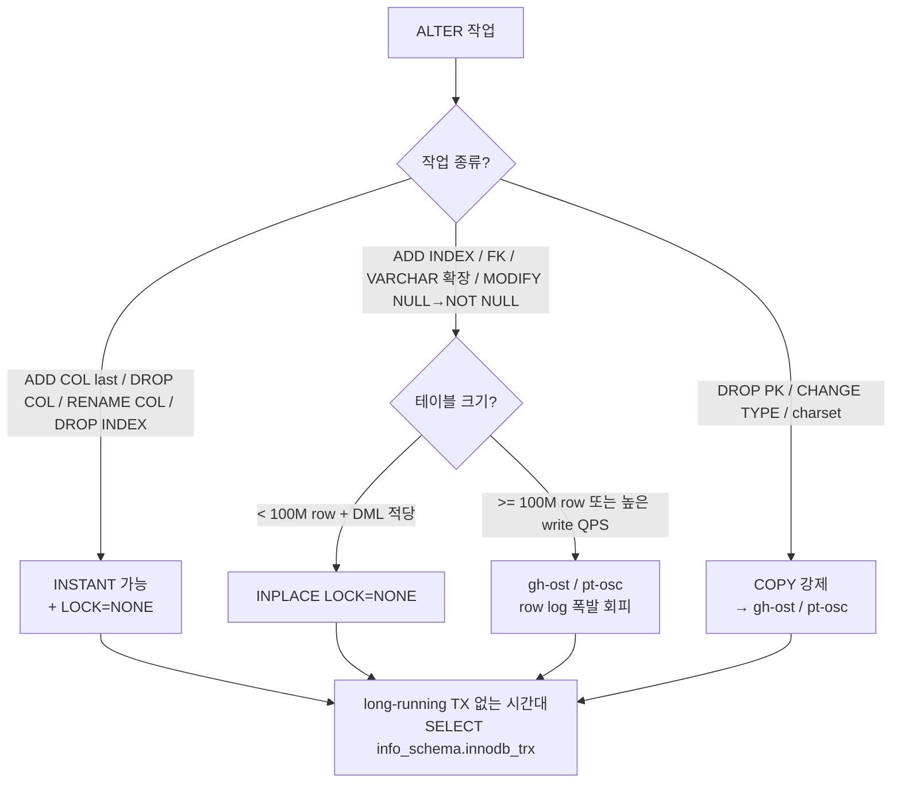

# 20. Online DDL Deep — INSTANT/INPLACE/COPY + gh-ost/pt-osc + PG CONCURRENTLY + 무중단 마이그레이션

> 카탈로그 매핑: §99 §H — `ALGORITHM=INSTANT` (8.0+) (✅ → ✅+한도/실패 모드), `ALGORITHM=INPLACE` row log (✅ → ✅), `ALGORITHM=COPY` 의 ROW lock 사용 (★ → ✅), `gh-ost / pt-osc` (🟡 → ✅), `pg_repack` (★ → ✅), PostgreSQL `CREATE INDEX CONCURRENTLY` / `REINDEX CONCURRENTLY` (★ → ✅). 13 의 카탈로그 적 정리를 **알고리즘 내부 동작 + 큰 테이블 운영 절차** 로 확장한다.
> 학습 시간 예상: ~3h · 자가평가 입구 레벨: B+

> 운영 트래픽이 살아 있는 상태에서 스키마를 바꾸는 일은 **알고리즘을 고르는 문제** 가 아니라 **장애 시나리오를 고르는 문제** 다. 본 deep file 은 13 에서 정리한 INSTANT/INPLACE/COPY 의 카탈로그적 차이를 **InnoDB 내부 동작 (메타데이터 vs row log vs 테이블 재작성)** 으로 한 단계 깊이 들어가고, **gh-ost/pt-osc 의 binlog vs trigger 메커니즘**, **PostgreSQL 의 `CONCURRENTLY` / `pg_repack` 의 다른 모델**, **MDL 폭탄을 만드는 long-running TX 패턴**, 그리고 msa 의 큰 테이블 (수억 행 가정) 컬럼 추가 절차를 담는다.

---

## §1. 한 줄 핵심

> **Online DDL = "운영 트래픽 (DML) 을 막지 않으면서 스키마를 바꾸는 기술".** MySQL 의 답은 INSTANT (8.0+, 메타데이터 한 번만 변경) → INPLACE (테이블 안에서 row log 로 동시 DML 추적) → COPY (새 테이블 + 모든 row 복제, DML 차단) 의 **세 단계 fallback**. 큰 테이블엔 native 보다 **gh-ost / pt-osc (그림자 테이블)** 가 표준. PostgreSQL 은 다른 모델 — `ALTER TABLE` 의 default 는 ACCESS EXCLUSIVE 짧게, 인덱스는 `CREATE INDEX CONCURRENTLY` 가 별도 동사. MDL (Metadata Lock) 의 함정은 알고리즘이 아니라 **시작/종료 순간의 짧은 X-MDL 이 long-running TX 뒤에서 줄 서면 모든 후속 쿼리가 hang** 하는 것.

---

## §2. 등장 배경 — 왜 "Online" DDL 이 필요한가

### 2-1. MySQL 5.5 시대 — DDL = full table lock

5.5 이전: 거의 모든 `ALTER TABLE` 은 **새 테이블 생성 + 모든 row 복사 + RENAME** 의 COPY 방식이었다.

```
시간 ─────────────────────────────────────────►
DDL ████████████████████████ (모든 row 복사 — 시간 / 일 단위)
DML 차단 ████████████████████ (그동안 INSERT/UPDATE/DELETE 모두 X)
```

1억 row 테이블에 컬럼 하나 추가하는 데 수 시간이 걸렸고, 그동안 모든 트래픽이 막혔다. 운영자가 새벽 2시에 점검 모드 켜고 작업하던 시절.

### 2-2. 5.6 — INPLACE 도입

InnoDB 가 "테이블 안에서 수정" 하는 모드를 도입. DDL 중에도 DML 가능. 변경은 **row log buffer** 에 누적 → DDL 종료 직전 일괄 적용.

→ "Online DDL" 이라는 용어가 이때 정착.

### 2-3. 8.0 — INSTANT 도입

**메타데이터만 변경** 하는 ALGORITHM=INSTANT 가 등장. 8.0.12 에서 `ADD COLUMN (마지막 위치)`, 8.0.29 에서 `DROP COLUMN`, ENUM/SET 끝값 추가, RENAME COLUMN 등이 INSTANT 가능 작업으로 확장.

```
시간 ─────────────────────────────────────────►
DDL █ (수십 ms — frm/dd 메타데이터 한 번 갱신)
DML 차단 █ (시작/종료 순간 X-MDL 잠시 — 보통 ms 수준)
```

→ 1억 row 테이블의 컬럼 추가가 ms 단위로.

### 2-4. 그래도 native 만으론 부족한 이유

- INSTANT 는 적용 가능 작업 제한적 (`ADD INDEX` 불가, ENUM 중간 추가 불가, AUTO_INCREMENT 변경 불가).
- INPLACE 도 `innodb_online_alter_log_max_size` (기본 128MB) 초과 시 fail. 큰 테이블 + 높은 DML 부하면 row log 폭발.
- Master-Replica 토폴로지에서 DDL 자체가 binlog 에 한 statement 로 기록 → replica 가 그 statement 를 실행하는 동안 lag (replica 도 block 시간 발생).

→ GitHub / Shopify / Percona 등이 **그림자 테이블 + 청크 복사 + atomic RENAME** 방식의 외부 도구 (gh-ost / pt-osc) 를 표준으로 채택.

### 2-5. PostgreSQL 의 다른 길

PG 는 MVCC 가 heap-based 라 MySQL 의 INPLACE/COPY 같은 알고리즘 분리가 없다. 대신:

- `ALTER TABLE ADD COLUMN ... DEFAULT ...` 가 11+ 부터 메타데이터만 변경 (full table rewrite 회피).
- 인덱스는 `CREATE INDEX` 가 ACCESS EXCLUSIVE 잡지만, `CREATE INDEX CONCURRENTLY` 는 ACCESS SHARE 만 → DML 동시 가능.
- bloat 회피용 `REINDEX CONCURRENTLY` (12+) / `pg_repack` (extension).

→ "online" 의 모델 자체가 다르다.

---

## §3. MySQL InnoDB 의 3 ALGORITHM — 내부 동작

### 3-1. ALGORITHM=INSTANT — 메타데이터만

#### 동작

InnoDB 의 dd (Data Dictionary) 와 row 의 hidden 메타데이터에 "이 시점부터 추가된 컬럼은 default X" 만 기록. 기존 row 의 실제 디스크 데이터는 **그대로**. row 를 읽을 때 InnoDB 가 `n_columns` 와 row 의 `n_columns_at_insert_time` 을 비교해서 default 를 합성.

```
INSTANT ADD COLUMN tax DECIMAL(10,2) DEFAULT 0:
  ├── dd.tables 에 새 컬럼 정의 추가
  ├── dd.tables 에 "instant_cols" 카운터 갱신
  └── 기존 row 디스크 페이지 — 변경 없음
                              ↓
  SELECT 시: row 메타로 "이 row 는 새 컬럼 정보 없음 → default 합성"
```

#### 가능 작업 (8.0.29 기준 + 8.4 확장)

| 작업 | INSTANT? | 비고 |
|---|---|---|
| `ADD COLUMN ... LAST` | ✅ | 마지막 위치만 (8.0.12+). 8.0.29+ 부터 임의 위치 가능 (단 모든 컬럼 다시 합성). |
| `DROP COLUMN` | ✅ (8.0.29+) | row 메타에 "tombstone" 기록 |
| `RENAME COLUMN` | ✅ | dd 만 변경 |
| `ENUM/SET 끝에 값 추가` | ✅ | 기존 ordinal 보존 |
| `ENUM/SET 중간 추가/순서 변경` | ❌ | 기존 row 의 ordinal 이 변하므로 |
| `MODIFY COLUMN` (호환 변경) | △ | VARCHAR 길이 확장 (같은 byte 표현 안), NULL → NOT NULL 은 X |
| `ADD INDEX` | ❌ | INPLACE 가 보통 |
| `DROP INDEX` | ✅ | 메타만 변경 |
| `RENAME TABLE` | ✅ | dd 만 변경 |
| `ADD/DROP FOREIGN KEY` | ❌ | INPLACE |
| `AUTO_INCREMENT` 값 변경 | ❌ | INPLACE/COPY |

#### INSTANT 한도 — 64회

테이블당 **INSTANT ADD/DROP COLUMN 누적 64 회** 제한. 한도 차면 다음 INSTANT 시도가 다음 에러를 던짐:

```
ERROR 4092 (HY000): Maximum row size for an INSTANT ADD/DROP COLUMN
is exceeded. Considering the storage overhead, including the
row format header, is required.
```

→ `OPTIMIZE TABLE foo;` 또는 `ALTER TABLE foo ENGINE=InnoDB, ALGORITHM=COPY;` 로 테이블을 한 번 재작성하면 카운터 리셋. 단 이건 COPY → 운영 중엔 위험.

#### INSTANT 의 read amplification

기존 row 가 새 컬럼을 갖지 않은 상태로 누적되면, SELECT 마다 default 합성 비용 발생. 수십 번 INSTANT 누적된 테이블은 read 성능이 점진적으로 떨어진다 (체감하기 어려운 ~1-3% 수준이지만 누적).

→ 운영 룰: "INSTANT 는 무료가 아니다. 분기에 한 번 OPTIMIZE 로 정리".

#### LOCK 옵션

INSTANT 는 본질적으로 메타데이터 변경이라 LOCK=NONE 만 의미가 있다. LOCK=DEFAULT 면 InnoDB 가 자동으로 NONE 적용.

```sql
ALTER TABLE orders ADD COLUMN tax DECIMAL(10,2) DEFAULT 0,
    ALGORITHM=INSTANT, LOCK=NONE;
```

### 3-2. ALGORITHM=INPLACE — row log 추적

#### 동작

InnoDB 가 **새 .ibd 파일** 을 만들고 (또는 기존 파일 안에서 새 인덱스 트리) 데이터를 채워 넣는 동안, 그 사이에 들어오는 DML 을 **online_alter_log** 에 기록. DDL 완료 직전 잠시 X-MDL 잡고 row log 의 누적 변경을 신 구조에 일괄 적용 → atomic swap.

```
T0: ALTER TABLE 시작
    ├── X-MDL (잠시) → S-MDL 로 다운그레이드
    └── 새 인덱스 / 새 .ibd 채움 시작

T0~Tn: 기존 테이블에 INSERT/UPDATE/DELETE 들어옴
    └── 변경 사항이 online_alter_log 에 기록 (FIFO)

Tn (복사 완료): X-MDL 다시 획득 (잠시)
    ├── online_alter_log 의 누적 변경을 신 구조에 일괄 apply
    └── 신/구 .ibd swap → 구 .ibd drop
```

#### 가능 작업

| 작업 | INPLACE? | LOCK |
|---|---|---|
| `ADD INDEX` (secondary) | ✅ | NONE |
| `DROP INDEX` | ✅ | NONE (INSTANT 가 보통) |
| `ADD/DROP FOREIGN KEY` | ✅ | NONE |
| `ADD COLUMN (중간 위치, < 8.0.29)` | ✅ | NONE — 단 row 재작성 발생 |
| `MODIFY COLUMN` 길이 확장 (같은 byte) | ✅ | NONE |
| `MODIFY COLUMN` NULL → NOT NULL | ✅ | SHARED (검증 동안 read만) |
| `ADD PRIMARY KEY` | ✅ | NONE — 무거움 (clustered 재구성) |
| `DROP PRIMARY KEY` 단독 | ❌ | COPY 만 |
| `CHANGE COLUMN` 타입 변경 | ❌ (대부분) | COPY |
| `ADD FULLTEXT INDEX` (첫 번째) | ❌ | COPY |

#### `innodb_online_alter_log_max_size` — 폭발 지점

기본 128MB. row log 가 이 크기를 초과하면 DDL 이 fail:

```
ERROR 1799 (HY000): Creating index 'idx_x' required more than
'innodb_online_alter_log_max_size' bytes of modification log.
Please try again.
```

→ DML 부하가 높은 시간대엔 INPLACE ADD INDEX 가 row log 폭발로 실패. 대형 테이블 (수억 row) + 높은 write QPS (Queries Per Second, 초당 쿼리 수) 시 native INPLACE 보다 gh-ost 가 안전.

#### INPLACE 의 단계별 lock 패턴

```
시작        ─ X-MDL 잠시 (ms)
복사 진행 중 ─ S-MDL (DML 가능)
종료 직전   ─ X-MDL 잠시 (ms ~ 초) — row log apply
완료        ─ MDL 해제
```

핵심은 **종료 직전의 X-MDL 시간** 이 row log 크기에 비례한다는 점. 1GB row log → apply 에 수 분 → 그동안 X-MDL → 모든 후속 쿼리 hang.

#### 진행 상황 모니터링

```sql
SELECT
    EVENT_NAME,
    WORK_COMPLETED,
    WORK_ESTIMATED,
    WORK_COMPLETED / WORK_ESTIMATED * 100 AS pct
FROM performance_schema.events_stages_current
WHERE EVENT_NAME LIKE 'stage/innodb/alter%';
```

→ "stage/innodb/alter table (read PK and internal sort)" / "merge sort" / "log apply table" 단계가 보임.

### 3-3. ALGORITHM=COPY — 마지막 수단

#### 동작

새 테이블 생성 → 모든 row 를 SELECT 하면서 INSERT → 트리거 / row log 없이 단순 복사 → RENAME.

복사 중 원본은 **shared lock** (DML 의 INSERT/UPDATE/DELETE 차단, SELECT 만 허용 + LOCK=SHARED) 또는 **exclusive lock** (SELECT 도 차단 + LOCK=EXCLUSIVE).

#### 강제되는 경우

- `DROP PRIMARY KEY` 단독 (다른 컬럼을 새 PK 로 동시에 지정해야 INPLACE 가능).
- `CHANGE COLUMN` 의 타입을 호환되지 않게 변경 (INT → VARCHAR 등).
- character set 변경.
- partitioning 의 일부 변경 (복잡한 reorganize).

#### 운영 룰

- 명시적으로 `ALGORITHM=INPLACE` 또는 `ALGORITHM=INSTANT` 를 적어야 fallback 으로 COPY 가 선택되는 일을 막을 수 있다.
- 안 적으면 InnoDB 가 가장 가벼운 알고리즘을 자동 선택 — INSTANT 가능하면 INSTANT, 아니면 INPLACE, 아니면 COPY → "내가 모르는 사이 COPY 로 떨어져 운영 정지" 위험.

```sql
-- ✅ 안전 — 가능한 최저 알고리즘 명시
ALTER TABLE orders ADD INDEX idx_user_status (user_id, status),
    ALGORITHM=INPLACE, LOCK=NONE;

-- ❌ 위험 — fallback COPY 가능
ALTER TABLE orders MODIFY COLUMN tracking_code VARCHAR(255);  -- INPLACE 가능 여부 불투명
```

만약 `INPLACE` 가 불가능한 작업이면 다음 에러로 즉시 실패 → 안전한 fallback 방지:

```
ERROR 1846 (0A000): ALGORITHM=INPLACE is not supported for this operation.
Try ALGORITHM=COPY.
```

### 3-4. 결정 트리



---

## §4. gh-ost — binlog 기반 그림자 테이블

### 4-1. 동작 메커니즘

```
[원본 테이블 orders]
       ↓
1) gh-ost: orders 와 같은 구조의 그림자 테이블 _orders_gho 생성
2) 그림자에 ALTER 적용 (예: ADD INDEX) — 구조만 다름
3) 청크 단위 SELECT FROM orders → INSERT INTO _orders_gho (chunk by PK range)
4) 동시에 binlog (replica 또는 master) 를 stream 으로 읽어 원본의 변경을
   _orders_gho 에 apply (INSERT/UPDATE/DELETE)
5) 청크 복사 + binlog apply 가 거의 동기화되면 cut-over 진입
6) cut-over: atomic RENAME — orders → _orders_old, _orders_gho → orders
7) (옵션) _orders_old DROP
```

### 4-2. pt-osc 와의 차이

| 항목 | pt-online-schema-change | gh-ost |
|---|---|---|
| 변경 추적 | INSERT/UPDATE/DELETE **트리거** 가 그림자에 동기 | **binlog** 를 stream 으로 읽어 apply |
| 마스터 부하 | 트리거 실행 → write QPS ~10-20% 증가 | 트리거 없음 → 거의 0 (별도 worker 가 binlog 읽음) |
| binlog 읽기 위치 | (사용 안 함) | master 또는 replica (`--allow-on-master` / 기본은 replica) |
| 일시정지 | 청크 속도 throttle | 일시정지 + 재개 가능 (`echo throttle | nc`) |
| FK 처리 | 옵션 복잡 (`--alter-foreign-keys-method`) | FK 가 있는 테이블은 거부 (안전) |
| binlog format 요구 | 무관 (트리거가 알아서) | `ROW` 필수 |
| 성숙도 | Percona 검증된 표준 | GitHub / Shopify 표준, 더 현대적 |

### 4-3. gh-ost 명령 예

```bash
gh-ost \
  --user=admin --password=*** \
  --host=replica-01.example.com \           # binlog 는 replica 에서 읽기 (master 부하 0)
  --allow-on-master \                       # master 에 ALTER 발행
  --database=commerce \
  --table=orders \
  --alter="ADD INDEX idx_user_status (user_id, status)" \
  --max-load='Threads_running=25' \         # 부하 보호 — 25 이상이면 throttle
  --critical-load='Threads_running=50' \    # 50 이상이면 abort
  --chunk-size=1000 \                       # 1회 1000 row
  --max-lag-millis=1500 \                   # replica lag 1.5s 이상이면 throttle
  --cut-over=default \                      # cut-over 정책 (default = atomic)
  --execute                                 # 실제 실행 (--noop 으로 dry-run)
```

### 4-4. cut-over 의 본질

청크 복사가 끝나도 binlog 가 항상 약간 뒤처짐. cut-over 는 다음의 atomic 한 RENAME 만으로 traffic 을 신 테이블로 옮긴다:

```sql
RENAME TABLE orders TO _orders_old, _orders_gho TO orders;
```

이 RENAME 자체는 InnoDB 의 dd 변경 — **수 ms ~ 수십 ms**. 이 짧은 시간만 X-MDL 발생. 그 사이에 long-running TX 가 있으면 같은 MDL 폭탄.

→ gh-ost 는 cut-over 전에 long-running TX 를 자동 감지하고 throttle 한다.

### 4-5. gh-ost 의 안전장치

- **호스트 cut-over 검증** — 본 cut-over RENAME 전에 lock 을 잠깐 잡아 다른 작업이 끼어들 수 없게 하고, 검증 후 풀고 진짜 RENAME.
- **`--postpone-cut-over-flag-file`** — 사람이 신호줄 때까지 cut-over 보류. 새벽 시간 자동 작업 시 유용.
- **`--ok-to-drop-table`** 미설정 → 자동 DROP 안 함 (원본 보존).

---

## §5. pt-online-schema-change — 트리거 기반

### 5-1. 동작

```
[원본 orders]
   ↓
1) _orders_new 생성 + 그림자에 ALTER 적용
2) orders 에 트리거 3종 (AFTER INSERT/UPDATE/DELETE) 부착
   → 원본의 변경이 그림자에 동기 INSERT/UPDATE/DELETE
3) 청크 복사 — `INSERT IGNORE INTO _orders_new SELECT ... FROM orders WHERE id BETWEEN ? AND ?`
4) RENAME (atomic) → 트리거 제거 → 구 테이블 DROP (옵션)
```

### 5-2. INSERT IGNORE 의 의미

청크 복사 중 같은 row 가 트리거에 의해 그림자에 먼저 들어왔을 수 있음. `INSERT IGNORE` 가 그 충돌을 silently skip → 트리거의 결과가 항상 우선 (정합성 유지).

### 5-3. FK 처리의 까다로움

- `--alter-foreign-keys-method=auto`: 자식 테이블의 FK 를 RENAME 시 임시로 떼고 다시 붙임.
- `--alter-foreign-keys-method=rebuild_constraints`: FK 를 ALTER TABLE child DROP/ADD 로 다시 생성 (시간 길어짐).
- `--alter-foreign-keys-method=drop_swap`: atomic swap 대신 DROP + RENAME (매우 짧은 다운타임).

→ FK 가 있는 큰 테이블은 pt-osc 보다 gh-ost 또는 application-level FK + 분리 운영이 안전.

### 5-4. msa 의 outbox 테이블 같은 케이스

```sql
-- 가정: outbox 가 1억 row 누적 + 새 인덱스 추가 필요
pt-online-schema-change \
  --alter "ADD INDEX idx_topic_published (topic, published_at)" \
  --execute \
  --chunk-time=0.5 \                # 1 청크당 0.5초 내
  --max-load='Threads_running=20' \
  D=quant,t=outbox,h=master.example.com,u=admin,p=...
```

---

## §6. PostgreSQL 의 Online DDL — 다른 모델

### 6-1. ALTER TABLE 의 lock 모델

PG 의 `ALTER TABLE` 은 기본 ACCESS EXCLUSIVE (모든 read/write 차단) 를 잡는다. 하지만 작업 종류에 따라 **잠시만** 잡는다:

| 작업 | lock | 시간 |
|---|---|---|
| `ADD COLUMN ... DEFAULT NULL` | ACCESS EXCLUSIVE | ms (메타만) |
| `ADD COLUMN ... DEFAULT 'x'` (11+) | ACCESS EXCLUSIVE | ms (메타만) — fast default |
| `ADD COLUMN ... DEFAULT 'x'` (10 이하) | ACCESS EXCLUSIVE | 시간 (전체 row rewrite) |
| `ALTER COLUMN ... TYPE` | ACCESS EXCLUSIVE | row rewrite |
| `ALTER COLUMN ... SET NOT NULL` | ACCESS EXCLUSIVE | 전체 scan (검증) |
| `ADD CONSTRAINT ... NOT VALID` + `VALIDATE CONSTRAINT` | 후자는 SHARE UPDATE EXCLUSIVE | 분리하면 online |
| `DROP COLUMN` | ACCESS EXCLUSIVE | ms (논리적 tombstone) |

#### Fast default — PG 11 의 변화

11+ 부터 `ADD COLUMN ... DEFAULT 'x' NOT NULL` 도 메타데이터에 stored attribute 로 기록 → 기존 row 디스크는 그대로. SELECT 시 default 합성. MySQL 의 INSTANT 와 같은 모델.

### 6-2. CREATE INDEX CONCURRENTLY

PG 에서 인덱스 생성은 별도 동사. 일반 `CREATE INDEX` 는 ACCESS EXCLUSIVE 잡지만:

```sql
CREATE INDEX CONCURRENTLY idx_orders_user_id ON orders(user_id);
```

- **2단계 scan**: 첫 scan 으로 인덱스 빌드, 두 번째 scan 으로 그 사이 변경된 row 동기.
- **ACCESS SHARE 만** (read 가능). DML 도 가능.
- 하지만 **트랜잭션 안에서 사용 불가** — DDL 트랜잭션 분리 필요.
- **실패 시 INVALID 인덱스로 남음**: `\d` 에서 `INVALID` 표시 → `DROP INDEX` 후 재생성 필수.

```sql
-- 실패한 CONCURRENTLY 인덱스 정리
SELECT indexrelid::regclass, pg_relation_size(indexrelid)
FROM pg_index WHERE NOT indisvalid;

DROP INDEX CONCURRENTLY idx_orders_user_id;
CREATE INDEX CONCURRENTLY idx_orders_user_id ON orders(user_id);
```

### 6-3. REINDEX CONCURRENTLY (12+)

bloat 정리 / 손상 인덱스 재생성. 새 인덱스를 만들고 atomic 하게 swap.

```sql
REINDEX INDEX CONCURRENTLY idx_orders_user_id;
REINDEX TABLE CONCURRENTLY orders;
```

### 6-4. NOT NULL 추가의 안전한 패턴

```sql
-- ❌ 위험 — 전체 row scan + ACCESS EXCLUSIVE
ALTER TABLE orders ALTER COLUMN tax SET NOT NULL;

-- ✅ 안전 — 2단계
ALTER TABLE orders ADD CONSTRAINT orders_tax_not_null
    CHECK (tax IS NOT NULL) NOT VALID;       -- ACCESS EXCLUSIVE 잠시
ALTER TABLE orders VALIDATE CONSTRAINT orders_tax_not_null;
                                              -- SHARE UPDATE EXCLUSIVE — DML 가능
ALTER TABLE orders ALTER COLUMN tax SET NOT NULL;
ALTER TABLE orders DROP CONSTRAINT orders_tax_not_null;
```

PG 12+ 부터는 NOT VALID CHECK 가 있으면 `SET NOT NULL` 이 그것을 인지하고 전체 scan 을 skip.

### 6-5. pg_repack — bloat 정리

`VACUUM FULL` 은 ACCESS EXCLUSIVE — 운영 불가능. `pg_repack` extension 이 그림자 테이블 + 트리거로 bloat 제거 (gh-ost 와 유사 모델 — PG 버전).

```bash
pg_repack --no-superuser-check -d commerce -t orders
```

- 공식 PG 가 아닌 커뮤니티 도구.
- 새 .heap / .toast 만들고 swap.
- 짧은 ACCESS EXCLUSIVE 한 번 (cut-over).

### 6-6. PG 의 logical replication + DDL

PG 의 logical replication 은 DDL 을 자동 전파하지 않는다. 운영 시 master/replica 양쪽에 각각 DDL 적용해야 함 (16+ 부터 일부 지원).

→ MySQL 의 binlog 가 statement-based 면 DDL statement 가 그대로 흐른다는 점이 다름.

---

## §7. MDL 폭탄 — 모든 알고리즘에 공통된 함정

### 7-1. 시나리오

```
T1 (오래 걸리는 SELECT — 30분 짜리 BI 리포트):
    BEGIN;
    SELECT ... FROM orders ...;  -- S-MDL on orders
    -- 아직 commit 안 함

T2 (운영자가 DDL):
    ALTER TABLE orders ADD INDEX idx_x (...) ALGORITHM=INPLACE, LOCK=NONE;
    -- 시작 직전 X-MDL 시도 → T1 끝날 때까지 wait

T3 (정상 트래픽 SELECT):
    SELECT * FROM orders WHERE id = 1;
    -- S-MDL 시도 → T2 (X-MDL waiter) 뒤에서 wait
    -- T2 가 못 끝나면 T3 도 못 들어감

T4, T5, ... (모든 후속 쿼리):
    -- 줄줄이 hang → connection pool 고갈 → 서비스 정지
```

→ "ALGORITHM=INPLACE LOCK=NONE 인데 왜 서비스가 멈췄나" 의 답. **알고리즘은 진행 중에만 NONE 이고 시작/종료 순간엔 X-MDL** — 이 시작 단계에서 long-running TX 가 발목을 잡는다.

### 7-2. 진단 — DDL 직전 체크

```sql
-- 1) 5분 이상 살아 있는 TX
SELECT
    trx_id,
    trx_started,
    trx_mysql_thread_id,
    TIMEDIFF(NOW(), trx_started) AS duration,
    LEFT(trx_query, 100) AS query
FROM information_schema.innodb_trx
WHERE trx_started < NOW() - INTERVAL 5 MINUTE
ORDER BY trx_started;

-- 2) MDL 대기자
SELECT
    OBJECT_TYPE,
    OBJECT_SCHEMA,
    OBJECT_NAME,
    LOCK_TYPE,
    LOCK_STATUS,
    OWNER_THREAD_ID
FROM performance_schema.metadata_locks
WHERE OBJECT_NAME = 'orders';
```

### 7-3. lock_wait_timeout 분리

DDL 만 짧은 timeout 으로 보호:

```sql
SET SESSION lock_wait_timeout = 5;  -- DDL 세션만
ALTER TABLE orders ADD COLUMN tax DECIMAL(10,2) DEFAULT 0,
    ALGORITHM=INSTANT, LOCK=NONE;
```

5초 안에 X-MDL 못 잡으면 DDL fail → 그러면 long-running TX 죽이고 재시도. 모든 후속 트래픽이 hang 되는 것보다 DDL 한 번 fail 이 안전.

### 7-4. PG 의 같은 함정

PG 도 동일 — `lock_timeout` 이 그 세션의 lock 대기 시간 제한.

```sql
SET lock_timeout = '5s';
ALTER TABLE orders ADD COLUMN tax NUMERIC(10,2);
```

실패 시 `canceling statement due to lock timeout` 에러 → 운영 자동화에서 retry.

---

## §8. msa 적용 — 큰 테이블 컬럼 추가 절차

### 8-1. 가정

```
quant 의 outbox 테이블
  - 행 수: ~1.5억 (Phase 2 가동 6개월 후 가정)
  - DML 부하: 평균 200 INSERT/s (이벤트 발행) + 200 UPDATE/s (markPublished)
  - PK: id BIGINT AUTO_INCREMENT
  - 인덱스: idx_outbox_published, idx_outbox_tenant_published
  - 요청: tracing 강화 위해 trace_id VARCHAR(64) 컬럼 추가
```

### 8-2. 알고리즘 선택 의사결정

| 옵션 | 가능? | 권장? |
|---|---|---|
| INSTANT ADD COLUMN trace_id VARCHAR(64) DEFAULT NULL LAST | ✅ | 1순위 |
| INPLACE | ✅ | 2순위 (불필요) |
| gh-ost | ✅ | INSTANT 한도 차거나 NOT NULL 강제 시 |
| pt-osc | ✅ | gh-ost 안 되면 |

→ **INSTANT 가 정답**. 단 운영 절차를 빠짐없이 수행해야 함.

### 8-3. 운영 절차 (msa 표준 룰 후보)

```
[T-7d] 변경 PR 작성 + Flyway migration 추가
       (`V20260712_001__outbox_add_trace_id.sql`)
       → migration 의 SQL 에 ALGORITHM=INSTANT, LOCK=NONE 명시

[T-3d] staging 적용 + INSTANT 한도 카운터 확인
       SELECT TABLE_NAME, INSTANT_COLS FROM information_schema.INNODB_TABLES
       WHERE TABLE_NAME = 'outbox';

[T-1d] 운영 환경의 long-running TX baseline 측정
       (어느 시간대에 5분 이상 TX 가 가장 적은가)

[T-0]  off-peak 시간대 (새벽 03:00 KST 가정)
       1) Flyway 비활성 모드로 인스턴스 운영 (auto-apply 차단)
       2) 운영 admin 세션에서 직접:
            SET SESSION lock_wait_timeout = 5;
            ALTER TABLE outbox
                ADD COLUMN trace_id VARCHAR(64) DEFAULT NULL,
                ALGORITHM=INSTANT, LOCK=NONE;
       3) 검증:
            DESC outbox;  -- 신 컬럼 확인
            SELECT TABLE_NAME, INSTANT_COLS FROM information_schema.INNODB_TABLES;
       4) 코드 배포 — 신 컬럼 사용

[T+0..T+1d] 모니터링
       - 에러율 / latency 변화
       - long-running TX 기록 (DDL 직후 잠금 대기 발생 여부)
       - INSTANT 누적 카운터 (다음 ALTER 의 한도 잔여)
```

### 8-4. NOT NULL 강제 + default 가 필요할 때

`trace_id NOT NULL DEFAULT 'unknown'` 으로 추가하고 싶다면:

- 8.0.16+ 부터는 `INSTANT ADD COLUMN ... NOT NULL DEFAULT '...'` 가능 (메타에 default 저장).
- 8.0.12-15 면 `NULL` 로 추가 후 backfill UPDATE → `MODIFY COLUMN ... NOT NULL` (이건 INPLACE 가 보통). 큰 테이블이면 backfill 자체가 문제 → 청크로 쪼갬.

```sql
-- 청크 backfill
UPDATE outbox SET trace_id = 'unknown'
WHERE id BETWEEN ? AND ? AND trace_id IS NULL;
-- 청크 크기 1만, 청크 사이 sleep 100ms
```

### 8-5. msa 의 현행 Flyway 운영

`order/app/src/main/resources/db/migration/V20260502_001__create_outbox_event.sql` 에서 보듯이 msa 는 **단순 CREATE TABLE / INDEX** 만 Flyway 로 처리한다. `inventory/app/src/main/resources/db/migration/V2__processed_event_composite_key.sql` 의 5-step swap 패턴 (backup → 신 테이블 → backfill → RENAME → 추후 DROP) 이 이미 ADR-0029 의 권장 절차로 정착.

→ 큰 테이블 ALTER 가 발생하면 본 §8.3 의 절차를 ADR 로 명시화하는 것이 17 (improvements) 의 후보.

### 8-6. msa 의 inventory `processed_event` swap 패턴 — 사례 분석

`inventory/app/src/main/resources/db/migration/V2__processed_event_composite_key.sql` (1-41 line):

```
1) backup — CREATE TABLE processed_event_backup_v0 AS SELECT * FROM processed_event
2) 신규 테이블 — CREATE TABLE processed_event_v1 (BINARY(16) + VARCHAR(64), 신 PK)
3) backfill — INSERT IGNORE INTO ... SELECT UNHEX(REPLACE(event_id, '-', '')) ...
4) atomic swap — RENAME TABLE processed_event TO processed_event_v0, processed_event_v1 TO processed_event
5) (후속 PR-10) DROP processed_event_v0, processed_event_backup_v0
```

이 패턴은 본질적으로 **"pt-osc 의 application-level 수동 버전"** 이다:
- 트리거 대신 application 의 dual-write 또는 짧은 정지창.
- gh-ost 처럼 binlog stream 안 쓰고 단순 INSERT IGNORE.
- atomic swap 만 RENAME 으로.

→ 작은 테이블 (수만 row) 엔 안전한 패턴. 큰 테이블 (1억 row+) 엔 backfill 단계가 너무 오래 걸려 부적합 → gh-ost 또는 application dual-write 필요.

---

## §9. 실패 모드 카탈로그

### 9-1. INSTANT 한도 초과

```
ERROR 4092 (HY000): Maximum row size for an INSTANT ADD/DROP COLUMN
is exceeded.
```
→ `ALTER TABLE foo ENGINE=InnoDB, ALGORITHM=COPY` 으로 카운터 리셋 (off-peak + gh-ost 권장).

### 9-2. INPLACE row log 폭발

```
ERROR 1799 (HY000): Creating index 'idx_x' required more than
'innodb_online_alter_log_max_size' bytes of modification log.
```
→ 즉시 fail. DML 부하 줄이고 재시도하거나 `innodb_online_alter_log_max_size` 임시 증가 (예: 1G — 메모리 부담 주의) 또는 gh-ost 로 전환.

### 9-3. ALGORITHM 명시 + 불가능 작업

```
ERROR 1846 (0A000): ALGORITHM=INPLACE is not supported for this operation.
Try ALGORITHM=COPY.
```
→ 안전한 fallback 방지. 의도가 맞으면 명시적으로 `ALGORITHM=COPY` (또는 gh-ost) 로 진행.

### 9-4. lock_wait_timeout

```
ERROR 1205 (HY000): Lock wait timeout exceeded; try restarting transaction.
```
→ DDL 시작 단계의 X-MDL 이 long-running TX 에 막힘. `information_schema.innodb_trx` 로 범인 찾고 KILL 후 재시도.

### 9-5. PG INVALID 인덱스

```
\d orders 출력에:
  "idx_x" btree (x) INVALID
```
→ `CREATE INDEX CONCURRENTLY` 가 중간에 죽어서 미완성. `DROP INDEX CONCURRENTLY` + 재생성.

### 9-6. gh-ost cut-over 실패

```
gh-ost: Lock wait timeout exceeded
```
→ cut-over 시점에 long-running TX 가 잡고 있음. gh-ost 가 재시도하도록 두거나 long TX 를 죽임.

### 9-7. pt-osc FK 깨짐

```
ERROR 1452 (23000): Cannot add or update a child row: a foreign key
constraint fails
```
→ `--alter-foreign-keys-method` 옵션 잘못 선택. drop_swap 이나 rebuild_constraints 로 변경.

---

## §10. 면접 대비 포인트

### Q1. "ALGORITHM=INPLACE LOCK=NONE 인데 왜 운영 트래픽이 멈췄을까요?"

**A**: INPLACE 의 LOCK=NONE 은 **진행 중에만** NONE 이고, 시작 직전과 종료 직전엔 X-MDL 을 잠시 잡습니다. 그 시작 직전의 X-MDL 이 long-running TX 가 보유한 S-MDL 을 기다리며 대기 큐에 들어가면, 그 뒤로 새로 들어오는 SELECT/INSERT/UPDATE 의 S-MDL 시도가 모두 X-MDL waiter 뒤에서 줄을 섭니다. 결과적으로 모든 후속 쿼리가 hang. 회피는 (1) `lock_wait_timeout` 짧게 + (2) DDL 직전 `information_schema.innodb_trx` 로 long TX 확인 + (3) gh-ost 의 `--postpone-cut-over-flag-file` 같은 사람-게이트.

### Q2. "INSTANT 와 INPLACE 의 본질적 차이는?"

**A**: INSTANT 는 **dd 메타데이터만** 변경, 기존 row 의 디스크 데이터를 건드리지 않습니다. row 를 읽을 때 default 를 합성하는 비용이 누적되며, 테이블당 64 회 한도가 있습니다. INPLACE 는 **테이블 안에서 데이터를 재작성** 하면서 그동안 들어온 DML 을 row log 에 누적, 종료 직전 일괄 apply 합니다. row log 가 `innodb_online_alter_log_max_size` (기본 128MB) 를 초과하면 fail.

### Q3. "1억 row 테이블에 인덱스 추가, 어떻게 하시겠습니까?"

**A**: 결정 트리:
1. 가능 알고리즘: ADD INDEX 는 INSTANT 불가, INPLACE 가 native.
2. INPLACE 의 row log 폭발 위험 — DML 부하가 평균 100 QPS 이상이면 위험.
3. 따라서 **gh-ost** 권장. binlog 기반이라 master 부하 거의 0, throttling / pause / resume 가능.
4. 운영 절차: off-peak + `--max-load=Threads_running=25` + `--postpone-cut-over-flag-file` 로 사람-게이트 + cut-over 직전 long-running TX 확인 + atomic RENAME.
5. 검증: `SHOW INDEX FROM table` + EXPLAIN 으로 새 인덱스 사용 확인.

### Q4. "PostgreSQL 에서 NOT NULL 컬럼을 운영 중에 추가하는 안전한 방법은?"

**A**: 직접 `ALTER COLUMN ... SET NOT NULL` 은 ACCESS EXCLUSIVE + 전체 scan. 안전한 패턴은 (1) `ADD CONSTRAINT ... CHECK (col IS NOT NULL) NOT VALID` 로 미검증 제약 추가 (짧은 X-lock), (2) `VALIDATE CONSTRAINT` 로 SHARE UPDATE EXCLUSIVE 모드에서 scan (DML 가능), (3) `SET NOT NULL` (PG 12+ 는 NOT VALID CHECK 인지하고 scan 생략), (4) CHECK 제약 DROP. PG 11 이하면 (3) 이 다시 전체 scan 이라 다른 접근 (그림자 컬럼 + dual write) 필요.

### Q5. "gh-ost 와 pt-osc 의 핵심 차이는?"

**A**: 변경 추적 메커니즘:
- pt-osc: AFTER INSERT/UPDATE/DELETE **트리거** → master 의 write 부하 ~10-20% 증가, 트리거 자체가 동기 실행이라 application 대기.
- gh-ost: **binlog stream** 을 별도 worker 가 읽어 그림자 테이블에 apply → master 부하 거의 0 (replica 에서 binlog 읽으면 0). 단 `binlog_format=ROW` 강제.

운영 안정성: gh-ost 가 throttle / pause / postpone-cut-over 같은 안전장치가 더 풍부. FK 가 있는 테이블은 gh-ost 가 거부 (안전), pt-osc 는 옵션으로 다룰 수 있지만 까다로움.

---

## §11. 핵심 포인트

- **INSTANT** (8.0+) = dd 메타만 변경, 64 회 한도, ADD COLUMN LAST / DROP / RENAME / ENUM 끝값 / DROP INDEX 가 가능. **read amplification** 누적 — 분기에 한 번 OPTIMIZE 권장.
- **INPLACE** = 테이블 안에서 재작성 + row log 추적, `innodb_online_alter_log_max_size` 폭발 위험. 시작/종료 직전의 X-MDL 이 long-running TX 와 충돌 시 모든 후속 쿼리 hang.
- **COPY** = 새 테이블 + 모든 row 복사, DML 차단. PRIMARY KEY 변경 / 일부 charset / 호환 안 되는 타입 변경에 강제. 운영 회피.
- **ALGORITHM 명시** 컨벤션이 안전 — fallback COPY 자동 선택을 막음.
- **gh-ost** (binlog 기반) = master 부하 0 + throttle/pause/postpone 풍부. FK 거부 (안전).
- **pt-osc** (트리거 기반) = master write +10-20%. FK 처리 옵션 까다로움.
- **PostgreSQL** = `ADD COLUMN` 은 fast default (11+) 로 INSTANT 모델, 인덱스는 `CREATE INDEX CONCURRENTLY` 별도 동사. NOT NULL 추가는 NOT VALID CHECK + VALIDATE 의 2-step. `pg_repack` 으로 bloat 정리.
- **MDL 폭탄** = 알고리즘 선택과 무관. DDL 시작 단계의 X-MDL 이 long-running TX 의 S-MDL 과 충돌하면 모든 후속 쿼리 hang. 회피: `lock_wait_timeout` 짧게 + 사전 long TX 점검.
- **msa 적용** = Flyway 의 무지성 ALTER 위험. 큰 테이블은 별도 운영 작업으로 분리. inventory `processed_event` 의 5-step swap 패턴 (`V2__processed_event_composite_key.sql`) 이 application-level pt-osc 의 좋은 예시.

## 다음 학습

- [21-deadlock-anti-patterns.md](21-deadlock-anti-patterns.md) — DDL 진행 중 데드락 패턴
- [13-online-ddl.md](13-online-ddl.md) — Online DDL 카탈로그 정리
- [17-improvements.md](17-improvements.md) — msa 의 큰 테이블 ALTER 운영 룰 ADR 후보
