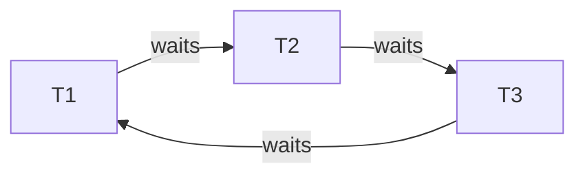

# 21. Deadlock Anti-Patterns Deep — 4 조건 + InnoDB wait-for graph + 흔한 5 패턴 + 회피/재시도 + msa 적용

> 카탈로그 매핑: §99 §C — `Deadlock 진단 (SHOW ENGINE INNODB STATUS)` (✅ → ✅+추가 깊이), `Lock wait timeout` (✅ → ✅), `Pessimistic vs Optimistic lock` (✅ → ✅+회피 패턴), PostgreSQL `pg_locks` / `pg_blocking_pids()` (★ → ✅), `SKIP LOCKED 도입` (★ → ✅+msa 적용 케이스). 08 의 카탈로그 정리 + 19 의 cookbook 을 **데드락 패턴 + 진단 + 회피/재시도** 로 한 단계 깊이 들어간다.
> 학습 시간 예상: ~3h · 자가평가 입구 레벨: B+

> 데드락은 InnoDB 가 자동 감지하므로 "버그" 가 아니다 — 적절한 retry + 멱등성이 갖춰지면 정상 동작. 그러나 **재현 가능한 데드락이 1초에 수십 건 발생** 하면 그건 코드의 안티패턴 신호다. 본 deep file 은 데드락의 4 조건 (Coffman conditions) → InnoDB 의 wait-for graph 와 victim 선정 → 흔한 5 패턴 (반대 순서 update / gap lock vs insert intention / secondary index 경로 차이 / FK cascade / SELECT FOR UPDATE 와 일반 INSERT 충돌) → 회피 패턴 (일관 정렬 / `SKIP LOCKED` / 짧은 TX) → 재시도 패턴 (exponential backoff + jitter + idempotency) → PostgreSQL 의 다른 모델 → msa 의 outbox / inventory 적용을 다룬다.

---

## §1. 한 줄 핵심

> **데드락 = "두 TX 가 서로 상대방이 잡은 lock 을 기다리며 영원히 대기" 의 cycle.** 4 조건 (mutual exclusion / hold-and-wait / no preemption / circular wait) 중 **circular wait 만 깨면** 데드락이 사라진다. 가장 실용적인 회피는 "**모든 lock 을 항상 같은 순서로 잡기**" — PK ASC 또는 정렬 키 ASC. InnoDB 는 자동 감지하고 rollback 비용이 작은 쪽을 abort (SQLSTATE 40001) → application 은 **멱등 retry + exponential backoff + jitter** 로 처리. 데드락이 잦으면 (1) lock 순서 검토, (2) 짧은 TX (외부 IO 분리, ADR-0020), (3) `SKIP LOCKED` 도입 (multi-worker), (4) 격리 레벨 변경 (RR → RC) 가 답.

---

## §2. 데드락의 4 조건 (Coffman Conditions)

1948년 Coffman 이 정리한 데드락 발생의 4 필요 조건. **하나라도 깨면 데드락이 발생할 수 없다**. 운영의 회피 전략은 결국 이 4 중 어느 것을 깨느냐의 선택.

### 2-1. Mutual Exclusion (상호 배제)

자원이 한 번에 한 TX 만 보유 가능. DB row 의 X-lock 은 본질적으로 mutual exclusion. 이 조건은 보통 깰 수 없다 (DB 의 본질이라).

→ 단, **read 만 하는 자원은 S-lock 으로 공유 가능** → 그래서 read-only 는 데드락 없음. update 가 끼어들면 발생.

### 2-2. Hold-and-Wait (보유하며 대기)

이미 자원을 보유한 상태에서 새 자원을 기다림. **이 조건이 가장 깨기 쉬움** — 모든 lock 을 한 번에 잡거나 (atomic), 새 lock 잡기 전에 기존 lock 을 풀거나.

```sql
-- ❌ Hold-and-Wait
BEGIN;
UPDATE a SET ... WHERE id=1;  -- a 보유
UPDATE b SET ... WHERE id=2;  -- b 대기 ← hold-and-wait

-- ✅ 한 번에 잡기 (multi-row 한 statement)
BEGIN;
UPDATE x SET ... WHERE id IN (1, 2);  -- 한 statement 가 두 row 다 잡음
```

→ 단 multi-row UPDATE 도 row 처리 순서가 옵티마이저 결정이라 일관성 보장 안 됨. ORDER BY 명시 + 단일 인덱스 경로로 강제.

### 2-3. No Preemption (선점 불가)

다른 TX 의 lock 을 강제로 뺏을 수 없음. DB 는 일반적으로 preemption 안 함 — TX 가 자발적으로 release (commit/rollback) 해야 함.

→ 다만 **deadlock 감지 시** 한쪽을 **rollback (=abort)** 하는 것이 일종의 선점. lock_wait_timeout 도 일종의 선점.

### 2-4. Circular Wait (순환 대기)

T1 → T2 → T3 → ... → T1 의 cycle. **이 조건을 깨는 게 가장 실용적**. 모든 자원에 **전역 순서** 를 부여하고 항상 그 순서로만 lock 을 잡으면 cycle 자체가 불가능.

```kotlin
// ❌ 순서 다름 → cycle 가능
fun transferAB(fromId: Long, toId: Long) {
    val from = repo.findByIdForUpdate(fromId)  // T1 이 a 잡음, T2 가 b 잡음
    val to = repo.findByIdForUpdate(toId)       // T1 이 b 대기, T2 가 a 대기 → cycle
    ...
}

// ✅ 항상 작은 ID 부터 잡기 → cycle 불가
fun transferAB(fromId: Long, toId: Long) {
    val (a, b) = if (fromId < toId) fromId to toId else toId to fromId
    val first = repo.findByIdForUpdate(a)
    val second = repo.findByIdForUpdate(b)
    ...
}
```

→ **이 패턴이 압도적으로 자주 쓰는 회피 기법**.

### 2-5. 4 조건의 운영 적용 표

| 조건 | 깨는 방법 | 비용 |
|---|---|---|
| Mutual Exclusion | read-only 분리 / 낙관 락 | 정합성 trade-off |
| Hold-and-Wait | 모든 lock 한 statement 로 / 미리 잡기 | 한 번에 잡을 lock 수 정확히 알아야 |
| No Preemption | timeout (`innodb_lock_wait_timeout`) / 자동 abort | 사용자에게 실패 |
| Circular Wait | **전역 순서 부여** (PK ASC) | 거의 무료 — 가장 실용적 |

---

## §3. InnoDB 의 데드락 감지

### 3-1. Wait-For Graph

InnoDB 는 **모든 lock wait 를 그래프로 추적**한다.

- 노드 = TX
- 간선 T_i → T_j = T_i 가 T_j 가 보유한 lock 을 기다림

매 lock wait 발생 시 그래프에 간선 추가 → DFS 로 cycle 검사 → cycle 이 발견되면 즉시 한쪽 abort.



→ T1 / T2 / T3 중 하나가 victim.

### 3-2. Victim 선정 — rollback 비용

InnoDB 는 **rollback 시 영향이 가장 적은 TX** 를 victim 으로 선택. 기준:

1. **Undo log 의 row 수** — 적은 쪽이 victim. (rollback 으로 되돌려야 할 row 가 적으니).
2. row 수가 같으면 가장 최근 시작한 TX.

→ 큰 batch 작업은 rollback 비용이 커서 victim 이 잘 안 된다. 작은 OLTP TX 가 자주 abort 되는 이유.

### 3-3. innodb_deadlock_detect

기본 `ON`. 매 lock wait 시 cycle 검사 → wait 그래프가 클 때 (수천 활성 TX) mutex 비용이 커짐.

`OFF` 로 끄면 cycle 검사 안 하고 `innodb_lock_wait_timeout` (기본 50s) 으로만 대응. 초고동시성 (수천 conn) 에서만 검토 — 일반 운영엔 ON.

### 3-4. 에러 시그널

```
ERROR 1213 (40001): Deadlock found when trying to get lock;
try restarting transaction.
```

- **SQLSTATE 40001** = `serialization_failure` (ANSI 표준).
- Spring 매핑: `DeadlockLoserDataAccessException` → `CannotAcquireLockException` 의 자식.
- vs `Lock wait timeout exceeded; try restarting transaction.` (SQLSTATE HY000) — 이건 timeout, deadlock 아님 → 다른 에러 클래스 (`PessimisticLockingFailureException`).

→ application 의 retry 로직에서 두 에러 분리 처리:
- 데드락 (40001) → 즉시 retry 가능 (멱등하면).
- timeout (HY000) → backoff 더 길게 (시스템 과부하 가능성).

---

## §4. SHOW ENGINE INNODB STATUS 로 데드락 분석

### 4-1. 출력의 LATEST DETECTED DEADLOCK 섹션

```
------------------------
LATEST DETECTED DEADLOCK
------------------------
2026-05-05 03:14:15 0x7f8a1c00b700
*** (1) TRANSACTION:
TRANSACTION 12345, ACTIVE 0.5 sec
mysql tables in use 1, locked 1
LOCK WAIT 3 lock struct(s), heap size 1136, 2 row lock(s),
  undo log entries 5
MySQL thread id 7, OS thread handle 140242951620352, query id 891
  192.168.1.5 admin updating
UPDATE orders SET status='PAID' WHERE id=2
*** (1) WAITING FOR THIS LOCK TO BE GRANTED:
RECORD LOCKS space id 4567 page no 8 n bits 144 index PRIMARY
  of table `commerce`.`orders` trx id 12345 lock_mode X locks rec
  but not gap waiting

*** (2) TRANSACTION:
TRANSACTION 12346, ACTIVE 0.4 sec
mysql tables in use 1, locked 1
4 lock struct(s), heap size 1136, 3 row lock(s), undo log entries 3
MySQL thread id 8, OS thread handle 140242951620353, query id 892
  192.168.1.5 admin updating
UPDATE orders SET status='REFUND' WHERE id=1
*** (2) HOLDS THE LOCK(S):
RECORD LOCKS space id 4567 page no 8 n bits 144 index PRIMARY
  of table `commerce`.`orders` trx id 12346 lock_mode X locks rec
  but not gap
*** (2) WAITING FOR THIS LOCK TO BE GRANTED:
RECORD LOCKS space id 4567 page no 8 n bits 144 index PRIMARY
  of table `commerce`.`orders` trx id 12346 lock_mode X locks rec
  but not gap waiting
*** WE ROLL BACK TRANSACTION (2)
```

### 4-2. 읽는 법

| 항목 | 의미 |
|---|---|
| `*** (1) TRANSACTION` | 첫 번째 참여 TX |
| `LOCK WAIT N lock struct(s)` | 보유 + 대기 lock 수 |
| `undo log entries N` | rollback 비용 (victim 선정 기준) |
| `*** (1) WAITING FOR THIS LOCK TO BE GRANTED` | 기다리는 lock — 인덱스, mode |
| `*** (2) HOLDS THE LOCK(S)` | (2) 가 보유한 lock |
| `*** (2) WAITING FOR THIS LOCK TO BE GRANTED` | (2) 가 추가로 기다리는 lock = cycle |
| `*** WE ROLL BACK TRANSACTION (X)` | 죽은 쪽 |

### 4-3. lock_mode 디코딩

| 표기 | 의미 |
|---|---|
| `lock_mode X` | exclusive lock |
| `lock_mode S` | shared lock |
| `locks rec but not gap` | record lock 만 (gap 미포함, RC 격리) |
| `locks gap before rec` | gap lock |
| `locks rec but not gap insert intention waiting` | insert intention (gap lock 충돌) |
| `locks rec` (gap 표기 없음) | next-key lock (RR 격리 default) |

### 4-4. innodb_print_all_deadlocks

`SHOW ENGINE INNODB STATUS` 는 **마지막 1 건만** 보여줌. 여러 데드락 분석엔:

```sql
SET GLOBAL innodb_print_all_deadlocks = ON;
```

→ 모든 데드락이 error log 에 기록. 운영에선 항상 ON 권장 + log aggregator (Loki / ELK) 로 alarming.

### 4-5. performance_schema.data_lock_waits + data_locks

8.0+ 부터는 더 구조화된 진단:

```sql
SELECT
    waiting_thread_id,
    waiting_query,
    blocking_thread_id,
    blocking_query,
    locked_index,
    locked_type,
    lock_mode
FROM sys.innodb_lock_waits;
```

→ data_locks (현재 보유 lock 전체) + data_lock_waits (대기 그래프) 가 표준. innodb_lock_waits VIEW 는 sys schema 가 wrapper.

---

## §5. 흔한 데드락 패턴 5종

### 5-1. 패턴 A — 반대 순서 UPDATE (가장 흔함)

#### 시나리오

```sql
-- T1
BEGIN;
UPDATE accounts SET balance = balance - 100 WHERE id = 1;  -- X-lock id=1
UPDATE accounts SET balance = balance + 100 WHERE id = 2;  -- X-lock id=2 wait

-- T2 (동시)
BEGIN;
UPDATE accounts SET balance = balance - 50 WHERE id = 2;   -- X-lock id=2
UPDATE accounts SET balance = balance + 50 WHERE id = 1;   -- X-lock id=1 wait

→ CYCLE: T1 holds 1 wait 2, T2 holds 2 wait 1
```

#### 회피 — 일관된 정렬

```kotlin
// 항상 작은 ID 부터 lock
fun transfer(fromId: Long, toId: Long, amount: BigDecimal) {
    val (a, b) = listOf(fromId, toId).sorted().let { it[0] to it[1] }
    val first = accountRepo.findByIdForUpdate(a)
    val second = accountRepo.findByIdForUpdate(b)
    val (from, to) = if (fromId == a) first to second else second to first
    from.balance -= amount
    to.balance += amount
}
```

#### 변형 — batch UPDATE 의 ORDER BY 누락

```sql
-- ❌ 옵티마이저가 row 처리 순서 자유 결정
UPDATE accounts SET status='ACTIVE' WHERE user_id IN (5, 3, 9, 1);

-- ✅ ORDER BY id 로 일관 순서
UPDATE accounts SET status='ACTIVE' WHERE user_id IN (5, 3, 9, 1) ORDER BY id;
```

→ MySQL 은 multi-row UPDATE 에서 ORDER BY 가 표준 SQL 은 아니지만 lock 순서를 강제하는 hack 으로 유용.

### 5-2. 패턴 B — Gap Lock vs Insert Intention 충돌

#### 시나리오 (RR 격리)

```sql
-- T1
BEGIN;
SELECT * FROM orders WHERE id BETWEEN 5 AND 10 FOR UPDATE;
-- next-key lock: id=5,6,7,8,9,10 + gap (4,5), (5,6), ..., (10, +∞)

-- T2
BEGIN;
INSERT INTO orders VALUES (8, ...);
-- insert intention lock @ id=8 → T1 의 gap lock 과 충돌 → wait

-- T1
INSERT INTO orders VALUES (12, ...);
-- T1 의 gap (10, +∞) 안 → 자체 gap 안 충돌 없을 거 같지만,
-- T2 가 이미 insert intention 을 큐에 등록한 상태에서
-- T1 의 새 INSERT 가 다른 gap 을 건드리면 cycle 가능
```

#### 회피

- **격리 레벨 RC 로 변경** — gap lock 사라짐 (단 next-key 사라지고 phantom read 가능).
- **WHERE id = ?** 같은 정확한 PK 조회 + INSERT 분리.
- **ORDER BY 와 LIMIT 명시** — gap 범위 최소화.

#### msa 의 RR vs RC 선택

MySQL InnoDB 의 default 는 RR. RC 로 내리면 gap lock 사라져 **lock 경합 감소** + **데드락 감소** + **phantom read 가능** trade-off.

→ msa 의 대부분 서비스는 default (RR) 사용. analytics 같은 OLAP 쿼리가 많은 서비스는 RC 가 유리할 수 있음 (16-msa-tx-routing.md 의 분기 후보).

### 5-3. 패턴 C — Secondary Index vs PRIMARY 경로 차이

#### 시나리오

```sql
-- 테이블: orders(id PK, user_id with idx_user, status, ...)

-- T1: secondary index 경로
UPDATE orders SET status='PAID' WHERE user_id='alice';
-- 1) idx_user 의 'alice' row 들에 X-lock
-- 2) 그 row 들의 PK 로 clustered index 찾아 X-lock

-- T2: PRIMARY 경로 (PK 직접)
UPDATE orders SET status='REFUND' WHERE id = 5;  -- alice 의 row
-- 1) clustered index id=5 에 직접 X-lock

→ T1 이 idx_user 에서 'alice' lock + clustered id=5 wait
   T2 가 clustered id=5 lock + (다른 row 의 idx_user wait?) → 직접 cycle 은 약하지만
   T1 이 다른 'alice' row (id=10) 도 lock 시도 + T2 가 idx_user 거치면 cycle.
```

#### 회피

- **읽기/쓰기 경로를 통일** — secondary 로 SELECT 했어도 update 는 PK 로.
- **인덱스 경로 명시** — 옵티마이저 hint (`USE INDEX`) 또는 application 에서 PK 추출 후 update.

### 5-4. 패턴 D — FK Cascade

#### 시나리오

```sql
-- parent → child FK ON DELETE CASCADE
DELETE FROM parent WHERE id = 1;
-- 1) parent.id=1 X-lock
-- 2) child 의 모든 parent_id=1 row X-lock (FK cascade)

-- 동시에 다른 TX 가 child 의 한 row 만 update 중이면:
UPDATE child SET ... WHERE id = 99;  -- 그 row 가 parent_id=1 이면
-- → child row X-lock 보유, 어쩌면 parent S-lock 도 (FK 검증)

→ 두 TX 의 lock 순서가 parent → child vs child → parent 로 어긋나면 cycle.
```

#### 회피

- **CASCADE 를 application 레벨로 분리** — DB 의 FK 는 보존하되 ON DELETE NO ACTION 으로 두고, application 이 명시적으로 child 먼저 delete → parent delete.
- **FK 자체를 제거** (논리적 FK only) — DDD (Domain-Driven Design) / MSA 컨텍스트에선 흔함.

### 5-5. 패턴 E — SELECT FOR UPDATE 와 일반 INSERT

#### 시나리오 (RR)

```sql
-- T1
BEGIN;
SELECT * FROM events WHERE event_id = 'X' FOR UPDATE;
-- event_id 가 unique index 이고 'X' 가 존재하지 않으면
-- next-key lock 으로 'X' 의 gap lock 보유

-- T2
INSERT INTO events VALUES ('X', ...);
-- insert intention 'X' → T1 의 gap lock 과 충돌 → wait

-- T1
INSERT INTO events VALUES ('X', ...);
-- T1 자체가 gap 안에 INSERT → 자기 lock 과 충돌 안 함, 진행
-- 하지만 T2 의 wait 와 cycle 형성 시 deadlock
```

#### 회피

- **존재 확인은 INSERT 의 `ON DUPLICATE KEY UPDATE`** 또는 `INSERT IGNORE` 로 — gap lock 회피.
- **PostgreSQL 의 `INSERT ... ON CONFLICT DO NOTHING/UPDATE`** 동등 패턴.
- 19 cookbook 의 시나리오 ① — UNIQUE 제약 + DuplicateKeyException 흡수.

---

## §6. PostgreSQL 의 데드락

### 6-1. PG 의 wait-for graph

PG 도 InnoDB 와 같은 모델. `deadlock_timeout` (기본 1s) 만큼 대기 후에야 cycle 검사 시작 (즉시 검사 안 함 — 짧은 대기는 그냥 기다리는 게 효율적).

데드락 감지 시:
```
ERROR:  deadlock detected
DETAIL: Process 12345 waits for ShareLock on transaction 6789;
        blocked by process 12346.
        Process 12346 waits for ShareLock on transaction 6788;
        blocked by process 12345.
HINT:  See server log for query details.
SQLSTATE: 40P01
```

→ SQLSTATE `40P01` (PG 의 deadlock_detected). MySQL 의 40001 과 다름 — application retry 로직이 양쪽 다 처리해야.

### 6-2. pg_locks 와 pg_blocking_pids

PG 는 InnoDB 와 달리 lock 정보를 view 로 노출:

```sql
SELECT pid, locktype, mode, granted, relation::regclass
FROM pg_locks
WHERE NOT granted;     -- 대기 중 lock

-- 어떤 PID 가 누구를 블록하는지
SELECT pid, pg_blocking_pids(pid) AS blocked_by, query
FROM pg_stat_activity
WHERE cardinality(pg_blocking_pids(pid)) > 0;
```

→ MySQL 의 `data_lock_waits` 와 같은 역할. PG 가 더 직관적인 API.

### 6-3. PG 의 advisory lock

PG 만의 기능 — DB 객체와 무관한 "advisory" lock. application 레벨 mutex.

```sql
-- 세션 lock
SELECT pg_advisory_lock(12345);
-- ... 작업 ...
SELECT pg_advisory_unlock(12345);

-- TX lock (자동 release on commit)
SELECT pg_advisory_xact_lock(12345);
```

→ Redis 분산 락 대안 (DB 안에 머무름). 단 PG 인스턴스 안에서만 의미 — multi-master 면 무용.

### 6-4. PG 의 SKIP LOCKED

PG 9.5+ 부터 `FOR UPDATE SKIP LOCKED` 지원 (MySQL 8.0 과 비슷한 시기).

```sql
SELECT * FROM outbox
WHERE published_at IS NULL
ORDER BY occurred_at
LIMIT 100
FOR UPDATE SKIP LOCKED;
```

→ outbox / job queue 패턴은 MySQL/PG 동일.

---

## §7. 회피 패턴 총정리

### 7-1. 일관된 정렬

```kotlin
// PK 작은 순으로 lock
val sortedIds = ids.sorted()
sortedIds.forEach { repo.findByIdForUpdate(it) }
```

→ §2.4 / §5.1 에서 본 가장 실용적인 패턴.

### 7-2. SKIP LOCKED — multi-worker 분산

```sql
-- N 개 worker 가 동시에 outbox 처리
SELECT * FROM outbox
WHERE published_at IS NULL
ORDER BY occurred_at
LIMIT 100
FOR UPDATE SKIP LOCKED;
```

- 다른 worker 가 이미 lock 한 row 는 skip.
- 데드락 자체가 발생할 수 없음 — 각자 다른 row 만 잡음.
- 19 cookbook §3.8 의 표준 패턴.

### 7-3. 짧은 TX (외부 IO 분리)

데드락 확률은 **lock 보유 시간에 비례**. 외부 IO (HTTP, Redis, Kafka) 를 TX 안에 두면 그 시간만큼 lock 보유 → 다른 TX 와 충돌 가능성 ↑.

```kotlin
// ❌ 외부 IO 가 TX 안
@Transactional
fun process(orderId: Long) {
    val order = repo.findByIdForUpdate(orderId)  // X-lock 시작
    paymentGateway.charge(order)                  // 5초 — lock 5초 보유
    order.markPaid()
}

// ✅ 외부 IO TX 밖 (ADR-0020)
fun process(orderId: Long) {
    val order = readOrder(orderId)
    val charge = paymentGateway.charge(order)     // TX 밖, lock 0
    completePayment(orderId, charge.id)            // 짧은 TX
}
```

→ 19 cookbook §3.3 시나리오 ③.

### 7-4. 격리 레벨 RC (Read Committed)

RR 의 next-key lock / gap lock 이 데드락의 큰 원인 → RC 로 내리면 사라짐.

```sql
SET TRANSACTION ISOLATION LEVEL READ COMMITTED;
```

trade-off:
- (+) 데드락 감소, lock 경합 감소.
- (-) phantom read 가능, repeatable read 보장 X.
- (-) replica 의 statement-based replication 안전성 ↑ → row-based 권장.

→ MySQL 의 default 가 RR 인 데에는 historical 이유 (5.x 시절 statement-based replication 안전성). 현대 운영은 RC 가 더 흔함 (Postgres 의 default 도 RC).

### 7-5. 낙관적 락 (`@Version`)

row lock 자체를 안 잡음. 충돌 시 `OptimisticLockingFailureException` → retry. 데드락은 불가 (lock 안 잡으니).

```kotlin
@Entity
class InventoryJpaEntity(
    @Id val id: Long?,
    var availableQty: Int,
    @Version var version: Long = 0,
)
```

→ msa 의 inventory / quant ExchangeCredential 이 이 패턴 (19 cookbook §3.2 시나리오 ②).

### 7-6. UNIQUE 제약 + DuplicateKeyException 흡수

INSERT race 는 lock 으로 막지 말고 UNIQUE 제약에 맡김. 19 cookbook §3.1.

```kotlin
try {
    repo.save(ProcessedEvent(eventId, consumerGroup))
} catch (e: DataIntegrityViolationException) {
    // 이미 처리됨 → 멱등 skip
}
```

---

## §8. 재시도 패턴

### 8-1. Spring `@Retryable` 의 표준

```kotlin
@Service
class TransferService(private val accountRepo: AccountJpaRepository) {

    @Retryable(
        value = [
            DeadlockLoserDataAccessException::class,
            CannotAcquireLockException::class,
        ],
        maxAttempts = 3,
        backoff = Backoff(
            delay = 50,            // 첫 retry 50ms 후
            multiplier = 2.0,      // 2배씩 증가 (50, 100, 200ms)
            random = true,         // jitter ±50%
            maxDelay = 1000,
        ),
    )
    @Transactional
    fun transfer(fromId: Long, toId: Long, amount: BigDecimal) {
        // 멱등하게 작성 — retry 시 같은 결과
        ...
    }
}
```

### 8-2. 재시도의 3 원칙

1. **멱등성** — retry 한 번이 두 번 실행돼도 결과 같음. 19 cookbook §3.1 의 UNIQUE 제약 또는 상태 머신 (`WHERE status='PENDING'`) 사용.
2. **Exponential Backoff + Jitter** — 데드락이 동시에 여러 TX 에서 발생 시 똑같이 50ms 후 retry 하면 재 충돌. jitter 로 분산.
3. **MaxAttempts 제한** — 무한 retry 는 throughput 0 또는 무한 hang. 3-5 회 후 fail-fast 가 안전.

### 8-3. 데드락 vs Lock Wait Timeout — 다른 에러

```kotlin
@Retryable(
    include = [
        DeadlockLoserDataAccessException::class,    // 40001 — 즉시 retry
    ],
    maxAttempts = 3,
    backoff = Backoff(delay = 50, multiplier = 2.0, random = true),
)
@Transactional
fun fastRetry() { ... }

@Retryable(
    include = [
        PessimisticLockingFailureException::class,  // HY000 — 시스템 부하 가능성
    ],
    maxAttempts = 2,
    backoff = Backoff(delay = 1000, multiplier = 2.0, random = true),
)
@Transactional
fun slowRetry() { ... }
```

데드락은 즉시 + jitter 로 재시도 가능. timeout 은 시스템이 이미 과부하라는 신호 → 짧은 retry 가 상황을 더 악화. 더 긴 backoff.

### 8-4. application + DB layer 결합

application retry + DB 자체 retry (예: AWS Aurora 의 query retry) 의 결합은 위험 — 의도치 않은 multi-execute. application 한 곳에서만 retry.

### 8-5. msa 의 IdempotentEventHandler 사례

`common/src/main/kotlin/com/kgd/common/messaging/IdempotentEventHandler.kt` 가 Kafka consumer 의 중복 메시지 흡수 패턴. 데드락 retry 도 같은 사상 — **멱등하게 다시 실행해도 결과 같다** 가 전제.

---

## §9. msa 적용 — 동시 갱신 패턴

### 9-1. inventory 의 재고 차감

`inventory/app/src/main/kotlin/com/kgd/inventory/infrastructure/persistence/inventory/entity/InventoryJpaEntity.kt` (1-53 line):

```kotlin
@Entity
@Table(name = "inventory")
class InventoryJpaEntity(
    @Id @GeneratedValue(strategy = GenerationType.IDENTITY)
    val id: Long? = null,
    @Column(nullable = false) val productId: Long,
    @Column(nullable = false) val warehouseId: Long,
    @Column(nullable = false) var availableQty: Int,
    @Column(nullable = false) var reservedQty: Int,
    @Version
    @Column(nullable = false) var version: Long = 0,
)
```

→ `@Version` 으로 **낙관적 락** 사용. 데드락 불가 (row lock 안 잡음). 충돌 시 OptimisticLockingFailureException → application retry.

#### 평가

- 양호 — 19 cookbook §3.2 시나리오 ② 의 표준.
- hot product (수만 TPS 차감) 시나리오는 별도 — Lua atomic 으로 분리 (`InventoryCacheAdapter` + `reserve-stock.lua`).

### 9-2. quant 의 outbox relay

`quant/app/src/main/kotlin/com/kgd/quant/infrastructure/persistence/repository/OutboxJpaRepository.kt` (1-39 line):

```kotlin
fun findTop100ByPublishedAtIsNullOrderByOccurredAtAsc(): List<OutboxEntity>

@Modifying
@Query("UPDATE OutboxEntity o SET o.publishedAt = :publishedAt WHERE o.eventId IN :eventIds")
fun markPublished(...): Int
```

#### 현 상태 분석

- **단일 worker 가정** — replica = 1. 데드락 위험 없음.
- replica > 1 로 확장 시:
  - 두 worker 가 같은 100 row 를 SELECT → 둘 다 markPublished UPDATE 시도 → row lock 경합 → 같은 PK 순서로 update 하면 데드락 안 나지만, ORDER BY occurred_at 만 있어 PK 순서 보장 X → **데드락 가능**.

#### 개선 제안

```kotlin
@Lock(LockModeType.PESSIMISTIC_WRITE)
@QueryHints(QueryHint(name = "jakarta.persistence.lock.timeout", value = "0"))
@Query(
    value = """
        SELECT * FROM outbox
        WHERE published_at IS NULL
        ORDER BY occurred_at ASC
        LIMIT 100
        FOR UPDATE SKIP LOCKED
    """,
    nativeQuery = true,
)
fun findPendingForUpdateSkipLocked(): List<OutboxEntity>
```

→ `FOR UPDATE SKIP LOCKED` 로 worker N 개가 다른 row 만 처리 → 데드락 원천 회피. 19 cookbook §3.8 시나리오 ⑧ 의 표준.

→ 17-improvements.md 의 ADR 후보 (Outbox SKIP LOCKED 도입) — replica > 1 도입 직전 필수.

### 9-3. order 의 동시 INSERT

`order/app/src/main/resources/db/migration/V1__create_orders_table.sql`:

```sql
CREATE TABLE orders (
    id BIGINT NOT NULL AUTO_INCREMENT,
    user_id VARCHAR(100) NOT NULL,
    status VARCHAR(20) NOT NULL,
    created_at DATETIME NOT NULL,
    PRIMARY KEY (id),
    INDEX idx_orders_user_id (user_id),
    INDEX idx_orders_status (status)
);

CREATE TABLE order_items (
    id BIGINT NOT NULL AUTO_INCREMENT,
    order_id BIGINT NOT NULL,
    ...
    FOREIGN KEY (order_id) REFERENCES orders(id),
    INDEX idx_order_items_order_id (order_id)
);
```

#### 분석

- `auto_increment_lock_mode = 2` (8.0 default) → AUTO-INC mutex 만, table lock 없음 → INSERT race 데드락 위험 적음.
- order → order_items 의 cascade INSERT 는 한 TX 안에서 PK 순으로 들어가므로 데드락 가능성 낮음.
- FK (`order_items.order_id REFERENCES orders.id`) 가 동시 DELETE/UPDATE 시 §5.4 의 FK cascade 패턴 위험. 단 msa 는 order 가 일반적으로 INSERT-only + status 전이만 → 위험 낮음.

#### 잠재 데드락

- Same user 의 동시 두 주문 → user_id idx_orders_user_id 의 같은 leaf 페이지에 동시 INSERT → secondary index 의 lock 경합. 8.0 의 InnoDB 는 leaf-level page lock 없이 row lock 만이라 거의 안 걸림.
- 진짜 위험은 status 전이 시 동시 두 worker (예: payment-completed + cancellation 이 동시 도착) → 19 cookbook §3.3 의 상태 머신 패턴으로 해결.

### 9-4. msa 종합 평가

| 패턴 | 데드락 위험 | 현 대응 |
|---|---|---|
| 단순 CRUD INSERT/UPDATE | 낮음 | `@Version` + retry |
| FK cascade | 낮음 (msa 는 cross-service FK 없음) | 도메인 분리가 본질적 회피 |
| Outbox multi-worker | 중간 (replica = 1 가정 깨지면) | **SKIP LOCKED 도입 후보** |
| 상태 머신 전이 | 낮음 | `WHERE status=?` 로 atomic 전이 |
| RR vs RC | 낮음 (대부분 단일 row 작업) | RR 유지 가능 |

→ msa 는 분산 락을 거의 안 쓰고 도메인 분리 + 낙관 락 + UNIQUE 제약 + Outbox 의 4종 세트로 동시성 처리 (19 cookbook §6 의 평가). 데드락 발생 빈도 자체가 매우 낮은 좋은 설계.

---

## §10. 면접 대비 포인트

### Q1. "데드락의 4 조건과 가장 실용적인 회피 전략은?"

**A**: Mutual Exclusion / Hold-and-Wait / No Preemption / Circular Wait. **Circular Wait 만 깨면** 데드락 불가능. 가장 실용적: 모든 lock 을 항상 같은 순서로 (PK ASC). 송금처럼 두 row 잡는 패턴은 `val (a, b) = listOf(fromId, toId).sorted().let { it[0] to it[1] }` 로 정렬 후 lock. 추가로 (1) 짧은 TX (외부 IO 분리, ADR-0020), (2) `SKIP LOCKED` (multi-worker), (3) 격리 레벨 RC (gap lock 회피), (4) 낙관 락 (`@Version`) 이 본질적 회피.

### Q2. "InnoDB 의 데드락 victim 선정 기준은?"

**A**: **rollback 비용** 이 가장 적은 TX. 기준은 **undo log entries 수** — 적은 쪽이 victim. 그래서 큰 batch 는 victim 이 잘 안 되고 작은 OLTP TX 가 자주 abort. 진단은 `SHOW ENGINE INNODB STATUS` 의 `LATEST DETECTED DEADLOCK` 섹션 — `*** WE ROLL BACK TRANSACTION (X)` 가 죽은 쪽. 운영에선 `innodb_print_all_deadlocks = ON` 으로 모든 데드락을 error log 에 남겨야 합니다.

### Q3. "SELECT FOR UPDATE 와 일반 INSERT 의 데드락은 왜 발생합니까?"

**A**: RR (Repeatable Read) 격리에서 `SELECT ... WHERE id=X FOR UPDATE` 가 X 가 존재하지 않으면 **gap lock** 또는 **next-key lock** 을 잡습니다. 동시에 다른 TX 가 그 X 를 INSERT 하려 하면 **insert intention lock** 이 gap lock 과 충돌 → wait. 그 사이 첫 TX 가 추가 INSERT 시도 시 cycle 형성. 회피는 (1) 격리 RC, (2) `INSERT ... ON DUPLICATE KEY UPDATE` / `INSERT IGNORE` 로 사전 SELECT 회피, (3) UNIQUE 제약 + DuplicateKeyException 흡수.

### Q4. "데드락 retry 의 3 원칙은?"

**A**: (1) **멱등성** — retry 가 두 번 실행돼도 결과 같음. UNIQUE 제약 + DuplicateKeyException 흡수, 또는 상태 머신의 `WHERE status='PENDING'` 으로 atomic 전이. (2) **Exponential Backoff + Jitter** — 동시 데드락 victim 들이 똑같이 50ms 후 retry 하면 재 충돌. random=true 로 jitter. (3) **MaxAttempts 제한** — 3-5 회 후 fail-fast. 데드락 (40001) 과 lock wait timeout (HY000) 은 다른 에러로 분리 처리 — 데드락은 즉시 retry, timeout 은 더 긴 backoff (시스템 과부하 신호).

### Q5. "SKIP LOCKED 가 outbox 패턴에 왜 표준인가?"

**A**: outbox 는 N 개 worker 가 동시에 미발행 row 를 polling. 일반 `SELECT ... FOR UPDATE` 면 worker A 가 잡은 row 를 worker B 가 기다림 → 사실상 단일 worker 직렬화. `SKIP LOCKED` 는 다른 worker 가 잡은 row 를 skip 하므로 **N 개 worker 가 모두 active** → throughput N 배 + 데드락 원천 봉쇄 (각자 다른 row 만 잡음). MySQL 8.0+, PostgreSQL 9.5+ 부터 지원. msa 의 quant outbox 는 현재 단일 worker 가정이라 미사용 — replica > 1 도입 시 필수 (17-improvements.md 의 ADR 후보).

---

## §11. 핵심 포인트

- **데드락의 4 조건** (Coffman) — Mutual Exclusion / Hold-and-Wait / No Preemption / Circular Wait. **Circular Wait 만 깨면** 데드락 불가.
- **InnoDB 의 자동 감지** = wait-for graph 의 cycle 검사. victim = **undo log entries 적은 쪽** (rollback 비용 작음). SQLSTATE **40001** (PG = 40P01).
- **진단 도구** — `SHOW ENGINE INNODB STATUS` 의 LATEST DETECTED DEADLOCK + `innodb_print_all_deadlocks = ON` + `sys.innodb_lock_waits` + PG 의 `pg_locks` / `pg_blocking_pids()`.
- **흔한 5 패턴** — (A) 반대 순서 UPDATE (가장 흔함), (B) gap lock vs insert intention, (C) secondary index vs PRIMARY 경로 차이, (D) FK cascade, (E) SELECT FOR UPDATE 와 INSERT 충돌.
- **회피 패턴** — 일관 정렬 (PK ASC) / `SKIP LOCKED` (multi-worker) / 짧은 TX (외부 IO 분리, ADR-0020) / 격리 RC / 낙관 락 (`@Version`) / UNIQUE 제약.
- **재시도 3 원칙** — 멱등성 + exponential backoff + jitter + maxAttempts 제한. 데드락 (40001, 즉시 retry) vs timeout (HY000, 긴 backoff) 분리.
- **PostgreSQL** — `deadlock_timeout` (기본 1s) 후 cycle 검사. `pg_locks` + `pg_blocking_pids()` 가 진단 표준. advisory lock + `SKIP LOCKED` (9.5+) 동등 지원.
- **msa 적용** — inventory `@Version` (낙관 락) 양호. quant outbox 는 단일 worker 가정 — replica > 1 시 `FOR UPDATE SKIP LOCKED` 필수. order 는 INSERT-only + 상태 머신이라 데드락 위험 낮음. 도메인 분리 + 낙관 락 + UNIQUE + Outbox 의 4종 세트가 데드락을 본질적으로 회피.

## 다음 학습

- [20-online-ddl-deep.md](20-online-ddl-deep.md) — DDL 진행 중 MDL 폭탄 패턴
- [19-concurrency-control-cookbook.md](19-concurrency-control-cookbook.md) — 동시성 제어 9 시나리오
- [17-improvements.md](17-improvements.md) — Outbox SKIP LOCKED 도입 ADR 후보
