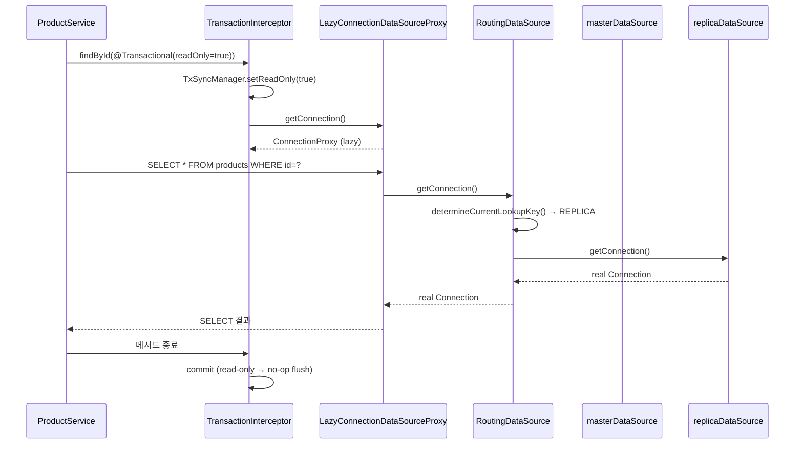

# 07. Replica Routing 패턴

> **이 파일의 한 줄 요약** — `@Transactional(readOnly = true)` 의 메타 정보를 `AbstractRoutingDataSource` 가 읽어 **read replica 로 자동 분기**한다. `LazyConnectionDataSourceProxy` 와 결합하면 **트랜잭션 메타가 확정된 뒤** 첫 SQL 시점에 커넥션을 획득해서 결정이 정확해진다. msa 11개 JVM 서비스가 모두 이 패턴.

---

## 1. 패턴의 개요

```
@Transactional(readOnly=true)
   │
   │ 트랜잭션 시작 시점
   ▼
TransactionSynchronizationManager.setCurrentTransactionReadOnly(true)   ← Spring 자동 설정
   │
   │ 첫 SQL 실행 시점
   ▼
LazyConnectionDataSourceProxy.getConnection()
   │
   ├─ AbstractRoutingDataSource.getConnection()
   │     │
   │     │ determineCurrentLookupKey() 호출
   │     ▼
   │   if (TxSyncManager.isCurrentTransactionReadOnly()) → REPLICA
   │   else                                              → MASTER
   │
   └─ 반환된 DataSource (master 또는 replica) 의 Connection 획득
```

**3개 컴포넌트의 협업**:
1. `@Transactional(readOnly = ...)` — 메타를 ThreadLocal 에 노출
2. `AbstractRoutingDataSource` — 메타를 읽어 라우팅 결정
3. `LazyConnectionDataSourceProxy` — 라우팅이 결정된 시점에 커넥션 획득

---

## 2. AbstractRoutingDataSource

Spring 이 제공하는 추상 클래스. `determineCurrentLookupKey()` 만 오버라이드하면 됨.

```kotlin
abstract class AbstractRoutingDataSource : AbstractDataSource(), InitializingBean {
    abstract fun determineCurrentLookupKey(): Any?

    override fun getConnection(): Connection {
        val lookupKey = determineCurrentLookupKey()
        val ds = resolvedDataSources[lookupKey] ?: defaultTargetDataSource
        return ds.connection
    }
}
```

내부적으로 `Map<Any, DataSource>` 를 들고 있고, lookup key 로 분기.

### msa 의 구현 (11개 서비스 표준)

```kotlin
enum class DataSourceType { MASTER, REPLICA }

class RoutingDataSource : AbstractRoutingDataSource() {
    override fun determineCurrentLookupKey(): DataSourceType =
        if (TransactionSynchronizationManager.isCurrentTransactionReadOnly())
            DataSourceType.REPLICA
        else
            DataSourceType.MASTER
}
```

**핵심**: `TransactionSynchronizationManager.isCurrentTransactionReadOnly()` 만으로 결정. 다른 메타는 안 봄.

---

## 3. LazyConnectionDataSourceProxy 의 역할

### 문제: 트랜잭션 시작 시점의 커넥션 획득

`AbstractRoutingDataSource` 만 쓰면 다음 문제가 있다:

```
@Transactional(readOnly=true)
   │
   ▼
TransactionInterceptor.invoke()
   │
   │ 1. TransactionManager.begin()
   │    → DataSource.getConnection()        ← 이 시점에 커넥션 획득!
   │    → AbstractRoutingDataSource.determineCurrentLookupKey()
   │       → readOnly 메타가 아직 ThreadLocal 에 안 들어가 있을 수 있음
   │       → MASTER 로 잘못 라우팅 가능
   │
   │ 2. setCurrentTransactionReadOnly(true)  ← 너무 늦음
```

### 해결: Lazy 획득

`LazyConnectionDataSourceProxy` 는 `getConnection()` 호출 시 실제 커넥션을 즉시 획득하지 않고, **proxy Connection 을 반환** 한다. 실제 커넥션은 **첫 SQL 실행 시점** 에 획득.

```
TransactionManager.begin()
   │
   ▼
LazyConnectionDataSourceProxy.getConnection()
   → ConnectionProxy 반환 (실제 connection 은 안 잡음)
   │
TransactionSynchronizationManager.setCurrentTransactionReadOnly(true)   ← 메타 설정
   │
   │ 비즈니스 로직
   │
   ▼ 첫 SQL 실행 (e.g. SELECT)
ConnectionProxy.prepareStatement()
   → 이제야 실제 connection 필요 → AbstractRoutingDataSource.getConnection()
   → determineCurrentLookupKey() → readOnly 메타 확정 → REPLICA 라우팅
```

**효과**:
1. 라우팅 결정이 **트랜잭션 메타가 확정된 뒤** 일어나서 정확
2. 비즈니스 로직 중 SQL 을 한 번도 안 발행하면 **커넥션을 아예 안 잡음** → 풀 점유 회피
3. 트랜잭션은 시작됐지만 SQL 이 없는 짧은 메서드의 경우 비용 0

### 단점

- proxy Connection 을 통한 호출이 한 단계 더 거침 → 미미한 오버헤드
- 트랜잭션 안에서 일어나는 일을 디버깅할 때 stack trace 가 한 단계 깊어짐

실무에서 단점 무시 가능 — 라우팅 정확성과 풀 효율 이득이 압도적.

---

## 4. msa 의 전체 설정 코드

`product/app/src/main/kotlin/com/kgd/product/infrastructure/config/DataSourceConfig.kt`:

```kotlin
@Configuration
class DataSourceConfig {

    @Bean
    @ConfigurationProperties(prefix = "spring.datasource.master")
    fun masterDataSource(): DataSource = DataSourceBuilder.create().build()

    @Bean
    @ConfigurationProperties(prefix = "spring.datasource.replica")
    fun replicaDataSource(): DataSource = DataSourceBuilder.create().build()

    @Bean
    fun routingDataSource(
        @Qualifier("masterDataSource") master: DataSource,
        @Qualifier("replicaDataSource") replica: DataSource
    ): DataSource = RoutingDataSource().apply {
        setTargetDataSources(mapOf(
            DataSourceType.MASTER to master,
            DataSourceType.REPLICA to replica
        ))
        setDefaultTargetDataSource(master)
        afterPropertiesSet()  // 필수 — Spring 이 @Bean 메서드에서 자동 호출 안 함
    }

    @Bean
    @Primary
    fun dataSource(@Qualifier("routingDataSource") routingDataSource: DataSource): DataSource =
        LazyConnectionDataSourceProxy(routingDataSource)
}
```

`application.yml`:

```yaml
spring:
  datasource:
    master:
      jdbc-url: jdbc:mysql://localhost:3316/product_db?...
      username: ${MYSQL_USER:product_user}
      password: ${MYSQL_PASSWORD:product_password}
      driver-class-name: com.mysql.cj.jdbc.Driver
      hikari:
        maximum-pool-size: 10
        minimum-idle: 2
    replica:
      jdbc-url: jdbc:mysql://localhost:3317/product_db?...
      username: ${MYSQL_USER:product_user}
      password: ${MYSQL_PASSWORD:product_password}
      driver-class-name: com.mysql.cj.jdbc.Driver
      hikari:
        maximum-pool-size: 10
        minimum-idle: 2
```

### 빈 구조 시퀀스



---

## 5. 11개 JVM 서비스에 동일 패턴 적용

`find ... -name "DataSourceConfig.kt"` 결과:
- `product/app/.../config/DataSourceConfig.kt`
- `order/app/.../config/DataSourceConfig.kt`
- `wishlist/app/.../config/DataSourceConfig.kt`
- `warehouse/app/.../config/DataSourceConfig.kt`
- `inventory/app/.../config/DataSourceConfig.kt`
- `fulfillment/app/.../config/DataSourceConfig.kt`
- `gifticon/app/.../config/DataSourceConfig.kt`
- `member/app/.../config/DataSourceConfig.kt`
- `code-dictionary/app/.../config/DataSourceConfig.kt`
- `auth/app/.../config/DataSourceConfig.kt`
- (그 외 한 개 더 동일 패턴)

→ **11개 JVM 서비스 모두 동일한 RoutingDataSource + LazyConnectionDataSourceProxy 패턴**.

---

## 6. 함정 1: 트랜잭션 없이 호출 → MASTER 로 가버림

```kotlin
@Service
class ProductService(...) {
    fun findById(id: Long): Product? = repository.findById(id)
    // ⚠ @Transactional 없음
}
```

이 메서드는:
- Spring Data JPA 가 내부적으로 자체 트랜잭션을 만듦 (개별 쿼리)
- 그 트랜잭션은 readOnly=false (default)
- → **MASTER 로 라우팅됨**

`@Transactional(readOnly = true)` 를 명시해야 replica 로 간다. 단, msa convention 은 단순 조회에 트랜잭션 자체를 빼라고 권장하므로 이 패턴은 의도적으로 master 로 가는 게 맞을 수도 있다 (read-after-write consistency 측면).

→ 다만 이 정책이 모든 서비스에 일관적이지 않다. [13-improvements.md](13-improvements.md) 의 stickiness ADR 후보 참고.

---

## 7. 함정 2: 같은 트랜잭션 안에서 master/replica 혼용 불가

```kotlin
@Transactional(readOnly = true)
fun findThenWrite(id: Long) {
    val product = repository.findById(id)  // REPLICA 결정 → 커넥션 획득
    product.changeName("new")              // ⚠ readOnly silent failure (06 파일)
    // 같은 TX 안에서 다른 DataSource 로 못 감
}
```

`AbstractRoutingDataSource` 의 lookup key 는 트랜잭션 시작 시 결정되며, 같은 트랜잭션 내에서는 같은 DataSource 를 계속 사용. master/replica 를 동적으로 바꿀 수 없다.

명시적 분리 필요:

```kotlin
fun process(id: Long) {
    val product = readService.findById(id)   // TX1 readOnly → REPLICA
    writeService.update(product)              // TX2 writable → MASTER
}
```

---

## 8. 함정 3: Replica Lag 으로 인한 read-after-write 비일관성

### 시나리오

```
T1: client → POST /products  (writable TX, MASTER)
    → INSERT 실행
    → MASTER commit
T2: replica 가 binlog 받기 전
T3: client → GET /products/{id}  (readOnly TX, REPLICA)
    → 방금 만든 row 가 아직 replica 에 없음 → 404
```

이건 모든 read-replica 시스템의 본질적 문제. 해결 옵션:

| 전략 | 방법 |
|---|---|
| **Stickiness (request-level)** | "쓰기 직후 N 초 동안 같은 사용자/세션은 master 로" — Redis 에 마커 저장, 그동안 모든 readOnly 도 master 라우팅 |
| **Hint annotation** | `@WithMaster` 같은 커스텀 annotation 으로 강제 master 라우팅 |
| **Synchronous replication (Galera, semi-sync)** | replica lag 0 보장 — 비용 큼 |
| **Read your own write** | 클라이언트 측에서 writeable TX 의 결과를 cache 에 저장하고 우선 사용 |

msa 는 현재 1번 (stickiness) 도 2번 (hint) 도 없음. 단순 fast-path 인 cachePort 로 일부 흡수. **개선 후보** ([13-improvements.md](13-improvements.md) 의 stickiness ADR 참고).

---

## 9. 함정 4: Hibernate session 캐시와 라우팅 결정의 시점

### 시나리오

```kotlin
@Transactional(readOnly = true)
fun findThenFindAgain(id: Long): Pair<Product, Product> {
    val first = repository.findById(id)      // REPLICA 결정
    Thread.sleep(100)                         // ...
    val second = repository.findById(id)     // 같은 REPLICA, 같은 캐시 → 같은 instance
    return first to second  // first === second
}
```

JPA persistence context (1차 캐시) 가 트랜잭션 단위로 유지되므로 두 번째 조회는 SQL 발행 없이 캐시에서 반환. 라우팅 결정은 한 번만 일어남.

---

## 10. 함정 5: 트랜잭션 동기화 없이 재진입 → MASTER fallback

```kotlin
@Service
class StatService(...) {
    fun count(): Long = repository.count()  // @Transactional 없음
}

// 호출처: 외부 컨트롤러
controller.action()
   ↓
statService.count()
```

`@Transactional` 이 어디에도 없음 → `TransactionSynchronizationManager.isCurrentTransactionReadOnly()` 가 false → MASTER 로 라우팅. msa 에서 **단순 조회에 `@Transactional` 을 안 붙이면 MASTER 로 간다는 점은 의도적/비의도적 둘 다 가능** — 정책으로 통일 필요.

---

## 11. 디버깅: 라우팅이 실제로 일어나는지 확인

### 로그 추가

```kotlin
class RoutingDataSource : AbstractRoutingDataSource() {
    private val log = KotlinLogging.logger {}

    override fun determineCurrentLookupKey(): DataSourceType {
        val readOnly = TransactionSynchronizationManager.isCurrentTransactionReadOnly()
        val txName = TransactionSynchronizationManager.getCurrentTransactionName()
        log.debug { "Routing: readOnly=$readOnly, tx=$txName" }
        return if (readOnly) DataSourceType.REPLICA else DataSourceType.MASTER
    }
}
```

### Hikari 풀 메트릭

```
hikaricp.connections.active{pool="masterDataSource"}
hikaricp.connections.active{pool="replicaDataSource"}
```

readOnly 트랜잭션 비율이 높은 시간대에 replica 풀이 더 많이 쓰이는지 확인.

---

## 12. 패턴의 한계와 대안

### 한계

1. **Application 레벨 라우팅** — 인프라가 이걸 모름. ProxySQL/RDS Proxy 같은 외부 라우터를 쓸 거면 이 패턴 자체가 불필요.
2. **MasterMaster 환경 미지원** — 단일 master + N replica 가정.
3. **트랜잭션 중간 라우팅 변경 불가** — 트랜잭션 분리로 해결.
4. **Replica lag 대응 부재** — stickiness 미구현.

### 대안

- **MySQL 8.x + RDS Proxy / Aurora**: Connection.setReadOnly 기반 자동 라우팅 → application 코드는 라우팅 모름
- **ShardingSphere / Vitess**: SQL 레이어에서 라우팅 — 더 정교
- **GraphQL 게이트웨이**: read query 를 명시적으로 replica 풀로 보냄

---

## 13. 면접 답변 패턴

### Q. Master/Replica 라우팅을 어떻게 구현했나요?

> Spring 의 AbstractRoutingDataSource 를 상속해서 RoutingDataSource 를 만들고, determineCurrentLookupKey 안에서 TransactionSynchronizationManager.isCurrentTransactionReadOnly() 를 봐서 readOnly 면 REPLICA, 아니면 MASTER 를 반환합니다. 그 위에 LazyConnectionDataSourceProxy 를 한 번 더 감싸는데, 이게 핵심입니다. AbstractRoutingDataSource 만 쓰면 트랜잭션 시작 시점에 커넥션을 잡아버려서 readOnly 메타가 ThreadLocal 에 들어가기 전에 라우팅 결정이 잘못 일어날 수 있습니다. LazyConnectionDataSourceProxy 는 첫 SQL 실행 시점까지 커넥션 획득을 미루기 때문에, 트랜잭션 메타가 확정된 후에 라우팅이 결정돼서 정확합니다. msa 11개 JVM 서비스 모두 이 패턴을 표준으로 적용하고 있습니다.

### Q. 이 패턴의 한계는?

> Replica lag 로 인한 read-after-write 비일관성이 가장 큰 약점입니다. 사용자가 글을 쓰자마자 새로고침하면 replica 에 아직 안 와서 안 보일 수 있습니다. 우리 msa 는 현재 stickiness 정책이 없어서 향후 ADR 로 정리할 후보입니다. 옵션은 Redis 에 "최근 N 초 동안 이 사용자는 master 로" 같은 마커를 두는 방식, 또는 read-after-write 가 중요한 endpoint 에 @WithMaster 같은 hint 를 다는 방식입니다.

---

## 14. 요약 카드

- 3개 컴포넌트: `@Transactional(readOnly=)`, `AbstractRoutingDataSource`, `LazyConnectionDataSourceProxy`
- `LazyConnectionDataSourceProxy` 가 필수인 이유: **트랜잭션 메타 확정 후** 첫 SQL 시점에 라우팅 결정
- msa 11 서비스 모두 동일 패턴
- 같은 트랜잭션 안에서 master/replica 동적 변경 불가
- Replica lag 로 인한 read-after-write 비일관성은 별도 stickiness 정책 필요
- application 레벨 라우팅의 대안: ProxySQL, RDS Proxy, Aurora 자동 라우팅

---

## 다음 학습

- [08-class-level-pitfalls.md](08-class-level-pitfalls.md) — 클래스 레벨 + AOP catch 함정
- [13-improvements.md](13-improvements.md) — stickiness ADR 후보
