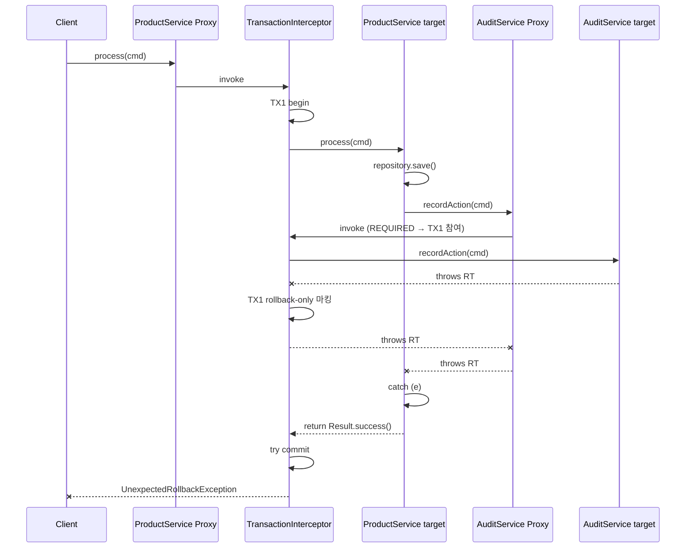

# 08. 클래스 레벨 @Transactional + AOP catch 함정

> **이 파일의 한 줄 요약** — 클래스 레벨 `@Transactional` 은 **모든 public 메서드를 같은 정책으로 묶어버려** 조회 메서드의 readOnly 최적화를 잃고, 중첩 호출에서 catch 시 **`UnexpectedRollbackException`** 함정에 빠진다.

---

## 1. 클래스 레벨 @Transactional 의 효과

```kotlin
@Service
@Transactional  // 클래스 레벨
class ProductService(...) {
    fun create(cmd: Command) { ... }
    fun update(cmd: Command) { ... }
    fun findById(id: Long) = ...     // ⚠ 쓰기 트랜잭션에 참여
    fun findAll(pageable: Pageable) = ... // ⚠ 동일
}
```

- 모든 public 메서드가 default `@Transactional(readOnly = false)` 적용
- 조회 메서드가 쓰기 트랜잭션으로 동작 → readOnly 최적화 못 받음 → replica 라우팅도 못 받음
- 변경 의도가 없는 메서드도 dirty check 비용

### msa convention 의 권고

`docs/conventions/transactional-usage.md` §4:

> 가능하면 메서드 레벨에서 필요한 곳에만 `@Transactional` 을 선언한다. 클래스 레벨 선언이 필요한 경우, 조회 메서드에는 `@Transactional(readOnly = true)` 를 명시한다.

### 클래스 레벨이 정당화되는 케이스

- **Transactional Service 분리 패턴**의 `{Entity}TransactionalService` — 클래스 자체가 "DB 트랜잭션 담당" 의 역할을 가지고, 모든 public 메서드가 짧은 단위 트랜잭션. msa 의 `ProductTransactionalService`, `OrderTransactionalService` 가 이 케이스.

```kotlin
@Service
@Transactional  // 클래스 레벨이 의미를 가짐
class ProductTransactionalService(
    private val repository: ProductRepositoryPort,
) {
    fun save(product: Product): Product = repository.save(product)

    @Transactional(readOnly = true)  // ✅ 조회는 명시적 readOnly
    fun findById(id: Long): Product = repository.findById(id) ?: throw NotFound()

    @Transactional(readOnly = true)
    fun findAll(pageable: Pageable): Page<Product> = repository.findAll(pageable)
}
```

이게 msa 의 표준 — 클래스 레벨 사용 시 **조회 메서드는 readOnly 명시** 가 강제 규칙.

---

## 2. AOP 내부 catch 시 롤백 미동작 / UnexpectedRollbackException

### 가장 흔한 함정 코드

```kotlin
@Service
@Transactional
class ProductService(
    private val auditService: AuditService,
) {
    fun process(cmd: Command): Result {
        repository.save(cmd.toEntity())

        try {
            auditService.recordAction(cmd)  // @Transactional, throws RT
        } catch (e: Exception) {
            log.warn("audit failed", e)
            // 무시하고 계속 진행하려는 의도
        }

        return Result.success()
    }
}
```

**기대**: audit 실패해도 process 는 정상 commit.
**실제**: process 가 정상 리턴 시점에 Spring 이 commit 시도 → `UnexpectedRollbackException` 발생 → 모든 변경 롤백 + 호출자에게 예외 전파.

### 왜 이런가

1. `auditService.recordAction()` 이 `@Transactional` (default REQUIRED) → process 의 같은 트랜잭션에 참여
2. recordAction 안에서 RT 발생 → Spring 이 트랜잭션을 **rollback-only 로 마킹** (`TransactionStatus.setRollbackOnly()`)
3. process 의 catch 가 예외를 삼킴 → process 는 정상 리턴
4. Spring 이 process 종료 시점에 commit 시도
5. rollback-only 마킹 발견 → `UnexpectedRollbackException` throw

핵심 인사이트: **rollback-only 마킹은 catch 로 되돌릴 수 없다.** Spring 입장에서 한번 마킹된 트랜잭션은 commit 절대 불가.

### 프록시 동작 시퀀스



---

## 3. 회피 방법 4가지

### 방법 1: catch 자체 안 하기 (실패 전파)

```kotlin
@Transactional
fun process(cmd: Command): Result {
    repository.save(cmd.toEntity())
    auditService.recordAction(cmd)  // 실패 시 자연스럽게 롤백
    return Result.success()
}
```

가장 단순. audit 이 비즈니스 흐름의 일부라면 이게 정답.

### 방법 2: 예외 대신 nullable 리턴

```kotlin
// 별도 메서드를 제공
@Service
class AuditService(...) {
    @Transactional(readOnly = true)
    fun findById(id: Long): Audit = repository.findById(id) ?: throw NotFound()

    @Transactional(readOnly = true)
    fun findByIdOrNull(id: Long): Audit? = repository.findById(id)  // ✅ 예외 없음
}
```

호출처:
```kotlin
@Transactional
fun process(cmd: Command): Result {
    val existing = auditService.findByIdOrNull(cmd.id)  // RT 안 발생
    if (existing == null) { ... }
}
```

msa convention 에 명시된 패턴. `findByProvider()` → `findByProviderOrNull()` 이라는 예시가 있다.

### 방법 3: REQUIRES_NEW 로 트랜잭션 분리

```kotlin
@Service
class AuditService(...) {
    @Transactional(propagation = Propagation.REQUIRES_NEW)  // 새 TX
    fun recordAction(cmd: Command) { ... }
}
```

```kotlin
@Transactional
fun process(cmd: Command): Result {
    repository.save(cmd.toEntity())
    try {
        auditService.recordAction(cmd)  // TX2 (REQUIRES_NEW) — 독립 commit/rollback
    } catch (e: Exception) {
        log.warn("audit failed", e)  // ✅ TX1 에 영향 없음
    }
    return Result.success()
}
```

**REQUIRES_NEW 는 별도 트랜잭션이라 rollback-only 마킹이 안 옮겨짐**. 다만 별 커넥션이 필요해서 풀 사이즈 압박.

### 방법 4: 외부에서 트랜잭션 제거 (msa 표준)

```kotlin
@Service
class ProductService(
    private val productTxService: ProductTransactionalService,
    private val auditService: AuditService,
) {
    // @Transactional 없음 — 오케스트레이션만
    fun process(cmd: Command): Result {
        productTxService.save(cmd.toEntity())  // TX1
        try {
            auditService.recordAction(cmd)     // TX2
        } catch (e: Exception) {
            log.warn("audit failed", e)
        }
        return Result.success()
    }
}
```

오케스트레이션 메서드 자체에 트랜잭션이 없으므로 rollback-only 마킹 우려 자체가 없다. 각 호출이 자기 트랜잭션을 가짐.

---

## 4. AOP 함정의 다른 변형들

### 변형 1: throw 다시 (re-throw)

```kotlin
@Transactional
fun process(cmd: Command): Result {
    try {
        innerService.inner()
    } catch (e: SpecificException) {
        throw BusinessException(...)  // ✅ 다시 throw → 트랜잭션 롤백
    }
    return ...
}
```

re-throw 하면 정상 롤백. `UnexpectedRollbackException` 안 남.

### 변형 2: setRollbackOnly() 명시

```kotlin
@Transactional
fun process(cmd: Command): Result {
    try {
        innerService.inner()
    } catch (e: Exception) {
        TransactionAspectSupport.currentTransactionStatus().setRollbackOnly()
        return Result.partial()  // 정상 리턴이지만 롤백 마킹
    }
    return Result.success()
}
```

명시적으로 rollback-only 마킹 → Spring 이 commit 시도 시 자연스럽게 롤백. `UnexpectedRollbackException` 안 남 (이미 마킹됐다고 인지).

### 변형 3: REQUIRES_NEW + 외부 trycatch (정답에 가까운 패턴)

방법 3 의 변형. 가장 견고.

---

## 5. 함정의 진짜 원인: catch 이중 의미

이 함정의 본질은 **"catch 의 의미가 두 개" 라는 데 있다**:

| 의미 | 코드 |
|---|---|
| (A) 비즈니스적으로 실패를 인지하고 다른 흐름으로 갈 것 | `try { x() } catch (e) { return fallback() }` |
| (B) 트랜잭션을 살릴 것 | (위와 같지만 트랜잭션 컨텍스트에서) |

(A) 가 의도라도 (B) 는 자동으로 따라오지 않는다. 트랜잭션은 catch 와 무관하게 이미 마킹됐기 때문.

**해결의 핵심은 catch 와 트랜잭션 경계를 분리하는 것** — 다른 트랜잭션(REQUIRES_NEW)이거나, 아예 트랜잭션 밖이거나.

---

## 6. 예외 패턴 매트릭스

| 호출 구조 | catch 위치 | 결과 |
|---|---|---|
| `@Transactional outer` → `@Transactional(REQUIRED) inner` throws | outer 에서 catch | ❌ UnexpectedRollbackException |
| `@Transactional outer` → `@Transactional(REQUIRES_NEW) inner` throws | outer 에서 catch | ✅ outer commit 가능 |
| `@Transactional outer` → 비TX inner throws | outer 에서 catch | ✅ outer commit 가능 (re-throw 안 하면) |
| 비TX outer → `@Transactional inner` throws | outer 에서 catch | ✅ inner 트랜잭션은 롤백, outer 영향 없음 |
| `@Transactional outer` → `@Transactional inner` throws | inner 에서 catch | ✅ inner 가 catch 하고 정상 리턴 → outer 도 정상 |

---

## 7. 클래스 레벨 + 함정의 결합

```kotlin
@Service
@Transactional  // 클래스 레벨
class OrderService(
    private val auditService: AuditService,
) {
    // 모든 public 메서드가 @Transactional → catch 함정에 노출됨

    fun complete(orderId: Long) {
        ...
        try {
            auditService.record(...)
        } catch (e: Exception) {
            // ⚠ 클래스 레벨 @Transactional 때문에 이 catch 가 함정
        }
    }

    fun findById(id: Long) = ...  // 쓰기 트랜잭션 (readOnly 최적화 손실)
}
```

클래스 레벨은 위험을 보이지 않게 만든다. 메서드별로 명시하면 함정의 존재가 코드에 보인다.

---

## 8. msa 코드에서의 처리

msa 의 `OrderService.execute(suspend)`:

```kotlin
override suspend fun execute(command: PlaceOrderUseCase.Command): PlaceOrderUseCase.Result {
    val pendingOrder = orderTransactionalService.savePendingOrder(command)  // TX1

    val paymentResult = try {
        paymentPort.requestPayment(orderId, ...)  // 외부 HTTP — 트랜잭션 밖
    } catch (e: Exception) {
        log.error("Payment failed for orderId={}", orderId, e)
        val cancelled = orderTransactionalService.cancelOrder(orderId)  // TX2'
        eventPort.publishOrderCancelled(cancelled)
        throw BusinessException(ErrorCode.EXTERNAL_API_ERROR, ...)
    }

    return if (paymentResult.status == "SUCCESS") {
        val completed = orderTransactionalService.completeOrder(orderId)  // TX2
        ...
    } else { ... }
}
```

핵심:
1. `OrderService.execute()` 자체에 `@Transactional` **없음** — catch 함정 회피
2. catch 안의 `orderTransactionalService.cancelOrder()` 는 새 트랜잭션 (TX2')
3. 외부 HTTP (paymentPort) 는 어떤 트랜잭션에도 포함 안 됨 — 커넥션 점유 없음
4. catch 마지막에 `throw BusinessException(...)` 으로 호출자에게 명시적 전파

**이 코드는 catch 함정의 모든 위험을 정확히 회피한 모범 사례**. 면접에서 코드 리뷰 사례로 활용 가능.

---

## 9. 면접 답변 패턴

### Q. UnexpectedRollbackException 이 왜 발생하나요?

> 중첩된 `@Transactional` 호출에서 안쪽 메서드가 RuntimeException 을 던지면 Spring 이 그 트랜잭션을 rollback-only 로 마킹합니다. 바깥 메서드가 그 예외를 catch 해서 정상 리턴하려고 하면, Spring 이 commit 을 시도하면서 마킹을 발견하고 UnexpectedRollbackException 을 던집니다. catch 한다고 마킹이 풀리는 게 아니거든요. 회피하려면 안쪽 메서드를 REQUIRES_NEW 로 분리해서 별 트랜잭션으로 만들거나, 예외를 던지지 않는 *OrNull 메서드를 따로 두거나, 가장 안전하게는 외부 메서드의 `@Transactional` 자체를 제거하고 오케스트레이션만 하게 만듭니다. msa 가 OrderService 를 그렇게 설계했습니다 — `@Transactional` 없는 service 가 `OrderTransactionalService` 의 짧은 트랜잭션을 단계별로 호출하는 패턴.

### Q. 클래스 레벨 @Transactional 을 권장하지 않는 이유는?

> 모든 public 메서드가 같은 정책으로 묶이는 게 가장 큽니다. 조회 메서드도 쓰기 트랜잭션으로 동작해서 readOnly 최적화를 잃고, replica 라우팅도 못 받습니다. 또 클래스 레벨이라 해당 클래스 안의 모든 catch 패턴이 잠재적 함정이 됩니다 — 메서드별로 명시하면 위험이 코드에 드러나는데 클래스 레벨이면 가려집니다. 다만 TransactionalService 분리 패턴처럼 "이 클래스는 DB 트랜잭션만 담당한다" 는 의도가 명확한 경우엔 클래스 레벨이 적절하고, 그땐 조회 메서드에 readOnly = true 를 명시하는 게 msa 의 컨벤션입니다.

---

## 10. 요약 카드

- 클래스 레벨 `@Transactional` = 모든 public 메서드 일괄 적용 → readOnly 최적화 손실 + 함정 노출
- 메서드 레벨이 기본 권장. 클래스 레벨 시 조회 메서드는 `readOnly = true` 명시
- 중첩 호출에서 catch + 정상 리턴 → **`UnexpectedRollbackException`**
- 4가지 회피: catch 안 하기 / nullable 리턴 / REQUIRES_NEW 분리 / 외부 트랜잭션 제거
- msa 의 `OrderService.execute()` 가 함정 회피 모범 사례 — 외부 트랜잭션 없는 오케스트레이션 + TransactionalService 호출

---

## 다음 학습

- [09-external-io-separation.md](09-external-io-separation.md) — 외부 IO (Input/Output, 입출력) 분리 패턴 종합
- [10-transaction-template.md](10-transaction-template.md) — 프로그래밍 방식 트랜잭션
