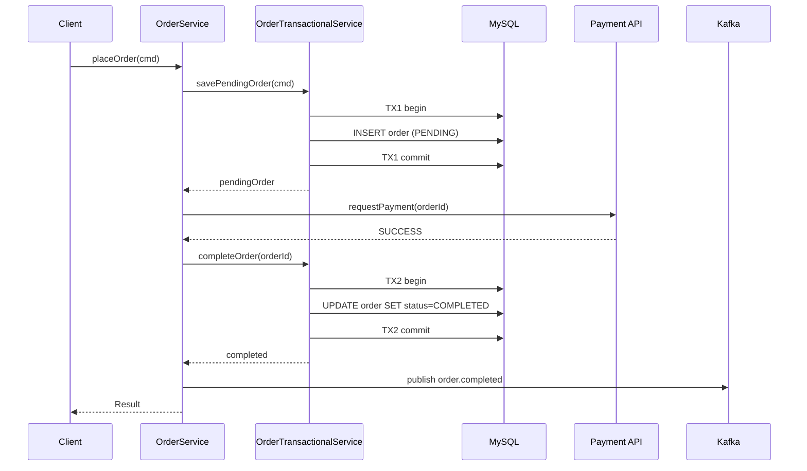
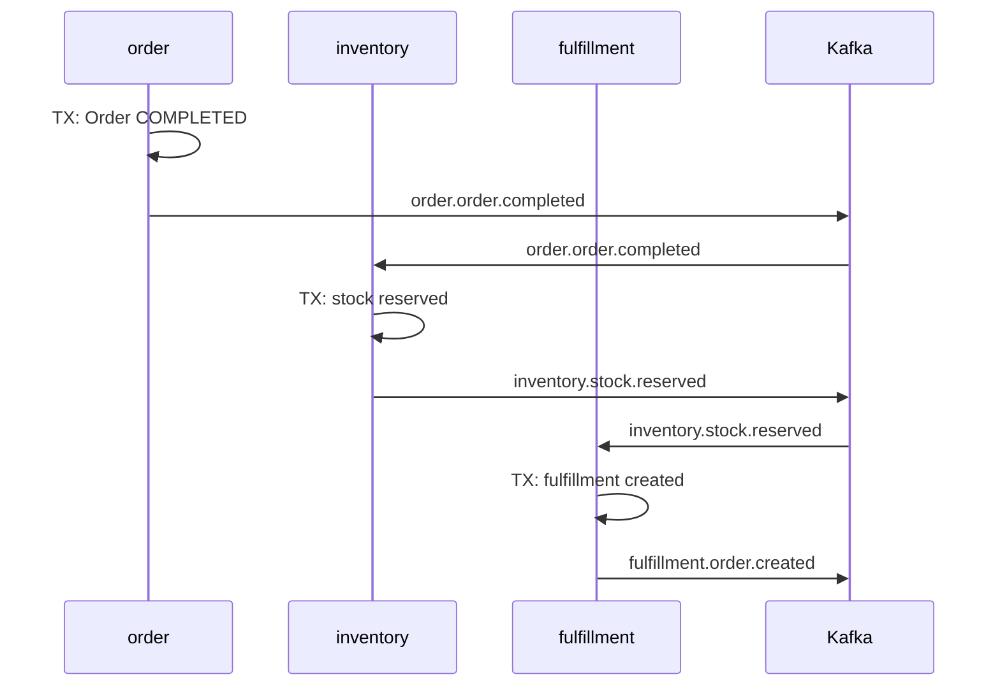
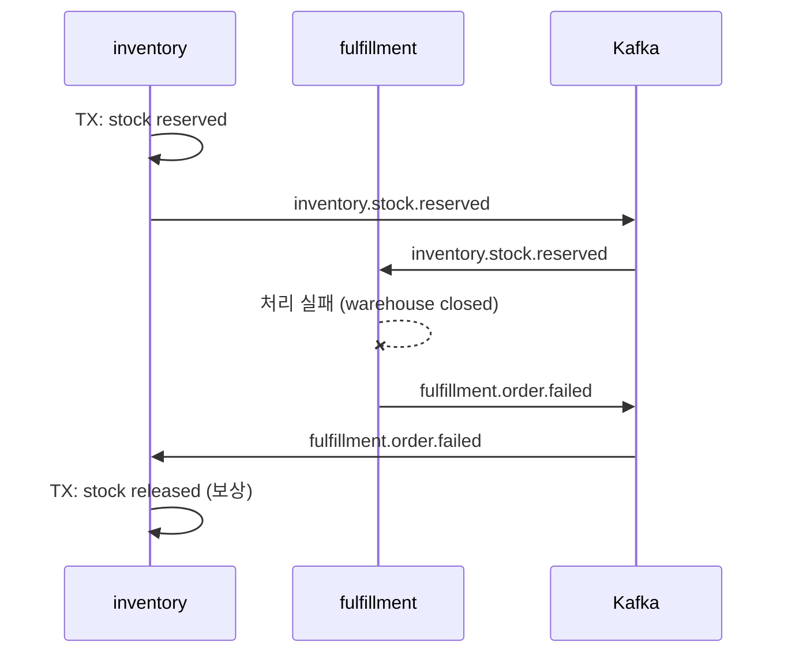

# 09. 외부 IO 분리 패턴

> **이 파일의 한 줄 요약** — 외부 IO (Input/Output, 입출력) (HTTP, Kafka 발행) 를 DB 트랜잭션 안에서 하면 **커넥션 점유 + 부분 실패 + 이중 발행** 의 3중 문제. 해결책 4가지: TransactionalService 분리 / Outbox / @TransactionalEventListener / Saga.

---

## 1. 왜 분리해야 하는가

### 안티패턴: 트랜잭션 안의 외부 호출

```kotlin
@Transactional
fun placeOrder(cmd: Command): Order {
    val order = orderRepository.save(Order.create(cmd))           // SQL 1
    val payment = paymentClient.charge(order)                      // 외부 HTTP (수 초)
    order.complete(payment)
    val saved = orderRepository.save(order)                        // SQL 2
    kafkaTemplate.send("order.completed", saved)                   // Kafka 발행
    return saved
}
```

문제 3가지:

1. **커넥션 점유**: HTTP 호출 (초 단위) 동안 DB 커넥션을 잡고 있음 → 풀 사이즈 압박, latency budget 초과 (#15 connection pool, ADR (Architecture Decision Record, 아키텍처 결정 기록)-0025 latency budget).
2. **이중 발행 / phantom 이벤트**: kafkaTemplate.send 가 commit 전에 발행됨 → 트랜잭션 롤백되어도 이벤트가 broker 에 남음 → consumer 가 존재하지 않는 order 의 이벤트를 받음.
3. **부분 실패 회복 불가**: 외부 HTTP 가 timeout 됐는데 실제로 결제가 됐는지 안 됐는지 알 수 없음. 트랜잭션 롤백 시도 → 결제는 됐고 주문은 없음.

### 분리의 원칙

> **DB 트랜잭션은 짧게, 외부 IO 는 트랜잭션 밖으로**

msa 는 이를 4가지 패턴으로 풀어낸다.

---

## 2. 패턴 1: TransactionalService 분리 (msa 표준)

### 구조

```
{Entity}Service                          {Entity}TransactionalService
  - 오케스트레이션 (@Transactional 없음)    - DB 트랜잭션만 (@Transactional 명시)
  - 외부 HTTP / Kafka 호출                  - 짧은 단위 트랜잭션
       │                                        ↑
       └────── 호출 ──────────────────────────┘
```

### msa OrderService 실제 코드

```kotlin
@Service
class OrderService(
    private val orderTransactionalService: OrderTransactionalService,
    private val eventPort: OrderEventPort,
    private val paymentPort: PaymentPort,
    private val productPort: ProductPort,
) : PlaceOrderUseCase, GetOrderUseCase {

    override suspend fun execute(command: PlaceOrderUseCase.Command): PlaceOrderUseCase.Result {
        // Phase 0: Product 유효성 검증 (외부 HTTP — TX 밖)
        for (item in command.items) {
            val productInfo = productPort.validateProduct(item.productId)
            if (productInfo.status != "ACTIVE") throw BusinessException(...)
        }

        // Phase 1: Save PENDING (TX1, 짧음)
        val pendingOrder = orderTransactionalService.savePendingOrder(command)
        val orderId = requireNotNull(pendingOrder.id)

        // Phase 2: 외부 결제 (TX 밖, 수 초 가능)
        val paymentResult = try {
            paymentPort.requestPayment(orderId, pendingOrder.totalAmount.amount)
        } catch (e: Exception) {
            log.error("Payment failed for orderId={}, cancelling order", orderId, e)
            val cancelled = orderTransactionalService.cancelOrder(orderId)  // TX2'
            eventPort.publishOrderCancelled(cancelled)
            throw BusinessException(ErrorCode.EXTERNAL_API_ERROR, ...)
        }

        // Phase 3: 결제 결과 반영 (TX2)
        return if (paymentResult.status == "SUCCESS") {
            val completed = orderTransactionalService.completeOrder(orderId)
            eventPort.publishOrderCompleted(completed)
            PlaceOrderUseCase.Result(...)
        } else {
            val cancelled = orderTransactionalService.cancelOrder(orderId)
            eventPort.publishOrderCancelled(cancelled)
            throw BusinessException(...)
        }
    }
}
```

```kotlin
@Service
class OrderTransactionalService(
    private val repositoryPort: OrderRepositoryPort
) {
    @Transactional
    fun savePendingOrder(command: PlaceOrderUseCase.Command): Order { ... }

    @Transactional
    fun completeOrder(orderId: Long): Order { ... }

    @Transactional
    fun cancelOrder(orderId: Long): Order { ... }

    @Transactional(readOnly = true)
    fun findById(id: Long): Order? = ...
}
```

### 시퀀스



### 한계

- Kafka 발행 (`eventPort.publishOrderCompleted`) 이 **별도 트랜잭션 밖**에서 일어남 → DB commit 직후 Kafka 가 실패하면 **이벤트 누락** 가능
- 이를 보완하는 게 패턴 2 (Outbox)

---

## 3. 패턴 2: Outbox 패턴

### 동기

이벤트 발행을 **DB 트랜잭션과 같이 commit** 시키되, 실제 Kafka 발행은 **별도 폴링** 으로 비동기 처리. DB 와 Kafka 의 atomic 발행을 시뮬레이션.

### 구조

```
[Producer 측]
@Transactional
fun businessLogic() {
    repository.save(entity)
    outboxPort.save(eventType, payload)   // 같은 TX 안에서 outbox_event 테이블에 INSERT
    // commit → entity 변경 + outbox INSERT 가 atomic
}

[Background Polling Publisher]
@Scheduled(fixedDelay = 1s)
fun publishPending() {
    val events = outboxRepository.findAllByStatusOrderByCreatedAtAsc("PENDING")
    for (event in events) {
        kafkaTemplate.send(event.eventType, event.payload).whenComplete { _, ex ->
            if (ex == null) {
                event.status = "PUBLISHED"
                outboxRepository.save(event)
            }
        }
    }
}
```

### msa fulfillment 의 실제 코드

```kotlin
// outbox 엔티티
@Entity
@Table(name = "outbox_event")
class OutboxJpaEntity(
    @Id @GeneratedValue val id: Long? = null,
    val eventId: String = UUID.randomUUID().toString(),
    val aggregateType: String,
    val aggregateId: Long,
    val eventType: String,
    @Column(columnDefinition = "JSON") val payload: String,
    var status: String = "PENDING",
    val createdAt: LocalDateTime = LocalDateTime.now(),
    var publishedAt: LocalDateTime? = null,
)

// 비즈니스 로직 (트랜잭션 안)
@Service
@Transactional
class FulfillmentService(
    private val fulfillmentRepository: FulfillmentRepositoryPort,
    private val outboxPort: OutboxPort,
    private val objectMapper: ObjectMapper
) {
    override fun execute(command: CreateFulfillmentUseCase.Command): CreateFulfillmentUseCase.Result {
        ...
        val saved = fulfillmentRepository.save(fulfillmentOrder)
        val event = FulfillmentEvent.Created(...)
        outboxPort.save(
            aggregateType = "FulfillmentOrder",
            aggregateId = saved.id!!,
            eventType = "fulfillment.order.created",
            payload = objectMapper.writeValueAsString(event)
        )
        // commit 시점: fulfillment + outbox 가 atomic
    }
}

// 폴링 발행
@Component
class OutboxPollingPublisher(
    private val outboxRepository: OutboxJpaRepository,
    private val kafkaTemplate: KafkaTemplate<String, Any>,
    private val objectMapper: ObjectMapper,
) {
    @Scheduled(fixedDelayString = "\${fulfillment.outbox.polling-interval-ms:1000}")
    fun publishPendingEvents() {
        val events = outboxRepository.findAllByStatusOrderByCreatedAtAsc("PENDING")
        for (event in events) {
            try {
                val enrichedPayload = objectMapper.readTree(event.payload).let { node ->
                    (node as ObjectNode).put("eventId", event.eventId)
                    objectMapper.writeValueAsString(node)
                }
                kafkaTemplate.send(event.eventType, event.aggregateId.toString(), enrichedPayload)
                    .whenComplete { _, ex ->
                        if (ex != null) {
                            log.error("Failed to publish outbox event id={}", event.id, ex)
                        } else {
                            event.status = "PUBLISHED"
                            event.publishedAt = LocalDateTime.now()
                            outboxRepository.save(event)
                        }
                    }
            } catch (e: Exception) { ... }
        }
    }
}
```

### 보장 시맨틱

| 시나리오 | 결과 |
|---|---|
| DB commit 성공 + Kafka 발행 성공 | atomic |
| DB commit 성공 + Kafka 발행 실패 | outbox 에 PENDING 으로 남아 다음 폴링에서 재시도 → eventually published |
| DB commit 실패 | outbox 도 같이 롤백 → 이벤트 발행 안 됨 |

→ **at-least-once delivery**. Consumer 측에서 idempotency 가 필요. ADR-0012 가 그 멱등성 약속.

### Outbox 의 한계 / 단점

1. **publishedAt 만 표시 — outbox 테이블 무한 증가** → 별도 보관 정책 필요 (개선 후보).
2. **폴링 interval (1s) 만큼 latency 발생** — 즉시성이 중요하면 CDC (Debezium 등) 로 대체 고려.
3. **순서 보장 X** — `findAllByStatusOrderByCreatedAtAsc` 로 정렬해도 동시 폴링/실패-재시도에서 순서가 흔들림. 강한 순서 필요 시 partition key 설계로 보강.

---

## 4. 패턴 3: @TransactionalEventListener

### 동기

코드 가독성을 더 좋게 만드는 in-memory 이벤트 + 트랜잭션 단계별 hook. Outbox 까지는 무겁고, 단순 commit 후 후속 작업 트리거 정도면 이걸로 충분.

### 사용

```kotlin
@Service
@Transactional
class ProductService(
    private val repository: ProductRepository,
    private val eventPublisher: ApplicationEventPublisher,
) {
    fun create(cmd: Command): Product {
        val product = repository.save(Product.create(cmd))
        eventPublisher.publishEvent(ProductCreatedEvent(product.id))
        return product
    }
}

@Component
class ProductEventHandler(
    private val kafkaTemplate: KafkaTemplate<String, Any>,
) {
    @TransactionalEventListener(phase = TransactionPhase.AFTER_COMMIT)
    fun onProductCreated(event: ProductCreatedEvent) {
        kafkaTemplate.send("product.created", event)
    }
}
```

### TransactionPhase 4단계

| Phase | 시점 | 사용 |
|---|---|---|
| `BEFORE_COMMIT` | flush 직전 | 마지막 검증, 보강 INSERT |
| **`AFTER_COMMIT`** (default) | commit 직후 | **이벤트 발행 (Kafka, 외부 호출)** |
| `AFTER_ROLLBACK` | rollback 직후 | 실패 알림, 보상 |
| `AFTER_COMPLETION` | commit/rollback 모두 | 정리 작업 |

### Outbox vs @TransactionalEventListener

| 항목 | Outbox | @TransactionalEventListener |
|---|---|---|
| 견고성 | ✅ DB 가 SSOT, 발행 보장 | ❌ JVM crash 시 이벤트 손실 |
| 코드 복잡도 | 높음 (테이블 + 폴링) | 낮음 |
| Latency | ~ polling interval | 즉시 |
| 사용 시점 | **외부 시스템과의 데이터 동기화** | 내부 hook, 즉시성 중요한 발행 |

**msa 는 Outbox 를 쓴다** — 외부 consumer 가 명확한 도메인 이벤트를 받기 때문에 견고성 우선. `@TransactionalEventListener` 는 현재 msa 코드에서 사용처 없음 (`grep` 확인).

→ 향후 cross-cutting concern (e.g. 도메인 이벤트 → 캐시 무효화) 같은 곳에 도입 가능. [13-improvements.md](13-improvements.md) 의 개선 후보 참고.

---

## 5. 패턴 4: Saga

### 동기

여러 서비스에 걸친 비즈니스 트랜잭션을 **분산 트랜잭션 (XA / 2PC) 없이** 처리. 각 서비스가 로컬 트랜잭션을 commit 하고, 실패 시 **보상 트랜잭션** 으로 원복.

### Choreography vs Orchestration

| 종류 | 구성 | 장점 | 단점 |
|---|---|---|---|
| **Choreography** | 각 서비스가 이벤트를 듣고 다음 step 실행 | 결합도 낮음 | 흐름 파악 어려움, 디버깅 어려움 |
| **Orchestration** | Central orchestrator 가 step 호출 | 흐름 명확 | orchestrator 가 SPOF |

### 시나리오: 주문 생성 (msa 의 잠재 적용)

현재 msa 의 order/inventory/fulfillment 가 사실상 choreography Saga 구조:



각 단계가 자기 로컬 TX 로 commit, 다음 단계로 이벤트 전달. 실패 시 **보상 이벤트**:



### Saga 의 핵심 요구사항

1. **이벤트 멱등성** (ADR-0012) — consumer 가 같은 메시지를 두 번 받아도 같은 결과
2. **보상 트랜잭션의 가용성** — 보상이 실패하면 manual intervention 필요
3. **시간 일관성** — 단기적 비일관성 (eventual consistency) 수용

### Saga 의 한계

- 강한 isolation 부재 — Saga 진행 중에 다른 사용자에게 inconsistent 상태가 보일 수 있음 (e.g. 재고 reserved 됐지만 order 는 아직 PENDING)
- 보상 트랜잭션이 항상 가능한 게 아님 (e.g. 이메일 발송 보상 = 사과 메일?)

---

## 6. 4가지 패턴의 선택 기준

```
┌──────────────────────────────────────────────────────────┐
│ 외부 IO 종류                                              │
└──────────────┬─────────────────┬───────────────────────────┘
               │                 │
        외부 HTTP             메시징/이벤트
               │                 │
               ▼                 ▼
   TransactionalService     Outbox (견고)
   분리 (TX1 + TX2)          또는
   (msa OrderService)        @TransactionalEventListener
                             (가벼움)
                                 │
                                 ▼
                          여러 서비스 걸침?
                                 │
                                 ├─ Yes → Saga (choreography)
                                 │
                                 └─ No  → 단일 서비스 Outbox
```

| 패턴 | 사용 시점 | msa 적용 |
|---|---|---|
| TransactionalService 분리 | 외부 HTTP + DB 변경 | OrderService ↔ OrderTransactionalService |
| Outbox | DB + Kafka atomic 발행 | inventory/fulfillment/quant |
| @TransactionalEventListener | 가벼운 내부 hook | (현재 미사용) |
| Saga | 여러 서비스 분산 흐름 | order → inventory → fulfillment (choreography) |

---

## 7. 면접 답변 패턴

### Q. Kafka 발행과 DB 트랜잭션을 어떻게 결합하나요?

> 네 가지 옵션을 알고 있는데, msa 는 Outbox 패턴을 표준으로 씁니다. 비즈니스 트랜잭션 안에서 outbox_event 테이블에 이벤트 row 를 같이 INSERT 하면 DB commit 시 entity 변경 + 이벤트가 atomic 해집니다. 그 후 별도 OutboxPollingPublisher 가 1초 간격으로 PENDING 상태 row 를 Kafka 로 발행하고, 성공하면 PUBLISHED 로 마킹합니다. 이 패턴이 at-least-once 시맨틱을 보장하기 때문에 consumer 측에서는 ADR-0012 의 idempotent consumer 패턴 (eventId + processed_event 테이블) 으로 멱등성을 처리합니다. 외부 HTTP 같은 경우는 다른 패턴인 TransactionalService 분리 — OrderService 가 트랜잭션 없이 OrderTransactionalService 의 짧은 TX 를 단계별로 호출하고, 그 사이에 결제 API 를 트랜잭션 밖에서 호출합니다.

---

## 8. 요약 카드

- 외부 IO 를 트랜잭션 안에서 하면 3중 문제: 커넥션 점유 / phantom 이벤트 / 부분 실패
- 4가지 분리 패턴: TransactionalService 분리 / Outbox / @TransactionalEventListener / Saga
- msa 표준: **TransactionalService 분리 + Outbox** 조합. Saga 는 사실상 choreography 로 자연 형성
- Outbox = DB 가 SSOT, 견고함. polling latency 와 순서 약함이 단점
- @TransactionalEventListener AFTER_COMMIT = 가벼운 내부 hook. JVM crash 시 손실 가능
- 모든 분리 패턴은 **consumer 측 멱등성** (ADR-0012) 과 짝을 이룸

---

## 다음 학습

- [10-transaction-template.md](10-transaction-template.md) — 프로그래밍 방식 트랜잭션
- [12-msa-outbox-saga.md](12-msa-outbox-saga.md) — msa Outbox + Saga 분석 상세
