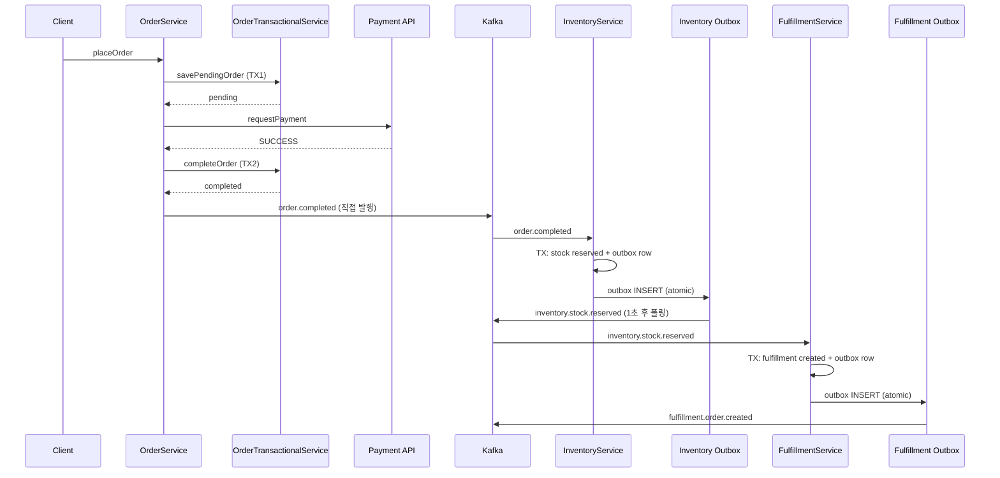

# 11. msa 코드베이스 매핑

> **이 파일의 한 줄 요약** — msa 의 트랜잭션 표준은 ADR-0020 (transactional usage) + ADR-0022 (entity mutation) + ADR-0012 (idempotent consumer) 의 3중 결합. 11개 JVM 서비스가 이 표준을 따른다.

---

## 1. 3개 ADR 의 관계

```
┌──────────────────────────────────────────────────────────┐
│ ADR-0020 (→ docs/conventions/transactional-usage.md)     │
│ "@Transactional 사용 규칙 — 외부 IO 분리, 클래스 레벨   │
│  주의, 중첩 catch 금지, readOnly 의 경계"                │
└────────────────────┬─────────────────────────────────────┘
                     │ 안에서 어떻게 entity 를 변경?
                     ▼
┌──────────────────────────────────────────────────────────┐
│ ADR-0022 (→ docs/conventions/entity-mutation.md)         │
│ "Entity 수정 규칙 — 서비스에서 직접 대입 금지,           │
│  changeXxx / update 분리, 캡슐화"                        │
└────────────────────┬─────────────────────────────────────┘
                     │ commit 후 외부 시스템 동기화
                     ▼
┌──────────────────────────────────────────────────────────┐
│ ADR-0012 (Outbox + Idempotent Consumer)                  │
│ "Producer = Outbox, Consumer = eventId + processed_event │
│  → at-least-once + effectively-once"                     │
└──────────────────────────────────────────────────────────┘
```

**세 ADR 의 통합 메시지**: 트랜잭션을 짧게 유지하고 (0020), entity 변경은 도메인 메서드로 안전하게 (0022), 외부 발행은 Outbox 로 atomic 보장 + consumer 멱등 (0012).

---

## 2. ADR-0020 의 4가지 규칙 (요약)

`docs/conventions/transactional-usage.md` 에서 이전됨.

### 규칙 1: 단순 조회에 `@Transactional(readOnly = true)` 안 붙임

> 여러 쿼리 간 스냅샷 일관성이 필요하지 않은 경우 서비스 메서드에 `@Transactional` 을 선언하지 않는다. 각 Repository 호출은 자체 트랜잭션으로 실행되므로 별도 선언이 불필요하다.

| 케이스 | 권장 |
|---|---|
| 단일 SELECT | `@Transactional` 없음 |
| 외부 API/캐시/Kafka 가 섞인 메서드 | `@Transactional` **금지** (커넥션 점유) |
| 여러 쿼리 + 스냅샷 일관성 | `@Transactional(readOnly = true)` |
| LazyLoading 사용 | `@Transactional(readOnly = true)` |

### 규칙 2: 외부 IO 가 포함된 메서드는 트랜잭션 분리

```
TX1: 엔티티 PENDING 저장
→ 외부 API/캐시/메시징 (트랜잭션 밖)
→ TX2: 결과 반영
```

`{Entity}TransactionalService` (DB 만) + `{Entity}Service` (오케스트레이션) 분리.

### 규칙 3: 중첩 `@Transactional` 에서 catch 금지

→ `UnexpectedRollbackException` 위험. 08 파일 상세.

### 규칙 4: 클래스 레벨 `@Transactional` 주의

- 가능하면 메서드 레벨
- 클래스 레벨 시 조회 메서드는 `readOnly = true` 명시

---

## 3. ADR-0022: Entity 수정 규칙

### 핵심

```kotlin
class Product private constructor(
    val id: Long?,
    name: String,
    price: BigDecimal,
    status: ProductStatus,
) {
    var name: String = name; private set
    var price: BigDecimal = price; private set
    var status: ProductStatus = status; private set

    fun update(command: ProductSyncCommand) { ... }   // 전체 동기화
    fun changeName(name: String) { ... }              // 부분 수정
    fun changePrice(price: BigDecimal) { ... }
    fun deactivate() { ... }                          // 비즈니스 행위
}
```

| 메서드 패턴 | 용도 |
|---|---|
| `update(Command)` | 전체 동기화 (배치/외부) |
| `changeXxx(value)` | 단일 필드 변경 |
| `applyXxx(Command)` | 복수 필드 (특정 시나리오) |
| `{동사}()` | 비즈니스 행위 (`deactivate`, `cancel`, `complete`) |

### 트랜잭션과의 상호작용

```kotlin
@Transactional
fun changeName(id: Long, newName: String) {
    val product = repository.findById(id)
    product.changeName(newName)        // ✅ 도메인 메서드 호출
    // commit 시 dirty check → UPDATE
    // repository.save() 안 부름 — JPA 가 자동 처리
}
```

만약 `readOnly = true` 였다면 06 파일의 silent failure 발생. 두 ADR 이 서로 보완.

---

## 4. ADR-0012: Idempotent Consumer

### Outbox 측 (Producer)

```kotlin
@Transactional
fun businessLogic() {
    repository.save(entity)
    outboxPort.save(eventType, payload)  // 같은 TX, eventId 자동 생성 (UUID)
}
```

→ DB commit 시 entity + outbox row atomic.

### Consumer 측

```kotlin
@KafkaListener(topics = ["inventory.stock.reserved"])
@Transactional
fun handleStockReserved(message: StockReservedEvent) {
    if (processedEventRepository.existsById(message.eventId)) {
        return  // 이미 처리됨, skip
    }
    processedEventRepository.save(ProcessedEvent(message.eventId, "inventory.stock.reserved"))

    // 비즈니스 로직 (멱등 보장)
    fulfillmentService.create(...)
}
```

`processed_event` 테이블 + eventId UUID 로 중복 처리 방지.

### 보관 정책

7일 후 삭제 (스케줄러). 7일은 Kafka retention + consumer lag 여유 기준.

---

## 5. 11개 JVM 서비스의 DataSourceConfig 표준

`find` 결과로 확인된 11개:

| 서비스 | DataSourceConfig 위치 |
|---|---|
| product | `product/app/.../config/DataSourceConfig.kt` |
| order | `order/app/.../config/DataSourceConfig.kt` |
| wishlist | `wishlist/app/.../infrastructure/config/DataSourceConfig.kt` |
| warehouse | `warehouse/app/.../infrastructure/config/DataSourceConfig.kt` |
| inventory | `inventory/app/.../infrastructure/config/DataSourceConfig.kt` |
| fulfillment | `fulfillment/app/.../infrastructure/config/DataSourceConfig.kt` |
| gifticon | `gifticon/app/.../infrastructure/config/DataSourceConfig.kt` |
| member | `member/app/.../infrastructure/config/DataSourceConfig.kt` |
| code-dictionary | `code-dictionary/app/.../infrastructure/config/DataSourceConfig.kt` |
| auth | `auth/app/.../config/DataSourceConfig.kt` |
| quant | (별도 검토) |

모든 파일이 동일 패턴:

```kotlin
enum class DataSourceType { MASTER, REPLICA }

class RoutingDataSource : AbstractRoutingDataSource() {
    override fun determineCurrentLookupKey(): DataSourceType =
        if (TransactionSynchronizationManager.isCurrentTransactionReadOnly())
            DataSourceType.REPLICA else DataSourceType.MASTER
}

@Configuration
class DataSourceConfig {
    @Bean @ConfigurationProperties("spring.datasource.master")
    fun masterDataSource(): DataSource = ...

    @Bean @ConfigurationProperties("spring.datasource.replica")
    fun replicaDataSource(): DataSource = ...

    @Bean
    fun routingDataSource(...): DataSource = RoutingDataSource().apply {
        setTargetDataSources(...)
        setDefaultTargetDataSource(master)
        afterPropertiesSet()
    }

    @Bean @Primary
    fun dataSource(routingDataSource: DataSource): DataSource =
        LazyConnectionDataSourceProxy(routingDataSource)
}
```

→ 07 파일에서 분석한 패턴 그대로. **#15 connection pool 학습** 에서도 발견된 표준.

### 한 발견사항

- `order/app/.../config/DataSourceConfig.kt` 에 명시적 주석:
  > `// AbstractRoutingDataSource requires explicit initialization to resolve target data sources. Spring does not call afterPropertiesSet() automatically in @Bean methods.`
  
  → `afterPropertiesSet()` 누락 함정을 알고 있다는 증거. 다른 서비스도 동일하게 `apply { ... afterPropertiesSet() }` 호출.

---

## 6. TransactionalService 적용 현황

`find -name "*Transactional*.kt"` 결과:

| 서비스 | 클래스 | 역할 |
|---|---|---|
| product | `ProductTransactionalService.kt` | DB 트랜잭션 분리 |
| product | `ProductStockSyncService.kt` | (별도) |
| order | `OrderTransactionalService.kt` | DB 트랜잭션 분리 |
| inventory | (없음) | `InventoryService` 가 직접 `@Transactional` |
| fulfillment | (없음) | `FulfillmentService` 클래스 레벨 `@Transactional` |
| 그 외 | (없음) | 서비스 직접 |

→ **product/order 만 분리 패턴 적용** — 둘 다 외부 HTTP 호출 (PaymentPort, 또는 Kafka 발행이 없음을 보장하는 분리) 이 비즈니스 흐름의 핵심이라 분리가 정당화됨.

inventory/fulfillment 는 **외부 HTTP 호출이 없고 Outbox 로만 발행**하기 때문에 `@Transactional` 클래스 레벨로 충분하고, 외부 IO 분리 필요성이 약함.

### Inventory 의 패턴

```kotlin
@Service
class InventoryService(
    private val inventoryRepository: InventoryRepositoryPort,
    private val reservationRepository: ReservationRepositoryPort,
    private val outboxPort: OutboxPort,
    private val objectMapper: ObjectMapper,
    @param:Autowired(required = false)
    private val cachePort: InventoryCachePort? = null,
) : ... {

    @Transactional
    override fun execute(command: ReserveStockUseCase.Command): ReserveStockUseCase.Result {
        // 1. Redis fast-path (트랜잭션 안이지만 read-only — 커넥션 영향 미미)
        cachePort?.let { cache -> cache.reserveStock(...) }

        // 2. DB 작업 (master)
        val inventory = inventoryRepository.findByProductIdAndWarehouseId(...)
        inventory.reserve(command.qty)
        val savedInventory = inventoryRepository.save(inventory)

        // 3. Redis 캐시 동기화 (트랜잭션 안)
        syncCache(...)

        // 4. Reservation 저장
        val reservation = Reservation.create(...)
        val savedReservation = reservationRepository.save(reservation)

        // 5. Outbox 저장 (같은 TX 로 atomic)
        outboxPort.save(AGGREGATE_TYPE, inventoryId, "inventory.stock.reserved", ...)

        return ReserveStockUseCase.Result(...)
    }
}
```

여기서 `cachePort` (Redis) 호출이 **트랜잭션 안에서 발생** — ADR-0020 규칙 1 의 "외부 IO 가 포함된 메서드에 `@Transactional` 금지" 와 약한 충돌. 하지만:
- Redis 호출이 sub-millisecond — 커넥션 점유 영향 미미
- Redis fast-path 가 실패해도 DB 가 SSOT → 무시하고 진행 (try-catch 로 흡수: `syncCache` 의 try)
- 비즈니스적으로 한 트랜잭션 안에서 일관성 보장 우선

**의도적 트레이드오프** — convention 의 절대 규칙이 아니라 case-by-case 판단.

### Fulfillment 의 패턴

```kotlin
@Service
@Transactional  // 클래스 레벨
class FulfillmentService(
    private val fulfillmentRepository: FulfillmentRepositoryPort,
    private val outboxPort: OutboxPort,
    private val objectMapper: ObjectMapper
) {
    override fun execute(command: CreateFulfillmentUseCase.Command): ... { ... }
    override fun execute(command: TransitionFulfillmentUseCase.Command): ... { ... }

    @Transactional(readOnly = true)
    override fun findById(id: Long): ... { ... }

    @Transactional(readOnly = true)
    override fun findByOrderId(orderId: Long): ... { ... }
}
```

ADR-0020 규칙 4 의 정확한 모범 사례:
- 클래스 레벨 `@Transactional` (모든 쓰기 메서드)
- 조회 메서드에 명시적 `@Transactional(readOnly = true)`
- 외부 HTTP 없음 → 클래스 레벨 정당함

---

## 7. Order 의 외부 IO 분리 (ADR-0020 모범)

`OrderService.execute(suspend)` 가 ADR-0020 의 모든 규칙을 한꺼번에 적용한 사례:

| 규칙 | 적용 |
|---|---|
| 규칙 1: 외부 API 메서드에 TX 없음 | `OrderService.execute()` 에 `@Transactional` 없음 |
| 규칙 2: 외부 IO 분리 | `OrderTransactionalService.savePending/complete/cancel` 로 TX 분리 |
| 규칙 3: 중첩 catch 회피 | catch 안에서 `cancelOrder()` 호출 후 명시적 `throw` — UnexpectedRollbackException 우려 없음 (외부 메서드에 TX 없으니) |
| 규칙 4: 클래스 레벨 회피 | 메서드 레벨 `@Transactional` |

```kotlin
override suspend fun execute(command: PlaceOrderUseCase.Command): PlaceOrderUseCase.Result {
    // Phase 0: Product 검증 (외부 HTTP)
    for (item in command.items) {
        val productInfo = productPort.validateProduct(item.productId)
        ...
    }

    // Phase 1: TX1 (PENDING)
    val pendingOrder = orderTransactionalService.savePendingOrder(command)

    // Phase 2: 외부 결제 (트랜잭션 밖)
    val paymentResult = try {
        paymentPort.requestPayment(orderId, ...)
    } catch (e: Exception) {
        val cancelled = orderTransactionalService.cancelOrder(orderId)  // TX2'
        eventPort.publishOrderCancelled(cancelled)
        throw BusinessException(...)
    }

    // Phase 3: TX2 (결과 반영)
    return if (paymentResult.status == "SUCCESS") {
        val completed = orderTransactionalService.completeOrder(orderId)
        eventPort.publishOrderCompleted(completed)
        ...
    } else { ... }
}
```

이 코드는 면접 코드 리뷰 자료로 그대로 사용 가능. 결제 API 가 5초씩 걸려도 DB 커넥션은 점유되지 않고, 결제 성공/실패에 따라 짧은 두 번째 트랜잭션으로 마무리.

---

## 8. Entity 변경 패턴 적용 사례

### Inventory (ADR-0022 모범)

```kotlin
class Inventory(...) {
    fun reserve(qty: Int) {
        require(qty > 0) { "예약 수량은 0보다 커야 합니다" }
        require(getAvailableQty() >= qty) { "가용 재고가 부족합니다" }
        this.reservedQty += qty
    }

    fun release(qty: Int) { ... }
    fun confirm(qty: Int) { ... }
    fun receive(qty: Int) { ... }
}
```

서비스에서 직접 필드 대입 없이 `inventory.reserve(qty)` 같은 도메인 메서드만 호출:

```kotlin
@Transactional
override fun execute(command: ReserveStockUseCase.Command): ... {
    val inventory = inventoryRepository.findByProductIdAndWarehouseId(...)
    inventory.reserve(command.qty)  // ✅ 도메인 메서드
    val savedInventory = inventoryRepository.save(inventory)
    ...
}
```

ADR-0022 의 캡슐화 원칙 그대로. `private set` 으로 필드 보호.

---

## 9. ADR-0020 + 0022 + 0012 통합 시퀀스

### 주문 → 재고 → 풀필먼트 (Saga)



각 단계에서:
- ADR-0020 규칙 1, 2 적용 (외부 IO 분리)
- ADR-0022 적용 (도메인 메서드로만 변경)
- ADR-0012 적용 (Outbox + processed_event)

---

## 10. msa 의 미적용 / 약점

| 영역 | 현재 상태 | 개선 후보 |
|---|---|---|
| Optimistic Lock (`@Version`) | 미적용 | inventory/order 의 동시성 충돌 보강 |
| Replica lag → read-after-write | 미해결 | stickiness ADR (#15 에서도 제안) |
| Outbox 보관/삭제 정책 | 미정 | 7일 retention + 스케줄러 |
| @TransactionalEventListener | 미사용 | 캐시 무효화 같은 가벼운 hook 도입 |
| processed_event 보관 정책 | ADR-0012 에 7일 명시, 스케줄러는 미구현 | 스케줄러 도입 |
| order 의 직접 Kafka 발행 | order 는 outbox 미적용 (ADR-0012 적용 범위 표 참고) | 일관성 위해 order 도 Outbox 화 |

상세는 [13-improvements.md](13-improvements.md).

---

## 11. 면접 답변 패턴

### Q. 회사 시스템에서 트랜잭션을 어떻게 관리하나요?

> 11개 JVM 서비스가 ADR-0020 (Spring transactional usage) + ADR-0022 (entity mutation) + ADR-0012 (idempotent consumer) 의 3개 ADR 을 표준으로 따릅니다. 외부 HTTP 가 있는 서비스 (order) 는 OrderService (오케스트레이션, TX 없음) + OrderTransactionalService (DB 트랜잭션) 분리 패턴으로 PENDING → 결제 → COMPLETED 의 짧은 트랜잭션 두 개로 쪼갭니다. Kafka 발행이 있는 서비스 (inventory, fulfillment) 는 Outbox 패턴으로 DB commit 과 이벤트가 atomic 하게 보장되고, 별도 polling publisher 가 1초 간격으로 발행합니다. Replica 라우팅은 `AbstractRoutingDataSource + LazyConnectionDataSourceProxy` 로 readOnly 트랜잭션을 자동으로 replica 로 보내는 패턴이 11개 서비스 모두 표준입니다.

---

## 12. 요약 카드

- ADR 3개 통합: 0020 (트랜잭션 분리) + 0022 (entity mutation) + 0012 (idempotent consumer)
- 11 서비스 모두 동일 DataSourceConfig 패턴
- product/order 만 TransactionalService 분리 (외부 HTTP 호출이 있어서)
- inventory/fulfillment 는 클래스 레벨 + Outbox 만으로 외부 IO 분리
- order 의 `OrderService.execute(suspend)` 가 ADR-0020 4 규칙을 모두 적용한 모범 사례
- 미적용: `@Version`, replica lag stickiness, Outbox 보관 정책, order Outbox 화

---

## 다음 학습

- [12-msa-outbox-saga.md](12-msa-outbox-saga.md) — Outbox + Saga 적용 분석 상세
- [13-improvements.md](13-improvements.md) — 개선 후보 종합
