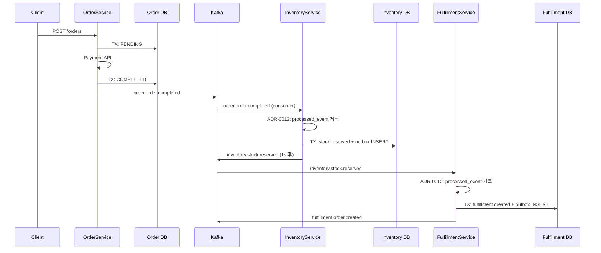
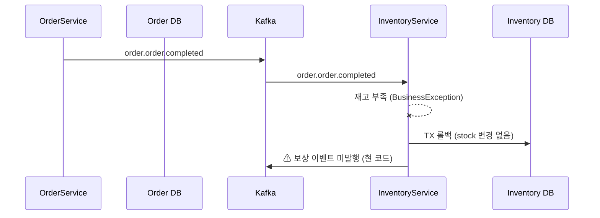

# 12. msa Outbox + Saga 적용 분석

> **이 파일의 한 줄 요약** — msa 는 inventory/fulfillment/quant 에 Outbox 적용. order/inventory/fulfillment 의 흐름이 자연스러운 **choreography Saga**. 보상 트랜잭션 일부는 미구현 — 운영 시 manual intervention 가능성.

---

## 1. Outbox 적용 현황

`find -name "outbox" -type d` 결과:

| 서비스 | Outbox 적용 | 비고 |
|---|---|---|
| **inventory** | ✅ | `inventory/.../infrastructure/persistence/outbox/` |
| **fulfillment** | ✅ | `fulfillment/.../infrastructure/persistence/outbox/` |
| **quant** | ✅ | `quant/.../infrastructure/outbox/` |
| order | ❌ | `OrderService` 가 `eventPort.publishOrderCompleted/Cancelled` 직접 호출 |
| product | ❌ | Kafka 발행 직접 (필요 시) |
| auth/member/wishlist/gifticon/code-dictionary | ❌ | Kafka 발행 거의 없음 |

**inventory/fulfillment 는 외부 consumer 가 명확** (다른 서비스가 listen) → Outbox 견고성 우선.

**order 는 직접 발행** — ADR-0012 적용 범위 표에서 "order = ✓" 로 명시되어 있지만 Outbox 가 아닌 자체 처리 (eventId 만 추가). 이 비대칭이 [13-improvements.md](13-improvements.md) 의 개선 후보 1.

---

## 2. Outbox 패턴 코드 분석 — fulfillment 기준

### 1) Outbox 엔티티

```kotlin
// fulfillment/.../infrastructure/persistence/outbox/entity/OutboxJpaEntity.kt
@Entity
@Table(name = "outbox_event")
class OutboxJpaEntity(
    @Id @GeneratedValue(strategy = GenerationType.IDENTITY)
    val id: Long? = null,

    @Column(nullable = false, length = 36)
    val eventId: String = UUID.randomUUID().toString(),  // ✅ ADR-0012 멱등성 키

    @Column(nullable = false, length = 50)
    val aggregateType: String,                           // "FulfillmentOrder"

    @Column(nullable = false)
    val aggregateId: Long,

    @Column(nullable = false, length = 100)
    val eventType: String,                               // "fulfillment.order.created"

    @Column(nullable = false, columnDefinition = "JSON")
    val payload: String,

    @Column(nullable = false, length = 20)
    var status: String = "PENDING",                      // PENDING / PUBLISHED

    @Column(nullable = false)
    val createdAt: LocalDateTime = LocalDateTime.now(),

    var publishedAt: LocalDateTime? = null
)
```

### 2) Outbox Port + Adapter

```kotlin
// application 레이어 — 도메인 의존성 없음
interface OutboxPort {
    fun save(aggregateType: String, aggregateId: Long, eventType: String, payload: String)
}

// infrastructure 레이어 — JPA 의존
@Component
class OutboxAdapter(
    private val outboxJpaRepository: OutboxJpaRepository,
) : OutboxPort {
    override fun save(aggregateType: String, aggregateId: Long, eventType: String, payload: String) {
        val entity = OutboxJpaEntity(
            aggregateType = aggregateType,
            aggregateId = aggregateId,
            eventType = eventType,
            payload = payload,
        )
        outboxJpaRepository.save(entity)  // 같은 트랜잭션에 참여
    }
}
```

Clean Architecture 원칙대로 application 은 인터페이스, infrastructure 는 구현. 비즈니스 서비스는 `OutboxPort` 만 알고 JPA 를 모름.

### 3) 비즈니스 로직 (Outbox INSERT 가 같은 TX 안)

```kotlin
@Service
@Transactional
class FulfillmentService(
    private val fulfillmentRepository: FulfillmentRepositoryPort,
    private val outboxPort: OutboxPort,
    private val objectMapper: ObjectMapper
) {
    override fun execute(command: CreateFulfillmentUseCase.Command): CreateFulfillmentUseCase.Result {
        val existing = fulfillmentRepository.findByOrderIdAndWarehouseId(...)
        if (existing != null) return ...  // 멱등성: 중복 호출 시 기존 반환

        val fulfillmentOrder = FulfillmentOrder.create(...)
        val saved = fulfillmentRepository.save(fulfillmentOrder)
        val savedId = requireNotNull(saved.id)

        val event = FulfillmentEvent.Created(
            fulfillmentId = savedId,
            orderId = saved.orderId,
            warehouseId = saved.warehouseId
        )
        outboxPort.save(
            aggregateType = "FulfillmentOrder",
            aggregateId = savedId,
            eventType = "fulfillment.order.created",
            payload = objectMapper.writeValueAsString(event)
        )

        return CreateFulfillmentUseCase.Result(...)
    }
}
```

**핵심**:
- 같은 `@Transactional` 안에서 `fulfillmentRepository.save` + `outboxPort.save` → atomic
- 비즈니스 트랜잭션 commit 시점에 fulfillment 변경 + outbox row 가 한 번에 commit
- 실패 시 둘 다 롤백 → 이벤트 발행되지 않음

### 4) Polling Publisher

```kotlin
@Component
@ConditionalOnProperty(name = ["outbox.polling.enabled"], havingValue = "true", matchIfMissing = true)
class OutboxPollingPublisher(
    private val outboxRepository: OutboxJpaRepository,
    private val kafkaTemplate: KafkaTemplate<String, Any>,
    private val objectMapper: ObjectMapper,
) {
    @Scheduled(fixedDelayString = "\${fulfillment.outbox.polling-interval-ms:1000}")
    fun publishPendingEvents() {
        val events = outboxRepository.findAllByStatusOrderByCreatedAtAsc("PENDING")
        if (events.isEmpty()) return

        for (event in events) {
            try {
                val enrichedPayload = objectMapper.readTree(event.payload).let { node ->
                    (node as ObjectNode).put("eventId", event.eventId)
                    objectMapper.writeValueAsString(node)
                }
                kafkaTemplate.send(event.eventType, event.aggregateId.toString(), enrichedPayload)
                    .whenComplete { _, ex ->
                        if (ex != null) {
                            log.error("Failed to publish outbox event id={}", event.id, ex)
                        } else {
                            event.status = "PUBLISHED"
                            event.publishedAt = LocalDateTime.now()
                            outboxRepository.save(event)
                        }
                    }
            } catch (e: Exception) { ... }
        }
    }
}
```

**관찰 포인트**:
1. `eventId` 가 발행 시 payload 에 추가됨 → consumer 가 멱등성 키로 사용
2. `whenComplete` 콜백 안에서 `event.status = "PUBLISHED"` — **트랜잭션 밖에서 dirty save**. Spring Data JPA 가 콜백 안에서 트랜잭션을 새로 만드는지 의존. 안전을 위해 `@Transactional` 명시 권장 가능.
3. 발행 실패 시 status 가 PENDING 으로 남아 다음 폴링에서 재시도 → at-least-once.
4. `@Scheduled` 가 단일 인스턴스에서만 돌아야 함 → multi-replica 배포 시 leader election 필요 (SchedulerLock 등).

---

## 3. Outbox 의 5가지 약점 / 미해결

| 약점 | 영향 | 해결 후보 |
|---|---|---|
| **테이블 무한 증가** | publishedAt 후 row 가 쌓임 → 디스크/조회 성능 | 7일 후 DELETE 스케줄러 |
| **순서 보장 미흡** | 동시 폴링 / 실패-재시도에서 순서 흐트러짐 | partition key (aggregate_id) 로 보강 |
| **multi-replica 중복 발행** | 두 인스턴스가 같이 폴링 | SchedulerLock + DB row lock |
| **콜백 안 dirty save** | 트랜잭션 외부 변경 → race condition 가능 | 명시적 `@Transactional` |
| **publishedAt 만 기록** | 재발행 history 안 남음 | retry_count, last_error 컬럼 추가 |

---

## 4. Choreography Saga 흐름

msa 의 order → inventory → fulfillment 가 자연스러운 choreography Saga.

### 정상 흐름



### 보상 흐름 (재고 부족)



**여기서 약점 발견** — InventoryService 의 reserve 가 실패하면 **OrderService 가 모름**. 결제는 됐는데 재고가 없어 fulfillment 가 생성 안 됨. order 는 COMPLETED 로 남고 사용자에게는 곧 받을 거라 안내됨.

### 현재 msa 의 보상 메커니즘

`InventoryService.execute(ReleaseStockByOrderUseCase.Command)` 와 `ReservationExpiryService.execute()` 가 **부분적 보상**:

```kotlin
@Transactional
override fun execute(command: ReleaseStockByOrderUseCase.Command): List<...> {
    val reservations = reservationRepository.findAllByOrderId(command.orderId)
        .filter { it.getStatus() == ReservationStatus.ACTIVE }

    return reservations.map { reservation ->
        reservation.cancel()
        reservationRepository.save(reservation)

        val inventory = inventoryRepository.findByProductIdAndWarehouseId(...)
        inventory.release(reservation.qty)
        ...
        outboxPort.save(AGGREGATE_TYPE, inventoryId, "inventory.stock.released", ...)
        ...
    }
}
```

→ "이미 reserved 된 재고를 외부 트리거로 해제" 하는 별도 use case. 다만 이 use case 가 **언제 호출되는지** 가 중요한데, `order.order.cancelled` 같은 이벤트를 InventoryEventConsumer 가 받아서 호출하는 패턴이 자연스러움. **검증 결과 (2026-05-01)**: `inventory/app/.../infrastructure/messaging/InventoryEventConsumer.kt` 에서 `onOrderCompleted`(order.order.completed → reserve), `onFulfillmentShipped`(fulfillment.order.shipped → confirm), `onFulfillmentCancelled`(fulfillment.order.cancelled → release) 세 개만 정의됨. **`order.order.cancelled` 토픽 consumer 는 없음** — 즉 결제 실패 / 사용자 취소 시 inventory 즉시 release 가 명시적으로 트리거되지 않고, `ReservationExpiryService` 의 30분 TTL fallback 으로만 회복. → 19-improvements §4 (payment 실패 시 명시적 inventory 보상) 가 이 정확한 gap 을 가리킴.

`ReservationExpiryService` 는 TTL 30분 만료된 reservation 을 주기적으로 cancel + 재고 release. 이건 **사고 회복 안전망** 역할.

### 보상 흐름의 약점

- **자동 보상 chain 미완성** — order 까지 cancel 시키는 흐름 (`order.order.cancelled` 발행 → consumer 처리) 이 완전히 구현되어 있는지 코드만으로 단언하기 어려움.
- **금전 보상 (환불)** 미구현 — 결제는 PaymentPort 로 외부 호출하고, 환불은 별도 보상 호출 필요.
- **manual intervention** 가능성 인정해야 함 — Saga 의 본질적 한계.

---

## 5. ADR-0012 + Outbox 의 결합 효과

```
[Producer 측 — Outbox]
TX commit → entity + outbox row atomic
Polling → Kafka 발행 (at-least-once)

[Consumer 측 — ADR-0012]
eventId 추출 → processed_event 조회
  ├─ 존재: skip
  └─ 없음: 비즈니스 로직 + processed_event INSERT (같은 TX)

→ 결과: at-least-once + idempotent = effectively-once 시맨틱
```

이게 분산 시스템에서 atomic 발행 + 정확히 한 번 처리를 시뮬레이션하는 가장 표준적인 패턴.

---

## 6. quant 의 Outbox

`quant/.../infrastructure/outbox/` 에 동일 패턴 적용. 암호화폐 자동매매 도메인이라 거래 이벤트 발행이 핵심 — Outbox 견고성이 정당함.

(상세 코드는 비슷한 패턴이라 생략)

---

## 7. 함정: Outbox 가 만능이 아닌 케이스

### 케이스 1: 외부 HTTP 의 멱등성 미보장

Outbox 는 **DB commit 과 Kafka 발행을 동기화** 하는 패턴. 외부 HTTP 호출 (e.g. PaymentPort) 의 atomic 성은 별도 문제.

```kotlin
@Transactional
fun processPayment() {
    paymentClient.charge(...)  // ⚠ 외부 HTTP — Outbox 패턴 적용 불가
    outboxPort.save("payment.completed", ...)
}
```

이런 경우 TransactionalService 분리 + retry / saga 로 해결.

### 케이스 2: Outbox 자체가 SPOF

Outbox 테이블이 손상되거나 폴링이 멈추면 → 모든 이벤트 발행 정지. 모니터링 + alert 필수:
- `outbox_event WHERE status='PENDING' AND createdAt < now() - 1 minute` count
- Polling lag 모니터링

### 케이스 3: 이벤트 순서가 강하게 필요한 경우

Outbox 폴링이 단순 ORDER BY createdAt 으로 정렬해도, Kafka 발행이 비동기 + 실패-재시도 시 순서가 흔들림. 강한 순서가 필요하면:
- Kafka partition key = aggregate_id 로 같은 aggregate 의 이벤트가 같은 partition 에 가도록
- Consumer 측에서 순서 보장 처리 (sequence number 필드 추가)

---

## 8. 면접 답변 패턴

### Q. msa 에서 Saga 를 어떻게 구현했나요?

> Choreography 방식의 Saga 입니다. order, inventory, fulfillment 가 각각 로컬 트랜잭션을 commit 하고, Outbox 패턴으로 Kafka 이벤트를 발행하면 다음 서비스가 그걸 받아 자기 트랜잭션을 시작합니다. 예를 들면 order 가 결제 완료 후 order.order.completed 를 발행하면, inventory 가 그걸 받아 재고를 reserve 하고 inventory.stock.reserved 를 발행합니다. fulfillment 가 그걸 받아 fulfillment 를 만들고 fulfillment.order.created 를 발행하는 식입니다. 보상 흐름은 inventory 의 ReservationExpiryService 가 30분 TTL 만료된 reservation 을 자동 취소하고, ReleaseStockByOrderUseCase 가 외부 트리거로 재고를 해제하는 방식입니다. 멱등성은 ADR-0012 의 eventId + processed_event 테이블로 보장하고, Outbox 와 결합해 at-least-once 발행 + effectively-once 처리를 달성합니다. 다만 환불처럼 금전 보상이 필요한 케이스는 manual intervention 가능성을 인정한 설계입니다.

### Q. Outbox 의 단점은?

> 4가지 정도 알고 있습니다. 첫째, polling interval 만큼 latency 가 생겨서 1초 미만 즉시성이 필요한 케이스에는 CDC (Debezium) 같은 대안이 더 적합합니다. 둘째, 테이블이 무한 증가해서 별도 retention 정책 (7일 후 DELETE) 이 필요합니다. 셋째, Kafka partition key 를 적절히 안 잡으면 같은 aggregate 의 이벤트 순서가 흔들립니다. 넷째, multi-replica 배포 시 두 인스턴스가 같이 폴링하면 중복 발행이 일어나서 SchedulerLock 같은 분산 락이 필요합니다. 우리 msa 는 1, 2번이 미해결 — 폴링 1초 latency 는 비즈니스적으로 허용 범위 안이지만, retention 스케줄러는 ADR 후보로 정리할 예정입니다.

---

## 9. 요약 카드

- **Outbox 적용**: inventory, fulfillment, quant (외부 consumer 명확)
- **order 는 직접 발행** — 비대칭, 개선 후보
- Outbox 약점 5가지: 테이블 무한 증가 / 순서 / multi-replica 중복 / 콜백 dirty save / 재발행 이력
- choreography Saga: order → inventory → fulfillment 의 자연 흐름
- 보상 메커니즘은 부분적 — 환불 등 금전 보상은 manual intervention 가능성
- ADR-0012 의 idempotent consumer 와 결합 → at-least-once + idempotent = effectively-once

---

## 다음 학습

- [13-improvements.md](13-improvements.md) — 개선 후보 종합
- [14-interview-qa.md](14-interview-qa.md) — Q&A 카드
