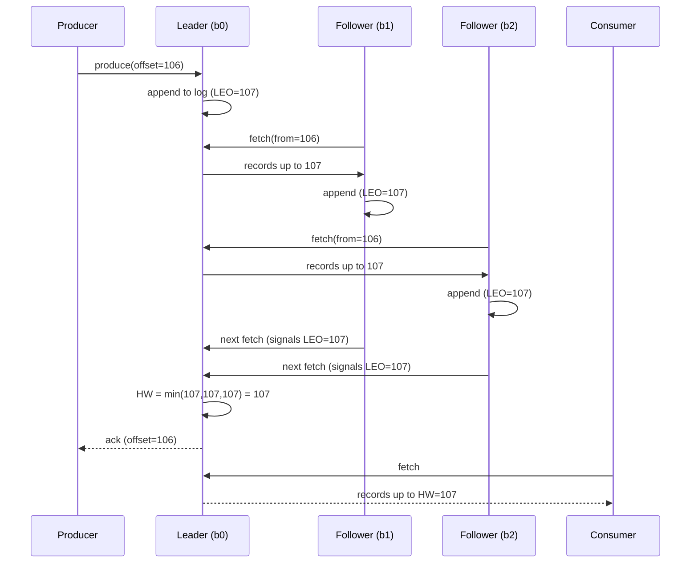
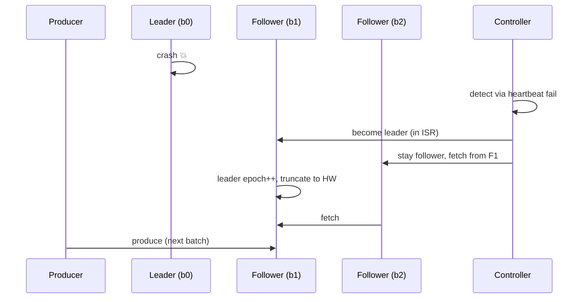

# 06. 복제 — ISR / HW / Leader Election / Rack Awareness

## 한 줄 요약

> Kafka 의 복제는 **leader 가 모든 read/write 처리, follower 가 leader 의 log 를 fetch 해 따라잡음**. 동기화된 follower 집합이 **ISR (In-Sync Replica)**, 컨슈머에 노출되는 마지막 offset 이 **HW (High Watermark)** = ISR 모두에 복제된 위치. leader 장애 시 ISR 에서 새 leader 선출.

## 1. Replica 의 종류

| 역할 | 동작 |
|---|---|
| **Leader** | 클라이언트의 모든 read/write 처리. fetch 응답 |
| **Follower** | leader 에서 fetch 해 자기 로그에 append. 클라이언트 응답 안 함 |
| **In-Sync Replica (ISR)** | leader 또는 leader 와 충분히 동기화된 follower 의 집합 |
| **Out-of-Sync Replica** | replica.lag.time.max.ms 이상 뒤처진 follower |

```
Topic order.order.completed, partition 0, RF=3
┌─────────────────────────────────────────────┐
│  broker-0 (leader)    ▶ HW=100, LEO=105     │
│      ▲                                      │
│      │ fetch                                │
│  broker-1 (follower) ▶ HW=100, LEO=103      │  ← 약간 뒤처짐 (ISR)
│  broker-2 (follower) ▶ HW=100, LEO=98       │  ← lag 많음 (out-of-sync)
└─────────────────────────────────────────────┘

LEO (Log End Offset): 그 replica 의 마지막 offset + 1
HW  (High Watermark): ISR 전체에 복제된 마지막 offset
```

## 2. HW (High Watermark) 의 정확한 의미

- **모든 ISR replica 의 LEO (Log End Offset) 의 최솟값**
- 컨슈머는 HW 까지만 읽을 수 있음 (그 위는 invisible)

```
LEO 들:    leader=105, ISR follower 1=103, follower 2=104
HW:        min(105, 103, 104) = 103
컨슈머가 보는 latest offset: 103
```

**왜?** — HW 미만은 아직 충분히 복제되지 않아 leader 가 죽으면 사라질 수 있음. HW 이상만 노출하면 "한번 컨슈머에 보였던 메시지는 절대 사라지지 않는다" 보장.

## 3. acks=all 의 ack 시점

```
1. Producer → leader (broker-0)
2. leader 가 자기 log 에 append (LEO=106)
3. follower 1, 2 가 fetch 요청
4. 둘 다 받아 자기 log 에 append (LEO=106)
5. follower 들이 다음 fetch 요청 (이때 fetch offset 으로 자기 LEO 알림)
6. leader 가 모든 ISR follower 의 LEO ≥ 106 확인 → HW=106 갱신
7. leader 가 producer 에 ack
8. consumer 도 이제 offset 106 가시
```

**핵심**: ack 시점 = HW 가 그 메시지를 포함했을 때. 즉 **ISR 전체에 도달한 시점**.

## 4. ISR 멤버십 — 누가 ISR 에 들어 있나?

**들어가는 조건**:
- replica.lag.time.max.ms (default 30초) 이내에 leader 의 LEO 까지 따라잡음

**나가는 조건** (out-of-sync):
- 30초 동안 fetch 요청 없거나
- 30초 동안 fetch 요청은 있는데 leader 에 영원히 못 따라잡음 (네트워크/디스크 이슈)

**다시 들어오는 조건**:
- 다시 따라잡으면 자동 재합류

**중요**:
- 옛날엔 `replica.lag.max.messages` 로 메시지 수 기반이었음 → producer burst 시 false out-of-sync → 폐기됨
- 지금은 시간 기반만 사용 (KIP-16)

## 5. Leader Election

### 일반 election (Clean)
- ISR 에서 새 leader 선출
- 기본 정책: ISR 의 첫 번째 (= Replicas 리스트의 첫 번째 중 ISR 에 있는 것)
- preferred replica = Replicas 리스트의 첫 번째 (대개 균등 분산용)

```
auto.leader.rebalance.enable=true (default)
leader.imbalance.check.interval.seconds=300
```

→ broker 재시작 후 leader 가 한쪽에 몰리면 자동 재배치.

### Unclean Leader Election

**상황**: ISR 이 모두 죽음. ISR 외의 replica 만 살아남음. → ISR 빈 상태에서 leader 가 없음.

**선택**:
- `unclean.leader.election.enable=false` (default, 권장) → leader 없음. 토픽 unavailable. **데이터 손실 0**.
- `unclean.leader.election.enable=true` → ISR 외 replica 를 leader 로 선출. **데이터 일부 손실 가능**.

```
ISR (모두 죽음):
  broker-0 (leader, HW=100, LEO=105) — 죽음
  broker-1 (ISR, HW=100, LEO=104)    — 죽음

out-of-sync 만 살아남:
  broker-2 (LEO=80)                   — 살아 있음

unclean=true → broker-2 가 leader, HW=80 으로 reset
              → offset 81~100 메시지 손실 (이미 컨슈머에 보였던 메시지가 사라짐)
```

**msa 기본**: 명시적 false (Strimzi default). 가용성보다 정확성 우선.

## 6. min.insync.replicas 와 acks=all 의 관계

```
min.insync.replicas = 2
RF = 3
```

**ISR ≥ 2** 일 때만 acks=all 쓰기 허용. ISR=1 까지 떨어지면 producer 가 `NotEnoughReplicasException` (W 차단).

**가용성/안전성 트레이드오프**:
- min.ISR=1 → 항상 쓰기 가능. 단 leader 만 살아도 ack → leader 죽으면 손실
- min.ISR=2 → 1대 장애까지 OK. 2대 장애시 쓰기 차단 (= 사용자에게 에러)
- min.ISR=3 (RF=3) → 1대만 죽어도 쓰기 차단. 매우 보수적

**msa 프로덕션**: `min.ISR=2, RF=3` → 가용성 + 안전성 균형. 2대 장애 시 쓰기 막혀 더 큰 사고 방지.

## 7. msa 의 Replication 설정

`k8s/infra/prod/strimzi/kafka-cluster.yaml`:
```yaml
config:
  default.replication.factor: 3
  min.insync.replicas: 2
  offsets.topic.replication.factor: 3            # __consumer_offsets 도 RF=3
  transaction.state.log.replication.factor: 3    # __transaction_state 도 RF=3
  transaction.state.log.min.isr: 2
```

`k8s/infra/prod/strimzi/kafka-topics.yaml` per-topic:
```yaml
spec:
  partitions: 6
  replicas: 3
  config:
    retention.ms: "604800000"
    min.insync.replicas: "2"
```

**로컬 (k3s-lite)**: 모두 RF=1, min.ISR=1 (개발 편의 — 단일 노드).

## 8. Rack Awareness (KIP-392, KIP-881)

**문제**: 클라우드 환경에서 partition 의 모든 replica 가 같은 AZ (Availability Zone, 가용 영역) (rack) 에 배치되면, AZ 장애시 partition 전체 사라짐. 또 cross-AZ 트래픽 비용 ↑.

**해결**:
- Producer/broker 에 `broker.rack` 설정 → controller 가 rack 분산을 고려해 replica 배치
- KIP-881 (Kafka 3.5+): Consumer 도 같은 rack 의 follower 에서 fetch 가능 (`replica.selector.class=RackAwareReplicaSelector`)

```yaml
# Strimzi 예시
spec:
  kafka:
    rack:
      topologyKey: topology.kubernetes.io/zone
```

→ broker 가 자동으로 노드의 zone label 을 broker.rack 으로 사용.

**msa 적용 여부**: 현재 미설정. 프로덕션 다중 AZ 시 cross-AZ 트래픽 비용 절감 위해 도입 후보 (`13-improvements.md`).

## 9. Replication 메커니즘 시각화

### 정상 상태 (Mermaid)


### 장애 상황 (leader 죽음)


## 10. Leader Epoch — 왜 추가됐나

옛날엔 leader 변경 시 follower 가 자기 LEO 까지 keep 했다가 새 leader 보다 ahead 가 되면 잘라버림 (truncate). 그런데 문제: **HW 가 진짜 마지막 안전 위치인지 확신 못 함**.

KIP-101 (Leader Epoch) 도입 후:
- 매 leader 변경 시 epoch 증가
- follower 는 새 leader 의 epoch 별 LEO 를 조회 → 정확한 truncation point 파악

**효과**: HW 만 의존했을 때 발생하던 데이터 손실/divergence 시나리오가 사라짐. 운영자가 직접 신경 쓸 필요는 없지만 면접 답에 들어갈 수 있음.

## 11. 면접 포인트

- **Q. ISR 이 비면 어떻게 되나?**
  > leader 가 없는 상태. unclean.leader.election.enable=false 면 토픽 unavailable (가용성 손실), true 면 out-of-sync replica 를 강제 leader 로 (데이터 손실 가능). 보통 false 가 권장 — "잠시 못 쓰는 게 데이터 잃는 것보다 낫다."

- **Q. HW 가 LEO 보다 작은 이유?**
  > LEO 는 leader 가 알고 있는 끝 (방금 append 한 메시지 포함), HW 는 모든 ISR 에 복제된 끝. follower 가 fetch 로 따라잡는 시간 차 때문에 HW < LEO 가 정상. 그 차이는 producer 가 아직 ack 못 받은 메시지들.

- **Q. min.ISR=2, RF=3 인데 broker 1 대 죽으면?**
  > ISR 2 명 → acks=all 정상 작동 (1대 ack 받음 = 2명 ISR 만족). 한 대 더 죽으면 ISR=1 로 떨어져 acks=all 쓰기 차단.

- **Q. unclean.leader.election 을 true 로 해야 할 때는?**
  > 데이터 손실 < 가용성 손실 인 경우. 예: 메트릭 수집 (잠깐 끊김 > 일부 데이터 손실), 로그 (재전송 가능). 도메인 이벤트는 절대 안 됨 — 주문 사라지면 사고.

- **Q. Rack-aware fetch 가 비용 절감하는 이유?**
  > AWS / GCP cross-AZ 트래픽은 GB 당 과금. 같은 AZ 의 follower replica 에서 fetch 하면 zone 내 트래픽으로 처리되어 무료 또는 저렴. partition 수가 많고 트래픽 큰 클러스터에서 월 수천 달러 절감 가능.

## 12. 다음 단계

- [03-controller-kraft.md](03-controller-kraft.md) — controller 가 leader election 을 어떻게 트리거
- [09-exactly-once.md](09-exactly-once.md) — transaction state log 의 RF/min.ISR 설정 의미
- [10-idempotency-dlq-failure.md](10-idempotency-dlq-failure.md) — URP / lag 폭증 운영 대응
