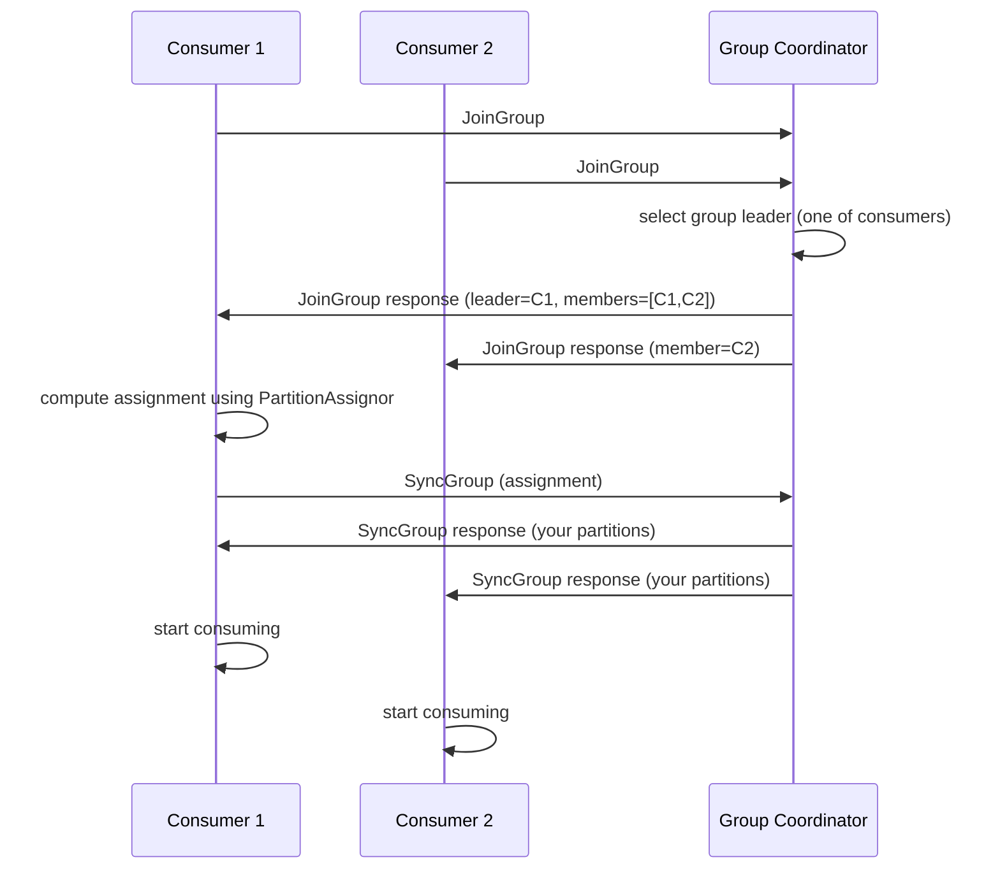

# 07. Consumer Group / Rebalance Protocol

## 한 줄 요약

> Consumer Group 은 토픽의 파티션을 멤버들에게 **분배**한다. 멤버 추가/이탈/장애 시 **rebalance** 가 발생, 어느 컨슈머가 어느 파티션을 받을지 재조정. 옛날 **Eager** 프로토콜은 모든 멤버가 일시 정지(STW) 됐지만, 현재는 **Cooperative-Sticky** 로 점진적 재할당이 가능.

## 1. Consumer Group 의 역할

```
Topic order.order.completed (partitions: 0,1,2,3,4,5)
                  │
            ┌─────┴──────┐
            ▼            ▼
Group "inventory-service" (3 instances)
   ├── instance A → 파티션 0, 1
   ├── instance B → 파티션 2, 3
   └── instance C → 파티션 4, 5

Group "search-indexer" (2 instances)
   ├── instance X → 파티션 0, 1, 2
   └── instance Y → 파티션 3, 4, 5
```

**규칙**:
- 한 파티션은 **같은 그룹 내** 한 컨슈머에만 할당
- 그룹 간엔 독립적 — 같은 토픽을 여러 그룹이 각자 처리
- 컨슈머 수 > 파티션 수 → 일부는 idle (할당 못 받음)
- 컨슈머 수 < 파티션 수 → 한 컨슈머가 여러 파티션

## 2. Group Coordinator

각 그룹마다 **Group Coordinator** 라는 broker 1 명이 정해짐.

```
hash(group.id) % offsets.topic.num.partitions → coordinator partition
                                              → 그 partition 의 leader broker = coordinator
```

**역할**:
- 멤버 등록/제거
- 멤버의 heartbeat 체크
- rebalance 트리거 + 조율
- offset commit 받기 (__consumer_offsets 에 저장)

**FindCoordinator API**: 컨슈머가 시작할 때 coordinator 가 누군지 broker 에 물어봄.

## 3. Rebalance 가 트리거되는 시점

| 트리거 | 예시 |
|---|---|
| 멤버 추가 | 새 컨슈머 인스턴스 시작 |
| 멤버 이탈 (정상) | 컨슈머 graceful shutdown |
| 멤버 이탈 (장애) | session.timeout.ms 동안 heartbeat 없음 |
| 멤버 정체 | max.poll.interval.ms 동안 poll 호출 없음 |
| 토픽 변경 | 파티션 수 증가, 새 토픽 매칭 (regex 구독 시) |
| group.id 첫 시작 | 초기 할당 |

## 4. Rebalance 프로토콜 — 단계

### 공통 흐름


**핵심**: 그룹 멤버 중 한 명이 **group leader** 로 선출되어 assignment 를 계산. coordinator 는 조율만 함 (assignment 결정은 클라이언트 측).

## 5. Eager Rebalance (옛날 방식)

```
1. Coordinator: rebalance 시작 신호
2. 모든 멤버: 자기 partition 모두 revoke (= 처리 중단, 마지막 offset commit)
3. JoinGroup → SyncGroup 흐름
4. 새 assignment 받음
5. 다시 처리 시작
```

**문제**: 단계 2 부터 5 까지 **모든 컨슈머가 멈춤** (Stop The World). 큰 그룹에서 수십 초.

## 6. Cooperative Sticky Rebalance (현재 권장)

```
Round 1:
1. Coordinator: rebalance 시작
2. 멤버 leader 가 새 assignment 계산
3. 변경 없는 partition 은 그대로 유지, 이동할 partition 만 revoke
4. JoinGroup → SyncGroup → 변경 안 된 컨슈머는 계속 처리

Round 2:
5. revoke 된 partition 을 이번엔 새 owner 에 할당
6. 끝
```

→ **STW 최소화**. 변경 없는 partition 은 처리 중단 안 됨.

```kotlin
// 권장 설정
ConsumerConfig.PARTITION_ASSIGNMENT_STRATEGY_CONFIG to
    "org.apache.kafka.clients.consumer.CooperativeStickyAssignor"
```

**msa 현황**: KafkaConfig 에서 명시 안 함 → 기본값 (RangeAssignor) 사용 중. **개선 후보** (`13-improvements.md`).

## 7. Partition Assignment 전략

### RangeAssignor (default until 2.4)
- 토픽 별로 파티션을 컨슈머에 연속 범위로 분배
- 토픽 1, 2가 각각 4 파티션 + 컨슈머 3 명:
  ```
  C1: t1[0,1], t2[0,1]
  C2: t1[2],   t2[2]
  C3: t1[3],   t2[3]
  ```
- 단점: 토픽 수 많으면 C1 만 부하 집중

### RoundRobinAssignor
- 모든 (토픽, 파티션) 을 한 줄로 세워 round-robin
- 단점: rebalance 시 거의 모든 partition 이 이동

### StickyAssignor
- 균등 분배 + **이전 할당 최대한 유지**
- rebalance 시 이동 minimize

### CooperativeStickyAssignor (3.0+ 권장)
- StickyAssignor 의 점진적(2-round) 버전
- **rebalance 중 STW 최소화**
- 새 시스템은 이거 쓰는 게 정공법

## 8. Static Membership (group.instance.id)

기본 동작:
- 컨슈머 재시작 → 새 멤버 ID → rebalance 트리거
- K8s rolling update 에서 매 pod 마다 rebalance → 비효율

**해결**: `group.instance.id` 명시
```kotlin
ConsumerConfig.GROUP_INSTANCE_ID_CONFIG to "inventory-pod-${podId}"
```

→ 같은 instance ID 로 재합류하면 **같은 멤버 ID 로 인식 → rebalance 트리거 안 함**. session.timeout.ms 까지는 다른 멤버들이 자기 파티션 유지.

**효과**: rolling restart 시 partition 재할당 안 일어나서 재처리 부담 감소.

## 9. Heartbeat / Session Timeout / Poll Interval

| 설정 | 기본값 | 의미 |
|---|---|---|
| `heartbeat.interval.ms` | 3s | heartbeat 보내는 주기 |
| `session.timeout.ms` | 45s (3.0+) | heartbeat 누락 허용 시간 |
| `max.poll.interval.ms` | 5min | poll() 호출 사이 최대 간격 |

**poll loop**:
```kotlin
while (true) {
    val records = consumer.poll(Duration.ofMillis(500))
    process(records)        // 비즈니스 처리
    consumer.commitSync()   // (수동 commit 시)
}
```

- heartbeat 은 별도 thread 가 보냄 → 처리 중에도 살아있음 신호
- 단, **`max.poll.interval.ms` 안에 다음 poll() 안 돌아오면 장애로 판단** → rebalance 트리거

**흔한 사고**:
- 처리 시간 > max.poll.interval.ms (5분)
- 같은 메시지가 다시 들어오는 무한 루프
- → **`max.poll.records` 줄이거나, max.poll.interval.ms 늘리거나, 처리를 비동기화**

## 10. msa Consumer 설정 분석

```kotlin
// inventory KafkaConfig.kt
ConsumerConfig.GROUP_ID_CONFIG to "inventory-service",
ConsumerConfig.AUTO_OFFSET_RESET_CONFIG to "earliest",
ConsumerConfig.ENABLE_AUTO_COMMIT_CONFIG to false,
// concurrency, max.poll.records, assignor 등은 기본값
```

`ConcurrentKafkaListenerContainerFactory` 의 concurrency 도 명시 안 됨 → 기본 1 (단일 thread).

| 설정 | msa 값 | 평가 |
|---|---|---|
| group.id | `inventory-service` | ✓ kafka-convention |
| auto.offset.reset | earliest | ✓ 재처리 안전 |
| enable.auto.commit | false + AckMode.RECORD | ✓ 표준 |
| assignment.strategy | (기본 Range) | △ CooperativeSticky 권장 |
| group.instance.id | (없음) | △ K8s 환경에선 추가 권장 |
| max.poll.records | (기본 500) | △ 비즈니스 처리시간 따라 조정 |
| concurrency | (기본 1) | △ 파티션 수 만큼 늘릴 수 있음 |

## 11. Concurrency vs Partition 관계

`ConcurrentKafkaListenerContainerFactory` 의 concurrency 는 **컨테이너 인스턴스 수** = 동시 polling thread 수.

- partition=6, concurrency=3 → 각 thread 가 partition 2개씩 처리
- partition=6, concurrency=6 → 각 thread 가 partition 1개 (최대 병렬)
- partition=6, concurrency=10 → 4개 thread 는 idle

**vs K8s replica**:
- K8s replica=3, concurrency=2 → 6개 컨슈머 인스턴스 (각 pod 에서 2 thread)
- partition=6 이면 정확히 균등 분배

→ **목표 throughput / 컨슈머 1 thread 처리율 = 필요한 thread 수**. partition 수가 그 상한.

## 12. 면접 포인트

- **Q. Rebalance 중 메시지 누락이 발생할 수 있나?**
  > Eager 프로토콜은 멤버가 partition revoke 시 마지막 offset commit 안 하면 → 새 owner 가 이전 위치부터 재처리 → 누락은 없지만 중복 가능 (at-least-once). Cooperative 도 마찬가지. 누락은 없고 중복은 가능 — 그래서 컨슈머 멱등성이 필수.

- **Q. Partition 1개에 컨슈머 2개 붙이면?**
  > 같은 그룹 안에서는 불가능 — Coordinator 가 한 명에게만 할당. 다른 그룹이면 각자 독립 처리. 같은 그룹에 2명 띄워서 둘 다 받게 하고 싶다면 → 파티션 늘리거나 그룹 분리.

- **Q. max.poll.interval.ms 타임아웃 되면?**
  > Coordinator 가 그 컨슈머를 그룹에서 제거 → rebalance. 그 동안 컨슈머가 처리 중이던 메시지의 offset 은 commit 못 됨 → 새 owner 가 이전 위치부터 재처리. 처리 시간 긴 작업은 별도 worker 에 dispatch 후 즉시 poll() 복귀 패턴 권장.

- **Q. Static Membership 의 효과?**
  > rolling restart / 짧은 GC (Garbage Collection, 가비지 컬렉션) pause 같은 일시적 부재에 rebalance 트리거 안 함. session.timeout.ms 안에 같은 instance ID 로 재합류하면 그대로 진행. K8s StatefulSet 의 pod 이름을 instance.id 로 쓰는 패턴이 흔함.

- **Q. CooperativeStickyAssignor 가 RangeAssignor 보다 좋은 이유?**
  > 1) Sticky — rebalance 시 partition 이동 최소화 (캐시 보존), 2) Cooperative — STW 최소화 (변경 없는 partition 은 계속 처리), 3) 균등 분산 (Range 의 첫 컨슈머 부하 집중 문제 없음). 단점은 클라이언트 호환성 (모든 컨슈머가 cooperative 지원해야 mixed mode 사용 가능).

## 13. 다음 단계

- [08-offset-commit-poll.md](08-offset-commit-poll.md) — poll loop 함정 + offset commit 전략
- [09-exactly-once.md](09-exactly-once.md) — read_committed isolation 의 의미
- [10-idempotency-dlq-failure.md](10-idempotency-dlq-failure.md) — rebalance 와 멱등성
