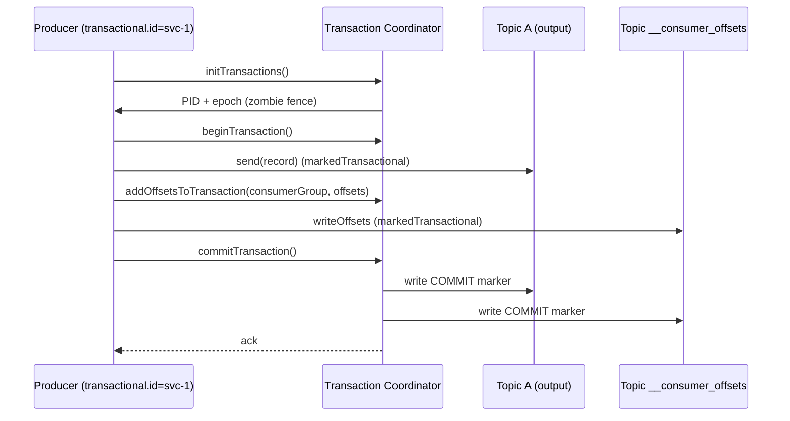

# 09. Exactly-Once Semantics (EOS v2)

## 한 줄 요약

> Kafka 의 EOS 는 **Producer Transaction + Consumer read_committed + Consume-Transform-Produce** 의 좁은 영역에서만 성립한다. **외부 시스템 (DB, REST API) 으로 나가는 순간 깨진다**. msa 가 EOS 대신 **Outbox + Consumer 멱등성** 을 택한 이유.

## 1. 시맨틱 3종

| 시맨틱 | 의미 | 달성 방법 |
|---|---|---|
| at-most-once | 0회 또는 1회 (누락 가능) | commit 먼저 후 처리 |
| at-least-once | 1회 또는 N회 (중복 가능) | 처리 후 commit (msa 표준) |
| exactly-once | 정확히 1회 | EOS 또는 effectively-once |

**effectively-once** = at-least-once + 멱등성 = 결과적으로 1회와 같음. msa 가 ADR-0012 로 달성하는 방식.

## 2. EOS 의 두 가지 의미

Kafka 진영에서 EOS 라고 부르는 것:

### (A) Producer 측 EOS — 중복 발행 차단
- **`enable.idempotence=true`** 로 충분
- (PID, sequence) 로 broker 측 dedup
- 단일 producer 인스턴스 + 단일 세션 안에서

### (B) Stream 처리 EOS — Consume → Transform → Produce
- **`transactional.id`** 사용
- Consumer 가 메시지 읽고 처리 후 새 메시지 발행 + offset commit 을 **하나의 트랜잭션** 으로 묶음
- 둘 다 commit 또는 둘 다 abort

```
read input → process → write output → commit offsets   (모두 atomic)
```

이 둘이 다른 개념인데 흔히 같이 부른다 → 헷갈리기 쉬움.

## 3. EOS v2 (Kafka 2.5+) — 어떻게 동작하나

### 컴포넌트
- **Transaction Coordinator** — broker 중 한 명이 그 transactional.id 의 코디네이터 (`__transaction_state` 토픽 partition leader)
- **`__transaction_state`** — 트랜잭션 메타데이터 저장 (Strimzi 설정: RF=3, min.ISR=2)
- **Transaction Marker** — 토픽 파티션에 commit/abort 표시를 위해 보내는 특수 record

### 흐름


**핵심**:
- producer 가 send 하면 broker 의 partition log 에 들어가지만 **uncommitted 상태**
- commitTransaction 시 coordinator 가 모든 관련 partition 에 **commit marker** 기록
- consumer (read_committed) 는 marker 보기 전엔 그 메시지를 노출하지 않음

### Consumer 측 isolation.level
```kotlin
ConsumerConfig.ISOLATION_LEVEL_CONFIG to "read_committed"
```

| 값 | 동작 |
|---|---|
| `read_uncommitted` (default) | 모든 메시지 읽기 (비-트랜잭션 + 트랜잭션 미완료 포함) |
| `read_committed` | 트랜잭션 commit 된 것만 + 비-트랜잭션 메시지 |

read_committed 는 **LSO (Last Stable Offset)** 까지만 읽는다. 미완료 트랜잭션 이전까지가 LSO.

```
Topic partition 0:
  offset 100: 비-트랜잭션 메시지
  offset 101: TX1 begin (msg)
  offset 102: TX1 (msg)
  offset 103: TX2 begin (msg)
  offset 104: TX1 commit marker         ← TX1 완료
  offset 105: TX2 (msg)
  ...

read_committed consumer 가 보는 것:
  100, 101, 102 (TX1 의 msg + commit 됐으니)
  나머지는 TX2 끝날 때까지 보류
```

→ **TX2 가 안 끝나면 105 이후 영원히 못 봄** — 운영 사고 패턴.

## 4. transactional.id — Zombie Fencing

같은 transactional.id 로 producer 가 다시 init 하면:
- coordinator 가 epoch 를 증가시킴
- 옛날 epoch 의 producer 는 **fenced** → send 시 ProducerFencedException
- 자동으로 abort 처리

→ **좀비 producer 방지**: 한 producer 가 죽었다고 판단했는데 실은 살아 있어서 옛 트랜잭션을 이어가는 사고.

```kotlin
val txId = "order-svc-${podName}"  // K8s pod 이름 등 고유 ID
ProducerConfig.TRANSACTIONAL_ID_CONFIG to txId
```

K8s 환경에선 pod 이름 또는 statefulset ordinal 로 안정 ID 보장.

## 5. EOS 의 한계 — 외부 시스템

EOS 는 **Kafka 안에서만** 정확히 1회. 외부 시스템 (DB, HTTP) 이 끼는 순간:

```
read input → process (DB write) → write output → commit
                       │
                       ▼
              DB write 후 commit 직전 죽음
              → 재시작 시 DB write 는 이미 됐는데
                 Kafka 트랜잭션은 abort
              → consumer 가 다시 읽음
              → DB write 또 발생 (중복!)
```

**XA / 2PC** 로 풀 수 있지만:
- DB 와 Kafka 의 XA 통합은 어렵고 성능 ↓
- 운영 복잡도 매우 높음
- 현실적으로 거의 안 씀

**대안**:
1. **DB 멱등성** — UNIQUE constraint, INSERT ... ON DUPLICATE KEY 등
2. **processed_event 테이블** (msa, ADR-0012)
3. **Outbox 패턴** — DB 트랜잭션에 이벤트도 함께 INSERT, 별도 polling 으로 발행

## 6. Outbox 패턴 — msa 의 선택

```
Inventory Service:
1. BEGIN TRANSACTION
2. UPDATE inventory SET reserved_qty = reserved_qty + ?
3. INSERT INTO outbox (event_id, event_type, payload, created_at, status='PENDING')
4. COMMIT

별도 Polling Worker:
5. SELECT * FROM outbox WHERE status='PENDING'
6. kafkaTemplate.send(eventType, key, payload)
7. UPDATE outbox SET status='PUBLISHED'
```

**장점**:
- DB 트랜잭션 한 개로 도메인 변경 + 이벤트 보장 (atomic)
- Kafka 장애 시 outbox 에 쌓임 → Kafka 복구 후 자동 발행

**단점**:
- 발행 지연 (polling 주기 — msa 1초)
- 중복 발행 가능 (`status='PUBLISHED'` 업데이트 실패 시) → 컨슈머 멱등성으로 보강

→ **at-least-once Producer + at-least-once Consumer + 컨슈머 멱등성** = effectively-once.

## 7. msa 코드 — Outbox + IdempotentEventConsumer

### Outbox Polling (inventory)
```kotlin
// inventory/.../OutboxPollingPublisher.kt
@Scheduled(fixedDelayString = "\${inventory.outbox.polling-interval-ms:1000}")
fun publishPendingEvents() {
    val events = outboxRepository.findAllByStatusOrderByCreatedAtAsc("PENDING")
    for (event in events) {
        val enrichedPayload = objectMapper.readTree(event.payload).let { node ->
            (node as ObjectNode).put("eventId", event.eventId)   // eventId 보강
            objectMapper.writeValueAsString(node)
        }
        kafkaTemplate.send(event.eventType, event.aggregateId.toString(), enrichedPayload)
            .whenComplete { _, ex ->
                if (ex == null) {
                    event.status = "PUBLISHED"
                    event.publishedAt = LocalDateTime.now()
                    outboxRepository.save(event)
                }
            }
    }
}
```

### Idempotent Consumer (quant)
```kotlin
// quant/.../IdempotentEventConsumer.kt
fun process(eventId: UUID, consumerGroup: String, block: () -> Unit): Boolean {
    val pk = ProcessedEventId(eventId, consumerGroup)
    if (processedEventRepo.existsById(pk)) return false
    block()
    transactionTemplate.execute {
        processedEventRepo.save(ProcessedEventEntity(eventId, consumerGroup, Instant.now()))
    }
    return true
}
```

→ Producer 측은 Outbox, Consumer 측은 processed_event. 두 단계 보호.

## 8. EOS 가 적합한 시나리오

EOS 가 진짜 도움이 되는 경우:
- **Kafka Streams 같은 내부 처리** — 외부 시스템 안 끼고 토픽 → 토픽 처리만
- **단일 Kafka 클러스터 내** 데이터 변환 파이프라인
- **개수 정확성이 절대적** (예: 정산, 결제 정합성 — 이 경우 더 보통은 DB 트랜잭션 + Outbox)

EOS 가 부적합:
- **외부 DB / API 호출** 끼는 컨슈머 (msa 의 대부분)
- **부분 실패 후 보정 가능** 한 시나리오 (멱등 처리로 충분)

## 9. Kafka Streams 의 EOS

```kotlin
StreamsConfig.PROCESSING_GUARANTEE_CONFIG to "exactly_once_v2"
```

Streams 는 자동으로:
- input topic → state store → output topic 을 트랜잭션 묶음
- changelog topic 도 트랜잭션 안에 포함
- offset commit 도 함께

→ **사용자는 거의 신경 안 써도 EOS 작동**. msa 의 analytics 가 활용 후보 — 현재는 EOS 미설정 (그래서 score 가 잠깐 중복 계산될 수 있음, 큰 문제 아님).

## 10. 면접 포인트

- **Q. Kafka EOS 가 정말 정확히 1회를 보장하나?**
  > Kafka 클러스터 내부에서만. Producer Tx + Consumer read_committed + Consume-Transform-Produce 한정. 외부 DB / API 가 끼면 깨짐. 그래서 실무에선 EOS 단독이 아니라 컨슈머 멱등성 (DB UNIQUE / Outbox / processed_event) 으로 보강.

- **Q. transactional.id 가 왜 안정적이어야 하나?**
  > 좀비 fencing 메커니즘 때문. 같은 ID 로 재시작하면 epoch 증가 → 옛 producer 가 fenced. 매 시작마다 랜덤 ID 면 fencing 안 됨 → 옛 producer 의 commit 이 그대로 진행될 수 있어 데이터 정합성 깨짐. K8s 면 pod 이름 추천.

- **Q. read_committed 의 lag 이 폭증하는 이유?**
  > 미완료 트랜잭션이 있으면 LSO (Last Stable Offset) 가 그 위치에서 멈춤. 컨슈머는 LSO 까지만 봄 → 트랜잭션이 commit 안 되면 그 이후 메시지를 영원히 못 봄. transaction.timeout.ms (60s default) 후 broker 가 자동 abort. timeout 잘못 잡으면 사고.

- **Q. msa 가 EOS 안 쓰고 Outbox 쓴 이유?**
  > 외부 DB (MySQL) 트랜잭션과 Kafka 트랜잭션을 묶을 수 없음 (XA 안 씀). Outbox 로 DB 트랜잭션 안에 이벤트도 INSERT → 도메인 변경과 이벤트 발행이 atomic. Kafka 발행은 별도 polling. 단순하고 안정적. 컨슈머 멱등성으로 중복 처리만 막으면 됨.

- **Q. EOS v1 과 v2 의 차이?**
  > v2 (Kafka 2.5+) 는 단일 producer 가 여러 partition 에 트랜잭션 처리할 때 RPC 횟수를 크게 줄임 (1번 commitTransaction 으로 모든 partition coordinator 처리). v1 은 partition 별로 별도 처리해서 throughput 낮음. 신규 시스템은 v2 자동 사용.

## 11. 다음 단계

- [10-idempotency-dlq-failure.md](10-idempotency-dlq-failure.md) — 멱등 컨슈머 + DLQ 심화
- [11-msa-codebase-grep.md](11-msa-codebase-grep.md) — msa 의 Outbox + 컨슈머 멱등 전수조사
- [13-improvements.md](13-improvements.md) — analytics Streams EOS 도입 검토
