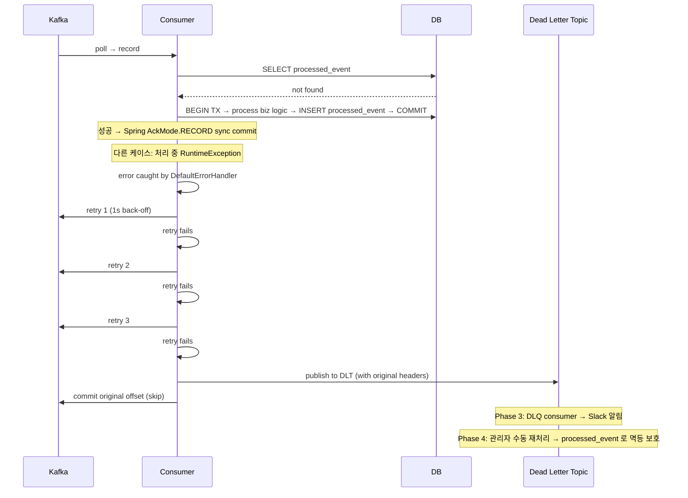

# 10. 멱등 Consumer / DLQ / 장애 대응

## 한 줄 요약

> Kafka 가 EOS 를 강제로 보장하지 못하는 외부 시스템 영역에서 **at-least-once + 컨슈머 멱등성** 으로 effectively-once 달성 (ADR (Architecture Decision Record, 아키텍처 결정 기록)-0012). 처리 실패는 **Spring DefaultErrorHandler + DeadLetterPublishingRecoverer** 로 자동 재시도 + DLQ (Dead Letter Queue, 데드 레터 큐) 송부 (ADR-0015). 운영 사고는 **URP / lag 폭증 / unclean election** 이 핵심 시그널.

## 1. 컨슈머 멱등 패턴 종합

### 패턴 A: DB UNIQUE / PRIMARY KEY
```sql
CREATE TABLE order (
    id BIGINT PRIMARY KEY,
    ...
);
INSERT INTO order(id, ...) VALUES (?, ...) ON DUPLICATE KEY UPDATE ...;
```

- 자연스러운 멱등성 (도메인 ID 가 메시지 ID 와 매칭)
- 단점: 도메인 ID 가 사전에 정해져 있어야

### 패턴 B: Redis SETNX
```kotlin
val acquired = redisTemplate.opsForValue()
    .setIfAbsent("processed:$eventId", "1", Duration.ofDays(7))
if (acquired != true) return  // 이미 처리됨
process(event)
```

- 빠름 (in-memory)
- 단점: Redis 장애 시 fail-open or fail-close 결정 필요

### 패턴 C: processed_event 테이블 (msa 표준 — ADR-0012)
```sql
CREATE TABLE processed_event (
    event_id    VARCHAR(36) PRIMARY KEY,
    topic       VARCHAR(100) NOT NULL,
    processed_at DATETIME(6) NOT NULL DEFAULT CURRENT_TIMESTAMP(6),
    INDEX idx_processed_at (processed_at)
);
```

- DB 트랜잭션과 자연 통합 가능
- 7일 보관 후 스케줄러로 정리
- msa 의 inventory, fulfillment, order 가 이 패턴

### 패턴 D: Inbox Pattern
- Outbox 의 반대편 — consumer 측 inbox 테이블
- 메시지 수신 즉시 inbox 에 저장 + offset commit → 별도 worker 가 처리
- 처리/대기 분리, replay 쉬움

## 2. msa 의 처리 흐름 (ADR-0012)

```
메시지 수신 (Kafka)
   │
   ▼
[1] eventId 추출
   │
   ▼
[2] processed_event 조회
   │
   ├─ 존재 → log + return (메시지는 자동 commit)
   │
   └─ 없음
        │
        ▼
[3] 비즈니스 처리 (DB 트랜잭션)
   │
   ▼
[4] processed_event INSERT
   │
   ▼
[5] 메서드 종료 → Spring AckMode.RECORD 가 sync commit
```

**약점**: [3] 과 [4] 가 별도 트랜잭션 → [3] 성공 + [4] 실패 시:
- 다음 메시지에서 [2] 가 false 반환
- [3] 다시 실행 → **중복 처리 발생**
- 다행히 [4] 의 INSERT 는 PK conflict 로 실패 후 catch (quant 의 IdempotentEventConsumer 는 명시적 처리)

→ **개선 후보**: [3] + [4] 를 같은 트랜잭션으로 묶기 (ADR-0012 의 IdempotentEventHandler 유틸리티 도입).

## 3. DLQ (Dead Letter Queue) 메커니즘

### Spring Kafka 의 자동 처리

```kotlin
// inventory KafkaConfig.kt
setCommonErrorHandler(
    DefaultErrorHandler(
        DeadLetterPublishingRecoverer(kafkaTemplate),
        FixedBackOff(1000L, 3L),    // 1초 간격, 3회 재시도
    )
)
```

**흐름**:
```
처리 중 예외 발생
   │
   ▼
1초 대기 → 재시도 1
   │
   ▼ (다시 예외)
1초 대기 → 재시도 2
   │
   ▼ (다시 예외)
1초 대기 → 재시도 3
   │
   ▼ (다시 예외)
DeadLetterPublishingRecoverer 작동
   │
   ▼
원본 토픽 + ".DLT" 로 메시지 + 헤더 추가 발행
   │
   ▼
원본 메시지의 offset commit (다음 메시지로 진행)
```

### DLQ 메시지의 헤더 정보
DeadLetterPublishingRecoverer 가 자동으로 추가:
- `kafka_dlt-original-topic`
- `kafka_dlt-original-partition`
- `kafka_dlt-original-offset`
- `kafka_dlt-original-timestamp`
- `kafka_dlt-exception-fqcn`
- `kafka_dlt-exception-message`
- `kafka_dlt-exception-stacktrace`

→ DLQ consumer 가 정확한 컨텍스트로 재처리 가능.

### 토픽 매핑
```
order.order.completed         → order.order.completed.DLT
inventory.stock.reserved      → inventory.stock.reserved.DLT
fulfillment.order.shipped     → fulfillment.order.shipped.DLT
```

msa kafka-convention.md 가 명시.

## 4. DLQ 운영 단계 (ADR-0015 Phase)

| Phase | 처리 |
|---|---|
| Phase 2 (현재) | DLT 적재만 — 모니터링 (lag, count) |
| Phase 3 | DLQ Consumer → Slack 알림 |
| Phase 4 | DLQ 재처리 API (관리자 수동) |

DLQ 재처리 시 **컨슈머 멱등성** 이 작동 (processed_event) → 안전.

## 5. Retry Topic 패턴 (대안)

DLQ 만 쓰는 대신 **재시도 전용 토픽** 을 두는 패턴:

```
원본 → 1차 처리 실패 → retry-1m (1분 후 재시도)
                          │
                          ▼
                    여전히 실패 → retry-10m
                                    │
                                    ▼
                                 retry-1h
                                    │
                                    ▼
                                  DLQ
```

- consumer 가 message 의 timestamp 보고 1분 안 됐으면 sleep → poll
- 또는 KIP-484 처럼 broker 가 timestamp-based delay

**msa 는 단순 DLQ 만 사용** (ADR-0015). retry topic 도입 여부는 운영 부담 vs 가치 판단.

## 6. Parking Topic — 일시 격리

특정 패턴의 메시지 (예: corrupt JSON) 만 처리 안 하고 격리:
```kotlin
@KafkaListener(...)
fun consume(record: ConsumerRecord<String, String>) {
    if (isCorrupt(record)) {
        kafkaTemplate.send("parking.corrupt", record.key(), record.value())
        return  // commit 진행 — DLQ 로 안 보냄
    }
    process(record)
}
```

- DLQ 와 차이: 자동 재시도 후 안 들어옴 (직접 라우팅)
- 사후 분석 / 수동 복구 용도

## 7. 운영 시그널 — 무엇을 봐야 하나

### Under-Replicated Partitions (URP)
```bash
kafka-topics.sh --bootstrap-server kafka:9092 --describe \
  --under-replicated-partitions
```
- 출력 있으면 = ISR (In-Sync Replicas) 부족
- 즉시 조사: broker 장애? 디스크? 네트워크?
- 알람 임계: > 0 이면 warning

### Consumer Lag 폭증
```bash
kafka-consumer-groups.sh --bootstrap-server kafka:9092 \
  --group inventory-service --describe
```
- LAG 컬럼 모니터링
- Prometheus + kafka-exporter 또는 Burrow 권장
- 알람: lag > 임계 / lag 비감소 (5분간 같은 값)

### Unclean Leader Election Rate
- broker JMX: `kafka.controller:type=ControllerStats,name=UncleanLeaderElectionsPerSec`
- 0 이 정상. > 0 이면 데이터 손실 발생 (unclean.leader.election.enable=true 인 경우)
- msa 는 false 라 발생 안 해야 함

### Active Controller Count
- 항상 1 이어야 함
- 0 이면 controller 없음 (cluster 마비)
- 2+ 이면 split brain (드물게 KRaft 에서 transient)

### Failed Producer Sends
- 클라이언트 메트릭 `record-error-rate`
- 0 가까워야 함

## 8. 흔한 사고 시나리오와 대응

### 사고 1: 컨슈머 lag 폭증
**원인 후보**:
- 처리 시간 증가 (외부 API 느림 / DB 느림)
- max.poll.interval.ms 초과 → rebalance 무한 루프
- DLQ 로 안 보내는 비동기 코드 (재시도 쌓임)

**진단**:
1. `kafka-consumer-groups --describe` — lag 어느 partition
2. 컨슈머 로그 — rebalance 빈도 / 처리 시간
3. APM trace — 처리 단계 어디서 느림

**조치**:
- 처리 단계 최적화 / 비동기화
- consumer instance 추가 (partition 까지)
- max.poll.records 줄이기 / interval 늘리기
- 임시: 토픽 partition 늘리고 consumer scale-out

### 사고 2: URP 발생
**원인 후보**:
- broker 장애 / 디스크 만료
- 네트워크 partition
- 큰 batch 처리로 follower 가 따라잡지 못함

**조치**:
- broker 헬스 확인
- 임시: replica.lag.time.max.ms 늘려 ISR 유지 (근본 해결 아님)
- 디스크 추가 / broker 추가 / partition 재배치

### 사고 3: Producer 발행 실패 폭증
**원인 후보**:
- min.ISR 미달 (broker 다수 장애)
- delivery.timeout.ms 초과
- network 이슈

**조치**:
- ISR 복구 (broker 살리기)
- 메시지 buffer 가 차면 producer block → application 장애 전파 → CircuitBreaker 검토

### 사고 4: DLQ 메시지 폭증
**원인 후보**:
- 메시지 포맷 변경 후 schema mismatch (Avro 미사용 시 위험)
- 다운스트림 시스템 장애 (DB / 외부 API)

**조치**:
- DLQ consumer 로 패턴 분석
- 메시지 포맷 호환성 → Schema Registry 도입 검토 (`13-improvements.md`)
- root cause 수정 후 DLQ 재처리

## 9. 멱등성 + DLQ 결합 시퀀스



## 10. 면접 포인트

- **Q. at-least-once + 멱등성 = exactly-once 가 정말 같은가?**
  > 결과적 (effectively-once) 으로는 같지만 시맨틱적으로 다르다. at-least-once 는 메시지가 1회 이상 처리될 수 있음 (네트워크/리밸런스로). 멱등성 컨슈머가 두 번째 처리부터 skip → 결과적으로 1회 처리한 것과 같다. 비즈니스 결과 관점에선 EOS 와 구분 안 됨, 단 추적/디버깅 시 중복 시도가 로그에 남는 차이.

- **Q. DLQ 로 보낸 메시지를 어떻게 재처리?**
  > DLQ 토픽을 구독하는 별도 consumer + 관리자 API 로 원본 토픽에 재발행. 재처리 시 컨슈머 멱등성으로 중복 방어 (이미 처리된 메시지는 skip). msa Phase 4 계획.

- **Q. processed_event 테이블이 무한정 커지는 문제?**
  > ADR-0012 에 따라 7일 보관 후 스케줄러로 정리. 보관 기간은 retention.ms × 안전 배수 정도 (msa 토픽 7d → processed_event 도 7d). 중복 메시지가 retention 보다 늦게 도착하는 경우는 없으므로 안전.

- **Q. URP 가 0 보다 큰 상태가 지속되면 무엇을 할 건가?**
  > 1) 어느 broker / partition 인지 확인 (`kafka-topics --describe --under-replicated-partitions`), 2) 해당 broker 의 디스크 / 네트워크 / GC (Garbage Collection, 가비지 컬렉션) 점검, 3) follower 가 못 따라잡으면 replica.lag.time.max.ms 임시 늘리되 근본 원인 해결, 4) broker 추가 / partition 재배치 (`kafka-reassign-partitions`).

- **Q. DefaultErrorHandler 의 backoff 가 FixedBackOff (1s × 3) 인데, ExponentialBackOff 가 더 좋지 않나?**
  > ExponentialBackOff (예: 1s, 2s, 4s, 8s) 는 일시적 장애 (DB peak, 외부 API 일시 장애) 에 더 잘 견딘다. msa 는 단순화로 Fixed 사용. 트래픽 큰 토픽이나 외부 의존 많은 컨슈머는 Exponential 검토 가치 있음.

## 11. 다음 단계

- [11-msa-codebase-grep.md](11-msa-codebase-grep.md) — msa 의 멱등/DLQ/장애 패턴 전수조사
- [12-interview-qa.md](12-interview-qa.md) — 면접 Q&A 카드
- [13-improvements.md](13-improvements.md) — Schema Registry, EOS, Retry Topic 도입 검토
