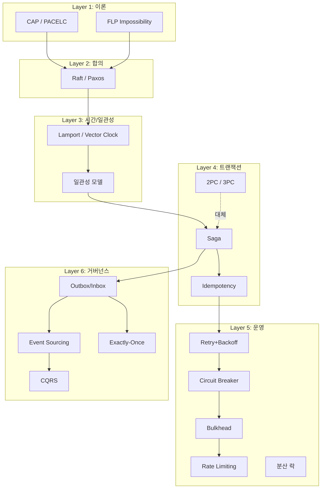

# 분산 시스템 이론 + 패턴 — Preview

> 학습자 수준: advanced (10년차 백엔드, MSA (Microservices Architecture, 마이크로서비스 아키텍처) 운영 경험) · 전체 예상 시간: 18h · 목표: 면접 방어 + msa 코드베이스 진단/개선
> 계획서: [00-plan.md](00-plan.md) · 학습 순서: 이론 → 합의 → 트랜잭션 → 운영 패턴 → 코드 적용

---

## 멘탈 모델: "분산 시스템 6층 케이크"

분산 시스템은 **이론 → 합의 → 시간/일관성 → 트랜잭션 → 운영 패턴 → 거버넌스** 순으로 쌓이는 6층 케이크다.
아래 층이 위 층을 지탱한다. 면접 답변도 항상 "어느 층 이야기인지"를 먼저 박아야 흐트러지지 않는다.

```
  ┌──────────────────────────────────────────────┐
  │  Layer 6: 거버넌스 (Outbox, Event Sourcing)   │
  │   - DB↔Kafka 원자성, Exactly-Once 시도        │
  └────────────────────┬─────────────────────────┘
                       │ "메시지 신뢰성"
  ┌────────────────────┴─────────────────────────┐
  │  Layer 5: 운영 패턴 (CB, Bulkhead, RL, Retry) │
  │   - Resilience4j, Token Bucket, Backoff      │
  └────────────────────┬─────────────────────────┘
                       │ "장애 격리"
  ┌────────────────────┴─────────────────────────┐
  │  Layer 4: 트랜잭션 (2PC, 3PC, Saga, 멱등)     │
  │   - Choreography vs Orchestration            │
  └────────────────────┬─────────────────────────┘
                       │ "결과 합의"
  ┌────────────────────┴─────────────────────────┐
  │  Layer 3: 시간/일관성 (Lamport/Vector Clock)  │
  │   - Strong vs Eventual, Linearizability      │
  └────────────────────┬─────────────────────────┘
                       │ "어떻게 합의?"
  ┌────────────────────┴─────────────────────────┐
  │  Layer 2: 합의 (Paxos / Raft)                │
  │   - leader election, log replication         │
  └────────────────────┬─────────────────────────┘
                       │ "물리 한계"
  ┌────────────────────┴─────────────────────────┐
  │  Layer 1: 이론 (CAP / PACELC / FLP)          │
  │   - 비동기 네트워크, 부분 장애                 │
  └──────────────────────────────────────────────┘
```

**핵심 7문장만 외우자**:
1. 분산 시스템의 본질은 **부분 장애(partial failure)** + **네트워크 비결정성**.
2. CAP (Consistency / Availability / Partition tolerance, 일관성·가용성·분할 내성) 는 **분할 시 C vs A 트레이드오프**, PACELC (Partition → Availability/Consistency, Else → Latency/Consistency) 는 평시에도 **L vs C** 가 있다는 확장.
3. FLP: **비동기 + 1개 노드 장애** 만으로 **결정론적 합의 불가능** → 타임아웃 휴리스틱이 답.
4. Saga 는 ACID 의 **Atomicity 를 포기**하고 **보상 트랜잭션**으로 정합성을 사후 회복하는 패턴.
5. 멱등성은 **at-least-once 메시징의 전제**: 중복은 막을 수 없으니 "중복이 와도 안전"하게 만든다.
6. Circuit Breaker 는 **장애 전파를 끊는 차단기**, Half-Open 은 "완치 확인 한 번"을 위한 허락.
7. Outbox 는 **DB tx 와 Kafka publish 의 원자성**을 한 트랜잭션으로 묶는 표준 해법.

---

## 소주제 지도

> 22개 파일로 분할. 각 파일 평균 약 1h. 학습 순서는 01 → 19 직진 권장.

### Phase 1: 분산 시스템 이론 (5개)

| # | 소주제 | 심화 파일 | 핵심 |
|---|---|---|---|
| 01 | 분산 시스템의 본질 + 8가지 오류 | [01-distributed-fundamentals.md](01-distributed-fundamentals.md) | partial failure, fallacies, 동기 vs 비동기 |
| 02 | CAP / PACELC / FLP | [02-cap-pacelc-flp.md](02-cap-pacelc-flp.md) | CAP 의 오해, PACELC 가 더 정확, FLP 와 휴리스틱 |
| 03 | Strong vs Eventual + 일관성 모델 | [03-consistency-models.md](03-consistency-models.md) | Linearizability, Sequential, Causal, Eventual |
| 04 | Replica 구성 + Quorum | [04-replica-quorum.md](04-replica-quorum.md) | Primary-Replica, Multi-Master, R+W>N |
| 05 | 시계와 순서 (Lamport / Vector / HLC) | [05-clocks-ordering.md](05-clocks-ordering.md) | wall clock 위험, happens-before, MRDT 연결 |

### Phase 2: 합의 + 분산 트랜잭션 + 운영 패턴 (10개)

| # | 소주제 | 심화 파일 | 핵심 |
|---|---|---|---|
| 06 | Paxos 와 Raft | [06-paxos-raft.md](06-paxos-raft.md) | Raft 절차 (election/log/safety), etcd/ZK |
| 07 | 2PC / 3PC | [07-2pc-3pc.md](07-2pc-3pc.md) | blocking, coordinator 장애, 왜 안 쓰나 |
| 08 | Saga: Choreography vs Orchestration | [08-saga-pattern.md](08-saga-pattern.md) | 보상 tx, 추적성/decoupling 트레이드오프 |
| 09 | Idempotency 패턴 | [09-idempotency.md](09-idempotency.md) | Idempotency Key, natural, Inbox, SETNX |
| 10 | Retry + Exponential Backoff + Jitter | [10-retry-backoff.md](10-retry-backoff.md) | retryable 분류, thundering herd 방지 |
| 11 | Circuit Breaker (Resilience4j) | [11-circuit-breaker.md](11-circuit-breaker.md) | Closed/Open/Half-Open, fallback |
| 12 | Bulkhead + Rate Limiting | [12-bulkhead-ratelimit.md](12-bulkhead-ratelimit.md) | thread pool 격리, Token/Leaky/Sliding |
| 13 | 분산 락 (Redis / Redisson / ZK) | [13-distributed-lock.md](13-distributed-lock.md) | RedLock 논쟁, fencing token |
| 14 | Outbox / Inbox / CDC | [14-outbox-inbox-cdc.md](14-outbox-inbox-cdc.md) | DB+Kafka 원자성, Debezium |
| 15 | Event Sourcing + CQRS + Exactly-Once | [15-event-sourcing-cqrs.md](15-event-sourcing-cqrs.md) | 상태=이벤트, command/query 분리, EOS 한계 |

### Phase 3: msa 코드베이스 적용 (3개)

| # | 소주제 | 심화 파일 | 핵심 |
|---|---|---|---|
| 16 | ADR-0011 fulfillment Saga 분석 | [16-codebase-saga.md](16-codebase-saga.md) | 실제 Choreography 흐름, Outbox, 보상 부재 |
| 17 | ADR-0012 멱등 Consumer + ADR-0013 SSOT | [17-codebase-idempotent-ssot.md](17-codebase-idempotent-ssot.md) | processed_event, @Version, write-through |
| 18 | ADR-0015 Resilience + Gateway RL | [18-codebase-resilience.md](18-codebase-resilience.md) | CB 적용처, Token Bucket, Admission Control |

### 산출물 (2개)

| # | 소주제 | 심화 파일 | 핵심 |
|---|---|---|---|
| 19 | 개선 제안 + ADR 후보 | [19-improvements.md](19-improvements.md) | Saga Orchestrator, Inbox, ES 도입 검토 |
| 20 | 면접 Q&A 카드 | [20-interview-qa.md](20-interview-qa.md) | 5 영역 × 8개 = 40 카드 |

---

## 개념 관계도



---

## 면접 컨닝페이퍼 (학습 시작 전 한 장)

### "이 패턴, 언제 쓰는가" 단답

| 질문 | 답 |
|---|---|
| 분산 트랜잭션 | **2PC (Two-Phase Commit, 2단계 커밋) 는 거의 안 씀**. MSA 에선 Saga (장기) 가 표준 |
| Saga 어느 쪽 | 단계 ≤4: Choreography, ≥5 또는 추적 중요: Orchestration |
| 멱등성 보장 | 메시지마다 **eventId** + **DB UNIQUE / processed_event** |
| Retry | **Exponential Backoff + Full Jitter** + idempotent 일 때만 |
| Circuit Breaker | **외부 시스템 동기 호출** + fallback 이 의미 있을 때 |
| 분산 락 | **단일 노드 (Redis)**: 짧은 임계, **ZooKeeper**: 강한 정합 필요 시 |
| 일관성 | **돈/재고 = Strong**, 검색/추천 = Eventual |
| Outbox | **DB 변경 + 이벤트 발행** 을 동시에 보장해야 할 때 거의 항상 |

### 절대 하지 말 것

- 분산 환경에서 `System.currentTimeMillis()` 비교로 순서 결정
- `@Transactional` 안에서 외부 API 호출
- Retry 무한 + jitter 없이 (thundering herd)
- Circuit Breaker 만 끼고 fallback 없이 throw
- Redis SETNX 분산 락 + 펜싱 토큰 없이 임계 자원 보호
- 메시지 producer 만 idempotent 하고 consumer 는 무방비
- Eventual Consistency 시스템에 "즉시 일관" UI

---

## 학습 진행 가이드

- 권장 순서: **01 → 02 → ... → 18 → 19 → 20** (Top-down 직진)
- Phase 1 (01-05) 은 의존성이 강함 → 순서대로
- Phase 2 (06-15) 는 06→07→08→09 라인 (이론→트랜잭션→멱등) 이 핵심, 10-15 는 라이브러리/패턴 카탈로그
- Phase 3 (16-18) 은 msa 코드 직접 grep 하면서 따라갈 것 — 실무 자산화
- **20-interview-qa.md** 는 회독용 — 학습 종료 후 1주일 간격으로 2-3회

---

## 직전 학습 토픽과의 교차점

- **#14 CRDT/MRDT**: Layer 3 의 일관성 모델 / Vector Clock 이 CRDT 의 토대. 협업/오프라인 동기화 가 필요하면 14번 다시 펼치기.
- **#16 Async/IO**: Layer 5 의 Bulkhead / Backpressure / non-blocking 이 본 토픽 운영 패턴과 직접 연결. order-service 가 webflux + suspend 로 통합한 것이 그 결과.
- **#13 Crypto/JWT**: Saga 의 멱등 키 전송 / mTLS (mutual TLS, 양방향 TLS) 로 서비스 간 신뢰 + jti 로 token replay 방어 가 본 토픽 멱등성 의 변형.

각 파일 호출:
```
/study:start 7              # 다음 deep file 자동 선택
/study:start 7 06           # 06-paxos-raft.md 직접 지정
```
