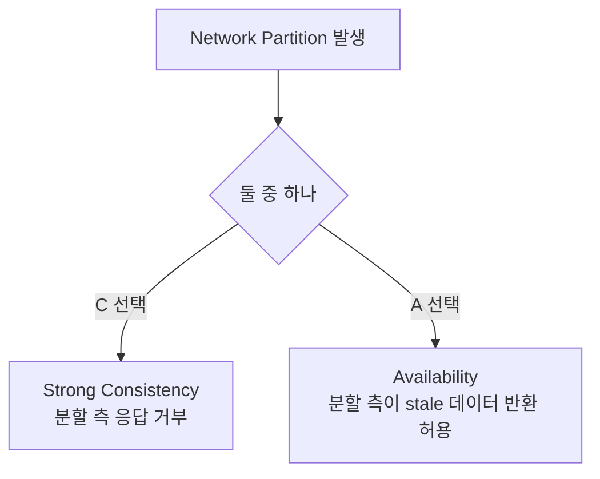

# 02. CAP / PACELC / FLP — 면접 단골 3종

> "CAP 에서 뭘 버리셨어요?" 는 함정 질문이다. **CAP 는 분할 시점에만 적용** 되고, **평시엔 PACELC (Partition → Availability/Consistency, Else → Latency/Consistency) 의 L vs C** 가 더 본질이다.

## 1. CAP Theorem (Eric Brewer, 2000)

CAP (Consistency / Availability / Partition tolerance, 일관성·가용성·분할 내성) 는 분산 시스템이 동시에 만족할 수 없는 3개 속성:

| 속성 | 의미 |
|---|---|
| **C** Consistency | 모든 노드가 같은 시점에 같은 데이터를 본다 (linearizability) |
| **A** Availability | 살아있는 모든 노드가 모든 요청에 (timeout 없이) 응답한다 |
| **P** Partition tolerance | 네트워크 분할이 일어나도 시스템이 계속 동작한다 |



### 흔한 오해 3가지

1. **"우리는 AP 시스템입니다"** — 평시엔 CA 처럼 동작하고, 분할 시점에만 A 를 우선한다. CAP 는 **"분할이 일어났을 때 C 와 A 중 하나"** 다.
2. **"P 는 선택할 수 있다"** — 못 한다. 네트워크 분할은 발생할 수밖에 없는 자연재해. **선택지는 P 가 일어났을 때 C/A 중 무엇** 이다.
3. **"CA 시스템도 있다"** — 단일 노드 RDBMS 는 CA 처럼 보이지만 분산 시스템이 아니다. CAP 의 대상이 아님.

### CAP 분류 사례

| 시스템 | 분류 | 이유 |
|---|---|---|
| ZooKeeper, etcd | CP | 분할 시 minority 측은 응답 거부 (read 도 leader 통해야 함) |
| Cassandra (default) | AP | 모든 replica 가 응답 가능, eventual consistency |
| MongoDB (writeConcern majority) | CP | majority ack 못 받으면 write 실패 |
| DynamoDB (eventual read) | AP | 읽기 시 stale 가능, 더 싸고 빠름 |
| MySQL Group Replication | CP | quorum 기반 |

## 2. PACELC (Daniel Abadi, 2010)

CAP 의 한계: **분할이 없는 평시** 에 대해 아무 말 안 함. 그런데 실제 시스템은 평시에도 **latency vs consistency** 트레이드오프가 있다.

> **If P, then A or C; Else L or C**
> (Partition 시: A 또는 C / 평시: Latency 또는 Consistency)

### 실제 시스템 PACELC 표 (DDIA 인용)

| 시스템 | P 시 | E 시 | 한 줄 |
|---|---|---|---|
| DynamoDB, Cassandra | PA | EL | 항상 가용성 + 저지연 우선 |
| MongoDB | PC | EC | 일관성 우선 (writeConcern majority) |
| Spanner | PC | EC | TrueTime 으로 강일관성 + 글로벌 |
| CockroachDB | PC | EC | Spanner 류 |
| MySQL async replication | PA | EL | replica 는 stale 허용 |
| MySQL semi-sync | PA | EC | master 가 적어도 1개 replica ack 대기 |

### "왜 PACELC 가 더 정확한가" — 면접 답변 템플릿

1. CAP 는 **분할 시점** 만 다룸 → 1년 중 99.99% 평시는 미정의
2. 평시에도 strong consistency 를 위해 **모든 read 를 leader 로** 보내거나 **majority quorum** 을 거치면 latency 가 올라감
3. 평시 latency 를 줄이려면 stale read 를 허용해야 함 (eventual)
4. → 따라서 시스템 선택은 **"P 시 + 평시"** 두 축으로 봐야 함

## 3. FLP Impossibility (Fischer-Lynch-Paterson, 1985)

> 비동기 (asynchronous) 분산 시스템에서, **단 1개 노드의 crash failure** 가 가능하다면, **결정론적 합의 (deterministic consensus) 알고리즘은 존재하지 않는다**.

### 직관

- 비동기 = 메시지 지연 상한 없음
- 받지 못한 메시지가 "지연 중인지 / 노드가 죽은건지" **구별 불가능**
- → 무한히 기다리거나 (liveness 위반), 잘못된 결정 (safety 위반) 이 발생

### FLP 가 의미하는 것

- **"합의는 영원히 못 한다"** 가 아니라 **"항상 끝나는 것을 보장하는 결정론적 알고리즘은 없다"**
- 실제 시스템 (Raft, Paxos) 은:
  - **Partially synchronous** 가정 추가 (평소엔 동기)
  - **Timeout 휴리스틱** 사용 (= 무작위성 도입, 결정론 깨짐)
  - **Liveness 를 확률적으로** 보장 (대부분의 경우 진행됨)

### Raft 의 우회 방법

```
1. 평소엔 leader 가 heartbeat 보냄
2. follower 는 election timeout (150-300ms 무작위) 안에 안 오면 candidate 됨
3. 무작위 timeout 으로 split vote 확률 ↓
4. majority quorum 이면 leader 확정
```

→ "무작위 timeout" 이 FLP 의 결정론을 깨는 트릭. 100% liveness 보장은 아님 (이론적으로 영원히 split vote 가능, 확률은 0 으로 수렴).

## 4. 면접 5문답 (자주 나오는 패턴)

### Q1. "CAP 에서 무엇을 선택하셨나요?"

**잘못된 답**: "AP 입니다" / "CP 입니다"
**좋은 답**:
> "CAP 는 분할 시점에만 적용되는 트레이드오프입니다. 저희 msa 의 경우 도메인별로 다릅니다.
> - **재고 (inventory)**: PC 모드 — Optimistic Lock 으로 강일관성 우선, 분할 시 양쪽 모두 write 거부 가능 (DB master 1개)
> - **상품 검색 (search)**: PA + EL — Elasticsearch 인덱싱 지연 허용, eventual consistency
> - **주문 → 결제**: 동기 호출 + Circuit Breaker — 분할 시 즉시 실패로 사용자에게 알림 (graceful degradation)"

### Q2. "Eventual Consistency 를 실무에서 어떻게 다루나요?"

```
1. 도메인 분리: 돈/재고는 strong, 검색/추천은 eventual
2. 사용자 UI: "처리 중" 상태로 일시적 불일치 흡수
3. Read-your-own-writes: 본인 write 후엔 master 에서 read (sticky)
4. 모니터링: replica lag, kafka consumer lag SLI (Service Level Indicator, 서비스 수준 지표)
5. Reconciliation: 주기적 정합성 검증 배치 (msa 의 InventoryReconciliationService 처럼)
```

### Q3. "FLP 가 실무에 어떤 영향을 주나요?"

> "FLP 는 'timeout 없이는 안전하게 합의 못 한다' 를 알려줍니다. 따라서 실무에서:
> 1. 모든 분산 통신엔 **timeout 필수** (서버는 무한 대기 금지)
> 2. timeout 은 **실패가 아니라 unknown** 으로 취급 → 멱등 + retry
> 3. 합의 시스템 (Kafka controller, etcd, ZK) 도 timeout 휴리스틱 기반이라 **session expire / split brain** 에 대한 이해 필요"

### Q4. "PACELC 의 EL vs EC 가 뭔가요?"

> "평시 (Else) 에 latency 를 우선하면 EL, consistency 를 우선하면 EC. DynamoDB 는 EL (eventual read 가 더 빠름), Spanner 는 EC (TrueTime 으로 글로벌 strong)."

### Q5. "분할 (Partition) 이 일어났는지는 어떻게 알 수 있나요?"

> "**알 수 없습니다**. 분할과 단순 지연은 노드 입장에서 구별 불가능 (이게 FLP 의 본질). 그래서 timeout 을 임계로 사용 + heartbeat 로 추정."

## 5. msa 프로젝트 분류

| 도메인 | PACELC | 근거 |
|---|---|---|
| inventory (재고) | PC + EC | DB master 단일, Optimistic Lock, 강일관성 |
| order (주문) | PC + EC | DB master 단일, 결제는 동기 + CB |
| search (검색) | PA + EL | ES eventual indexing, Kafka consumer 비동기 |
| product (상품) | PA + EL | Kafka consumer 로 stock 동기화 (ADR (Architecture Decision Record, 아키텍처 결정 기록)-0013), eventual |
| analytics | PA + EL | ClickHouse, 대량 적재 우선 |
| auth | PC + EC | RBAC (Role-Based Access Control, 역할 기반 접근 제어) 정합성 우선, 토큰 검증은 stateless |

## 6. 자주 틀리는 코너 케이스

- **"Strong consistency 면 빠르다"** — 거짓. **항상 더 느림** (quorum / leader read 비용)
- **"Eventual = 결국엔 일치한다"** — 맞지만 **언제** 가 보장 안 됨. 보통 ms~s, 장애 시 분 단위
- **"Cassandra 는 AP 니까 항상 AP"** — `consistency level` 옵션으로 quorum read/write 선택 시 CP 같이 동작 가능. **튜너블 일관성**
- **"P 가 안 일어나면 C+A 둘 다 가능"** — CAP 는 P 가정. 평시엔 PACELC 의 EL/EC 가 적용

## 7. 한 줄 요약

> CAP 는 **분할 시 C/A**, PACELC 는 **평시 + 분할** 양쪽, FLP 는 **비동기에서 결정론적 합의 불가**.
> 따라서 실제 시스템은 **partially synchronous + timeout 휴리스틱 + 도메인별 일관성 분리** 로 답한다.
