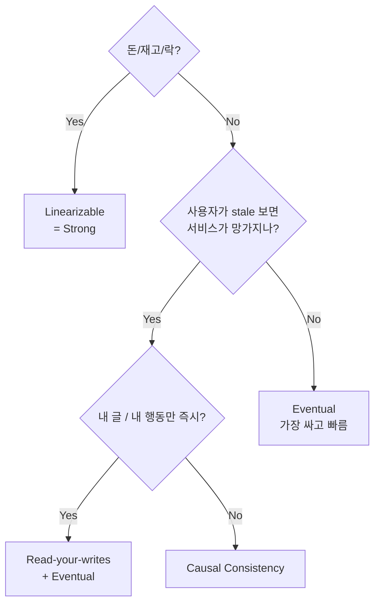

# 03. 일관성 모델 — Strong/Linearizable 부터 Eventual 까지

> "Strong consistency" 는 한 단어가 아니다. 최소 6단계 스펙트럼이 있고, 각각 latency 비용이 다르다.

## 1. 일관성 모델 스펙트럼

위에서 아래로 갈수록 **약함 (=빠름, 가용성 ↑)**.

```
┌─────────────────────────────────────────┐ ↑ 강함
│ Linearizability (Strong)                │ │ 비쌈
├─────────────────────────────────────────┤ │
│ Sequential Consistency                  │ │
├─────────────────────────────────────────┤ │
│ Causal Consistency                      │ │
├─────────────────────────────────────────┤ │
│ Read-your-writes / Monotonic Reads      │ │
├─────────────────────────────────────────┤ │
│ Eventual Consistency                    │ │ 가용성 ↑
└─────────────────────────────────────────┘ ↓ 약함
```

## 2. Linearizability (Strong, "Atomic")

**정의**: 모든 연산이 **단일 원자적 순간** 에 발생한 것처럼 보이고, 그 순서가 **실제 wall-clock 시간 순서** 를 따름.

```
A 가 12:00:00.000 에 write(x=1) 완료
B 가 12:00:00.001 에 read(x) → 반드시 1 이 보여야 함
```

- **단일 노드 RDBMS** 가 자연히 linearizable (단일 mutex 로 실현)
- 분산에선 비쌈: Spanner (TrueTime), 분산 DB 의 single-leader synchronous, ZooKeeper write
- **read 도** linearizable 이려면 leader 통과 필요 (Raft 의 ReadIndex / quorum read)

**비용**:
- write: leader → quorum ack
- read: leader 또는 quorum read
- 평시 latency 가 비-strong 보다 **수배~수십 배** 비쌈

**언제 필요한가**:
- 돈, 재고, 분산 락의 lock acquire/release
- 사용자가 "바로 직전 본 값과 다르면 버그" 라고 느끼는 모든 곳

## 3. Sequential Consistency (Lamport, 1979)

**정의**: 모든 노드가 **같은 순서** 로 연산을 보지만, 그 순서가 wall-clock 과 **일치할 필요는 없음**.

- linearizable 보다 약함 — global order 만 있으면 됨
- 멀티코어 CPU 의 메모리 모델에서 자주 등장
- 분산 DB 에선 거의 안 씀 (사람이 직관적으로 이해 못 함)

## 4. Causal Consistency

**정의**: **인과관계 (happens-before)** 가 있는 연산만 순서가 보장됨. 인과 없는 연산은 노드마다 다른 순서로 봐도 OK.

```
A: post("점심 뭐 먹지?") → 댓글 B: "김치찌개"
→ 모든 사용자가 "댓글이 post 후에" 보임 (인과 보장)

C: post("저녁 뭐 먹지?") (A 와 인과 없음)
→ A 와 C 의 순서는 사용자마다 달라도 OK
```

- 분산 시스템에서 **현실적인 최강 일관성** 으로 평가됨
- Vector Clock / DAG 로 구현 (CRDT/MRDT 와 직결)
- COPS, Causal+, Bayou

## 5. Session Guarantees (사용자 관점 4종)

| 보장 | 의미 | 예 |
|---|---|---|
| **Read-your-writes** | 내가 쓴 건 내가 즉시 읽을 수 있어야 함 | 글 쓴 직후 새로고침 시 안 보이면 버그 |
| **Monotonic Reads** | 내 읽기는 시간이 거꾸로 가지 않음 | 댓글 봤다가 새로고침 했더니 사라지면 안 됨 |
| **Monotonic Writes** | 내 쓰기들의 순서는 보존됨 | 1번 글 → 2번 글 순서 |
| **Writes Follow Reads** | 내가 읽은 값을 보고 쓴 결과는 그 후에만 보임 | 댓글 보고 답글 달았으면, 답글이 댓글 뒤에 |

이 4가지는 **eventual + session sticky** 로 보통 구현. 사용자 ID 를 hash 해서 같은 replica 에 라우팅.

## 6. Eventual Consistency

**정의**: 새 write 가 없으면 **결국 모든 replica 가 같아짐**. **언제** 는 보장 안 함.

```kotlin
// msa 의 ADR-0013: Inventory → Product stock 동기화
// inventory 가 stock 변경 → Kafka StockReserved → product 가 consume → product.stock 갱신
// 그 사이 Product API 호출하면 stale 한 stock 값 보임 (수십 ms ~ 수 초)
```

**현실 적용**:
- Kafka consumer 기반 데이터 동기화 (msa 의 search, product)
- DNS, CDN
- DynamoDB default read
- Cassandra default read

**무엇이 흔드는가**:
- consumer lag (Kafka 처리 지연)
- network partition (분리된 replica 끼리 sync 못 함)
- 노드 다운 후 catch-up

## 7. 일관성과 latency 의 진짜 비용

```
Linearizable read (Spanner): 5-10ms (TrueTime + quorum)
Causal read: 1-3ms (Vector Clock check)
Eventual read (local replica): <1ms
```

**메가 트래픽 시스템** (예: Netflix, Amazon, 카카오) 은 80% 이상의 read 를 eventual 로 처리. strong 은 결제/재고 같은 critical path 에만.

## 8. msa 도메인별 일관성 매핑

| 도메인 | 모델 | 구현 |
|---|---|---|
| **inventory.available_qty** (예약) | Linearizable | DB master single + Optimistic Lock (`@Version`) |
| **product.stock** (캐시) | Eventual | Kafka consumer 로 동기화 |
| **product 카탈로그 정보** | Read-your-writes | seller 가 등록 후 자기 화면엔 즉시 보임 (master read) |
| **search 인덱스** | Eventual | ES bulk indexing, indexing lag 수 초 허용 |
| **auth.role** | Linearizable | RBAC (Role-Based Access Control, 역할 기반 접근 제어) 정합성 절대 |
| **wishlist** | Causal+ | 추가/삭제 순서만 보존되면 OK |
| **analytics 지표** | Eventual | ClickHouse, 분 단위 집계 OK |

## 9. 일관성 모델 결정 트리 (실무용)



## 10. 구현 관용구

### 10.1 Read-your-writes — Sticky read

```kotlin
// 사용자 본인의 write 직후 read 는 master 로
@Service
class StickyReadService(
    private val masterRepo: MasterRepo,
    private val replicaRepo: ReplicaRepo,
    private val redis: StringRedisTemplate,
) {
    private val STICKY_WINDOW_SEC = 5L

    fun markWrite(userId: Long) {
        redis.opsForValue().set("sticky:$userId", "1", Duration.ofSeconds(STICKY_WINDOW_SEC))
    }

    fun read(userId: Long, key: String): String? =
        if (redis.hasKey("sticky:$userId")) masterRepo.find(key)
        else replicaRepo.find(key)
}
```

### 10.2 Causal — Vector Clock check

(상세는 05-clocks-ordering / 14번 CRDT 참조)

### 10.3 Eventual — Reconciliation

msa 의 `InventoryReconciliationService` 가 정확히 이 패턴:

```kotlin
@Scheduled(fixedDelayString = "\${inventory.reconciliation.interval-ms:300000}")
fun reconcile() {
    // Redis 캐시와 DB 가 어긋났는지 검사 → 어긋났으면 DB 기준으로 재동기화
    for (inventory in inventoryRepository.findAll()) {
        val cached = cachePort.getStock(inventory.productId, inventory.warehouseId)
        if (cached != null && cached.availableQty != inventory.getAvailableQty()) {
            cachePort.setStock(...)  // DB → cache 정합성 회복
        }
    }
}
```

→ Eventual consistency 에서 **divergence 가 누적되지 않도록** 주기 정합성 회복이 필수.

## 11. CAP / Linearizability 의 미묘한 차이

- CAP (Consistency / Availability / Partition tolerance, 일관성·가용성·분할 내성) 의 C 는 정확히 **linearizability**
- 그러나 많은 사람들이 "strong consistency = ACID (Atomicity / Consistency / Isolation / Durability, 원자성·일관성·격리성·내구성)" 로 오해 → ACID 의 C 는 **integrity constraint** (referential integrity 등) 로 다른 의미
- 면접에서 CAP 의 C 를 **"linearizable"** 이라고 못박으면 점수가 나옴

## 12. 한 줄 요약

> 일관성은 **단일 강도가 아니라 스펙트럼**. 도메인마다 알맞은 강도를 고르는 게 분산 설계자의 본업.
> 돈/재고는 **linearizable**, 검색/캐시는 **eventual**, 사용자 행동은 **causal+RYW** 가 표준.
