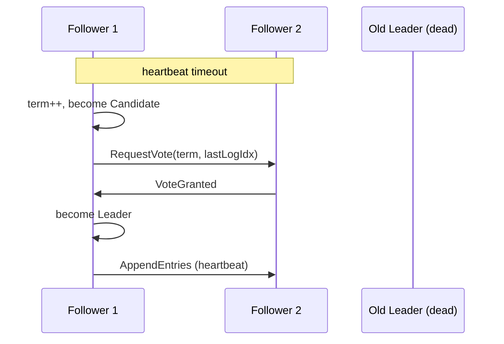

# 06. Paxos 와 Raft — 합의 알고리즘

> Paxos 는 "정확하지만 이해 못 함", Raft 는 "이해할 수 있는 Paxos". 면접에선 **Raft 를 설명할 수 있는지** 가 차별점.

## 1. 합의 (Consensus) 문제 정의

여러 노드가 **단 하나의 값** 에 동의하는 문제. 다음을 만족해야 함:

| 속성 | 의미 |
|---|---|
| Validity | 결정된 값은 어떤 노드가 제안한 값이어야 함 |
| Agreement | 모든 정상 노드는 같은 값을 결정 |
| Termination | 모든 정상 노드는 결국 결정에 도달 (liveness) |
| Integrity | 노드는 한 번만 결정 |

FLP 로 인해 비동기에선 **Termination 이 보장 안 됨**. 실제 시스템은 partially-sync + timeout 으로 우회.

## 2. Paxos (Lamport, 1989/1998)

> 보트가 의사 결정하는 그리스 의회 비유로 발표된 논문. 정확하지만 너무 추상적.

### 2.1 역할

| 역할 | 책임 |
|---|---|
| Proposer | 값을 제안 |
| Acceptor | 제안에 투표 |
| Learner | 결정된 값을 학습 |

### 2.2 2 phases

```
Phase 1 (Prepare):
  Proposer → Acceptors: PREPARE(n)
  Acceptor: n > 자기가 본 모든 번호 면 PROMISE(n, prev_accepted)

Phase 2 (Accept):
  Proposer 가 majority promise 받으면 → ACCEPT(n, value)
  Acceptor: PROMISE 한 n 보다 큰 ACCEPT 면 수락
```

majority 가 ACCEPT 한 값 → 결정됨.

### 2.3 왜 어려운가

- **single value** 만 결정. 여러 값을 결정하려면 Multi-Paxos (복잡)
- **leader election 이 명시되지 않음** (proposer 가 동시에 여러 명이면 dueling proposers → liveness 문제)
- 논문이 비유에 의존, 실제 구현 가이드 부족

→ Lamport 는 후속 논문 ("Paxos Made Simple") 으로 다시 설명. 그래도 안 풀려서 Raft 등장.

## 3. Raft (Ongaro & Ousterhout, 2014)

> "In Search of an Understandable Consensus Algorithm" — Paxos 와 동등한 안전성, 하지만 이해 가능하게.

핵심 분리:
1. **Leader Election** (누가 leader 가 될 것인가)
2. **Log Replication** (leader 가 follower 에 로그 복제)
3. **Safety** (commit 된 로그는 절대 잃어버리지 않음)

### 3.1 노드 상태

```
Follower → (timeout) → Candidate → (majority votes) → Leader
                          ↑                                ↓
                          └────────── (heartbeat) ─────────┘
```

### 3.2 Leader Election

```
1. Follower 가 election timeout (150-300ms 무작위) 안에 leader heartbeat 못 받음
2. Follower → Candidate, term + 1, 자기 자신에게 vote
3. RequestVote RPC 를 다른 노드에 보냄
4. Majority (> N/2) vote 받으면 → Leader
5. Leader 가 heartbeat (AppendEntries with empty entries) 시작
```

**무작위 timeout** 이 핵심: split vote (여러 candidate 동시 등장) 확률 ↓.



### 3.3 Log Replication

각 노드는 log 가짐: `[(term, command), ...]`.

```
Client → Leader: command
Leader: log 에 append (uncommitted)
Leader → Followers: AppendEntries(prevLogIdx, prevLogTerm, entries)
Follower: prevLogIdx,Term 일치 확인 후 append
Leader: majority ack 받으면 → commit
Leader: 다음 AppendEntries 에 commitIndex 포함하여 follower 에 commit 알림
Follower: commitIndex 까지 state machine 에 apply
```

### 3.4 Safety 규칙 (가장 중요)

#### Election Restriction

candidate 가 leader 되려면 **자기 log 가 majority 보다 적어도 같이 최신** 이어야 함:

```
candidate.lastLogTerm > voter.lastLogTerm
OR
(candidate.lastLogTerm == voter.lastLogTerm AND candidate.lastLogIdx >= voter.lastLogIdx)
```

→ 이로써 commit 된 entry 는 모든 미래 leader 에게 반드시 있음.

#### Log Matching Property

```
두 log 의 (idx, term) 이 같으면, 그 이전의 모든 entry 도 같다.
```

→ AppendEntries 가 prevLogIdx, prevLogTerm 으로 일치 검사. 안 맞으면 follower 가 거부 → leader 가 한 칸 뒤로.

#### Leader Append-Only

leader 는 자기 log 를 절대 덮어쓰지 않음. 새 leader 가 옛 leader 의 commit 안 된 entry 를 덮어쓸 수는 있음 (term 이 커서).

### 3.5 Term — 논리적 시계

각 leader 는 새 term 으로 시작. term 은 단조 증가. 노드는 자기보다 큰 term 을 보면 즉시 follower 로 step-down.

→ split-brain 방지: 옛 leader 가 부활해도 새 term 을 보고 항복.

### 3.6 Snapshot

log 가 무한히 커질 수 없으니, 주기적으로 state machine 을 snapshot 하고 그 이전 log 삭제. 새 follower 추가 시 snapshot 부터 받음.

## 4. Raft 의 안전성 증명 핵심

```
Leader Completeness Property:
  특정 term 에서 commit 된 log entry 는, 그보다 큰 term 의 모든 leader 에 존재.

증명 핵심:
  - commit = majority ack
  - 새 leader 는 majority vote 필요 + Election Restriction
  - 두 majority 는 반드시 1개 노드에서 겹침 (pigeonhole)
  - 그 겹친 노드가 commit 된 entry 를 가짐
  - 그 노드가 vote 한 후보는 자기 log 가 더 최신 → commit 된 entry 를 가짐
```

## 5. Raft vs Paxos 비교

| 항목 | Paxos | Raft |
|---|---|---|
| 이해도 | 어려움 | 명확 |
| Leader | 암묵적 (Multi-Paxos) | 명시적, 강한 leader |
| 로그 흐름 | 양방향 가능 | leader → follower 단방향 |
| Membership 변경 | 어려움 | joint consensus 명시 |
| 구현 사례 | Google Chubby, Zab (변형) | etcd, Consul, RethinkDB, TiKV |

**실제 시스템**:
- **etcd, Consul**: Raft 직접 구현
- **ZooKeeper**: ZAB (Zookeeper Atomic Broadcast) — Paxos 변형, 사실상 Raft 와 유사
- **Google Spanner**: Paxos 기반 (Multi-Paxos)
- **Kafka KRaft**: Raft 로 ZooKeeper 대체 (Kafka 3.x+)

## 6. 합의 시스템의 한계

### 6.1 성능

- 모든 write 가 majority quorum 거침 → latency 비쌈 (수 ms ~ 수십 ms)
- throughput 도 leader bottleneck

→ 합의 시스템은 **메타데이터** (configuration, lock, leader election) 에 사용. 실제 데이터는 별도.

### 6.2 클러스터 크기

- 5노드 (2대 장애 허용) 가 sweet spot
- 7노드 이상은 latency 가 오히려 더 느려짐 (majority = 4)

### 6.3 Liveness

- 50% 이상 노드 살아있어야 진행
- network partition 으로 minority 측은 응답 불가 (CP)

## 7. msa 프로젝트와 합의

### 7.1 직접 사용처

msa 는 합의 알고리즘을 **직접 구현하지 않음**. 그러나 다음 인프라가 내부적으로 Raft/ZAB 사용:

| 컴포넌트 | 합의 알고리즘 |
|---|---|
| Kafka (Zookeeper) | ZAB |
| Kafka (KRaft mode) | Raft |
| etcd (k8s control plane) | Raft |
| Redis Sentinel | Raft 변형 (failover 결정) |
| MySQL Group Replication | Paxos 변형 |

### 7.2 간접 영향

- **Kafka topic 의 leader election**: ISR 기반, controller 가 결정 (controller 자체는 Raft)
- **k8s leader election**: etcd 의 lease + Raft
- **분산 락 / 잠금 서비스**: Redis 단일 master (강한 합의 X), ZK / etcd (Raft) 사용 가능

## 8. 면접 5문답

### Q1. "Raft 의 leader election 을 설명해주세요"

> "Follower 가 election timeout (보통 150-300ms 무작위) 안에 leader heartbeat 를 못 받으면 candidate 로 전환. term 을 1 증가시키고 자기에게 투표 후, RequestVote RPC 를 모든 노드에 보냅니다. majority 의 vote 를 받으면 leader 가 되어 heartbeat 시작. 무작위 timeout 으로 split vote 확률을 낮추는 게 핵심."

### Q2. "Raft 가 어떻게 split-brain 을 방지하나요?"

> "두 가지 메커니즘. (1) majority quorum: leader 가 되려면 majority vote 필요 → 두 leader 가 동시에 majority 받는 건 불가능. (2) term 단조 증가: 옛 leader 가 부활해도 자기보다 큰 term 을 보면 자동 step-down."

### Q3. "Raft 는 왜 5노드가 표준인가요?"

> "majority = 3 → 2 노드 장애 허용. 7노드면 majority = 4 라 latency 만 늘고 안전성 향상은 미미. 3노드는 1 노드 장애만 허용해서 부족."

### Q4. "Paxos 와 Raft 의 차이는?"

> "Paxos 는 일반화된 합의, Raft 는 강한 leader 를 명시적으로 도입한 단순화 버전. Raft 가 leader 와 log replication 흐름을 명확히 분리해서 이해와 구현이 쉬움. 안전성은 동등."

### Q5. "FLP 가 합의 시스템에 어떻게 영향을 주나요?"

> "FLP 는 비동기에서 결정론적 합의 불가능을 증명. Raft 는 partially-synchronous 가정 + 무작위 timeout 으로 우회. 100% liveness 는 보장 못 하지만 (이론적으로 영원히 split vote 가능), 실용적으로는 거의 항상 진행."

## 9. 한 줄 요약

> Raft 는 **Leader Election + Log Replication + Safety** 3개 메커니즘으로 합의를 푼다.
> majority quorum + term + log matching 이 안전성의 핵심. msa 는 직접 안 짜지만 Kafka/etcd/Redis Sentinel 이 모두 이걸 쓴다.

## 10. 더 읽기

- Diego Ongaro, "In Search of an Understandable Consensus Algorithm" (USENIX 2014)
- https://raft.github.io/ — 시각화 + 인터랙티브
- Lamport, "The Part-Time Parliament" (1998) — 원조 Paxos
- "Designing Data-Intensive Applications" Ch.9 (Consistency and Consensus)
