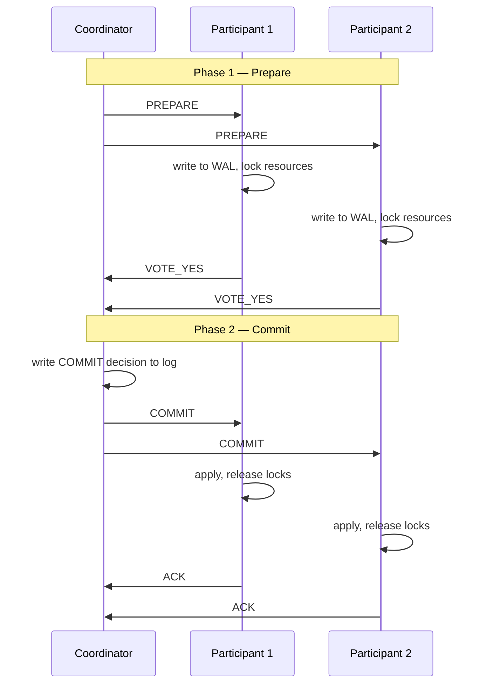

# 07. 2PC / 3PC — 전통 분산 트랜잭션과 그 한계

> 2PC (Two-Phase Commit, 2단계 커밋) 는 면접에서 "왜 안 쓰나" 를 묻는 패턴 질문. 답은 **blocking + coordinator SPoF + 성능** 세 가지.

## 1. 2PC (Two-Phase Commit)

### 1.1 역할

- **Coordinator** (= Transaction Manager): 트랜잭션 조정자
- **Participants** (= Resource Manager): DB, MQ 등 자원 관리자

### 1.2 절차



### 1.3 핵심 성질

- 모든 participant 가 YES 면 commit, 한 명이라도 NO/timeout 이면 abort
- coordinator 가 결정을 **로그에 쓴 후** 만 그 결정 유효 (durable decision)
- participant 는 PREPARE 후 결정 받기 전까지 **잠금 보유 + 결정 대기**

## 2. 2PC 가 왜 문제인가 — 4대 죄목

### 2.1 Blocking (가장 심각)

```
Participant 가 PREPARE 후 VOTE_YES 보냄
→ coordinator 가 죽음 (또는 네트워크 단절)
→ Participant 는 결정 받기 전까지 잠금 못 풀고 영원히 대기
→ 이 자원에 접근하려는 다른 트랜잭션도 줄줄이 대기
```

이게 분산 시스템에서 **가장 큰 운영 사고** 를 일으킨다. DB 의 lock 이 길어지면 connection pool 고갈 → 서비스 전체 다운.

### 2.2 Coordinator SPoF

coordinator 가 죽으면 **결정 진행 불가능**. 별도 합의 (Raft) 로 coordinator 를 HA 화 가능하지만 복잡도 폭발.

### 2.3 Heuristic Decisions (운영 지옥)

participant 가 너무 오래 기다리면 운영자가 강제로 commit/abort 결정 → 다른 participant 와 **불일치 발생** → 사후 수동 보정 필요. JTA / XA 트랜잭션 관리자에서 흔한 사고.

### 2.4 성능

- write latency = 모든 participant 의 PREPARE 응답 + COMMIT 라운드
- AZ (Availability Zone, 가용 영역) 간 통신이라면 수십 ms × 2 round = 100ms+
- 잠금 보유 시간이 그만큼 길어 → 동시성 처참

## 3. 2PC 와 ACID

```
A: 2PC 가 보장 (모두 commit 또는 모두 abort)
C: 각 DB 의 제약조건은 보장. 하지만 distributed integrity 는 별개
I: 잠금 기반이라 보장. 하지만 잠금 시간 길어서 throughput ↓
D: WAL 로 보장
```

→ 명목상 분산 ACID (Atomicity / Consistency / Isolation / Durability, 원자성·일관성·격리성·내구성). 그러나 비용이 너무 큼.

## 4. XA / JTA — 자바 진영의 2PC 표준

```kotlin
// XA-aware DataSource 사용 시
@Transactional  // JTA TransactionManager 가 2PC 조정
fun transferAndOrder(from: Long, to: Long, amount: BigDecimal) {
    bankDataSource.transfer(from, to, amount)
    orderDataSource.placeOrder(...)
    kafkaXaSession.send(...)
    // commit 시점에 모든 participant 에 PREPARE → COMMIT
}
```

**현실**:
- 운영 복잡도 (XA driver, transaction manager, recovery log)
- DBA 가 싫어함 (XA 잠금 보유 시간)
- 클라우드 매니지드 DB 는 XA 미지원 많음
- → **MSA (Microservices Architecture, 마이크로서비스 아키텍처) 에선 거의 사용 안 함**. msa 프로젝트에서도 사용 안 함.

## 5. 3PC (Three-Phase Commit)

2PC 의 blocking 을 줄이려는 시도. Phase 추가:

```
Phase 1: CanCommit?  (각자 가능 여부만 확인, 잠금 X)
Phase 2: PreCommit   (모두 가능하면 잠금 + 준비)
Phase 3: DoCommit    (실제 commit)
```

### 5.1 개선 의도

- Phase 1 에서 "누가 못 하면" 일찍 abort → 잠금 안 잡힘
- Phase 2 (PreCommit) 후 coordinator 죽어도, participant 끼리 **같은 PreCommit 상태** 면 자체 commit 가능

### 5.2 왜 실패했나

- **Network partition 에 취약**: partition 양측이 서로 다른 결정
- 이론적으론 비동기 모델에 적용 불가 (FLP 우회 못 함)
- 추가 라운드로 latency 더 커짐
- → **사실상 사용 안 됨**. 학술적 의의만.

## 6. 2PC 의 부활: TCC (Try-Confirm-Cancel)

```
Try:    각 서비스가 자원 예약 (e.g., 재고 hold, 결제 hold)
Confirm: 모두 OK 면 실제 차감
Cancel:  하나라도 실패하면 hold 풀기
```

- 잠금 대신 **명시적 hold** → 잠금 시간 짧음
- application-level 에서 구현 (DB 잠금 X)
- 중국 알리바바 Seata 가 대표적
- **Saga 와 유사** 하지만 더 동기적

msa 의 inventory 가 사실상 TCC 의 Try (reserve) 흉내. 다만 confirm/cancel 은 비동기 이벤트로 처리 (Saga 형).

## 7. 왜 MSA 는 2PC 를 안 쓰는가 — 한 문장 답

> "분산 트랜잭션의 잠금 보유 시간이 길어 throughput 을 죽이고, coordinator 장애 시 blocking 이 발생하며, 매니지드 DB 가 XA 를 지원 안 하는 경우가 많아, MSA 에선 **Saga + 보상 트랜잭션 + 멱등성** 으로 대체합니다."

## 8. 2PC vs Saga 비교

| 항목 | 2PC | Saga |
|---|---|---|
| 원자성 | 강한 ACID | **포기**, 보상으로 사후 회복 |
| 잠금 | 분산 잠금 (수 초 ~ 수 분) | 짧은 로컬 잠금만 |
| 구현 복잡도 | 낮음 (트랜잭션 매니저 사용) | 높음 (보상 흐름 직접 짜야) |
| 실패 시나리오 | blocking | eventual consistency, 보상 실행 |
| 통신 모델 | 동기 | 비동기 (이벤트) 가능 |
| MSA 적합성 | ✗ | ✓ |
| 추적성 | 한 트랜잭션 | 여러 이벤트로 산재 |

## 9. 2PC 가 살아있는 곳

| 영역 | 사용 |
|---|---|
| 단일 DB 안 | RDBMS 의 정상 트랜잭션 (사실상 1PC) |
| 같은 클러스터 분산 DB | TiDB, CockroachDB (내부 2PC + Raft) |
| 메시지 큐 + DB | Kafka transactional producer + DB (제한적) |
| 결제 게이트웨이 | TCC 패턴 (Try-Confirm-Cancel) 의 변형 |

→ **분산 DB 내부** 에선 여전히 2PC 가 정밀하게 사용. 단, 사용자 코드에서 직접 다루진 않음.

## 10. 면접 6문답

### Q1. "분산 트랜잭션을 어떻게 처리하시나요?"

> "MSA 환경이라 2PC 는 사용하지 않습니다. 도메인 경계에 따라:
> - **같은 서비스 내**: 단일 DB 트랜잭션
> - **서비스 간**: Saga + 보상 트랜잭션 + Outbox + 멱등 Consumer
> - **외부 시스템 (결제)**: 동기 + Circuit Breaker + Idempotency Key"

### Q2. "2PC 의 핵심 문제는?"

> "Blocking. participant 가 PREPARE 후 coordinator 결정을 못 받으면 잠금 보유한 채 무한 대기. 이게 다른 트랜잭션에 줄줄이 영향 → 가용성 폭망."

### Q3. "그럼 2PC 는 완전히 죽었나?"

> "사용자 코드에선 거의 안 쓰지만, 분산 DB (TiDB, CockroachDB) 가 내부적으로는 2PC + Raft 로 강일관성을 제공합니다. 사용자는 단순히 SQL 만 쓰고 분산 트랜잭션의 비용을 DB 가 흡수."

### Q4. "TCC 와 Saga 의 차이는?"

> "TCC 는 Try 단계에서 모든 서비스에 hold 를 걸고 동기적으로 응답을 모은 뒤 Confirm/Cancel. Saga 는 비동기 이벤트로 각 단계가 진행되고, 실패 시 역방향 보상 이벤트. TCC 는 더 강한 일관성, Saga 는 더 느슨한 결합."

### Q5. "재고 차감 + 결제 + 주문 생성을 한 트랜잭션처럼 보장하려면?"

> "Saga Choreography 가 표준:
> 1. order.OrderRequested 발행
> 2. inventory.StockReserved (성공) / StockShortage (실패) 응답
> 3. payment.PaymentApproved (성공) / PaymentDeclined (실패) 응답
> 4. 실패 시 이미 처리된 단계는 보상 (재고 release, 결제 환불)
> 5. 모든 단계는 멱등 (eventId + processed_event)"

### Q6. "Kafka transactional producer 가 분산 트랜잭션 아닌가요?"

> "엄밀히는 Kafka 내부 (여러 partition / topic) 의 atomic write 만 보장. 외부 DB 와는 분리. DB + Kafka 원자성이 필요하면 **Outbox 패턴** 으로 우회. Kafka transactional 은 stream processing 에서 read-process-write 의 exactly-once 에 주로 사용."

## 11. 한 줄 요약

> 2PC 는 이론적으로 가장 깔끔한 분산 트랜잭션이지만 **blocking + coordinator SPoF + 성능** 으로 MSA 에선 자살.
> 답은 **Saga + Outbox + 멱등성** 으로의 대체.
