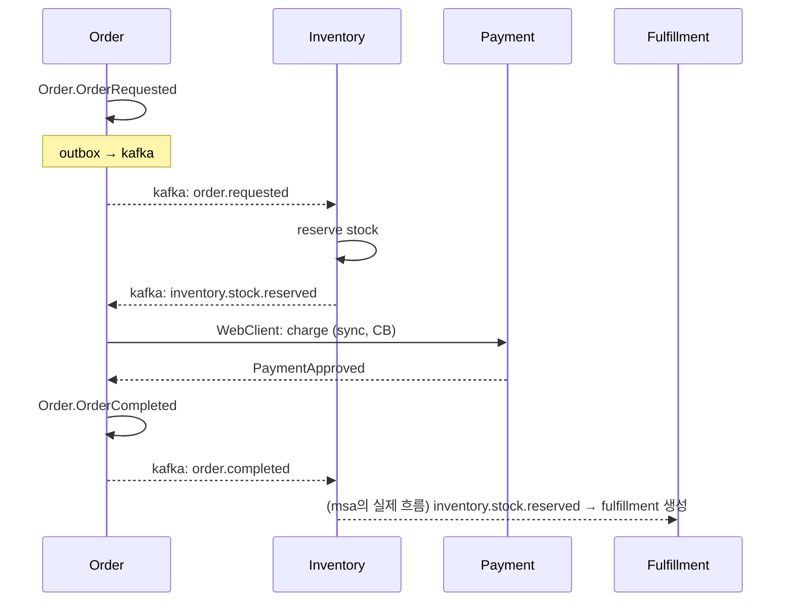
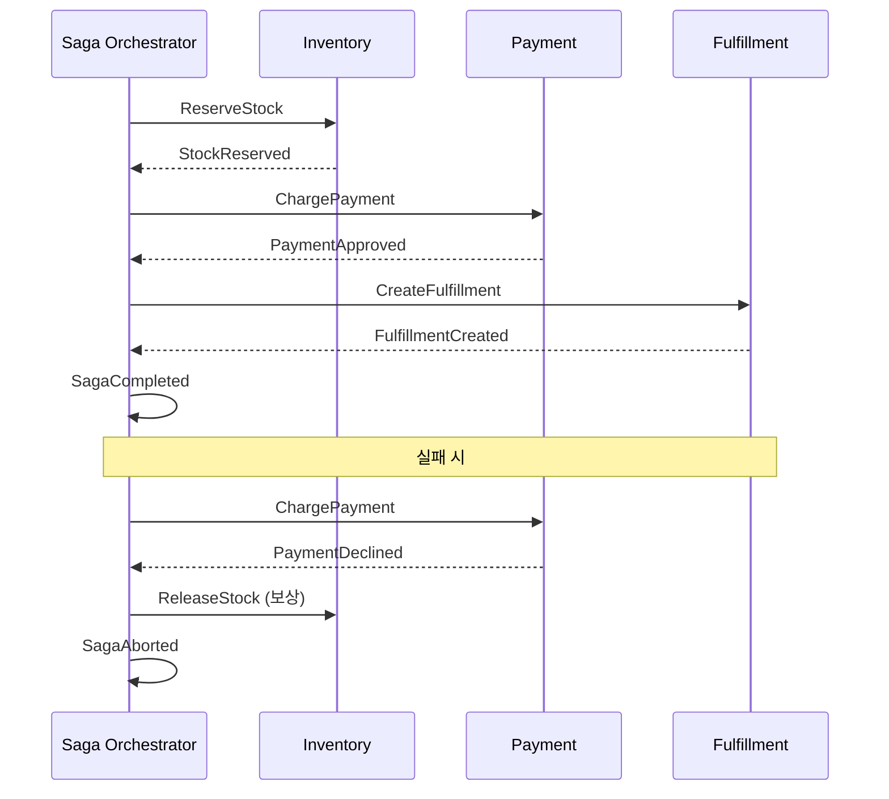

# 08. Saga Pattern — Choreography vs Orchestration

> Saga 는 **ACID (Atomicity / Consistency / Isolation / Durability, 원자성·일관성·격리성·내구성) 의 Atomicity 를 포기** 하고 **보상 트랜잭션** 으로 정합성을 사후 회복하는 분산 트랜잭션 패턴. MSA (Microservices Architecture, 마이크로서비스 아키텍처) 의 표준.

## 1. Saga 의 역사

- 1987 Hector Garcia-Molina 의 Long-Lived Transactions 논문
- 본래 단일 DB 안에서 긴 트랜잭션을 짧은 sub-tx 로 쪼개는 아이디어
- MSA 시대에 **서비스 간 분산 트랜잭션 패턴** 으로 부활

## 2. 본질 정의

> 일련의 **로컬 트랜잭션** (T1, T2, ..., Tn) 으로 구성된 시퀀스.
> 어느 단계가 실패하면 이미 완료된 단계들에 대해 **보상 트랜잭션 (C1, ..., Ck)** 을 역순으로 실행.

```
정상:    T1 → T2 → T3 → T4 → done
실패:    T1 → T2 → T3 → ✗  → C2 → C1 → aborted
```

### 핵심 가정

- 각 Ti 는 **로컬 ACID 트랜잭션** (그 서비스의 DB 만 다룸)
- 각 Ci 는 Ti 의 **의미적 역연산** (시간상 되돌릴 순 없으니 "취소", "환불")
- Ti 사이엔 **isolation 없음** → 다른 Saga 가 중간 상태를 볼 수 있음 (compensable update)

## 3. Saga 의 두 가지 스타일

### 3.1 Choreography (춤추듯)

각 서비스가 이벤트를 발행/구독, 중앙 조정자 없음.



**특징**:
- 서비스 간 **decoupling 최고** — 각 서비스는 자기 이벤트만 알면 됨
- 새 서비스 추가가 쉬움 (구독만 추가)
- **단점**: 흐름이 코드에 분산되어 **추적 어려움**, 디버깅 지옥
- **장애 시 보상 흐름** 도 분산 — 누가 어떤 보상을 책임지는지 명확히 해야 함

### 3.2 Orchestration (지휘자)

중앙 Saga Orchestrator 가 모든 단계를 명시적으로 호출/대기.



**특징**:
- **추적성 최고** — 한 곳에서 흐름 다 보임
- 보상 흐름 명시적
- 새 단계 추가 시 orchestrator 만 수정
- **단점**: orchestrator 가 SPoF / 비즈니스 로직 집중 → "분산 모놀리식" 위험
- 구현체: AWS Step Functions, Temporal, Camunda Zeebe, Spring Statemachine

## 4. 어느 쪽을 언제 쓰나

| 기준 | Choreography | Orchestration |
|---|---|---|
| 단계 수 | ≤ 4 | ≥ 5 |
| 흐름 변경 빈도 | 낮음 | 높음 (BPM) |
| 추적 중요도 | 낮음 | 높음 (감사, 컴플라이언스) |
| 팀 구성 | 도메인별 자율 | 통합 BPM 팀 |
| 디버깅 | 분산 추적 도구 (Jaeger, Tempo) 필수 | orchestrator 로그만 봐도 됨 |
| 결합도 | 낮음 (이벤트만) | 중간 (orchestrator 가 알아야) |

**실제 트렌드**: 단순 흐름은 Choreography, 복잡한 워크플로우는 Orchestration. **혼합** 도 흔함 — 도메인 그룹 안은 choreography, 그룹 간은 orchestrator.

## 5. 보상 트랜잭션 (Compensating Transaction)

### 5.1 종류

| 종류 | 의미 | 예 |
|---|---|---|
| Pure compensable | 완전히 되돌릴 수 있음 | 재고 reserve → release |
| Retriable | 결국엔 성공할 수 있음 | 결제 승인 retry |
| Pivot | 실패하면 보상 못 함 | 이메일 발송 (이미 보냄) |

### 5.2 보상 설계 원칙

1. **멱등** 이어야 함 — 재시도 시 안전
2. **commutative** 이면 더 좋음 (순서 무관)
3. **시간 제한** — 보상이 너무 늦으면 사용자가 이미 다른 행동 → race
4. **모니터링** — 보상 실패 시 알람 + 수동 개입 필요

### 5.3 안티패턴: 비대칭 보상

```kotlin
// 안티패턴: 보상이 원본보다 작음
T1: charge(amount = 10000)
C1: refund(amount = 9000)  // ← fee 빼고? 사용자 분쟁
```

→ 보상은 가능한 한 **완전 reverse**. fee 처리는 별도 도메인 이벤트로.

## 6. Saga 의 Isolation 문제

ACID 의 I 가 없어서 발생하는 문제들:

### 6.1 Lost Update

```
Saga A: T1 reserve 10
Saga B: 같은 재고에 T1 reserve 5 (A 의 T2 진행 중에)
Saga A 실패 → C1 release 10
→ A 가 reserve 안 한 5 까지 release 위험
```

해법: **Optimistic Lock** (`@Version`) + reservation entity 별도 추적.

### 6.2 Dirty Read

```
Saga A: T1 reserve → 다른 사용자 화면에 "재고 부족" 보임
Saga A 실패 → C1 release → 다른 사용자가 이미 떠남
```

해법: 재고 표시 시 reserved 와 available 구분, UI 에 "약간의 지연 가능" 명시.

### 6.3 Fuzzy Read

같은 Saga 가 같은 데이터를 두 번 read 했는데 다른 값.

해법: read 결과를 Saga state 에 저장, 다시 읽지 않음.

## 7. Saga 패턴 코드 예시 (Kotlin)

### 7.1 Choreography — Outbox + 멱등 Consumer (msa 의 실제 패턴)

```kotlin
// inventory 가 stock 예약 후 이벤트 발행
@Service
@Transactional
class ReserveStockService(
    private val inventoryRepo: InventoryRepositoryPort,
    private val outbox: OutboxPort,
    private val mapper: ObjectMapper,
) : ReserveStockUseCase {
    override fun execute(cmd: Command): Result {
        val inv = inventoryRepo.findByProductIdAndWarehouseId(cmd.productId, cmd.warehouseId)
            ?: throw BusinessException(ErrorCode.NOT_FOUND, "재고 없음")
        inv.reserve(cmd.qty)
        val saved = inventoryRepo.save(inv)

        // outbox: DB tx 와 같이 commit 됨
        outbox.save(
            aggregateType = "Inventory",
            aggregateId = saved.id!!,
            eventType = "inventory.stock.reserved",
            payload = mapper.writeValueAsString(InventoryEvent.StockReserved(...)),
        )
        return Result(...)
    }
}

// fulfillment 가 inventory.stock.reserved 구독
@Component
class FulfillmentEventConsumer(
    private val createFulfillment: CreateFulfillmentUseCase,
    private val processedEventRepo: ProcessedEventJpaRepository,
) {
    @KafkaListener(topics = ["inventory.stock.reserved"])
    fun on(record: ConsumerRecord<String, String>) {
        val node = mapper.readTree(record.value())
        val eventId = node.get("eventId").asText()
        if (processedEventRepo.existsById(eventId)) return  // 멱등

        createFulfillment.execute(...)
        processedEventRepo.save(ProcessedEventJpaEntity(eventId, "inventory.stock.reserved"))
    }
}
```

### 7.2 Orchestration — Spring State Machine (스케치)

```kotlin
enum class OrderState { CREATED, RESERVING, PAID, FULFILLED, CANCELLED, FAILED }
enum class OrderEvent { CREATE, RESERVE_OK, RESERVE_FAIL, PAY_OK, PAY_FAIL, FULFILL_OK }

@Configuration
@EnableStateMachineFactory
class OrderSagaConfig : EnumStateMachineConfigurerAdapter<OrderState, OrderEvent>() {
    override fun configure(states: StateMachineStateConfigurer<OrderState, OrderEvent>) {
        states.withStates()
            .initial(OrderState.CREATED)
            .state(OrderState.RESERVING)
            .state(OrderState.PAID)
            .end(OrderState.FULFILLED)
            .end(OrderState.CANCELLED)
    }

    override fun configure(t: StateMachineTransitionConfigurer<OrderState, OrderEvent>) {
        t.withExternal()
            .source(OrderState.CREATED).target(OrderState.RESERVING).event(OrderEvent.CREATE)
            .action { ctx -> reserveStock(ctx.extendedState["orderId"] as Long) }
        t.withExternal()
            .source(OrderState.RESERVING).target(OrderState.PAID).event(OrderEvent.RESERVE_OK)
            .action { ctx -> charge(ctx) }
        t.withExternal()
            .source(OrderState.PAID).target(OrderState.FULFILLED).event(OrderEvent.PAY_OK)
            .action { ctx -> createFulfillment(ctx) }
        // 실패 분기 (보상)
        t.withExternal()
            .source(OrderState.RESERVING).target(OrderState.CANCELLED).event(OrderEvent.RESERVE_FAIL)
        t.withExternal()
            .source(OrderState.PAID).target(OrderState.CANCELLED).event(OrderEvent.PAY_FAIL)
            .action { ctx -> releaseStock(ctx) }  // 보상
    }
}
```

→ 단순 saga 는 위 정도, 복잡하면 **Temporal / AWS Step Functions** 권장.

## 8. msa 프로젝트의 Saga 진단

### 8.1 현재 구조 (ADR-0011)

```
order.OrderCompleted
  → inventory: ReserveStock → InventoryEvent.StockReserved
    → fulfillment: CreateFulfillment → FulfillmentEvent.Created
    → product: syncStock (캐시 업데이트)

fulfillment.Shipped
  → inventory: ConfirmStock

fulfillment.Cancelled
  → inventory: ReleaseStock (보상)

ReservationExpiry (TTL 30분)
  → inventory: ReleaseStock (자동 보상)
```

→ **Choreography 형 Saga**. 각 서비스가 이벤트로 다음 단계 트리거.

### 8.2 강점

- Outbox 로 발행 원자성 (ADR (Architecture Decision Record, 아키텍처 결정 기록)-0011)
- 멱등 Consumer (ADR-0012, processed_event)
- Optimistic Lock (`@Version`)
- ReservationExpiry 로 PENDING 상태 자동 정리

### 8.3 약점 (개선 후보)

| 약점 | 영향 | 개선안 |
|---|---|---|
| 흐름 추적 어려움 | 운영 디버깅 비용 | 분산 추적 (OpenTelemetry + Jaeger) |
| 보상 흐름 일부 부재 | 결제 실패 시 reserved 가 30분 후 expire 되어야 풀림 | 즉시 보상 이벤트 발행 |
| Saga 상태 추적 테이블 없음 | "지금 saga 어디?" 가 불명확 | saga_instance 테이블 또는 OpenTelemetry trace |
| Pivot transaction (이메일 등) 없음 | 향후 도입 시 보상 어려움 | pivot 식별 + 후처리 ack |

→ Phase 3 (16-codebase-saga.md) 에서 자세히 코드와 함께.

## 9. Saga 와 멱등성 / Outbox 의 관계

```
┌─────────────────────────────────────┐
│ Saga (분산 tx)                      │
│  └── Outbox (DB ↔ Kafka 원자성)     │
│       └── 멱등 Consumer (중복 방어)│
│            └── Retry + DLQ          │
└─────────────────────────────────────┘
```

- Saga 는 **위쪽 비즈니스 시점** 의 패턴
- Outbox 는 **메시지 발행 단계** 의 패턴 (14번)
- 멱등성은 **메시지 수신 단계** 의 패턴 (09번)
- → **셋이 함께 가야** 분산 트랜잭션이 안전

## 10. 면접 5문답

### Q1. "Saga Choreography vs Orchestration 어느 쪽?"

> "단계 수 + 추적 요구로 결정. 단순 (≤4단계) 하고 도메인 자율성이 중요하면 Choreography, 복잡 (≥5단계) 하거나 BPM/감사 요구면 Orchestration. msa 는 inventory→fulfillment 가 Choreography."

### Q2. "보상 트랜잭션이 왜 어려운가요?"

> "(1) 시간상 되돌릴 수 없으니 의미적 역연산이 필요 (refund, cancel). (2) 멱등 + commutative 해야 안전. (3) Pivot transaction (외부 메일/SMS) 은 보상 불가 → 사후 ack 또는 다른 도메인 이벤트로 처리. (4) 보상 자체가 실패하면 사람이 개입."

### Q3. "Saga 의 isolation 부재로 무슨 문제가?"

> "다른 Saga 가 중간 상태를 봐서 lost update / dirty read 가능. 해법은 (1) Optimistic Lock (재고 `@Version`), (2) 사용자에게 `pending` 상태 노출, (3) read model 격리."

### Q4. "Saga 어디까지 진행됐는지 어떻게 추적?"

> "두 가지 접근: (1) saga_instance 테이블에 상태 저장 (orchestration 형), (2) 분산 트레이싱 (trace_id 를 모든 이벤트에 전파, OpenTelemetry + Jaeger). msa 는 후자가 표준."

### Q5. "Saga 가 영원히 멈춰있으면?"

> "각 단계마다 timeout 설정 + ReservationExpiry 같은 cleanup 배치. msa 는 inventory.Reservation 에 TTL 30분 + Scheduled expire job. 그 외 flow 도 Saga timeout (e.g., 1시간) 후 자동 abort 권장."

## 11. 한 줄 요약

> Saga = **ACID Atomicity 포기 + 보상 트랜잭션 + 멱등성** 의 패키지.
> Choreography (decoupling) 와 Orchestration (추적) 둘 다 트레이드오프, 단계 수와 추적 요구로 선택.
> msa 는 Choreography + Outbox + 멱등 Consumer 로 구현 — Phase 3 에서 실제 코드 분석.
