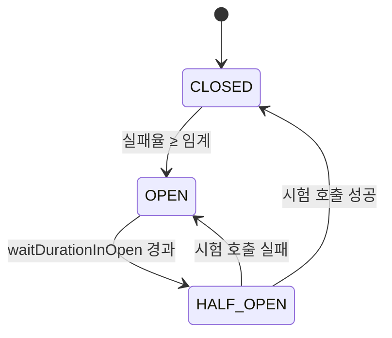

# 11. Circuit Breaker — 장애 전파 차단기

> Circuit Breaker 는 **"고장난 서비스를 호출하지 않게 막는 자동 차단기"**. 외부 의존성 동기 호출에 거의 필수.

## 1. 기본 개념 (Michael Nygard, "Release It!" 2007)

가전 차단기 (전기 차단기) 비유:
- 전류 (= 호출) 가 정상이면 흐름 통과 (CLOSED)
- 과전류 (= 실패율 ↑) 면 차단 (OPEN)
- 일정 시간 후 시험적 통과 (HALF-OPEN)
- 정상이면 다시 CLOSED, 비정상이면 다시 OPEN



## 2. 3가지 상태 상세

### 2.1 CLOSED (정상)

- 모든 호출 통과
- 실패율을 sliding window 로 측정
- 임계 (예: 50%) 초과 시 → OPEN

### 2.2 OPEN (차단)

- 모든 호출 즉시 실패 (`CallNotPermittedException`)
- 외부 시스템 회복 시간 줌
- `waitDurationInOpenState` (기본 30s 등) 후 → HALF_OPEN

### 2.3 HALF_OPEN (시험)

- 제한된 수 (예: 3) 의 호출만 통과
- 모두 성공하면 → CLOSED
- 1개라도 실패하면 → OPEN

## 3. Sliding Window 종류

### 3.1 Count-based (기본)

최근 N건 호출 기준 실패율.

```
slidingWindowSize = 10
→ 최근 10건 중 5건 실패 = 50%
```

### 3.2 Time-based

최근 N초 기준 실패율.

```
slidingWindowSize = 60 (sec)
→ 최근 60초 동안의 호출 실패율
```

QPS (Queries Per Second, 초당 쿼리 수) 가 낮은 서비스엔 time-based 가 더 정확. QPS 가 일정하면 count-based 가 가벼움.

## 4. Resilience4j — 자바/코틀린 표준

### 4.1 의존성

```kotlin
implementation("io.github.resilience4j:resilience4j-spring-boot3")
implementation("io.github.resilience4j:resilience4j-kotlin")
implementation("io.github.resilience4j:resilience4j-reactor")
```

### 4.2 설정 (application.yml)

```yaml
resilience4j:
  circuitbreaker:
    instances:
      payment-service:
        slidingWindowType: COUNT_BASED
        slidingWindowSize: 10
        failureRateThreshold: 50  # %
        waitDurationInOpenState: 30s
        permittedNumberOfCallsInHalfOpenState: 3
        minimumNumberOfCalls: 5
        recordExceptions:
          - org.springframework.web.reactive.function.client.WebClientResponseException
          - java.io.IOException
        ignoreExceptions:
          - com.kgd.common.exception.BusinessException
```

### 4.3 Kotlin 사용법 (msa 의 PaymentAdapter)

```kotlin
@Component
class PaymentAdapter(
    @Qualifier("paymentWebClient") private val webClient: WebClient,
    private val circuitBreakerRegistry: CircuitBreakerRegistry,
) : PaymentPort {
    private val cb = circuitBreakerRegistry.circuitBreaker("payment-service")

    override suspend fun requestPayment(orderId: Long, amount: BigDecimal): PaymentResult {
        return cb.executeSuspendFunction {
            webClient.post().uri("/payments")
                .bodyValue(mapOf("orderId" to orderId, "amount" to amount))
                .retrieve()
                .bodyToMono(PaymentResult::class.java)
                .awaitSingle()
                ?: throw BusinessException(ErrorCode.EXTERNAL_API_ERROR, "결제 응답 없음")
        }
    }
}
```

`executeSuspendFunction` 이 코루틴 친화 (block 안 함).

## 5. msa 의 실제 설정 (ADR-0015)

```kotlin
// order/WebClientConfig.kt
@Bean
fun circuitBreakerRegistry(): CircuitBreakerRegistry {
    val config = CircuitBreakerConfig.custom()
        .slidingWindowType(CircuitBreakerConfig.SlidingWindowType.COUNT_BASED)
        .slidingWindowSize(10)
        .failureRateThreshold(50f)
        .waitDurationInOpenState(Duration.ofSeconds(30))
        .permittedNumberOfCallsInHalfOpenState(3)
        .build()
    return CircuitBreakerRegistry.of(config)
}
```

**적용처**:
- `order → payment-service` (외부 결제)
- `order → product-service` (내부)

→ 비동기 통신 (Kafka) 엔 CB 안 씀 — 카프카는 다른 메커니즘 (consumer lag, DLT) 으로 처리.

## 6. Fallback 전략

OPEN 시 단순 throw 만 하면 사용자 경험 좋지 않음. fallback 패턴:

### 6.1 Cached value

```kotlin
suspend fun getProduct(id: Long): Product {
    return try {
        cb.executeSuspendFunction { productAdapter.fetch(id) }
    } catch (e: CallNotPermittedException) {
        productCache.get(id) ?: throw e  // 캐시도 없으면 throw
    }
}
```

### 6.2 Default response

```kotlin
suspend fun getRecommendations(userId: Long): List<Product> {
    return try {
        cb.executeSuspendFunction { recommendApi.fetch(userId) }
    } catch (e: CallNotPermittedException) {
        emptyList()  // 추천이 없어도 서비스는 동작
    }
}
```

### 6.3 Degraded path

```kotlin
suspend fun checkout(orderId: Long): CheckoutResult {
    return try {
        cb.executeSuspendFunction { paymentApi.charge(orderId) }
    } catch (e: CallNotPermittedException) {
        // 결제 시스템 장애 → 주문은 PENDING 으로 남기고 사용자 안내
        orderRepo.markPending(orderId)
        throw BusinessException(ErrorCode.PAYMENT_TEMPORARILY_UNAVAILABLE)
    }
}
```

→ msa 의 패턴: `CallNotPermittedException` → `BusinessException(ErrorCode.CIRCUIT_BREAKER_OPEN)` 변환 후 호출자가 처리.

## 7. CB 가 적합한 곳 / 부적합한 곳

| 적합 | 부적합 |
|---|---|
| 외부 시스템 동기 호출 | DB 쿼리 (CP 의존이라 다른 패턴) |
| 다른 서비스 동기 호출 | 자기 자신 메서드 |
| 외부 API (PG, 알림) | 비동기 메시징 (Kafka) |
| WebClient / RestTemplate | 캐시 (이미 fallback 동작) |

## 8. 메트릭과 모니터링

Resilience4j 가 Spring Actuator 와 자동 통합:

```
GET /actuator/circuitbreakers
→ 모든 CB 의 상태, 호출 수, 실패율 노출

GET /actuator/metrics/resilience4j.circuitbreaker.calls
→ Prometheus 호환
```

대시보드 표시 항목:
- 상태 (CLOSED/OPEN/HALF_OPEN) 변화 시계열
- 실패율
- 호출 수
- not-permitted 수 (OPEN 으로 차단된 호출)

## 9. CB 안티패턴

### 9.1 Fallback 없는 CB

```kotlin
// 안티: OPEN 시 그냥 throw → 사용자 500 에러
cb.executeSuspendFunction { ... }
```

→ fallback 또는 사용자 친화 메시지로 변환.

### 9.2 모든 호출에 같은 CB

```kotlin
val cb = registry.circuitBreaker("default")
adapter1.call(cb)
adapter2.call(cb)  // ← 다른 외부 시스템도 같은 CB → 한쪽 장애가 다른 쪽 차단
```

→ **외부 시스템마다 별도 CB** (msa 가 잘 함: payment-service, product-service 분리).

### 9.3 ignoreExceptions 누락

비즈니스 예외 (재고 부족) 도 CB 가 "실패" 로 카운트하면 OPEN 자주 발동.

```kotlin
// msa 권장
.ignoreExceptions(BusinessException::class.java)
```

### 9.4 너무 민감한 임계

```yaml
slidingWindowSize: 5
failureRateThreshold: 50
```

→ 5건 중 3건 실패면 즉시 OPEN. 평소 1-2개 transient 실패만 있어도 자주 OPEN.

권장: `slidingWindowSize >= 20`, `minimumNumberOfCalls >= 10`.

## 10. CB 와 Retry 의 상호작용

```
[Retry] → [CircuitBreaker] → 실제 호출
```

- retry 호출 하나하나마다 CB 검사
- CB OPEN 이면 retry 도 즉시 실패 (waste 없음)
- 단, retry 가 너무 많으면 sliding window 가 retry 호출로 채워져서 평균 실패율 왜곡 가능

→ `recordResult` 와 `recordException` 으로 retry 건은 측정에서 제외하는 옵션 검토 가치 있음.

## 11. CB vs Bulkhead

| 차원 | Circuit Breaker | Bulkhead |
|---|---|---|
| 목적 | 장애 전파 차단 | 자원 격리 |
| 발동 | 실패율 임계 | 동시 호출 수 |
| 효과 | OPEN 시 즉시 실패 | 풀 차면 대기/실패 |
| 사용 | 외부 의존성 | 같은 자원 풀 보호 |
| 결합 | Bulkhead 안에 CB | (12 장에서 자세히) |

## 12. 면접 6문답

### Q1. "Circuit Breaker 의 3가지 상태?"

> "CLOSED (정상 통과, 실패율 측정), OPEN (즉시 실패, 회복 대기), HALF_OPEN (제한된 시험 호출). HALF_OPEN 에서 성공하면 CLOSED, 실패하면 OPEN 으로."

### Q2. "언제 OPEN 으로 가나요?"

> "sliding window (msa: 최근 10건) 안에서 실패율이 임계 (msa: 50%) 를 넘을 때. minimumNumberOfCalls 를 만족해야 평가 시작."

### Q3. "HALF_OPEN 에서 어떻게 시험?"

> "permittedNumberOfCallsInHalfOpenState (msa: 3) 만큼만 통과. 그 결과로 CLOSED 또는 OPEN 결정."

### Q4. "fallback 은 어떻게 설계?"

> "도메인 critical 정도에 따라:
> - 추천/검색: 빈 결과 반환 (degraded)
> - 가격 조회: 캐시
> - 결제/재고: 즉시 실패 + 사용자 안내 (재시도 유도)"

### Q5. "비즈니스 예외 (재고 부족) 도 CB 카운트되나?"

> "기본은 카운트. 하지만 그러면 정상 도메인 흐름에 CB 가 자주 OPEN 됨. `ignoreExceptions` 에 BusinessException 등록 권장. msa 도 그렇게 함."

### Q6. "msa 에서 어디에 적용?"

> "order → payment, order → product. 둘 다 동기 외부/내부 호출. Kafka 같은 비동기는 CB 대신 DLT + 멱등 consumer 로 처리 (ADR (Architecture Decision Record, 아키텍처 결정 기록)-0015)."

## 13. 한 줄 요약

> Circuit Breaker = **CLOSED/OPEN/HALF_OPEN** 으로 외부 의존성을 자동 차단.
> Resilience4j + Spring Boot 가 표준. **외부 시스템마다 별도 CB**, **fallback 설계**, **ignoreExceptions 로 비즈니스 예외 분리** 가 핵심.
