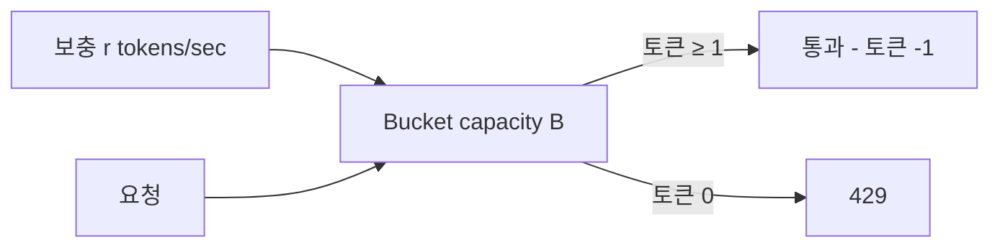

# 12. Bulkhead + Rate Limiting — 자원 격리와 입장 제어

> 모든 호출이 같은 풀을 쓰면 한 곳의 장애가 전체로 번진다. **Bulkhead** 는 자원 격리, **Rate Limiting** 은 처리량 제한. 둘은 보완 관계.

## 1. Bulkhead Pattern (격벽)

선박의 격벽 (수밀 구획) 비유: 배가 일부 침수돼도 다른 구획은 안전.

소프트웨어에서:
- 한 외부 시스템이 느려져도 다른 호출 흐름은 영향 없도록 **자원 풀을 격리**

### 1.1 두 가지 구현

#### Semaphore Bulkhead

- 동시 진행 호출 수만 제한 (예: max 20 concurrent)
- 호출당 별도 thread 안 만듦
- async / non-blocking 환경에 적합

```yaml
resilience4j:
  bulkhead:
    instances:
      payment-service:
        maxConcurrentCalls: 20
        maxWaitDuration: 100ms
```

```kotlin
val bh = bulkheadRegistry.bulkhead("payment-service")
val result = bh.executeSuspendFunction {
    paymentApi.charge(...)
}
```

#### ThreadPool Bulkhead

- 별도 thread pool 에서 호출 실행
- 호출자 thread 와 격리 (호출자가 timeout 으로 풀려도 실제 호출은 별도 thread 에서)
- blocking / sync 환경에 적합

```yaml
resilience4j:
  thread-pool-bulkhead:
    instances:
      legacy-call:
        max-thread-pool-size: 10
        core-thread-pool-size: 5
        queue-capacity: 50
```

```kotlin
val bh = threadPoolBulkheadRegistry.bulkhead("legacy-call")
val future: CompletableFuture<Result> = bh.executeSupplier { blockingCall() }
```

### 1.2 어디에 격리하는가

| 자원 | 격리 방식 | msa 적용 |
|---|---|---|
| HTTP Connection Pool | 외부 시스템마다 별도 WebClient | ✓ (`paymentWebClient`, `productWebClient`) |
| DB Connection Pool | 서비스마다 HikariCP | ✓ (`max=10, min=2`) |
| Kafka Consumer Group | 서비스마다 별도 group | ✓ |
| Thread Pool | bulkhead 또는 dispatcher | △ (직접 격리 코드는 부재) |
| External API (Resilience4j) | bulkhead 인스턴스마다 | △ (현재 미적용, 개선 후보) |

### 1.3 Bulkhead 효과 시각화

```
without bulkhead:
  payment 느려짐 → thread 점유 → product 호출 thread 풀 고갈 → 전체 마비

with bulkhead (semaphore):
  payment 느려짐 → payment bulkhead 가득 → payment 호출만 즉시 실패 (또는 wait)
  → product, search 등 다른 호출은 영향 없음
```

## 2. Rate Limiting (속도 제한)

처리량 자체를 제한 → 시스템 capacity 안에서 동작.

### 2.1 어디에 적용?

| 계층 | 목적 |
|---|---|
| **API Gateway** | 전역 트래픽 제어, abuse 방어 |
| 서비스 레벨 (Resilience4j RateLimiter) | 특정 endpoint / 특정 user 보호 |
| DB / 외부 API | 외부에 보낼 요청 자체 제한 (downstream 보호) |

## 3. Rate Limiting 알고리즘 4종

### 3.1 Token Bucket (가장 흔함)

```
버킷 용량: B (burst capacity)
보충 속도: r (replenish rate, tokens/sec)
요청마다 토큰 1개 소비, 0이면 reject 또는 대기
```

특징:
- **burst 허용**: 평소 안 썼으면 쌓인 토큰으로 짧은 폭주 가능
- AWS API Gateway, Stripe, Spring Cloud Gateway 의 기본



### 3.2 Leaky Bucket

```
큐 용량: B
처리 속도: r (requests/sec)
초과 요청: drop (overflow)
```

특징:
- **균일 출력**: burst 허용 안 함, 항상 일정 속도
- 네트워크 트래픽 shaping 에 사용
- 사용자에 친화적이진 않음 (정확히 r 만)

### 3.3 Fixed Window

```
1분 윈도우마다 카운터 reset, 1분에 N건 허용
```

문제: **윈도우 경계 burst** — 23:59:59 에 N건 + 24:00:00 에 N건 = 2초만에 2N건.

### 3.4 Sliding Window Log

```
각 요청 timestamp 저장
요청 시 (now - 60s) 동안의 요청 수 계산
```

정확하지만 메모리 비쌈. 트래픽 많은 곳엔 부담.

### 3.5 Sliding Window Counter

```
현재 윈도우 + 직전 윈도우의 가중 평균
```

Fixed 와 Sliding Log 의 절충. Cloudflare 가 사용. 메모리 적고 정확도 OK.

## 4. msa 의 Gateway Rate Limiting (실제 구현)

### 4.1 구성

`gateway/src/main/kotlin/com/kgd/gateway/config/RateLimiterConfig.kt`:

```kotlin
@Configuration
class RateLimiterConfig {
    @Bean
    fun ipKeyResolver(): KeyResolver = KeyResolver { exchange ->
        Mono.just(exchange.request.remoteAddress?.address?.hostAddress ?: "unknown")
    }

    @Bean
    @Primary
    fun userKeyResolver(): KeyResolver = KeyResolver { exchange ->
        Mono.just(
            exchange.request.headers.getFirst("X-User-Id")
                ?: exchange.request.remoteAddress?.address?.hostAddress
                ?: "unknown"
        )
    }

    @Bean
    fun redisRateLimiter(): RedisRateLimiter =
        RedisRateLimiter(100, 200, 1)
        //               ↑    ↑   ↑
        //   replenishRate  burst  requestedTokens
}
```

### 4.2 Redis Token Bucket Lua

Spring Cloud Gateway 내부에서 Redis Lua script 로 atomic 하게 token bucket 구현.

```lua
-- 단순화한 token bucket (Spring Cloud Gateway 내부 변형)
local key = KEYS[1] .. ':tokens'
local timestampKey = KEYS[1] .. ':timestamp'
local rate = tonumber(ARGV[1])      -- replenish rate
local capacity = tonumber(ARGV[2])  -- burst capacity
local now = tonumber(ARGV[3])
local requested = tonumber(ARGV[4])

local lastTokens = tonumber(redis.call('get', key)) or capacity
local lastRefreshed = tonumber(redis.call('get', timestampKey)) or 0

local delta = math.max(0, now - lastRefreshed)
local filledTokens = math.min(capacity, lastTokens + delta * rate)
local allowed = filledTokens >= requested
local newTokens = filledTokens

if allowed then
    newTokens = filledTokens - requested
end

redis.call('setex', key, math.ceil(capacity / rate), newTokens)
redis.call('setex', timestampKey, math.ceil(capacity / rate), now)

return { allowed and 1 or 0, newTokens }
```

→ Lua script 로 **single round trip + atomic** 보장. SET + INCR 분리 시 race condition 발생 가능.

### 4.3 Route 적용

`gateway/src/main/kotlin/com/kgd/gateway/config/GatewayRouteConfig.kt` (inventory route):

```kotlin
.route("inventory-service") { r ->
    r.path("/api/inventories/**")
        .filters { f ->
            f.filter(authFilter.apply(sellerConfig()))
                .requestRateLimiter { config ->
                    config.setRateLimiter(redisRateLimiter)
                    config.setKeyResolver(userKeyResolver)
                    config.setDenyEmptyKey(false)
                }
                .stripPrefix(0)
        }
        .uri("http://inventory:8085")
}
```

→ inventory route 만 RateLimiter 적용. 다른 route 는 미적용 (필요 시 추가).

### 4.4 Flash Sale 모드

ADR (Architecture Decision Record, 아키텍처 결정 기록)-0015 표 (replenishRate: 100→500, burstCapacity: 200→1000) — 환경변수로 조절.
실제로는 코드에 하드코딩 (`RedisRateLimiter(100, 200, 1)`) 되어 있어 **외부화 개선 필요** (19-improvements 에서).

## 5. msa 의 Admission Control (자체 구현)

`inventory/src/.../infrastructure/admission/AdmissionControlFilter.kt`:

```kotlin
@Component
class AdmissionControlFilter(
    private val redisTemplate: StringRedisTemplate?,
    @Value("\${inventory.admission.max-concurrent-reservations:1000}")
    private val maxConcurrentReservations: Long,
) : OncePerRequestFilter() {
    override fun doFilterInternal(request, response, chain) {
        if (!isReservationRequest(request)) { chain.doFilter(...); return }
        if (redisTemplate == null) { chain.doFilter(...); return }  // fail-open

        val current = redisTemplate.opsForValue().increment(KEY) ?: 0
        try {
            if (current > maxConcurrentReservations) {
                response.status = 429
                response.writer.write("""{"code":"TOO_MANY_REQUESTS"}""")
                return
            }
            chain.doFilter(...)
        } finally {
            redisTemplate.opsForValue().decrement(KEY)
        }
    }
}
```

→ **현재 동시 처리 중인 reservation 수** 를 Redis 카운터로 추적, 한도 초과 시 즉시 429.
→ Token Bucket 보다 더 직접적 — "지금 이미 처리 중인 게 너무 많다" 를 직접 측정.
→ Token Bucket (속도 제한) + Admission Control (concurrency 제한) 의 **조합** 이 msa 의 패턴.

## 6. Resilience4j RateLimiter (서비스 내부)

```yaml
resilience4j:
  ratelimiter:
    instances:
      legacy-api:
        limitForPeriod: 100   # 기간당 허용 횟수
        limitRefreshPeriod: 1s
        timeoutDuration: 50ms  # token 기다리는 최대 시간
```

```kotlin
val rl = rateLimiterRegistry.rateLimiter("legacy-api")
rl.executeSuspendFunction { legacyApi.call() }  // 토큰 못 받으면 RequestNotPermitted
```

→ **downstream 보호** 용. 외부에 보낼 요청을 우리 쪽에서 자율 제한.

## 7. Bulkhead vs Rate Limiting 차이

| 차원 | Bulkhead | Rate Limiter |
|---|---|---|
| 측정 | 동시 호출 수 | 시간당 호출 수 |
| 거부 시점 | 풀 가득 차면 | 토큰 부족하면 |
| 보호 대상 | 자원 풀 (thread, connection) | 처리량 / 트래픽 |
| 사용 | 자원 격리 | 사용자/외부 시스템 abuse 방어 |

→ **둘은 함께** 쓸 수 있음. RL 로 들어오는 양 자체 제한 + Bulkhead 로 동시 처리량 격리.

## 8. Rate Limiting 의 키 결정

키를 어떻게 정하느냐가 정책의 핵심:

| 키 | 의미 |
|---|---|
| IP | DDoS 방어, 단순 |
| User ID | 사용자별 quota (msa 기본) |
| API Key / Tenant ID | B2B 사용량 제한 |
| Endpoint + User | endpoint 별 차등 |

msa 의 `userKeyResolver`: `X-User-Id` 헤더 우선, 없으면 IP 폴백 → 인증된 사용자는 사용자별, 비인증은 IP.

## 9. 안티패턴

### 9.1 in-memory rate limiter

```kotlin
val counter = ConcurrentHashMap<String, AtomicInt>()  // ← 인스턴스 별로 카운터 분리
```

→ MSA (Microservices Architecture, 마이크로서비스 아키텍처) + replica N개 = 실제 한도 N배. **반드시 Redis / 분산 저장소**.

### 9.2 키가 너무 거칠다 / 너무 세밀

```
거칠다: 모든 요청 키 = "global" → 1명이 다 써먹음
세밀: 키 = "userId+endpoint+method+...” → 각 키마다 거의 안 쌓임 → 효과 없음
```

### 9.3 Rate Limiter 만으로 보호

```
RL: 100 RPS (Requests Per Second, 초당 요청 수) 허용
실제 외부 시스템: 50 RPS 부터 느려짐 → CB 도 같이 필요
```

→ RL + CB + Bulkhead 가 **3종 세트**.

## 10. 면접 6문답

### Q1. "Bulkhead 와 Rate Limiter 차이?"

> "Bulkhead 는 동시 호출 수 격리 (자원 풀 보호), Rate Limiter 는 시간당 호출 수 제한 (처리량 제어). 함께 사용 가능."

### Q2. "Token Bucket 과 Leaky Bucket 차이?"

> "Token Bucket 은 burst 허용 (쌓인 토큰만큼 단기 폭주 OK), Leaky Bucket 은 항상 일정 속도. 사용자 친화적인 건 Token Bucket. msa 는 Spring Cloud Gateway 의 Token Bucket (Redis Lua)."

### Q3. "Rate Limiter 가 인스턴스마다 다르면?"

> "MSA + N replica → 실제 한도 N 배 됨. 반드시 **분산 저장소 (Redis Lua)** 로 atomic counter."

### Q4. "Sliding Window Log 의 비용?"

> "각 요청 timestamp 저장 → 트래픽 ↑ 시 메모리 폭증. Cloudflare 가 쓰는 Sliding Window Counter (직전 + 현재 윈도우 가중평균) 가 절충."

### Q5. "msa 의 admission control 은 RL 과 어떻게 다른가?"

> "RL 은 요청 도착 속도 제한 (Token Bucket), Admission Control 은 **현재 처리 중인 동시성** 제한. msa 는 inventory reservation 에 대해 Redis INCR 로 inflight counter, 한도 초과 시 429. 길게 걸리는 처리 보호에 더 직접적."

### Q6. "Fail-open vs Fail-closed?"

> "Redis 같은 RL 인프라 장애 시 어떻게? msa 는 **fail-open** (Redis 다운 시 admission control bypass). 보안 critical 한 곳은 fail-closed (차라리 거부) 권장. 도메인에 따라."

## 11. 한 줄 요약

> Bulkhead = 자원 격리, Rate Limiting = 처리량 제한. 둘은 보완 관계.
> msa 는 Gateway Token Bucket (Redis Lua) + Admission Control (Redis INCR) + 서비스별 별도 WebClient (semantic bulkhead) 로 구현.
