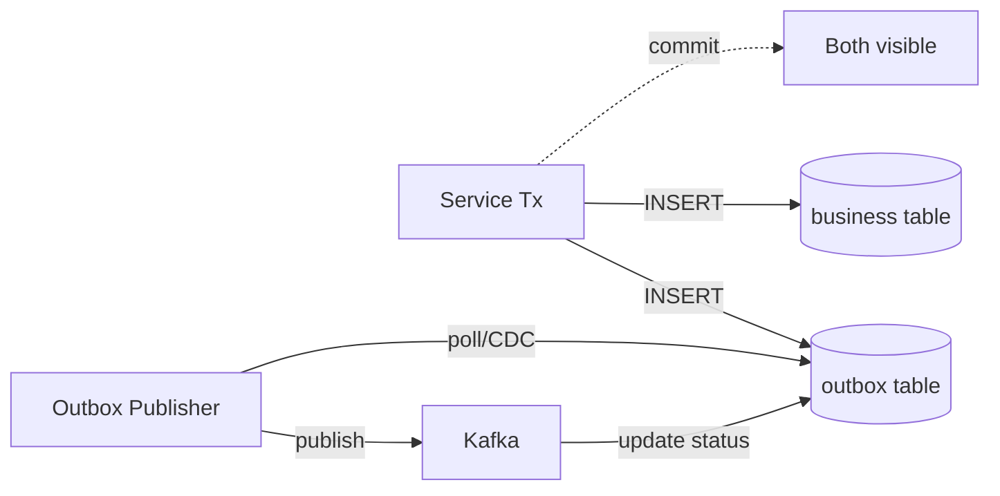

# 14. Outbox / Inbox / CDC — DB와 메시지의 원자성

> "DB save + Kafka publish 를 한 트랜잭션으로 묶을 수 있을까?" 에 대한 표준 답이 **Outbox 패턴**.

## 1. 문제 정의: Dual Write 의 함정

```kotlin
// 안티패턴 — 두 시스템에 분리 write
@Transactional
fun reserve(orderId: Long) {
    inventoryRepo.save(...)        // 1. DB write
    kafkaTemplate.send("...", ...) // 2. Kafka publish
}
```

발생 가능 시나리오:
- 1 OK + 2 OK → 정상
- 1 실패 → 둘 다 실패 (OK)
- **1 OK + 2 실패** → DB 는 변경, 다른 서비스는 모름 → **데이터 불일치**
- **1 OK + Kafka 응답 timeout** → 발행됐는지 알 수 없음

→ 2PC (XA) 로 묶으려 하면 앞 7장의 모든 문제 발생.

## 2. Outbox Pattern

### 2.1 핵심 아이디어

> 같은 DB 트랜잭션 안에서 **outbox 테이블에 이벤트 row** 도 INSERT.
> 별도 publisher 가 outbox 를 polling 또는 CDC 로 감지해서 Kafka 발행.



DB tx 가 atomic 이므로 비즈니스 데이터와 이벤트는 **같이 commit 또는 같이 rollback**.

### 2.2 Outbox 테이블 스키마 (msa 의 실제)

```sql
CREATE TABLE outbox_event (
    id              BIGINT AUTO_INCREMENT PRIMARY KEY,
    event_id        VARCHAR(36) NOT NULL UNIQUE,
    aggregate_type  VARCHAR(100) NOT NULL,
    aggregate_id    BIGINT NOT NULL,
    event_type      VARCHAR(100) NOT NULL,
    payload         TEXT NOT NULL,
    status          VARCHAR(20) NOT NULL DEFAULT 'PENDING',
    created_at      DATETIME(6) NOT NULL,
    published_at    DATETIME(6) NULL,
    INDEX idx_status_created (status, created_at)
);
```

- `event_id` (UUID) 는 멱등 key 로 consumer 가 사용
- `status`: PENDING / PUBLISHED / FAILED
- `aggregate_id` 는 Kafka partition key 로 사용 (순서 보장)

### 2.3 발행 메커니즘 2종

#### Polling Publisher (msa 의 Phase 1)

```kotlin
// fulfillment/OutboxPollingPublisher.kt 의 실제 코드
@Component
@ConditionalOnProperty(name = ["outbox.polling.enabled"], havingValue = "true", matchIfMissing = true)
class OutboxPollingPublisher(
    private val outboxRepository: OutboxJpaRepository,
    private val kafkaTemplate: KafkaTemplate<String, Any>,
    private val objectMapper: ObjectMapper,
) {
    @Scheduled(fixedDelayString = "\${fulfillment.outbox.polling-interval-ms:1000}")
    fun publishPendingEvents() {
        val events = outboxRepository.findAllByStatusOrderByCreatedAtAsc("PENDING")
        for (event in events) {
            try {
                val enrichedPayload = mapper.readTree(event.payload).let { node ->
                    (node as ObjectNode).put("eventId", event.eventId)
                    mapper.writeValueAsString(node)
                }
                kafkaTemplate.send(event.eventType, event.aggregateId.toString(), enrichedPayload)
                    .whenComplete { _, ex ->
                        if (ex == null) {
                            event.status = "PUBLISHED"
                            event.publishedAt = LocalDateTime.now()
                            outboxRepository.save(event)
                        }
                    }
            } catch (e: Exception) { log.error(...) }
        }
    }
}
```

- 단순, 인프라 추가 X
- 단점: polling interval 만큼 latency, DB 부하 상시

#### CDC Publisher (msa 의 Phase 2 — Debezium)

```yaml
# Debezium connector 설정 (요약)
{
  "connector.class": "io.debezium.connector.mysql.MySqlConnector",
  "table.include.list": "outbox_event",
  "transforms": "outbox",
  "transforms.outbox.type": "io.debezium.transforms.outbox.EventRouter",
  "transforms.outbox.route.by.field": "event_type"
}
```

- MySQL binlog 감시 → outbox row INSERT 시 자동 발행
- **저지연** (수십 ms), DB 부하 ↓
- 단점: Debezium / Kafka Connect 운영 부담

msa 는 둘 다 지원: 환경에 따라 polling 폴백 (`outbox.polling.enabled`).

## 3. Outbox 발행 vs DB Tx 시점

```
DB Tx 안:
  business_table INSERT
  outbox_event INSERT (status=PENDING)
DB Tx commit
─────────────────────
[비동기]
Publisher: outbox_event 읽음 → Kafka send → status=PUBLISHED
```

→ DB tx 후 **별도 비동기** 로 발행. 발행 자체가 실패해도 DB 는 영향 없음. Publisher 가 retry.

## 4. Inbox Pattern (소비 측 멱등 보장)

Outbox 의 대칭 — 소비 측에서 처리한 이벤트를 inbox 테이블에 기록.

```sql
CREATE TABLE inbox_event (
    event_id    VARCHAR(36) PRIMARY KEY,
    topic       VARCHAR(100),
    received_at DATETIME(6),
    processed_at DATETIME(6) NULL
);
```

```kotlin
@Transactional
fun handle(event: KafkaEvent) {
    if (inboxRepo.existsById(event.eventId)) return  // 멱등

    // 비즈니스 로직
    domainOps(event)

    inboxRepo.save(InboxEvent(event.eventId, event.topic, now()))
}
```

→ msa 의 `processed_event` 가 Inbox 의 변형. ADR (Architecture Decision Record, 아키텍처 결정 기록)-0012 의 핵심.

### Inbox vs processed_event 차이

| 차원 | Inbox | processed_event (msa) |
|---|---|---|
| 목적 | 멱등 + 처리 결과 추적 | 단순 멱등 dedup |
| 컬럼 | event_id, payload, processed_at, result | event_id, topic, processed_at |
| 사용 | 처리 실패 시 재시도 큐 역할도 | 단순 중복 방지만 |

msa 는 단순 dedup 만 필요해서 processed_event 로 단순화.

## 5. CDC (Change Data Capture)

CDC (Change Data Capture, 변경 데이터 캡처) 는 DB binlog 를 읽어 데이터 변경을 이벤트로 발행하는 패턴.

### 5.1 Debezium

- MySQL: binlog (row-based)
- PostgreSQL: logical replication (wal2json/pgoutput)
- MongoDB: oplog
- Oracle: LogMiner / XStream

### 5.2 Outbox Event Router (Debezium SMT)

특정 outbox 테이블의 INSERT 만 골라 적절한 Kafka topic 으로 라우팅.

```
INSERT INTO outbox_event(event_type='inventory.stock.reserved', payload=...)
→ Debezium 이 row 감지
→ EventRouter SMT 가 event_type 컬럼을 보고 'inventory.stock.reserved' 토픽으로 발행
→ payload 만 Kafka 메시지로
```

### 5.3 CDC 의 장점

- **저지연** (binlog 읽기는 ms 단위)
- DB 부하 ↓ (polling 안 함)
- **삭제** 도 감지 (polling 으론 어려움)

### 5.4 CDC 의 단점

- Kafka Connect / Debezium 운영 부담
- DB 권한 (replication slot, binlog read)
- 스키마 변경 시 connector 영향

→ msa 는 **CDC 가 기본 (Phase 2), polling 은 fallback**.

## 6. Outbox + CDC 조합의 강점

```
Service: business INSERT + outbox INSERT (DB tx)
         ↓ commit
binlog ─→ Debezium ─→ Kafka ─→ Consumer
         (CDC)        (router)
```

- DB → Kafka 가 **at-least-once** 보장 (CDC 가 retry)
- Producer side **enable.idempotence + eventId** → 중복 발행 방지
- Consumer side **processed_event (Inbox)** → 중복 처리 방지
- → 사실상 **effectively-once** 시맨틱

## 7. Outbox Polling 의 함정

### 7.1 다중 인스턴스 race

```
Replica A: SELECT pending → 100건
Replica B: SELECT pending → 같은 100건
→ 둘 다 send → Kafka 에 중복 발행 (consumer side 멱등으로 흡수해야)
```

해법:
- `SELECT ... FOR UPDATE SKIP LOCKED` (MySQL 8.0+)
- Redis 분산 락 (single publisher)
- K8s Deployment replica = 1

### 7.2 Polling interval vs latency

- 1초 = 평균 500ms 지연 (worst 1초)
- 100ms = DB 부하 ↑

→ 사용자에 즉각 보여야 하는 흐름은 **CDC 권장**.

## 8. 면접 5문답

### Q1. "Dual Write 문제가 뭔가요?"

> "DB save + Kafka publish 를 같은 코드에서 호출 시, 둘 사이에 네트워크/장애로 한쪽만 성공할 수 있음. → DB-Kafka 데이터 불일치. 해법은 **Outbox 패턴**."

### Q2. "Outbox 의 핵심?"

> "비즈니스 데이터와 같은 DB tx 안에서 outbox 테이블에도 이벤트 row INSERT. tx commit 후 별도 publisher 가 polling 또는 CDC 로 Kafka 발행. tx atomicity 가 곧 발행 atomicity."

### Q3. "Polling vs CDC 어느 쪽?"

> "단순/저트래픽: Polling (인프라 추가 X). 저지연/대규모: CDC (Debezium). msa 는 Phase 2 에서 CDC 도입, fallback 으로 polling 유지."

### Q4. "Inbox 와 Outbox 차이?"

> "Outbox 는 발행 측 (DB → Kafka 원자성), Inbox 는 소비 측 (중복 처리 방지 + 영속 dedup). msa 는 processed_event 가 Inbox 의 단순화 버전 (멱등만)."

### Q5. "Outbox 가 있어도 멱등 consumer 가 필요한가요?"

> "네. Outbox 는 producer 측 dual-write 만 해결. broker → consumer 사이에 재배달 (rebalance, ack 손실) 은 별개. 따라서 **eventId + processed_event/Inbox** 도 같이 필요."

## 9. msa 의 Outbox 코드 정리

```
[Service Layer]
ReserveStockService (@Transactional)
  → inventoryRepository.save(...)
  → outboxPort.save(eventType, aggregateId, payload)   // 같은 tx
  ← commit

[Async Layer]
OutboxPollingPublisher (@Scheduled, 1s)
  → SELECT WHERE status='PENDING'
  → kafkaTemplate.send(...)
  → UPDATE status='PUBLISHED'

[Kafka Side]
enable.idempotence=true
eventId 가 메시지 본문에 포함됨

[Consumer Layer]
@KafkaListener
  → processedEventRepo.existsById(eventId) → 중복이면 skip
  → 비즈니스 로직 + processedEvent.save() (같은 tx)
```

→ Outbox + 멱등 Consumer 의 조합이 msa 의 분산 트랜잭션 일관성 백본.

## 10. Outbox 의 한계와 Event Sourcing 으로의 진화

- Outbox 는 **이벤트 발행 보장** 만 함. 비즈니스 데이터 자체는 여전히 mutable
- 도메인이 복잡해지면 **Event Sourcing** 으로 진화 — 비즈니스 데이터 = 이벤트 stream 자체
- 15장에서 자세히

## 11. 한 줄 요약

> Outbox = **DB tx + 이벤트 row INSERT + 별도 비동기 publish**.
> Polling 은 단순, CDC 는 저지연. msa 는 둘 다 지원.
> 멱등 Consumer (processed_event) 와 짝을 이루어 effectively-once.

## 12. 더 읽기

- Chris Richardson, "Microservices Patterns" Ch.3 (Saga, Outbox)
- Debezium Outbox Event Router 공식 문서
- ADR-0011 (msa 의 Outbox 도입), ADR-0012 (멱등 Consumer)
