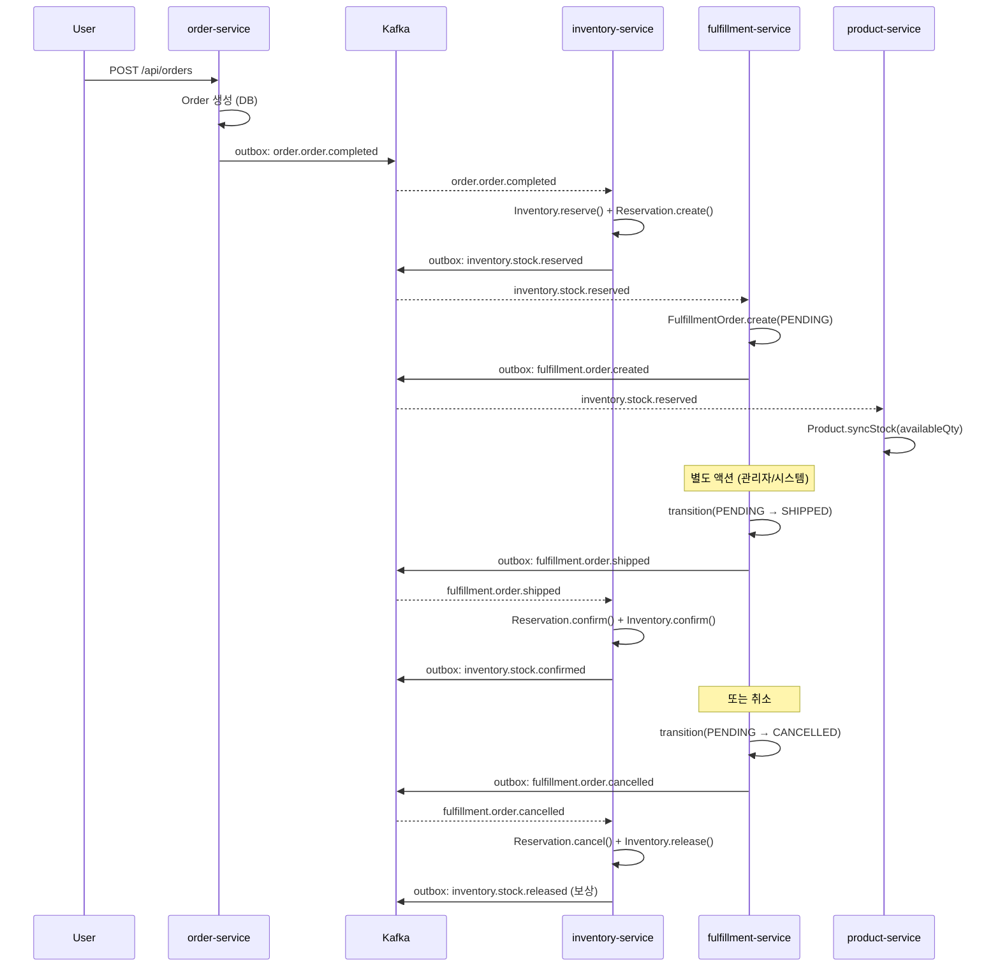

# 16. msa 의 Saga 구현 분석 (ADR-0011)

> Phase 3 시작. msa 의 inventory ↔ fulfillment Saga 코드를 직접 grep 하면서 구조를 분석한다.

## 1. ADR-0011 의 결정 사항

```
1. inventory + fulfillment 두 서비스 분리
2. Outbox 패턴으로 이벤트 발행의 원자성 보장
3. Saga Choreography 로 서비스 간 분산 트랜잭션 처리
```

Alternatives:
- ❌ Saga Orchestrator (Order 가 중앙 제어): "복잡도 증가, Phase 1 에서 과도"
- ❌ Redis 우선 전략: "인프라 복잡도, Phase 2 로"
- ❌ 단일 서비스 (Inventory+Fulfillment): "도메인 경계가 다름"

## 2. 전체 흐름도



## 3. 단계별 코드 분석

### 3.1 Order 측 (시작점, 추정)

`order/app/src/main/kotlin/com/kgd/order/.../OrderService.kt` 가 주문 완료 시 outbox 에 `order.order.completed` 저장. 동일 Outbox 패턴.

### 3.2 Inventory 측 — order.completed 수신 + reserve

`inventory/app/.../infrastructure/messaging/InventoryEventConsumer.kt`:

```kotlin
@KafkaListener(topics = ["order.order.completed"], groupId = "inventory-service", ...)
fun onOrderCompleted(record: ConsumerRecord<String, String>) {
    val event = mapper.readValue(record.value(), OrderCompletedEvent::class.java)

    // 멱등 체크 (ADR-0012)
    if (event.eventId.isNotBlank() && processedEventRepo.existsById(event.eventId)) {
        log.info("Duplicate event detected, skipping: eventId={}", event.eventId)
        return
    }

    if (event.items.isEmpty()) {
        log.warn("Order {} has no items, skipping reservation", event.orderId)
        return
    }

    for (item in event.items) {
        reserveStockUseCase.execute(ReserveStockUseCase.Command(
            orderId = event.orderId,
            productId = item.productId,
            warehouseId = 1L,    // ← 하드코딩, 개선 후보
            qty = item.quantity,
        ))
    }

    if (event.eventId.isNotBlank()) {
        processedEventRepo.save(ProcessedEventJpaEntity(event.eventId, "order.order.completed"))
    }
}
```

**관찰**:
- `warehouseId = 1L` 하드코딩 → 다중 창고 지원 시 라우팅 로직 필요
- 멱등 처리는 in-place (interceptor / aspect 로 추출 가능)

### 3.3 Inventory 측 — Reserve 실행 + Outbox 발행

`inventory/app/.../application/inventory/service/InventoryService.kt`:

```kotlin
@Transactional
override fun execute(command: ReserveStockUseCase.Command): ReserveStockUseCase.Result {
    // Redis fast-path: 사전 검증 (재고 부족 시 DB 접근 없이 빠르게 실패)
    cachePort?.let { cache ->
        val cacheResult = cache.reserveStock(command.productId, command.warehouseId, command.qty)
        if (cacheResult == null) {
            log.debug { "Redis fast-path: 재고 부족" }
            // DB 가 SSOT 이므로 DB 로 진행
        }
    }

    val inventory = inventoryRepository.findByProductIdAndWarehouseId(...)
        ?: throw BusinessException(ErrorCode.NOT_FOUND, "재고 없음")

    inventory.reserve(command.qty)  // 도메인 로직 (Optimistic Lock 적용됨)
    val savedInventory = inventoryRepository.save(inventory)

    syncCache(...)  // Write-Through

    val reservation = Reservation.create(
        orderId = command.orderId,
        productId = command.productId,
        warehouseId = command.warehouseId,
        qty = command.qty,
        ttlMinutes = RESERVATION_TTL_MINUTES,  // 30분
    )
    val savedReservation = reservationRepository.save(reservation)

    val event = InventoryEvent.StockReserved(
        productId = command.productId,
        warehouseId = command.warehouseId,
        qty = command.qty,
        orderId = command.orderId,
        availableQty = savedInventory.getAvailableQty(),
    )
    outboxPort.save("Inventory", inventoryId, "inventory.stock.reserved",
                    objectMapper.writeValueAsString(event))   // 같은 tx
    return ReserveStockUseCase.Result(...)
}
```

**Outbox + DB tx atomic** — `@Transactional` 안에서 inventory.save + reservation.save + outbox.save 모두 같이 commit.

### 3.4 Fulfillment 측 — stock.reserved 수신 + 풀필먼트 생성

`fulfillment/app/.../infrastructure/messaging/FulfillmentEventConsumer.kt`:

```kotlin
@KafkaListener(topics = ["inventory.stock.reserved"], containerFactory = "kafkaListenerContainerFactory")
fun onStockReserved(record: ConsumerRecord<String, String>) {
    val node = objectMapper.readTree(record.value())
    val eventId = node.get("eventId")?.asText() ?: ""
    val orderId = node.get("orderId").asLong()
    val warehouseId = node.get("warehouseId").asLong()

    if (eventId.isNotBlank() && processedEventRepository.existsById(eventId)) {
        log.info("Duplicate event detected, skipping: eventId={}", eventId)
        return
    }

    createFulfillmentUseCase.execute(CreateFulfillmentUseCase.Command(
        orderId = orderId,
        warehouseId = warehouseId,
    ))

    if (eventId.isNotBlank()) {
        processedEventRepository.save(ProcessedEventJpaEntity(eventId, "inventory.stock.reserved"))
    }
}
```

`fulfillment/app/.../application/fulfillment/service/FulfillmentService.kt`:

```kotlin
@Service
@Transactional
class FulfillmentService(...) : CreateFulfillmentUseCase, ... {

    override fun execute(command: CreateFulfillmentUseCase.Command): Result {
        // 동일 orderId + warehouseId 풀필먼트가 이미 존재하면 기존 것 반환 (자연 멱등)
        val existing = fulfillmentRepository.findByOrderIdAndWarehouseId(command.orderId, command.warehouseId)
        if (existing != null) {
            return Result(fulfillmentId = existing.id!!, ...)
        }

        val fulfillmentOrder = FulfillmentOrder.create(orderId = command.orderId, warehouseId = command.warehouseId)
        val saved = fulfillmentRepository.save(fulfillmentOrder)

        val event = FulfillmentEvent.Created(
            fulfillmentId = saved.id!!, orderId = saved.orderId, warehouseId = saved.warehouseId,
        )
        outboxPort.save("FulfillmentOrder", saved.id!!, "fulfillment.order.created",
                        objectMapper.writeValueAsString(event))
        return Result(...)
    }
}
```

**자연 멱등 추가 보호**: `findByOrderIdAndWarehouseId` 가 이미 있으면 기존 반환. processed_event 만 의존하지 않고 비즈니스 키로도 보호.

### 3.5 Fulfillment 측 — 상태 전이 (Shipped / Cancelled)

`fulfillment/domain/.../FulfillmentOrder.kt`:

```kotlin
fun transition(to: FulfillmentStatus): FulfillmentEvent {
    if (!status.canTransitionTo(to)) {
        throw InvalidFulfillmentStateException(status, to)
    }
    val from = status
    status = to
    return when (to) {
        FulfillmentStatus.SHIPPED -> FulfillmentEvent.Shipped(id, orderId)
        FulfillmentStatus.DELIVERED -> FulfillmentEvent.Delivered(id, orderId)
        FulfillmentStatus.CANCELLED -> FulfillmentEvent.Cancelled(id, orderId)
        else -> FulfillmentEvent.StatusChanged(id, orderId, from, to)
    }
}
```

→ **State Machine** 이 도메인에 캡슐화. `canTransitionTo` 가 허용된 전이를 enforce.

`FulfillmentService.execute(TransitionFulfillmentUseCase.Command)`:

```kotlin
override fun execute(command: TransitionFulfillmentUseCase.Command): Result {
    val fulfillmentOrder = fulfillmentRepository.findById(command.fulfillmentId)
        ?: throw FulfillmentNotFoundException(command.fulfillmentId)

    val event = fulfillmentOrder.transition(targetStatus)
    fulfillmentRepository.save(fulfillmentOrder)

    val eventType = when (event) {
        is FulfillmentEvent.Shipped -> "fulfillment.order.shipped"
        is FulfillmentEvent.Delivered -> "fulfillment.order.delivered"
        is FulfillmentEvent.Cancelled -> "fulfillment.order.cancelled"
        else -> "fulfillment.order.status-changed"
    }
    outboxPort.save("FulfillmentOrder", fulfillmentId, eventType,
                    objectMapper.writeValueAsString(event))
    return Result(...)
}
```

### 3.6 Inventory 측 — fulfillment.shipped 수신 → confirm

`inventory/.../InventoryEventConsumer.kt::onFulfillmentShipped`:

```kotlin
@KafkaListener(topics = ["fulfillment.order.shipped"], groupId = "inventory-service")
fun onFulfillmentShipped(record: ConsumerRecord<String, String>) {
    val event = mapper.readValue(record.value(), FulfillmentShippedEvent::class.java)
    if (event.eventId.isNotBlank() && processedEventRepo.existsById(event.eventId)) return

    val results = confirmStockByOrderUseCase.execute(
        ConfirmStockByOrderUseCase.Command(orderId = event.orderId)
    )
    // ... log
    processedEventRepo.save(ProcessedEventJpaEntity(event.eventId, "fulfillment.order.shipped"))
}
```

`InventoryService.execute(ConfirmStockByOrderUseCase.Command)`:

```kotlin
@Transactional
override fun execute(command: ConfirmStockByOrderUseCase.Command): List<Result> {
    val reservations = reservationRepository.findAllByOrderId(command.orderId)
        .filter { it.getStatus() == ReservationStatus.ACTIVE }

    return reservations.map { reservation ->
        reservation.confirm()
        reservationRepository.save(reservation)

        val inventory = inventoryRepository.findByProductIdAndWarehouseId(...)
        inventory.confirm(reservation.qty)
        val savedInventory = inventoryRepository.save(inventory)
        syncCache(...)

        val event = InventoryEvent.StockConfirmed(
            productId = reservation.productId, warehouseId = reservation.warehouseId,
            qty = reservation.qty, orderId = command.orderId,
            availableQty = savedInventory.getAvailableQty(),
        )
        outboxPort.save("Inventory", inventoryId, "inventory.stock.confirmed", ...)
        Result(...)
    }
}
```

### 3.7 Inventory 측 — fulfillment.cancelled 수신 → 보상 release

`InventoryEventConsumer::onFulfillmentCancelled`:

```kotlin
@KafkaListener(topics = ["fulfillment.order.cancelled"], groupId = "inventory-service")
fun onFulfillmentCancelled(record: ConsumerRecord<String, String>) {
    val event = mapper.readValue(record.value(), FulfillmentCancelledEvent::class.java)
    if (event.eventId.isNotBlank() && processedEventRepo.existsById(event.eventId)) return

    val results = releaseStockByOrderUseCase.execute(
        ReleaseStockByOrderUseCase.Command(orderId = event.orderId)
    )
    // ...
    processedEventRepo.save(ProcessedEventJpaEntity(event.eventId, "fulfillment.order.cancelled"))
}
```

→ **보상 트랜잭션**. fulfillment 취소 시 inventory 가 reserve 해제.

## 4. Saga 의 강점 진단

| 측면 | 평가 | 근거 |
|---|---|---|
| Choreography 결정 | ✓ | 단계 수 적음 (3-4), 도메인 자율 |
| Outbox 발행 원자성 | ✓ | DB tx + outbox INSERT 같이 commit |
| 멱등 Consumer | ✓ | processed_event + 비즈니스 키 자연 멱등 |
| 도메인 캡슐화 | ✓ | FulfillmentStatus state machine, Inventory.reserve/confirm/release |
| Optimistic Lock | ✓ | InventoryJpaEntity.@Version |
| 자동 보상 (TTL) | ✓ | Reservation TTL 30분, ReservationExpiry 스케줄러 |

## 5. Saga 의 약점 / 개선 후보

### 5.1 흐름 추적 어려움 (Choreography 의 본질)

- 한 주문이 어디까지 갔는지 한 곳에서 안 보임
- → **분산 추적 (OpenTelemetry + Jaeger)** 도입 검토 (19-improvements)

### 5.2 보상 흐름 부분적

- 결제 실패 시 즉시 inventory release 가 명시적이지 않음 (msa 의 order 코드 추가 분석 필요)
- 30분 TTL 만료로 풀려나는 게 fallback
- → 명시적 `payment.failed → inventory.release` 보상 이벤트 추가 검토

### 5.3 Saga 상태 추적 테이블 부재

- 운영 디버깅 시 "이 saga 가 어디서 멈췄나?" 가 곤란
- → `saga_instance` 테이블 또는 trace_id 전파로 보강

### 5.4 warehouseId 하드코딩

- `warehouseId = 1L` 으로 단일 창고 가정
- → 다중 창고 라우팅 로직 (재고/지역 기반) 필요

### 5.5 Reservation 의 PENDING 상태가 길어짐

- fulfillment 가 SHIPPED/CANCELLED 가지 않으면 30분간 stock 묶임
- → SLA 위반 시 알림 / 자동 escalation

### 5.6 Pivot Transaction 부재

- 외부 알림 / 이메일 발송 같은 보상 불가능 행위 없음 (현재) — 추가 시 처리 방안 사전 검토 필요

## 6. Reservation TTL + Expiry 의 우아함

```kotlin
// inventory/app/.../application/reservation/usecase/ExpireReservationsUseCase.kt
interface ExpireReservationsUseCase {
    fun execute(): Int
}

// ReservationExpiryService (Scheduled)
@Scheduled(...)
fun expire() {
    val expired = reservationRepository.findExpired()
    for (r in expired) {
        r.cancel()  // 보상 트랜잭션
        ...
    }
}
```

→ Saga 의 timeout 보장. **결제가 영원히 안 와도 재고가 영원히 묶이지 않음**. 좋은 설계.

## 7. Choreography vs Orchestration 재검토

현재 단계: 3-4 단계 (order → inventory → fulfillment → inventory)
- ✓ Choreography 적합

향후 단계가 5개 이상 늘면? (예: 결제 + 알림 + 정산 + 배송업체 통합)
- → Orchestration 전환 검토 가치 (Spring Statemachine, Temporal, AWS Step Functions)

## 8. 한 줄 진단

> msa 의 Saga = **Choreography + Outbox + 멱등 Consumer + Reservation TTL** = MSA 표준 분산 트랜잭션 베스트 프랙티스.
> 강점: 도메인 자율성, 발행/수신 원자성. 약점: 흐름 추적, 보상 부분 명시화 → 19-improvements 에서 ADR 후보로.

## 9. 재미있는 코드 스니펫

```kotlin
// fulfillment 의 자연 멱등 (CreateFulfillmentUseCase 의 핵심)
val existing = fulfillmentRepository.findByOrderIdAndWarehouseId(orderId, warehouseId)
if (existing != null) {
    return Result(fulfillmentId = existing.id!!, ...)
}
```

→ processed_event 가 7일만 보관해서 만료된 메시지가 재배달되어도 **비즈니스 키 자연 멱등** 으로 안전. 이중 방어 (defense in depth).
