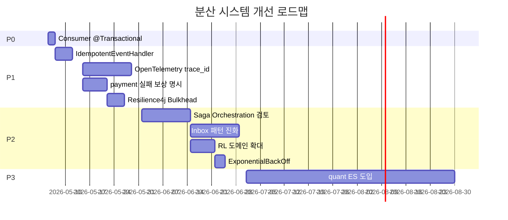

# 19. 개선 제안 + ADR 후보

> Phase 3 코드 분석에서 도출된 개선 제안 10가지. 우선순위와 ADR 필요 여부를 명시.

## 우선순위 매트릭스

| 우선순위 | 기준 |
|---|---|
| P0 (즉시) | 잠재 데이터 손상 / 운영 사고 직결 |
| P1 (이번 분기) | 운영 디버깅 비용 / 성능 / 일관성 |
| P2 (이번 반기) | 코드 품질 / 점진 개선 |
| P3 (장기) | 신규 도메인 또는 대규모 재설계 |

---

## 1. P0 — Consumer 메서드 @Transactional 적용

**문제**: 17 장에서 분석한 대로, consumer 메서드 자체가 `@Transactional` 이 아니라서 비즈니스 로직 (use case) 과 `processedEvent.save` 가 분리 tx. → reserve 후 save 실패 시 다음 재배달이 이중 reserve 가능.

**해법**:

```kotlin
@KafkaListener(topics = [...])
@Transactional
fun onOrderCompleted(record: ConsumerRecord<String, String>) {
    if (processedEventRepo.existsById(event.eventId)) return
    reserveStockUseCase.execute(...)
    processedEventRepo.save(...)
    // tx commit 시 둘 다 OK 또는 둘 다 rollback
}
```

또는 IdempotentEventHandler 추출 (아래 #2):

```kotlin
@KafkaListener(...)
fun on(record: ...) {
    val event = ...
    idempotent.handle(event.eventId, "topic") {
        useCase.execute(...)
    }
}
```

**ADR**: 불필요 (코드 수정 / ADR-0012 보완 commit).

---

## 2. P1 — IdempotentEventHandler 공통 모듈

**문제**: 6개+ consumer 메서드에 동일 boilerplate 10줄 반복. ADR-0012 의 4번 항목 "공통 모듈 제공" 이 명세돼 있는데 코드는 in-place.

**해법**: common 모듈에 추가.

```kotlin
// common/src/main/kotlin/com/kgd/common/messaging/IdempotentEventHandler.kt
@Component
class IdempotentEventHandler(
    private val processedEventRepo: ProcessedEventJpaRepository,
) {
    private val log = KotlinLogging.logger {}

    @Transactional
    fun <T> handle(eventId: String?, topic: String, action: () -> T): T? {
        if (eventId.isNullOrBlank()) {
            log.warn { "missing eventId, processing without dedup: topic=$topic" }
            return action()
        }
        if (processedEventRepo.existsById(eventId)) {
            log.info { "duplicate skipped: $eventId" }
            return null
        }
        val result = action()
        processedEventRepo.save(ProcessedEventJpaEntity(eventId, topic))
        return result
    }
}
```

**ADR**: ADR-0012 의 후속 commit (별도 ADR 없이).

---

## 3. P1 — Saga 의 trace_id 전파 (OpenTelemetry)

**문제**: Choreography Saga 의 본질적 약점 — 한 주문이 어디까지 갔는지 한 곳에서 안 보임. 운영 디버깅 비용 ↑.

**해법**:
1. Order 가 OrderCompleted 발행 시 `trace_id` (UUID) 생성, Kafka header 또는 payload 에 주입
2. 각 consumer 가 trace_id 를 받아서 로그 / 다음 이벤트 발행 시 propagate
3. OpenTelemetry agent + Jaeger / Tempo 백엔드

```kotlin
// outbox 발행 시
kafkaTemplate.send(topic, key, payload, headers = mapOf("X-Trace-Id" to traceId))

// consumer
val traceId = record.headers().lastHeader("X-Trace-Id")?.value()?.toString(StandardCharsets.UTF_8)
MDC.put("traceId", traceId)
try {
    useCase.execute(...)
} finally {
    MDC.remove("traceId")
}
```

**ADR**: ADR 후보 — "Distributed Tracing with OpenTelemetry"
- Decision: OpenTelemetry agent (auto-instrumentation) + Jaeger / Tempo
- 모든 Kafka 이벤트에 trace context 전파 표준화

---

## 4. P1 — payment 실패 시 명시적 inventory 보상

**문제**: 16장 진단 — 결제 실패 시 inventory release 가 명시적이지 않고 30분 TTL 후 expire 로 회복.

**시나리오**:
```
order 생성 → inventory reserve OK → payment 호출 → payment 실패
→ order 가 cancelled 로 마감, 그러나 inventory 는 30분간 묶임
```

**해법**:
1. order 가 payment 실패 시 `order.payment.failed` 또는 `order.cancelled` 발행
2. inventory 가 consume → release 즉시 실행

```kotlin
// inventory/InventoryEventConsumer
@KafkaListener(topics = ["order.payment.failed", "order.order.cancelled"])
fun onOrderCancelled(record: ...) {
    // 멱등 + releaseStockByOrder
    releaseStockByOrderUseCase.execute(...)
}
```

**ADR**: 보강 commit + ADR-0011 부록 (별도 ADR 불필요)

---

## 5. P1 — Resilience4j Bulkhead 명시화

**문제**: 18장 — semantic bulkhead 만 있고, Resilience4j Bulkhead 명시 적용 부재. 외부 호출 폭주 시 thread/connection 모두 점유될 위험.

**해법**: Order 의 외부 호출에 Bulkhead 추가.

```kotlin
@Bean
fun bulkheadRegistry(): BulkheadRegistry = BulkheadRegistry.of(
    BulkheadConfig.custom()
        .maxConcurrentCalls(20)
        .maxWaitDuration(Duration.ofMillis(50))
        .build()
)

// PaymentAdapter
private val bulkhead = bulkheadRegistry.bulkhead("payment-service")
override suspend fun requestPayment(...): PaymentResult {
    return Bulkhead.decorateSuspendFunction(bulkhead) {
        circuitBreaker.executeSuspendFunction {
            webClient.post()...
        }
    }.invoke()
}
```

**ADR**: 불필요 (ADR-0015 의 "Bulkhead" 항목 구현)

---

## 6. P2 — Saga Orchestration 도입 검토 (단계 5+ 시점)

**문제**: 현재 단계 ≤ 4 라 Choreography 가 적합하나, 향후 다음이 추가되면:
- 결제 + 알림 + 정산 + 배송업체 통합 + 회계 → 7+ 단계
- 추적성 / 감사 요구 ↑

**옵션**:
| 옵션 | 비용 | 효과 |
|---|---|---|
| Spring Statemachine | 중간 (코드만) | 단순 워크플로우 OK |
| Temporal | 큼 (인프라) | 강력, 클라우드 제공자도 있음 |
| AWS Step Functions | 큼 (vendor) | managed, 락인 위험 |
| Camunda Zeebe | 큼 | BPM 엔터프라이즈 |

**권장**: 단계 5+ 또는 BPM/감사 요구 시점에 Spring Statemachine → Temporal 단계적.

**ADR**: ADR 후보 — "Saga Orchestrator 도입 (조건부 트리거)"
- Decision: Choreography 유지 + 5+ 단계 / BPM 요구 시 Temporal 도입
- Trigger: 새 Saga 가 5+ 단계 또는 SLA/감사 요구

---

## 7. P2 — Outbox / Inbox 패턴 명시화 (Inbox 보강)

**문제**: 현재 processed_event 는 Inbox 의 dedup 부분만 구현. **payload 영속 저장 + 재시도 큐 역할** 부재.

**현재 한계**:
- DLT 로 간 이벤트의 재처리는 운영자 수동
- 같은 이벤트 처리에 다른 결과를 만든 이력 추적 어려움

**해법**: processed_event → inbox_event 로 진화

```sql
CREATE TABLE inbox_event (
    event_id        VARCHAR(36) PRIMARY KEY,
    topic           VARCHAR(100) NOT NULL,
    payload         TEXT NOT NULL,
    received_at     DATETIME(6) NOT NULL,
    processed_at    DATETIME(6) NULL,
    process_status  VARCHAR(20) NOT NULL DEFAULT 'PENDING',  -- PENDING/SUCCESS/FAILED
    error_message   TEXT NULL,
    retry_count     INT NOT NULL DEFAULT 0
);
```

→ DLT 재처리 시 inbox 에서 직접 재실행 가능. 감사 가능.

**ADR**: ADR-0012 후속 ADR 후보.

---

## 8. P2 — Rate Limiting 도메인 확대 + Flash Sale 모드 외부화

**문제**: 18장 — inventory route 만 RL 적용. 다른 route 도 폭주 위험.

**해법**:
1. order, search 등 critical route 에도 RL 적용 (각각 다른 limit)
2. RedisRateLimiter 의 (replenishRate, burstCapacity) 를 환경변수화
3. Flash Sale 모드 시 환경변수 전환으로 즉시 5배 (`spring.cloud.gateway.routes[].filters[].args.redis-rate-limiter.replenishRate=500`)

```kotlin
@Configuration
class RateLimiterConfig(
    @Value("\${msa.ratelimit.replenish-rate:100}") private val replenishRate: Int,
    @Value("\${msa.ratelimit.burst-capacity:200}") private val burstCapacity: Int,
) {
    @Bean
    fun redisRateLimiter(): RedisRateLimiter = RedisRateLimiter(replenishRate, burstCapacity, 1)
}
```

**ADR**: 불필요 (ADR-0015 보강 commit)

---

## 9. P2 — Kafka Consumer ExponentialBackOff + Jitter

**문제**: 현재 FixedBackOff(1s, 3) → DLT. thundering herd 미방어.

**해법**:

```kotlin
@Bean
fun errorHandler(template: KafkaTemplate<String, String>): DefaultErrorHandler {
    val recoverer = DeadLetterPublishingRecoverer(template) { ... }
    val backOff = ExponentialBackOff(1000L, 2.0).apply {
        maxInterval = 8000L
        maxElapsedTime = 30000L
    }
    // Spring Kafka 에 jitter 직접 지원 안 하면 customizer 로 오버라이드
    return DefaultErrorHandler(recoverer, backOff).apply {
        addNotRetryableExceptions(BusinessException::class.java)
    }
}
```

**ADR**: 불필요 (ADR-0015 보강).

---

## 10. P3 — Event Sourcing 도입 검토 (quant 우선)

**문제**: 일부 도메인은 audit / 시간 여행 요구가 본질적.

**1순위 후보**: quant (자동매매)
- 거래 내역이 본질적으로 stream
- 회계 audit 절대
- "이 시점의 포지션이 어땠는지" 시간 여행 query 가 가치 있음

**2순위**: order / payment
- 회계 audit
- 고객 분쟁 시 이력 재구성
- 단, ES 도입 비용 큼 — 별도 도메인 (ledger) 로 시작 가능

**3순위**: auth.role
- 누가 언제 어떤 role 부여했는지 audit

**비추**: product, search, wishlist, member — CRUD 단순

**ADR**: ADR 후보 — "Event Sourcing 도입 검토 (quant)"
- Decision: quant 의 ledger / position 도메인에 ES 도입 검토
- Phase 1: 별도 event_log 테이블 (현재 데이터 모델 병행)
- Phase 2: replay 기반 read model 구축
- Phase 3: 주력 도메인 ES 전환

---

## 종합 로드맵



## ADR 후보 정리

| ADR 후보 | 우선순위 | 설명 |
|---|---|---|
| ADR-002X Distributed Tracing (OpenTelemetry) | P1 | trace_id 전파, Jaeger 백엔드 |
| ADR-002X Saga Orchestrator 조건부 도입 | P2 | Temporal / Spring Statemachine 트리거 |
| ADR-002X Inbox 패턴 보강 | P2 | processed_event → inbox_event 진화 |
| ADR-002X quant Event Sourcing | P3 | 자동매매 ledger ES 도입 |

## 한 줄 요약

> P0 1개 + P1 4개 + P2 4개 + P3 1개. 가장 시급한 건 **consumer @Transactional + IdempotentEventHandler 공통 모듈 추출**.
> ADR 후보 4개 — 분산 추적, Saga Orchestrator, Inbox, ES — 가 향후 6개월 분산 시스템 진화의 큰 그림.
