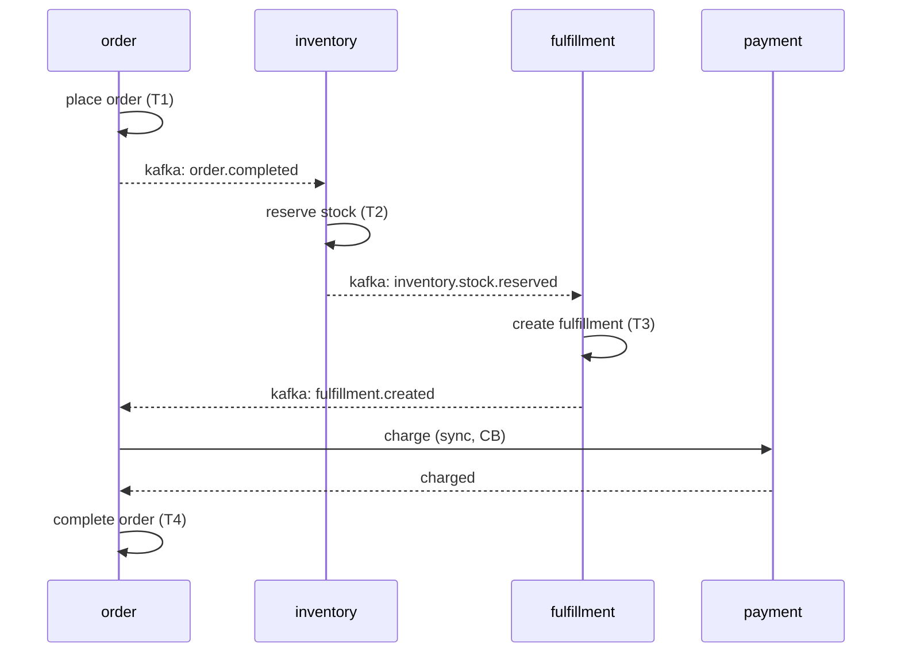
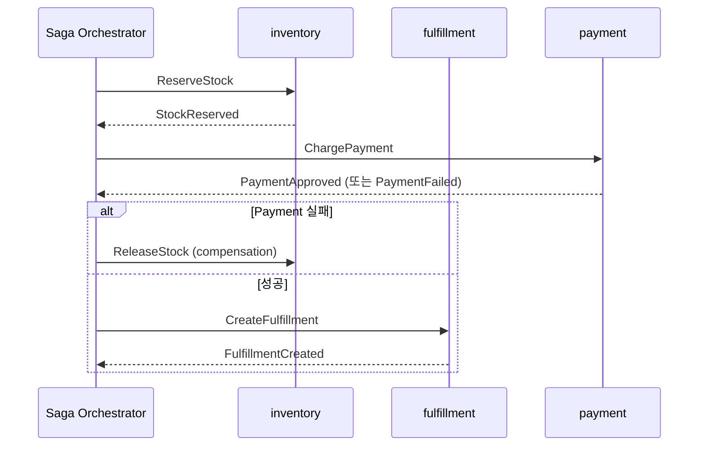
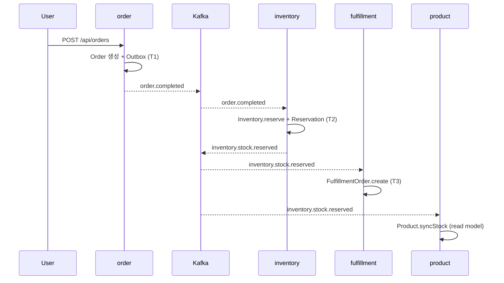

# 22. Saga 보상 트랜잭션 심화 — Choreography vs Orchestration / TCC / Workflow Engine

> 08-saga-pattern 이 입문, 16-codebase-saga 가 msa 의 inventory ↔ fulfillment 구현 분석이라면, 본 문서는 **보상 트랜잭션의 본질적 어려움 (멱등성 / 부분 실패 / 가시성)** 과 **TCC / workflow engine 같은 절충안** 을 깊게 다룬다. msa 의 order → inventory → fulfillment, payment, gifticon 발급 흐름을 grounding 으로 사용한다.

---

## §1. Saga 의 본질 — ACID 의 Atomicity 를 포기

### 1.1 단일 DB ACID 가 안 되는 이유

서비스마다 DB 가 분리된 MSA 환경에서 단일 트랜잭션 (`@Transactional`) 으로 묶을 수 없다.

```
[order DB]    ──X── 단일 TX 불가능
[inventory DB]
[payment DB]
[gifticon DB]
```

대안:
| 대안 | 한계 |
|---|---|
| 2PC (Two-Phase Commit) | blocking, coordinator SPOF, performance, 외부 시스템 (PG / 카드사) 가 XA 안 지원 |
| 3PC | 여전히 비동기 환경에서 deadlock 가능 |
| Distributed snapshot (Chandy-Lamport) | 적용 영역이 분석 / 디버깅 용도 |
| **Saga** | atomicity 포기 + 보상으로 사후 회복 |

### 1.2 Saga 의 핵심 정의 (Garcia-Molina 1987)

> 일련의 **로컬 트랜잭션 (T1, T2, ..., Tn)** 으로 구성된 시퀀스.
> 각 Ti 는 **로컬 ACID** 를 만족.
> 어느 단계가 실패하면 이미 완료된 단계들에 대해 **보상 트랜잭션 (compensating transaction, C1, ..., Ck)** 을 역순 실행.

```
정상 흐름:    T1 → T2 → T3 → T4 → done
실패 흐름:    T1 → T2 → T3 → T4(✗) → C3 → C2 → C1 → aborted
```

### 1.3 Saga 가 포기한 것 vs 얻은 것

| ACID 속성 | Saga | 비고 |
|---|---|---|
| Atomicity | ✗ | 보상으로 "의미적 atomicity" |
| Consistency | △ | eventual |
| Isolation | ✗✗ | 가장 큰 약점 — 다른 Saga 가 중간 상태 봄 |
| Durability | ✓ | 각 Ti 는 local DB commit |

**가장 위험한 것은 Isolation 의 부재** — 다른 Saga 가 commit 안 된 (= 곧 보상될) 상태를 보고 의사결정해버림 → "dirty read" 와 유사한 문제.

→ §6.4 에서 자세히.

---

## §2. Choreography vs Orchestration — 흐름 모델 비교

### 2.1 Choreography — 이벤트 기반, 중앙 조정자 없음

각 서비스가 이벤트를 발행/구독, 다음 단계를 자기가 결정.



**장점**:
- 서비스 간 **decoupling 최고** — 각 서비스는 자기 이벤트만 알면 됨
- 새 서비스 추가가 쉬움 (구독만 추가, 기존 서비스 코드 변경 X)
- 단일 SPOF 없음

**단점**:
- **흐름이 코드에 분산** — 어떤 이벤트가 어떤 다음 단계를 트리거하는지 한눈에 안 보임
- **순환 의존**: A → B → A 같은 cycle 이 디자인 실수로 생기기 쉬움
- **보상 흐름도 분산** — 누가 어떤 보상을 책임지는지 모호
- 디버깅 / 추적이 어려움 (분산 trace 필수)

### 2.2 Orchestration — 중앙 조정자 (Saga Orchestrator)



**장점**:
- **흐름이 한 곳에 모임** — Saga 의 시퀀스를 코드로 한 번에 읽을 수 있음
- 보상 흐름이 명확
- 새 단계 추가 시 orchestrator 만 수정
- 모니터링 / 추적 쉬움 (orchestrator 의 state)

**단점**:
- **Orchestrator 가 SPOF** — 가용성 / 확장성 별도 설계 필요
- **God object 위험** — orchestrator 가 모든 도메인 지식을 가짐, 결합도 ↑
- orchestrator 자체의 state 영속화 / 복구 (workflow engine 도입 동기)

### 2.3 비교 표

| 측면 | Choreography | Orchestration |
|---|---|---|
| 결합도 | 낮음 (이벤트만) | 중간 (orchestrator 가 모든 서비스 호출) |
| 가시성 | 낮음 (분산) | 높음 (한 곳) |
| 디버깅 | 어려움 | 쉬움 |
| 새 단계 추가 | 구독자 추가 | orchestrator 수정 |
| 단일 장애점 | 없음 | orchestrator |
| 적합 규모 | 단계 수 적음, 단순 | 단계 수 많음, 복잡한 분기 |
| 복잡한 분기 | 어려움 | 자연스러움 |
| msa 적용 | inventory ↔ fulfillment (ADR-0011) | (현재 미적용, gifticon 발급 시 검토) |

### 2.4 실전 결정 가이드

```
단계 수 ≤ 4 + 분기 단순 + 결합도 최소화 우선
  → Choreography (msa 의 ADR-0011 선택)

단계 수 > 4, 또는 복잡한 분기 / SLA 추적 필요
  → Orchestration (Temporal / Camunda / Step Functions)

혼합형도 가능:
  - 큰 흐름은 Orchestration
  - 각 단계 내부는 Choreography
```

---

## §3. Compensating Transaction 의 본질적 어려움

### 3.1 왜 보상이 어려운가

물리적으로 시간을 되돌릴 수 없으므로 **의미적 역연산** 으로 보상한다. 그러나 의미적 역연산은:

1. **항상 가능하지 않다** — "이메일 발송" 은 회수 불가
2. **부작용이 추가된다** — 환불도 거래 기록을 남김 (취소가 아닌 새 트랜잭션)
3. **순서 의존이다** — C2 가 C1 을 전제로 함
4. **부분 실패 가능** — C2 자체가 실패하면 어떻게?

### 3.2 보상 가능성 (Compensability) 분석

각 단계를 작성 전에 다음 표를 채워라.

| Ti | 부작용 | Ci 정의 | Ci 가능? | 비고 |
|---|---|---|---|---|
| 재고 예약 | reserved_qty += n | reserved_qty -= n | ✓ | 멱등 가능 |
| 결제 | 카드 승인 | 환불 (refund) | △ | PG 별 다름, T+1 정산 후엔 매입 취소 |
| 주문 생성 | order row insert | status = CANCELLED | ✓ | soft delete |
| 이메일 발송 | 메일 서버 큐 | (불가) | ✗ | "취소 메일 추가 발송" 으로 우회 |
| 외부 API 호출 (멱등성 X) | unknown | (불가) | ✗ | 외부 시스템에 보상 API 있어야 |
| 배송 출고 | 차량 출발 | 회수 요청 | ✗ | 비즈니스 의사결정 |

**원칙**:
- 보상 불가능한 단계는 **Saga 의 마지막 단계 (pivot 이후)** 에 둠
- pivot 이전: 모두 보상 가능해야 함

### 3.3 Pivot transaction — Saga 의 분기점

```
Ti들 ── Pivot ── Tj들
  ↓                ↓
보상 가능        보상 불가
(retriable)     (must succeed)
```

**Pivot 의 정의**: 이후 단계가 **반드시 성공해야 하거나 보상 불가** 한 지점.

예: 주문 흐름의 pivot
```
[보상 가능 영역]
order 생성 → inventory 예약 → payment 승인
                                    │
                                    ▼ pivot (결제 성공 후엔 무조건 진행)
[retriable until success 영역]
fulfillment 생성 → 배송 출고 → 알림 발송
```

→ pivot 이후는 retriable transaction (재시도로 결국 성공시킴), 보상 X.

### 3.4 보상 자체의 멱등성

보상이 retry 되거나 중복 호출될 수 있다. → **반드시 멱등** 이어야.

```kotlin
// inventory 의 release (보상) — 멱등 보장 패턴
fun release(reservationId: ReservationId) {
    val reservation = reservationRepo.findById(reservationId) ?: return  // already released
    if (reservation.status == CANCELLED) return                          // already cancelled
    reservation.cancel()                                                 // status 전이
    inventory.release(reservation.qty)                                   // available_qty += qty
}
```

→ 두 번 호출해도 같은 결과. 09-idempotency 의 패턴 + 17-codebase-idempotent-ssot 참조.

### 3.5 Forward recovery vs Backward recovery

| 방식 | 의미 | 용도 |
|---|---|---|
| Backward recovery | 실패 시 보상으로 되돌림 | 일반 Saga (보상 가능 영역) |
| Forward recovery | 실패해도 retry 로 결국 성공시킴 | pivot 이후 (must succeed) |

**Forward recovery 의 전제**:
- 단계가 멱등
- 외부 시스템도 멱등 (또는 idempotency key 지원)
- 영속화된 retry queue (DLQ → 재처리)

msa 의 outbox + retry 가 forward recovery 의 인프라.

---

## §4. TCC (Try-Confirm-Cancel) — 2PC 와 Saga 의 절충

### 4.1 TCC 의 3-phase

```
Try:     자원을 reservation (예약, soft hold)
         → 모든 단계가 성공했는지 확인
Confirm: 모든 Try 가 OK 면 → 실제 commit
Cancel:  하나라도 Try 실패 → 모든 reservation 풀기
```

### 4.2 Saga 와의 차이

| 측면 | Saga | TCC |
|---|---|---|
| Isolation | 없음 (다른 Saga 가 중간 상태 봄) | reservation 으로 부분 격리 |
| Compensation | 의미적 역연산 | 미리 정의된 cancel API |
| 단계 수 | 가변 (n 개) | 고정 3-phase |
| 외부 시스템 | 보상 API 필요 | Try / Confirm / Cancel API 모두 필요 |
| 복잡도 | 중간 | 높음 (각 도메인이 3 API 제공) |

### 4.3 msa 의 TCC 사례 — inventory 예약

msa 의 inventory 는 사실상 TCC 의 Try 역할을 한다.

```
Try:     inventory.reserve(productId, qty)
         → reserved_qty += qty (available_qty 는 안 줄어듦)
         → Reservation row 생성 (status=RESERVED)

Confirm: inventory.confirm(reservationId)
         → reserved_qty -= qty, available_qty -= qty
         → Reservation status = CONFIRMED

Cancel:  inventory.release(reservationId)
         → reserved_qty -= qty (원복)
         → Reservation status = CANCELLED
```

파일 grounding:
- `/Users/gideok-kwon/IdeaProjects/msa/inventory/domain/src/main/kotlin/com/kgd/inventory/domain/inventory/model/Inventory.kt` — `reserve`, `confirm`, `release` 메서드
- `/Users/gideok-kwon/IdeaProjects/msa/inventory/domain/src/main/kotlin/com/kgd/inventory/domain/reservation/model/Reservation.kt` — Reservation 도메인 모델
- `/Users/gideok-kwon/IdeaProjects/msa/inventory/domain/src/main/kotlin/com/kgd/inventory/domain/reservation/model/ReservationStatus.kt` — RESERVED / CONFIRMED / CANCELLED 상태

### 4.4 TCC 의 함정

1. **Try 의 만료** — 예약이 영원히 안 풀리면 자원 낭비. msa 는 `ReservationExpiryService` 로 TTL (Time To Live, 만료 시간) 만료 처리:
   ```
   /Users/gideok-kwon/IdeaProjects/msa/inventory/app/src/main/kotlin/com/kgd/inventory/application/reservation/service/ReservationExpiryService.kt
   ```
2. **Confirm / Cancel 메시지 손실** — 멱등 + retry 필수.
3. **Try 후 Cancel 받기 전에 같은 자원 재예약** — version (optimistic lock) 으로 보호.

### 4.5 TCC vs Saga 선택

| 상황 | 선택 |
|---|---|
| 자원 점유가 핵심 (재고, 좌석, 객실) | TCC |
| 부작용이 많음 (이메일 / 알림 / 외부 API) | Saga |
| 강한 isolation 필요 | TCC |
| 단순한 흐름 + 결합도 ↓ 우선 | Saga |
| 외부 시스템 통합 (PG / 카드사) | Saga (외부는 TCC 못 함) |

---

## §5. Saga state 추적 — 어디에 저장하는가

Saga 가 진행 중일 때 그 state 는 어디 영속화되는가? 옵션 4 가지.

### 5.1 옵션 1 — DB 테이블 (가장 단순)

```sql
CREATE TABLE saga_instance (
    saga_id          VARCHAR(36) PRIMARY KEY,
    saga_type        VARCHAR(64),
    current_step     VARCHAR(64),
    state            VARCHAR(16),  -- RUNNING/COMPLETED/COMPENSATING/FAILED
    payload          JSON,
    created_at       TIMESTAMP,
    updated_at       TIMESTAMP
);
```

- 장점: 단순, 익숙
- 단점: orchestrator 코드를 직접 짜야 함 (state machine, retry, timeout 모두)

### 5.2 옵션 2 — Kafka log (event-sourced Saga)

Saga 의 모든 단계 이벤트를 Kafka topic 에 append. state 는 이벤트의 fold.

- 장점: 자연스러운 audit trail, replay 가능
- 단점: state 조회 비용 (replay), event 스키마 evolution

### 5.3 옵션 3 — Workflow engine (Temporal / Camunda / Step Functions)

전용 엔진이 state 영속화 + retry + timeout + visibility 를 모두 제공.

| 엔진 | 모델 | 특징 |
|---|---|---|
| Temporal (Cadence 후속) | Workflow as Code (Java/Go/TS) | durable execution, "코드처럼 보이지만 영속적" |
| Camunda 8 (Zeebe) | BPMN 모델 | 비주얼 모델링, 비즈니스 분석가 친화 |
| AWS Step Functions | JSON state machine (ASL) | AWS 통합, serverless |
| Netflix Conductor | JSON DSL | open source, 단순 |
| Apache Airflow | Python DAG | batch / data pipeline 강점 |

### 5.4 옵션 4 — Outbox + 이벤트 기반 (msa 의 선택)

각 서비스가 자기 DB 에 outbox + processed_event 를 가지고 이벤트 기반으로 자기 단계 진행.

- Saga "instance" 라는 개념이 명시적으로 없음 — 이벤트의 흐름이 곧 Saga
- 장점: 인프라 단순 (Kafka + DB만), choreography 와 자연스럽게 결합
- 단점: 전체 가시성 부족 (별도 trace 필요)

→ msa 가 ADR-0011 에서 채택. 13~17 deep file 들이 이 패턴 분석.

### 5.5 비교

| 옵션 | 인프라 비용 | 가시성 | 복잡도 처리 | retry/timeout |
|---|---|---|---|---|
| DB 테이블 | 낮음 | 중간 | 직접 구현 | 직접 구현 |
| Kafka log | 중간 | 높음 (replay) | 중간 | Kafka retry / DLQ |
| Workflow engine | 높음 (인프라 ↑) | 매우 높음 | 엔진 제공 | 엔진 제공 |
| Outbox/이벤트 | 낮음 | 낮음 (분산) | 단순함만 가능 | 각 서비스 책임 |

→ 시작은 옵션 4, 흐름이 복잡해지면 옵션 3 으로 이주가 일반적 패턴.

---

## §6. Saga 의 함정 (실제로 만나는 문제들)

### 6.1 Compensation 의 비멱등성

```kotlin
// 안티패턴 — 두 번 호출하면 두 번 환불됨
fun refund(orderId: OrderId, amount: Money) {
    paymentGateway.refund(orderId, amount)  // 외부 호출
    paymentRepo.markRefunded(orderId)
}
```

**해법**:
1. PG 의 idempotency key (대부분 지원)
2. local idempotency 테이블 + status 체크
3. 17-codebase-idempotent-ssot 의 SSOT (Single Source of Truth) 패턴

### 6.2 부분 실패 — Compensation 자체가 실패

```
T1 → T2 → T3(✗) → C2 → C1(✗)
```

이때 C1 이 영원히 실패하면? → "compensation deadletter" 로 격리 + 운영자 알림.

**해법**:
1. C1 retry with exponential backoff + jitter
2. 일정 횟수 실패하면 DLQ + alert
3. 운영자가 수동 개입 (보상 반대 트랜잭션 또는 데이터 보정)

→ msa 의 패턴: outbox 의 retry → DLQ 토픽으로 격리 (ADR-0015 resilience strategy).

### 6.3 Long-running transaction 의 visibility

Saga 가 수 분 ~ 수 시간 걸릴 수 있다 (수동 confirm 필요한 경우). 이 동안:

- 사용자에게 어떤 status 를 보여줄까? "처리 중"? "결제 완료"?
- 운영 대시보드에서 어떤 단계인지 보이는가?

**해법**:
1. 사용자 대상: 명확한 progressive status (PENDING → PAYMENT_DONE → SHIPPING → DELIVERED)
2. 운영자 대상: Saga visibility 도구 (Temporal UI / Camunda Cockpit / 자체 admin)
3. 분산 trace (`traceId` 를 Saga 전체에 전파)

### 6.4 Read-your-writes 일관성 깨짐 (Isolation 부재)

가장 큰 함정. 다른 Saga 또는 같은 사용자의 다른 요청이 **commit 안 된 상태** 를 본다.

예시:
```
[Saga A]                              [Saga B]
T1: order 생성 (status=PENDING)
T2: inventory 예약                    -- B 가 inventory 조회 → 99개 (예약 반영)
T3: payment 실패 → C2                 -- B 가 99개 보고 의사결정
                                      -- 사실은 100개 였어야 함
```

**대책 패턴들**:

| 패턴 | 설명 | 비용 |
|---|---|---|
| Semantic lock | "내가 처리 중" 마크 (status=PENDING) — 다른 Saga 는 PENDING 인 row 를 안 봄 | row 가 lock 되는 효과 |
| Commutative update | 절대값 set 대신 delta (-1, +1) — 순서 무관 | 단순 case 만 |
| Pessimistic view | 사용자에겐 "예약된 만큼 빼고" 보여줌 | UX 변화 |
| Reread + version | 매번 최신 읽기 + version 체크로 stale 거부 | 충돌 시 retry 폭증 |
| By value | 결정에 필요한 값을 Saga 시작 시 snapshot | snapshot stale 위험 |

msa 의 적용:
- **Semantic lock**: `Reservation.status = RESERVED` — 다른 Saga 가 reserved_qty 만큼 invisible 처리
- **Optimistic lock**: `@Version` (Inventory entity 의 version 필드)

### 6.5 보상의 시간 의존성

T2 의 보상 C2 가 가능한 시간이 제한될 수 있음.

예: 결제 환불은 "T+0 (당일)" 은 승인 취소, "T+1 이후" 는 매입 취소 — 다른 API.

**해법**: 보상 시점에 따라 분기 + 최악의 경우 운영자 manual 처리.

### 6.6 순환 / cascade 보상

A → B → C 순서로 진행했다면 보상은 C → B → A 순서로 역순. 그러나:

- **이벤트 순서가 뒤집힐 수 있음** (Kafka partition 다르면)
- B 의 보상이 A 의 보상을 트리거해야 하는 경우 → 이벤트 cycle 위험

**해법**: Saga 의 step 마다 sequence number + correlation id, 보상도 동일 sequence 따라.

---

## §7. Saga vs Outbox + Inbox — 신뢰성의 양면

Saga 가 흐름 모델이라면, Outbox + Inbox 는 **메시지 신뢰성** 패턴. 두 개는 직교 — 함께 쓴다.

### 7.1 Outbox — 발신측 신뢰성

```
[Application TX] {
    update business table;
    insert outbox_event;
} commit;

[Outbox publisher (별도 프로세스)] {
    select from outbox_event where not_published;
    publish to kafka;
    mark as published;
}
```

→ 비즈니스 변경과 이벤트 발행이 **단일 local TX** 안에서 보장.

### 7.2 Inbox / Idempotent Consumer — 수신측 신뢰성

```
on_message(event) {
    if (processed_event.exists(event.id)) return;  // 중복 무시
    
    @Transactional {
        process business logic;
        processed_event.insert(event.id);
    }
}
```

→ at-least-once 메시지를 effectively-once 로.

### 7.3 둘이 만나는 곳 = Saga 의 신뢰성

```
[Saga step Ti]
  - 비즈니스 변경 + outbox insert (단일 TX) → at-least-once 보장
  - Kafka 발행 (publisher / CDC)

[Saga step Ti+1]
  - inbox / processed_event 체크 (멱등) → 중복 거부
  - 비즈니스 변경 + 다음 outbox insert (단일 TX)

  ... 반복 ...
```

msa 의 구체 구현:
- Outbox: 14-outbox-inbox-cdc.md + ADR-0011 + ADR-0032 (order 까지 확장)
- Inbox: ADR-0029 (`processed_event` 복합 PK 표준화)
- Saga 흐름: 16-codebase-saga.md

### 7.4 Outbox 없이 Saga 구현하면?

```
@Transactional {
    update business;
    kafka.send(event);  // ← TX 안에서 외부 IO!
}
```

문제:
- DB commit 후 Kafka 발행 실패 → 이벤트 유실
- Kafka 발행 후 DB rollback → ghost event

→ **Saga 는 Outbox 없이는 못 한다**. 결합도 ↓ 같지만 신뢰성 0.

---

## §8. Workflow Engine — Temporal / Cadence / Step Functions

### 8.1 Workflow as Code — Temporal 의 핵심 개념

> "코드처럼 보이지만 durable. 함수가 일시 중단되어 며칠 후 같은 변수 상태로 깨어남."

```typescript
// Temporal workflow 예시 (TypeScript)
async function orderSagaWorkflow(orderId: string): Promise<void> {
  try {
    await reserveInventory(orderId);                      // Activity 1
    await chargePayment(orderId);                         // Activity 2
    await createFulfillment(orderId);                     // Activity 3
    await sendConfirmationEmail(orderId);                 // Activity 4
  } catch (e) {
    if (e is PaymentFailure) {
      await releaseInventory(orderId);                    // Compensation
    }
    throw e;
  }
}
```

핵심:
- **Workflow** = 결정론적 로직 (await 마다 event log 에 기록 → replay 로 복원)
- **Activity** = 외부 IO (멱등, retry 자동)
- **History** = 모든 step 의 영속 log

### 8.2 Durable execution 의 마법

```
1. workflow function 시작
2. await reserveInventory() 시점에 history 에 ScheduleActivity 기록, 함수 일시 중단
3. activity 가 결과 반환 → history 에 ActivityCompleted 기록
4. workflow 가 다시 깨어나서 다음 라인 실행
   - 노드가 죽었어도 history 를 replay 해서 같은 변수 상태로 복원
5. 다음 await ... 반복
```

→ workflow 코드는 며칠/몇 달 동안 살아남을 수 있음. 노드 죽고 새 노드가 history 받아서 이어 실행.

### 8.3 Saga vs Workflow Engine

| 측면 | DIY Saga (msa 의 방식) | Workflow Engine |
|---|---|---|
| 인프라 | Kafka + DB | Temporal / Zeebe / Step Functions |
| 코드 표현 | 이벤트 listener 분산 | 단일 workflow 함수 |
| 가시성 | 분산 trace 필요 | 엔진 UI 자동 |
| Retry / Timeout | 직접 구현 | 엔진 제공 |
| Compensation | 직접 작성 | 엔진 헬퍼 (saga API) |
| 학습 곡선 | 낮음 | 높음 |
| 운영 비용 | 낮음 | 별도 클러스터 |
| 적합 규모 | 단계 ≤ 5 | 단계 > 5, 분기 복잡 |

### 8.4 언제 도입을 검토해야 하나

- 단계 ≥ 5 + 분기 / 조건부 보상 / 인간 개입 (manual approval)
- SLA visibility 가 비즈니스 요구
- 같은 패턴의 흐름이 5+ 종류 (재사용 ROI)

→ msa 는 현재 옵션 4 (Outbox + 이벤트). gifticon 발급의 3-step 흐름 (구매 → 권한 등록 → 알림) 같은 곳이 도입 후보.

---

## §9. msa 의 Saga 적용 분석

### 9.1 ADR-0011 의 결정과 한계

```
1. inventory + fulfillment 두 서비스 분리
2. Outbox 패턴으로 이벤트 발행의 원자성 보장
3. Saga Choreography 로 서비스 간 분산 트랜잭션 처리
```

(`/Users/gideok-kwon/IdeaProjects/msa/docs/adr/ADR-0011-inventory-fulfillment-service.md`)

### 9.2 실제 흐름 — order → inventory → fulfillment



실패 시 보상:
```
F: PENDING → CANCELLED (운영자 / timeout)
F-->>K: fulfillment.order.cancelled
K-->>I: fulfillment.order.cancelled
I->>I: Reservation.cancel + Inventory.release (C2)
I-->>K: inventory.stock.released  -- 보상 이벤트
```

파일 grounding:
- `/Users/gideok-kwon/IdeaProjects/msa/order/app/src/main/kotlin/com/kgd/order/messaging/OrderEventConsumer.kt` — order 측 이벤트 소비
- `/Users/gideok-kwon/IdeaProjects/msa/inventory/app/src/main/kotlin/com/kgd/inventory/infrastructure/messaging/InventoryEventConsumer.kt` — inventory 측 이벤트 소비
- `/Users/gideok-kwon/IdeaProjects/msa/inventory/app/src/main/kotlin/com/kgd/inventory/infrastructure/messaging/OutboxPollingPublisher.kt` — outbox publisher
- `/Users/gideok-kwon/IdeaProjects/msa/fulfillment/app/src/main/kotlin/com/kgd/fulfillment/infrastructure/persistence/idempotency/JpaProcessedEventRepositoryAdapter.kt` — 멱등 보장

### 9.3 ADR-0029 의 보강 — 멱등 표준화

`processed_event` 의 복합 PK 마이그레이션:
```
old: PK (event_id)                    -- 같은 이벤트 다른 listener 충돌
new: PK (consumer_name, event_id)     -- consumer 별 멱등 추적
```

→ 한 이벤트가 여러 listener 에서 소비될 때 (예: `inventory.stock.reserved` 가 fulfillment + product 양쪽으로) 각자 멱등 추적 가능.

### 9.4 ADR-0032 의 보강 — Cancellation 즉시 보상

본래 ADR-0011 은 fulfillment 가 trigger 하는 보상만 다룸. 그러나 **사용자가 주문 취소** 하면? → ADR-0032 가 `inventory.onOrderCancelled` listener 추가:

```
order: cancel → outbox: order.cancelled
  → inventory: onOrderCancelled → Reservation.cancel + Inventory.release
```

→ pivot 이전 사용자 취소도 보상 흐름으로 정상 처리.

### 9.5 향후 후보 — gifticon 발급의 3-step Saga

미구현 영역. gifticon 서비스 설계 시 검토할 흐름:

```
T1: order 의 gifticon 항목 결제 완료
T2: gifticon 발급 (외부 PG / 발급사 API 호출)
T3: 사용자 wallet 에 gifticon 등록 + 알림
```

특징:
- T2 가 외부 시스템 호출 → 멱등 키 + retry 필수
- T3 의 알림은 보상 불가 → pivot 이후
- 만약 T2 가 발급 후 T3 가 실패하면? → forward recovery (retry 로 결국 wallet 등록)

→ Saga + TCC 혼합 (T2 의 외부 시스템이 TCC 지원하면 활용) 고려할 만한 영역.

---

## §10. 면접 5문답

### Q1. "Saga 가 어떻게 ACID 의 원자성을 흉내내나요? 한계는?"

> Saga 는 진짜 atomicity 를 못 풀고 **의미적 atomicity** 만 제공. 모든 step 이 성공하면 그 효과가 그대로, 실패하면 보상 트랜잭션으로 사후 회복. 가장 큰 한계는 **Isolation 부재** — 다른 Saga 가 commit 안 된 (= 곧 보상될) 중간 상태를 볼 수 있음. 해법은 semantic lock (status=PENDING 으로 invisible 처리), commutative update, optimistic lock 등으로 우회. 그리고 **보상 불가능한 단계는 pivot 이후로** 옮겨 forward recovery 로 처리.

### Q2. "Choreography vs Orchestration 어떻게 결정하나요?"

> 결합도 낮추기 + 단계 수 적음 + 단순 흐름이면 Choreography (msa 의 ADR-0011 선택). 단계 수 많고 복잡한 분기 / SLA 추적이 필요하면 Orchestration. msa 는 inventory ↔ fulfillment 처럼 단계 4 이하라 Choreography 로 충분하지만, 같은 흐름이 더 복잡해지거나 인간 승인 같은 long-running step 이 들어오면 Temporal 같은 workflow engine 도입이 자연스러운 다음 단계.

### Q3. "보상 트랜잭션 작성 시 가장 흔한 실수는?"

> **멱등성 무시**. 보상은 retry / 중복 호출 가능성이 본질. 두 번 환불, 두 번 cancel 되면 비즈니스 사고. msa 는 inventory.release 가 Reservation status 를 체크해서 이미 CANCELLED 면 no-op 처리. 또 하나 흔한 실수는 **보상 자체의 실패 시나리오 누락** — C2 가 실패하면? retry + DLQ + 운영자 alert 까지 설계해야 진짜 신뢰성. 마지막으로 **외부 시스템의 보상 가능성** 을 사전 검증 안 하고 Saga 설계하는 것 — PG 의 환불 가능 시간, 외부 API 의 idempotency key 지원 여부를 처음부터 확인해야.

### Q4. "TCC 와 Saga 의 차이는?"

> Saga 는 각 step 이 즉시 commit 하고 실패 시 의미적 역연산. TCC 는 Try 단계에서 자원만 reservation 하고 모든 Try 가 OK 일 때만 Confirm 으로 실제 commit, 하나라도 실패면 Cancel 로 reservation 해제. msa 의 inventory 는 사실상 TCC — Reservation row 가 Try, confirm/release 가 Confirm/Cancel. 자원 점유가 본질이면 TCC, 부작용 (이메일, 알림, 외부 API) 이 많으면 Saga 가 자연스러움. 외부 시스템 (PG / 카드사) 은 TCC 못 하므로 그 단계는 Saga 식 보상으로.

### Q5. "Outbox 없이 Saga 가능한가요?"

> 이론적으론 가능하지만 **이벤트 신뢰성 0**. `@Transactional` 안에서 `kafka.send()` 호출하면 (1) DB commit 후 발행 실패 시 이벤트 유실, (2) 발행 후 DB rollback 시 ghost event. 둘 다 Saga 의 정합성을 깨뜨림. msa 는 ADR-0011 에서 Outbox 를 Saga 의 전제로 삼음 — 단일 local TX 안에 비즈니스 변경 + outbox row insert 를 묶고, 별도 publisher 가 outbox 를 polling (Phase 1) 또는 CDC (Debezium, Phase 2) 로 발행. 수신측은 inbox / processed_event 로 멱등 보장 (ADR-0029).

---

## §11. 한 줄 요약 + 더 읽기

> **Saga = ACID 의 Atomicity 포기 + 보상으로 사후 회복.**
> 본질적 어려움은 Isolation 부재 (semantic lock 으로 우회) + 보상의 멱등성 + pivot 이후의 forward recovery.
> Choreography 는 단순한 흐름, Orchestration 은 복잡한 흐름 / Workflow engine 은 long-running.
> Outbox + Inbox 는 Saga 의 신뢰성 인프라 — 둘은 항상 같이.
> msa 는 ADR-0011 에서 Choreography + Outbox + Idempotent Consumer 로 시작, ADR-0029/0032 로 보강.

### 더 읽기

- Garcia-Molina & Salem, "Sagas" (SIGMOD 1987) — 원논문
- Chris Richardson, "Microservices Patterns" Ch.4-5 — Saga / 멱등성 표준 정리
- Pat Helland, "Life beyond Distributed Transactions" (CIDR 2007) — 분산 트랜잭션 회피의 철학
- microservices.io: https://microservices.io/patterns/data/saga.html
- Temporal docs: https://docs.temporal.io/concepts/what-is-a-workflow
- AWS Step Functions: https://docs.aws.amazon.com/step-functions/
- Camunda 8 / Zeebe: https://docs.camunda.io/
- msa 의 ADR-0011, ADR-0012, ADR-0029, ADR-0032

### Cross-ref

- 07-2pc-3pc.md — Saga 가 회피한 2PC
- 08-saga-pattern.md — Saga 입문 (본 문서의 전제)
- 09-idempotency.md — 보상 멱등성의 구체 패턴
- 10-retry-backoff.md — retry / DLQ
- 14-outbox-inbox-cdc.md — Saga 의 신뢰성 인프라
- 16-codebase-saga.md — msa 의 inventory ↔ fulfillment 코드 분석
- 17-codebase-idempotent-ssot.md — processed_event SSOT 패턴
