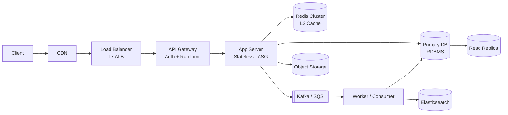

# 01. 시스템 설계 공통 프레임워크

> 어떤 시나리오라도 30분 안에 풀어낼 수 있는 "공통 절차"를 손에 익힌다.
> 핵심: **"질문 → 숫자 → 그림 → 데이터 → 병목"** 5단계 + 빌딩 블록 카탈로그.

---

## 1. 표준 절차 (5단계)

### Step 1. Requirement Clarification (요구사항 명확화) — 4분

면접관이 짧게 던진 문제는 **항상 모호하다**. 다음 4가지 축으로 좁혀라.

| 축 | 질문 예시 |
|---|---|
| **Functional** | "Read 만? Write 만? 사용자가 직접 등록?" |
| **Non-Functional** | "Latency 목표? Availability? Consistency?" |
| **Scale** | "DAU 100만? 1억? 글로벌? 한국만?" |
| **Out of scope** | "결제? 검색? 추천? 어디까지?" |

> 중요: **Out of scope 명시**가 시간 절약. "이번엔 결제 PG 연동은 빼고 진행할게요" 한 마디로 5분을 번다.

**Non-Functional 표준 표 (외워두기)**:

| 항목 | Tier 1 (결제·로그인) | Tier 2 (조회) | Tier 3 (분석) |
|---|---|---|---|
| Availability | 99.99% | 99.9% | 99.0% |
| P99 Latency | 100ms | 500ms | 5s |
| Consistency | Strong | Read-your-writes | Eventual |
| Durability | 11 9s | 11 9s | 9 9s |

본 msa 프로젝트는 ADR (Architecture Decision Record, 아키텍처 결정 기록)-0025에서 이 표를 강제 입력으로 둔다.

### Step 2. Capacity Estimation (용량 산정) — 5분

**암산용 매직 넘버 (10년차는 외워야 함)**:

```
1일 = 86,400 초 ≈ 100,000 초 (10^5)
1년 = 365 × 86,400 ≈ 30M 초 (3 × 10^7)

DAU 100만 × 일 평균 10 read → 일 1천만 read → QPS (Queries Per Second, 초당 쿼리 수) 100
DAU 1000만 × 일 평균 10 read → 일 1억 read → QPS 1,000
DAU 1억 × 일 평균 10 read → 일 10억 read → QPS 10,000

피크 = 평균 × 3 ~ 5
글로벌은 평탄, 한국은 저녁 피크 (× 5)

1KB 글 × 1억 = 100GB / 일
1MB 사진 × 1천만 = 10TB / 일
```

**산정 공식 (이 4개만 알면 됨)**:

1. **QPS** = (DAU × 사용자당 일일 요청 수) ÷ 86,400 × 피크 배수
2. **Storage / 일** = (이벤트 수 × 평균 크기)
3. **Bandwidth (in/out) / s** = QPS × 평균 응답 크기
4. **Cache size** = Active set × 평균 크기 × replica 계수 (1.2~1.5)

> 면접에서는 **"숫자 근거"가 핵심**. "MAU 300만, DAU/MAU 30%, 평균 요청 5회 → 약 500 QPS, 피크 2,500 QPS" 식으로 항상 식과 함께 말한다.

### Step 3. API Design — 3분

REST 기준 3-5개 엔드포인트만 적는다. **인증, 페이지네이션, 멱등성 키**는 명시.

```
POST   /api/v1/{resource}
       Headers: Idempotency-Key: {uuid}
       Body: { ... }
GET    /api/v1/{resource}/{id}
GET    /api/v1/{resource}?cursor=...&limit=20
PUT    /api/v1/{resource}/{id}
DELETE /api/v1/{resource}/{id}
```

**원칙**:
- 페이지네이션은 **cursor 기반** (offset은 deep paging에서 폭사)
- 멱등성 키는 **POST/PUT/DELETE** 의 의무 헤더로 본다
- 응답 포맷은 본 msa 의 `ApiResponse<T>` 패턴 (data / code / message) 참고

### Step 4. High-Level Architecture — 5분

표준 다이어그램(거의 모든 시나리오에 동일).



**조립 룰**:
- Read-heavy → CDN (Content Delivery Network, 콘텐츠 전송 네트워크) + Cache + Read Replica 강조
- Write-heavy → Queue + Worker + Idempotency 강조
- 실시간 → WebSocket / SSE (Server-Sent Events) + presence store
- 검색 → ES + 색인 파이프라인 (Kafka CDC (Change Data Capture, 변경 데이터 캡처))

### Step 5. Deep Dive — 10분

면접관이 가장 점수 주는 구간. 다음 6가지 중 **2개를 골라 깊이 판다**.

| Deep Dive 카드 | 언제 꺼내나 |
|---|---|
| 샤딩 키 설계 | DB 단일 인스턴스로 못 버틸 때 |
| Cache 전략 | Read-heavy + 핫 키 |
| Idempotency | 결제·주문·이벤트 컨슈머 |
| Hot partition | 인기 상품, 셀럽 피드, 인기 검색어 |
| 장애 대응 | DB primary 다운, PG 장애, Region 다운 |
| 일관성 모델 | Read-your-writes, Causal, Eventual |

> **꼬리 질문 대비**: "DAU 10x로 늘면?" → 항상 "병목이 어디로 옮겨갈지"로 답한다. (DB → Cache → MQ → Network 순으로 옮겨감)

---

## 2. 빌딩 블록 카탈로그

| 블록 | 대표 제품 | 언제 쓰나 | 주의점 |
|---|---|---|---|
| Load Balancer | ALB / NGINX | 모든 시스템 entry | L4 vs L7 구분, sticky session 회피 |
| API Gateway | Spring Cloud Gateway, Kong | Auth + Rate Limit + Routing | 비즈니스 로직 금지 (본 msa 규칙) |
| App Server | Spring Boot, Node | 비즈니스 로직 | **Stateless 강제** (HPA 가능) |
| RDBMS | MySQL, PostgreSQL | 트랜잭션, 정합성 | 샤딩은 마지막 카드 |
| NoSQL (KV) | Redis, DynamoDB | 캐시, 카운터, 세션 | TTL 필수 |
| NoSQL (Document) | MongoDB | 스키마 유연성 | 트랜잭션 약함 |
| Search | Elasticsearch / OpenSearch | Full-text, ranking | 색인 지연 (eventually consistent) |
| Message Queue | Kafka, SQS, RabbitMQ | 비동기, 이벤트 소싱 | exactly-once는 환상, 멱등성으로 풀자 |
| Object Storage | S3, GCS | 큰 파일 | presigned URL 패턴 |
| CDN | CloudFront, CloudFlare | 정적 자원, 글로벌 | invalidation 비용 |
| Stream | Kafka Streams, Flink | 실시간 집계 | watermark, exactly-once |
| Time-series | ClickHouse, TimescaleDB | 분석, 메트릭 | append-only 패턴 |

> 본 msa는 거의 모든 칸을 사용 — 그래서 답변 grounding 자료가 풍부.

---

## 3. 데이터 모델링 체크리스트

```
□ 1. 엔티티 ER 다이어그램 (3-5개 핵심)
□ 2. PK 전략 (Auto-Increment / UUID / Snowflake / KSUID)
□ 3. 인덱스 (조회 패턴 기반, 1개 테이블 5개 이내)
□ 4. 샤딩 키 (user_id? hash? range?)
□ 5. 파티셔닝 (시간 기반? 해시?)
□ 6. Read Replica 토폴로지
□ 7. 일관성 (Strong / Read-your-writes / Eventual)
□ 8. TTL / 만료 / 아카이빙
```

**PK 선택 가이드**:
- Auto-Increment → 단일 DB는 OK, 샤딩하면 충돌
- UUID v4 → 분산 OK, 인덱스 fragmentation 심함
- Snowflake (트위터) → 시간 정렬 + 분산 OK, 시계 동기화 필요
- KSUID / ULID → Snowflake 대체, 27자 base62, 정렬 가능

본 msa는 단일 DB 가정으로 Auto-Increment 사용 중 → 샤딩 시 마이그레이션 필요 (10번 e-Commerce 회고 참조).

---

## 4. 공통 패턴: 캐시 / 큐 / 멱등성

### 4-1. 캐시 패턴

| 패턴 | 설명 | 사용 |
|---|---|---|
| Cache-Aside | App이 직접 read-through, 미스 시 DB 후 set | 가장 흔함, 본 msa product 서비스 |
| Read-Through | Cache 라이브러리가 자동 로드 | Redis + lib (Spring `@Cacheable`) |
| Write-Through | 쓰기 시 cache + DB 동시 | 강한 정합성, 느림 |
| Write-Behind | 쓰기 cache → 비동기 DB | 빠름, 데이터 손실 위험 |
| Refresh-Ahead | TTL 임박 시 미리 갱신 | 핫 키 |

**Cache miss + Stampede 방어**: Redis SETNX + 백그라운드 갱신. 본 msa는 ADR-0007에서 정책 정리.

### 4-2. 큐 패턴

| 패턴 | 설명 | 본 msa |
|---|---|---|
| Work Queue | 단일 컨슈머 그룹 | search-indexer |
| Pub/Sub | 다중 컨슈머 fan-out | order.completed → analytics, search |
| DLQ | 실패 메시지 격리 | ADR-0015 |
| Outbox | DB 트랜잭션 + 이벤트 발행 분리 | (개선 후보, 12번 문서) |

### 4-3. 멱등성 패턴

`Idempotency-Key` 헤더 + Redis SETNX(TTL 24h) + DB Unique 제약 3중 방어.
본 msa ADR-0012 (Idempotent Consumer) 가 표준.

```kotlin
// 의사코드
fun handle(event: Event) {
    val key = "idempotency:${event.id}"
    if (!redis.setIfAbsent(key, "1", Duration.ofDays(1))) {
        log.info("Duplicate event ignored: ${event.id}")
        return
    }
    process(event)  // DB unique 제약으로 한 번 더 방어
}
```

---

## 5. Trade-off 박스 — 면접 고득점 키

면접관이 **"왜 그 선택을?"** 물으면 항상 trade-off 표를 꺼낸다.

| 결정 | A | B | 본 msa 선택 |
|---|---|---|---|
| 통신 | 동기 REST | 비동기 Kafka | 둘 다 (read sync, mutation event) |
| 일관성 | Strong (DB 트랜잭션) | Eventual (이벤트) | Cross-service는 Eventual |
| 캐시 | Cache-aside | Write-through | Cache-aside (단순) |
| Discovery | Eureka | K8s DNS | K8s DNS (ADR-0019) |
| 인증 | Session | JWT | JWT (gateway 검증) |
| 결제 | 동기 (블로킹) | 비동기 (콜백) | 동기 + CircuitBreaker |

> Trade-off는 **"이걸 골랐기 때문에 무엇을 포기했나"**까지 말해야 점수.

---

## 6. 장애 시나리오 표준 답안

| 장애 | 1차 방어 | 2차 방어 |
|---|---|---|
| DB primary 다운 | Read replica 승격 (자동 failover) | 30초 readonly 모드 |
| Cache 다운 | DB로 직접 (degraded) | Stampede 방어 (mutex) |
| Kafka 다운 | DB outbox에 적재 | Replay |
| PG 결제 장애 | CircuitBreaker open | 결제 대기열 + 재시도 |
| Region 다운 | DNS failover | active-active multi-region |
| Hot key | Local cache + jitter | Key 분산 (suffix) |

본 msa ADR-0015 (Resilience Strategy) 에서 표준화.

---

## 7. 마무리: 30분 면접 체크리스트

```
□ 요구사항 5문장 (Functional 3 + NFR 2)
□ 추정 4숫자 (DAU, QPS, Storage, Bandwidth)
□ API 3개 (POST + GET + List)
□ High-level 1장 (mermaid 5-7개 노드)
□ DB 스키마 2-3 테이블 + PK + 샤딩 키
□ Deep dive 2개 (캐시 / 멱등성 / 샤딩 중)
□ Trade-off 1개 명시
□ 장애 시나리오 1개 답변
□ 마지막 30초 요약
```

이 체크리스트가 곧 다음 시나리오 문서들의 공통 골격이다.
