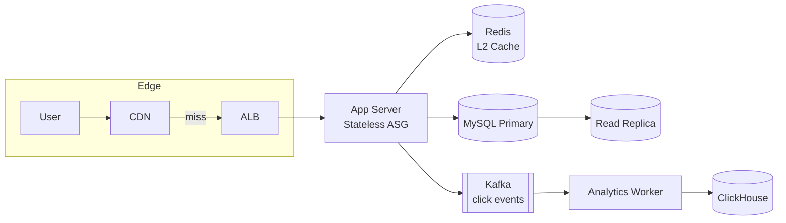

# 02. URL Shortener — bit.ly / TinyURL

> 시스템 설계 면접의 "헬로 월드". 단순해 보이지만 **충돌 처리, 캐시 계층화, 분석 데이터 분리**가 진짜 채점 포인트.

---

## 1. 요구사항 (Requirements)

### Functional

1. 긴 URL → 짧은 URL (단축)
2. 짧은 URL → 원본 URL로 redirect (조회)
3. (선택) 사용자별 단축 URL 목록, 만료 시간, 커스텀 alias, 클릭 수 통계

### Non-Functional

| 항목 | 목표 |
|---|---|
| Read : Write 비율 | **100 : 1** (Read-heavy) |
| Latency P99 | 단축 200ms / Redirect 50ms |
| Availability | 99.99% (다운되면 사용자가 즉시 인지) |
| Durability | URL 매핑은 영구 (사용자 신뢰 기반) |
| Consistency | Read-your-writes (방금 만든 URL이 즉시 동작해야 함) |

### Out of scope

- 사용자 인증/권한 (별도 IDP)
- 악성 URL 필터링 (별도 모더레이션)
- 빌링·결제

---

## 2. 용량 산정 (Capacity Estimation)

### 가정

- 신규 단축 URL: **1억 / 월** = 약 40 / 초 (write QPS)
- Read : Write = 100 : 1 → **read QPS 4,000** (피크 12,000)
- 평균 URL 길이: 원본 100 bytes, 단축 7자 + 메타 50 bytes
- 보관 기간: 5년

### 계산

```
write QPS  = 100M / (30 × 86,400) ≈ 40
read QPS   = 40 × 100 = 4,000 (피크 ×3 = 12,000)

Storage / 5년
  = 100M / month × 12 × 5 = 6 billion records
  = 6B × 150 bytes ≈ 900GB → 1TB 수준 (단일 RDBMS OK)

Cache (active set 20%)
  = 1.2B × 150 bytes ≈ 180GB → Redis Cluster 6 shards × 32GB OK

Bandwidth
  = 12,000 read × 500 byte (헤더 포함) ≈ 6MB/s → 단일 ALB OK
```

> **숫자가 말해주는 것**: 5년 1TB는 단일 MySQL로 충분. 샤딩이 아니라 **캐시와 redirect 응답속도**가 본질.

---

## 3. API Design

```
POST /api/v1/shorten
  Headers: Idempotency-Key, Authorization
  Body: { "url": "https://example.com/...", "alias": "myalias", "ttl": 86400 }
  Response: { "shortKey": "aZ3kL9q", "shortUrl": "https://sho.rt/aZ3kL9q" }

GET /{shortKey}              ← 핵심 hot path
  → 302 Location: <원본 URL>

GET /api/v1/shorten/{shortKey}/stats
  → { "clicks": 1234, "uniqueVisitors": 800, ... }

DELETE /api/v1/shorten/{shortKey}
```

**redirect 핵심**:
- HTTP **302** (임시) vs **301** (영구) — 분석을 위해 **302 권장** (브라우저 캐시 회피)
- `Cache-Control: private, max-age=0` 으로 통계 누락 방지

---

## 4. 핵심 알고리즘: 단축 키 생성

### 4-1. Base62 인코딩

```
charset = "0-9A-Za-z" (62자)
7자 길이 = 62^7 ≈ 3.5 trillion (3.5조) → 5년치 60억 충분
6자 길이 = 62^6 ≈ 56 billion (560억) → 5년치 충분하지만 충돌 잦음
```

```kotlin
fun encodeBase62(num: Long): String {
    val charset = "0123456789ABCDEFGHIJKLMNOPQRSTUVWXYZabcdefghijklmnopqrstuvwxyz"
    val sb = StringBuilder()
    var n = num
    while (n > 0) {
        sb.append(charset[(n % 62).toInt()])
        n /= 62
    }
    return sb.reverse().toString().padStart(7, '0')
}
```

### 4-2. ID 생성 전략 비교

| 전략 | 장점 | 단점 | 추천 |
|---|---|---|---|
| **Auto-Increment + Base62** | 충돌 0, 단순 | 단일 DB 종속, 추측 가능 (보안 약함) | 단일 DB 시 OK |
| **MD5/SHA Hash + 앞 7자** | 분산 친화 | 충돌 시 재시도 필요 | 분산 환경 |
| **Snowflake ID + Base62** | 분산 + 시간 정렬 | 64bit → 10-11자 (긴 편) | 글로벌 분산 |
| **Pre-generated Pool** | 초고속 (DB 안 침) | 풀 관리 부담 | 초고QPS |

**충돌 시나리오 (해시 방식)**:

```kotlin
fun shorten(url: String, attempt: Int = 0): String {
    val candidate = base62(md5(url + attempt).take(7))
    return when (val existing = repo.findByKey(candidate)) {
        null -> repo.save(candidate, url).also { return candidate }
        else -> if (existing.url == url) candidate     // 같은 URL이면 재사용
                else shorten(url, attempt + 1)         // 다른 URL이면 재시도
    }
}
```

> **재시도 한도**: 5회 초과 시 length를 1자 늘리는 fallback.

### 4-3. 본 msa의 ID 채번 전략 참고

본 프로젝트는 단일 MySQL Auto-Increment를 사용 중 (ADR-0006). URL Shortener도 동일 방식이 가장 단순하고 안전.

```sql
-- url_mapping
id          BIGINT PRIMARY KEY AUTO_INCREMENT
short_key   VARCHAR(10) UNIQUE
original_url TEXT
user_id     VARCHAR(36)
created_at  DATETIME
expires_at  DATETIME NULL
```

`short_key = base62(id)` — id 1 = "1", id 100 = "1c" 식. 7자 패딩은 미관용.

---

## 5. High-Level Architecture



**핵심 설계**:
1. **CDN에 redirect 응답 캐싱** → 가장 큰 win. `Cache-Control` 5분~1시간.
2. **Redis 미스율 < 1%** 목표. Active set 전부 Redis.
3. **클릭 이벤트는 Kafka로 비동기** → DB write QPS 격리.
4. ClickHouse는 통계용 OLAP (OLTP 절대 금지).

---

## 6. DB 스키마

```sql
CREATE TABLE url_mapping (
    id            BIGINT PRIMARY KEY AUTO_INCREMENT,
    short_key     VARCHAR(10) NOT NULL UNIQUE,
    original_url  TEXT NOT NULL,
    user_id       VARCHAR(36),
    created_at    DATETIME DEFAULT CURRENT_TIMESTAMP,
    expires_at    DATETIME NULL,
    INDEX idx_user (user_id, created_at)
);

CREATE TABLE click_events_daily (   -- ClickHouse
    short_key   String,
    click_date  Date,
    clicks      AggregateFunction(count, UInt64),
    unique_users AggregateFunction(uniq, String)
) ENGINE = AggregatingMergeTree()
ORDER BY (click_date, short_key);
```

---

## 7. Scale-out 전략

### 7-1. Read 스케일링

```
1단계: Cache hit ratio 99% 목표 (Redis Cluster, LRU)
2단계: Read Replica 3-5대 (replica lag < 100ms)
3단계: CDN edge에 short_key → URL 매핑 캐싱 (Lambda@Edge)
```

### 7-2. Write 스케일링 (DAU 100x 시)

| 단계 | 임계치 | 조치 |
|---|---|---|
| 1 | < 1k QPS | Auto-Increment + 단일 DB |
| 2 | 1k ~ 10k | Snowflake ID + Cassandra/DynamoDB |
| 3 | > 10k | Pre-generated Key Pool (Redis에서 발급) |

### 7-3. Hot key 문제

특정 URL이 viral 되면 → **Local cache (Caffeine) + Jitter TTL** 로 stampede 방어.

```kotlin
@Cacheable(value = ["short"], cacheManager = "caffeineCM")
fun resolve(shortKey: String): String? = redis.get(shortKey) ?: db.findByKey(shortKey)?.url
```

---

## 8. Trade-off 박스

| 결정 | 선택 | 포기한 것 |
|---|---|---|
| ID 전략 | Auto-Increment + Base62 | 분산 확장성 (단일 DB 종속) |
| 클릭 통계 | Kafka 비동기 | Strong consistency (1-2초 지연) |
| Redirect 응답 | 302 | 브라우저 캐시 효율 |
| 만료 처리 | Lazy (조회 시 검사) | 즉시 정리 (스토리지 약간 낭비) |
| Custom alias | 사용자 입력 허용 | 충돌 가능성 (UNIQUE 제약으로 방어) |

---

## 9. 장애 시나리오

| 장애 | 영향 | 대응 |
|---|---|---|
| Redis 다운 | DB로 직접 → P99 50→200ms | 1-2분 견딤, Stampede 방어 mutex |
| MySQL primary 다운 | write 5분 정지 | Read는 replica로 계속, write는 retry |
| Kafka 다운 | 클릭 통계 손실 | DB outbox로 보관 후 replay |
| CDN 캐시 invalidation | 5분간 hit ratio 50% | TTL 짧게 (5분) — 장애 자동 복구 |

---

## 10. 실제 시스템 사례

| 서비스 | 특징 |
|---|---|
| **bit.ly** | Cassandra + Memcached, 자체 ID 생성 서비스 |
| **TinyURL** | MySQL + 해시 기반 (충돌 시 알고리즘 변경) |
| **goo.gl (deprecated)** | Spanner + Bigtable + Borg |
| **Twitter t.co** | 모든 트윗 URL 자동 단축, 보안 필터링 강력 |

**공통점**: 모두 redirect는 **Edge에서 끝낸다** (CDN/Edge function).

---

## 11. 면접 30초 요약

> "URL Shortener는 read-heavy 100:1 시스템. 핵심은 (1) Base62 + Auto-Increment ID로 단순하게 채번, (2) 99% Cache hit + CDN edge caching으로 redirect 50ms P99, (3) 클릭 이벤트는 Kafka로 비동기 분리해 OLAP과 OLTP를 분리합니다. 본 msa의 product 서비스 캐싱과 Kafka 이벤트 발행 패턴을 그대로 차용 가능합니다."

---

## 부록 A. 흔한 함정 (면접 주의)

1. **301 redirect 추천 → 통계 누락**: 브라우저가 캐시. 302가 정답.
2. **UUID로 단축 키 → 너무 김**: 사용자 친화 안 됨. Base62 7자.
3. **샤딩 먼저 얘기**: 1TB는 단일 DB로 OK. 캐시부터.
4. **클릭 카운트를 동기 update**: Hot row 락 폭사. Kafka로 비동기.
5. **만료 cron**: 수십억 row scan은 비용. Lazy 검사 + cold storage 이관.
