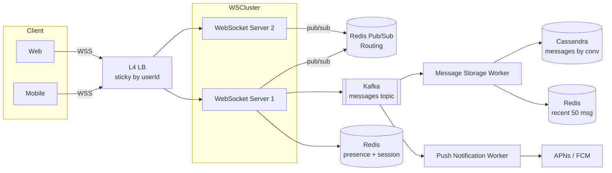

# 03. Chat System — 실시간 메시징

> Stateful + Write-heavy + 실시간성. **연결 유지, 순서 보장, 오프라인 큐, presence**가 4대 난제.

---

## 1. 요구사항

### Functional

1. 1:1 DM, 그룹 채팅 (~500명)
2. 텍스트 + 이미지/파일 첨부
3. 온라인 상태 (presence)
4. Read receipt (읽음 표시)
5. Push 알림 (오프라인 시)
6. 메시지 검색 (out of scope 가능)

### Non-Functional

| 항목 | 목표 |
|---|---|
| Message delivery | At-least-once + 순서 보장 |
| End-to-end latency | P99 200ms |
| Connection capacity | 서버당 100k WebSocket 동시 |
| Availability | 99.99% |
| Durability | 메시지 영구 보관 (사용자 삭제 시까지) |

### Out of scope

- E2E encryption (Signal Protocol)
- 영상 통화 (별도 미디어 서버)
- 봇/통합

---

## 2. 용량 산정

```
DAU = 5천만 (KakaoTalk 한국 가정)
1인당 일 메시지 = 50개
일 메시지 = 50M × 50 = 2.5B / 일
write QPS (Queries Per Second, 초당 쿼리 수) = 2.5B / 86400 ≈ 30,000 (피크 ×3 = 100k)

메시지 평균 크기 = 200 bytes
일 storage = 2.5B × 200 bytes = 500GB / 일
연 storage = 500GB × 365 = 180TB (콜드 스토리지 필요)

WebSocket 동시 연결 = DAU의 30% = 1500만
서버당 100k 연결 → 150대 connection server

Bandwidth (in/out) = 100k QPS × 500B = 50MB/s (양방향 100MB/s)
```

---

## 3. API + 프로토콜

### 3-1. REST (관리)

```
POST  /api/v1/conversations           대화방 생성
GET   /api/v1/conversations           내 대화방 목록
GET   /api/v1/conversations/{id}/messages?cursor=...&limit=50
POST  /api/v1/conversations/{id}/messages   (멱등성 키 필수)
POST  /api/v1/conversations/{id}/read       마지막 읽은 메시지 ID
```

### 3-2. WebSocket (실시간)

```
client → server
{
  "type": "MESSAGE",
  "clientMsgId": "uuid-...",   // 멱등성
  "conversationId": 123,
  "content": "hello"
}

server → client
{ "type": "ACK", "clientMsgId": "...", "messageId": 9876, "ts": 1715000000 }
{ "type": "DELIVERED", "messageId": 9876 }
{ "type": "READ", "messageId": 9876, "userId": "u1" }
{ "type": "PRESENCE", "userId": "u2", "status": "ONLINE" }
{ "type": "TYPING", "conversationId": 123, "userId": "u2" }
```

> WebSocket vs SSE (Server-Sent Events) vs Long Polling: WebSocket이 양방향 + 적은 오버헤드. 모바일 환경(WiFi/LTE 전환)은 reconnection 핸들링 필수.

---

## 4. High-Level Architecture



**핵심 분리**:
- **Connection layer (WS)** ↔ **Message storage** ↔ **Push** 가 독립 스케일
- WS 서버는 **stateful** (연결 유지) → sticky LB 또는 user→server 매핑 Redis
- Routing: 같은 대화방의 두 사용자가 다른 WS 서버에 붙어있어도 Redis Pub/Sub으로 fan-out

---

## 5. 데이터 모델

### 5-1. Cassandra (메시지 저장)

```cql
CREATE TABLE messages_by_conversation (
    conversation_id    bigint,
    bucket             int,           -- 일 단위 파티셔닝 (hot partition 방어)
    message_id         timeuuid,      -- 시간 정렬 PK
    sender_id          text,
    content            text,
    type               text,          -- TEXT, IMAGE, FILE
    attachment_url     text,
    PRIMARY KEY ((conversation_id, bucket), message_id)
) WITH CLUSTERING ORDER BY (message_id DESC);

CREATE TABLE conversation_members (
    conversation_id    bigint,
    user_id            text,
    last_read_msg_id   timeuuid,
    joined_at          timestamp,
    PRIMARY KEY (conversation_id, user_id)
);

CREATE TABLE user_conversations (
    user_id            text,
    last_msg_ts        timeuuid,
    conversation_id    bigint,
    PRIMARY KEY (user_id, last_msg_ts)
) WITH CLUSTERING ORDER BY (last_msg_ts DESC);
```

**핵심 설계 결정**:
- **파티션 키 = (conversation_id, bucket)**: 일 단위 bucket으로 hot partition 분산 (1대1 채팅도 활성화 시 폭주)
- **Clustering = message_id DESC**: 최신 메시지부터 즉시 페이징
- **Read pattern fits write pattern**: NoSQL 황금률

### 5-2. Redis (presence + recent)

```
SET presence:{userId} ONLINE EX 60        # heartbeat 30초마다 갱신
HSET session:user_to_server:{userId} server WS-3
LIST recent:{conversationId} (capped 50)  # 최근 메시지 캐시
ZADD typing:{conversationId} {ts} {userId}  # TTL 5초
```

---

## 6. 핵심 알고리즘

### 6-1. 메시지 순서 보장

**문제**: 클라이언트가 빠르게 3개 보내면 서버 도착 순서가 뒤섞임.

**해결**:
1. 서버에서 **timeuuid (timestamp + node)** 발급 → 정렬 키
2. 클라이언트는 **clientMsgId**로 ACK 매칭
3. 동일 대화방의 메시지는 **단일 Kafka 파티션** (conversation_id로 partitioning) → consumer 순서 보장

```kotlin
@KafkaListener(topics = ["chat.messages"], containerFactory = "chatFactory")
fun consume(msg: ChatMessage) {
    // 같은 conversationId는 항상 같은 partition → 순서 보장
    cassandra.insert(msg.toRow())
    redis.lpush("recent:${msg.conversationId}", msg)
    redis.ltrim("recent:${msg.conversationId}", 0, 49)
    pushIfOffline(msg)
}
```

### 6-2. Presence (온라인 상태)

```
Heartbeat 30초마다 → SET presence:{userId} ONLINE EX 60

조회: GET presence:{userId}
→ "ONLINE" 또는 nil(=OFFLINE)
```

> Presence 폭증 방지: 친구 목록이 1만 명인 사용자가 로그인할 때 → **친구가 많은 사용자만 lazy fetch** (UI 화면 진입 시).

### 6-3. Read Receipt

```
사용자가 대화방 진입 시:
  POST /conversations/{id}/read { lastMsgId: 9876 }
  → conversation_members.last_read_msg_id 업데이트
  → Kafka 발행 → 상대방 WS로 READ 이벤트 push
```

### 6-4. 오프라인 메시지 / Push

오프라인 사용자에게 도착한 메시지:
1. Cassandra에 저장 (영구)
2. Push notification 발송 (APNs / FCM)
3. 재접속 시 `GET /conversations/{id}/messages?since=lastSeenAt` 으로 동기화

---

## 7. WebSocket 연결 관리

### 7-1. Sticky session vs Pub/Sub Fan-out

| 방식 | 장점 | 단점 |
|---|---|---|
| Sticky (LB hash by userId) | 단순, 추가 인프라 X | LB 다운 시 대량 재연결 |
| Pub/Sub Fan-out (Redis) | LB 자유, 다중 디바이스 동시 | Redis 의존, 추가 hop |

**현실**: 둘 다. LB sticky + 메시지 fan-out은 Redis Pub/Sub.

### 7-2. 연결 capacity

- **Linux file descriptor**: ulimit -n 1M
- **Netty / Reactor Netty**: 100k 연결/서버 무난 (8GB heap)
- **Kotlin coroutine + WebFlux**: thread 적게 사용
- **TLS (Transport Layer Security, 전송 계층 보안) termination**: LB에서 종료 (서버 CPU 절약)

---

## 8. Scale-out 전략

### 8-1. 메시지 저장: Cassandra 샤딩

- 파티션 키 (conversation_id, bucket) → 자연 분산
- Read: 최근 100개는 Redis, 나머지는 Cassandra (`message_id < ?` 으로 페이징)
- Old data archive: 1년 이상은 S3로 이관 (cold storage)

### 8-2. WebSocket Cluster

- HPA: CPU 70% + connection count 80k 기준
- Graceful shutdown: drain 모드 → 신규 연결 차단 + 기존 60초 유지 후 종료
- 재연결: 클라이언트는 exponential backoff (1s, 2s, 4s, 8s ... max 60s)

### 8-3. Hot Conversation (인기 그룹방)

- 500명 그룹에서 100 msg/s → 50,000 fan-out/s
- 해결: **Pub/Sub fan-out 분산** (대화방을 N개 sub-channel로 분할)

---

## 9. Trade-off 박스

| 결정 | 선택 | 포기 |
|---|---|---|
| 저장소 | Cassandra | 트랜잭션 (필요 없음) |
| 메시지 ID | timeuuid | UUID v4 (정렬 불가) |
| Delivery | At-least-once | Exactly-once (멱등 클라이언트) |
| Presence | Redis TTL heartbeat | 정확한 실시간 (60초 lag 허용) |
| 검색 | ES (별도) | Cassandra full-text (성능 안 됨) |
| E2E 암호화 | (out of scope) | 서버 검색 가능성 |

---

## 10. 장애 시나리오

| 장애 | 대응 |
|---|---|
| WebSocket 서버 다운 | 클라이언트 자동 재연결, 재접속 후 missed messages 동기화 |
| Cassandra primary 다운 | Quorum write 유지 (RF=3, W=2) |
| Kafka 다운 | WS 서버 메모리 buffer + 외부 alert. 5분 견딤 |
| Redis 다운 | Presence 일시 OFFLINE 표시. 메시지는 정상 |
| Region 다운 | Multi-region active-active (eventual consistency) |

---

## 11. 실제 시스템 사례

| 서비스 | 특징 |
|---|---|
| **WhatsApp** | Erlang + FreeBSD, 서버당 200만 연결 (튜닝 끝판) |
| **Slack** | Kafka + MySQL + Redis, 채널 단위 sharding |
| **Discord** | Elixir + Cassandra, 길드 단위 분산 |
| **KakaoTalk** | 자체 메시지 큐 + 분산 storage, 푸시 자체 인프라 |
| **Signal** | E2E 암호화 (Double Ratchet), 메타데이터 최소화 |

---

## 12. 면접 30초 요약

> "Chat은 stateful + write-heavy. 핵심 분리는 (1) Connection layer (WebSocket cluster, sticky LB + Redis pub/sub), (2) Storage (Cassandra, conversation_id 파티션), (3) Push (Kafka → APNs/FCM). 순서 보장은 conversation_id로 Kafka 파티션 묶고 timeuuid로 정렬. Presence는 Redis TTL (Time To Live, 생존 시간) heartbeat. 본 msa의 Kafka 이벤트 패턴 + Redis 패턴이 그대로 적용 가능합니다."

---

## 부록 A. 흔한 함정

1. **메시지 순서를 timestamp로** → 시계 동기화 안 됨, timeuuid 필수
2. **모든 메시지를 푸시** → APNs rate limit. throttle + 미독 알림만.
3. **Sticky 없이 fan-out만** → 같은 사용자 다중 연결 처리 누락
4. **MySQL에 메시지 저장** → 1B row 후 쿼리 폭사. NoSQL 필수.
5. **Read Receipt마다 DB write** → 카운터로 묶거나 Kafka로 분리
