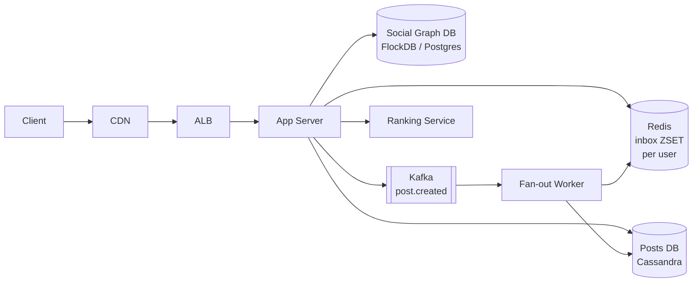

# 04. Feed System — Home Timeline

> Read-heavy + Stateful. **Fan-out on Write vs Read** 두 모델의 장단점과 **Celebrity 문제**의 hybrid 해법이 메인 시험 포인트.

---

## 1. 요구사항

### Functional

1. 사용자가 글(post) 작성
2. 팔로우 관계
3. **Home Timeline**: 내가 팔로우한 사람들의 글을 시간 역순으로
4. **User Timeline**: 특정 유저가 쓴 글
5. 좋아요, 댓글 (out of scope 가능)

### Non-Functional

| 항목 | 목표 |
|---|---|
| Read : Write | **1000 : 1** (트위터 평균) |
| Timeline 로딩 | P99 200ms |
| Post 생성 → Home 노출 | 1-5초 lag 허용 |
| Availability | 99.95% |

### Out of scope

- 광고/추천 알고리즘 (별도 ranking)
- 미디어 처리
- DM (다른 시나리오)

---

## 2. 용량 산정

```
DAU = 2억 (트위터 글로벌 가정)
1인 평균 follow = 200명
1인 평균 follower = 200명 (정규분포)
1인 일 작성 = 0.5 post
1인 일 timeline 조회 = 50회

Write QPS = 200M × 0.5 / 86400 ≈ 1,150 (피크 ×3 = 3,500)
Read QPS  = 200M × 50 / 86400 ≈ 115,000 (피크 350k)

Storage:
  posts/day = 200M × 0.5 = 100M / 일
  post 평균 1KB → 100GB / 일 → 36TB / 년 (저장 OK)

Fan-out (write 시):
  100M post × 평균 200 follower = 20B fan-out / 일 (20억 inbox 쓰기/일)
  QPS = 230k fan-out / 초 (피크 1M)
```

> Fan-out QPS 1M가 핵심 도전. Fan-out on Write (push)를 그대로 쓰면 폭주.

---

## 3. API

```
POST /api/v1/posts
GET  /api/v1/users/{id}/posts?cursor=...           # User timeline
GET  /api/v1/feed?cursor=...&limit=20              # Home timeline
POST /api/v1/follow/{userId}
GET  /api/v1/users/{id}/followers?cursor=...
```

---

## 4. 핵심 설계: Fan-out 모델 비교

### 4-1. Fan-out on Write (Push)

```
post 작성 시 → 모든 follower의 inbox에 미리 push
read 시 → 자신의 inbox만 읽으면 됨 (빠름)
```

**장점**: Read 매우 빠름 (Redis ZSET 단일 조회)
**단점**: Celebrity (1억 follower)가 글 1개 쓰면 1억 쓰기 발생 → fan-out storm

### 4-2. Fan-out on Read (Pull)

```
post 작성 → 자신의 user timeline에만 저장
read 시 → 내가 follow한 모두의 timeline을 fetch + merge
```

**장점**: Write 단순
**단점**: 200명 follow → 200번 query → P99 폭주

### 4-3. Hybrid (실전 정답)

```
일반 사용자 (follower < 10k)  → Push (inbox에 미리 fan-out)
Celebrity (follower ≥ 10k)   → Pull (Home read 시 merge)
```

```kotlin
fun publishPost(post: Post) {
    val author = userRepo.findById(post.authorId)
    db.savePost(post)                 // 항상 저장

    if (author.followerCount < 10_000) {
        // Push to inbox
        val followers = followRepo.getFollowers(author.id)
        for (f in followers) {
            redis.zadd("inbox:${f.id}", post.createdAt, post.id)
        }
    }
    // Celebrity는 fan-out 안 함 — Home read 시 별도 fetch
}

fun getHomeTimeline(userId: String, limit: Int = 20): List<Post> {
    val ownInbox = redis.zrevrange("inbox:$userId", 0, limit * 2)
    val celebFollows = followRepo.getCelebrityFollows(userId)
    val celebPosts = celebFollows.flatMap { c -> getRecentPostsByUser(c, limit) }
    return (ownInbox + celebPosts)
        .sortedByDescending { it.createdAt }
        .take(limit)
}
```

> 임계치 10k는 회사마다 다름. 트위터는 ~수만, 인스타는 ~수십만.

---

## 5. High-Level Architecture



**핵심 컴포넌트**:
- **Inbox cache (Redis ZSET)**: 사용자당 최대 800개 post id 저장 (40 timeline 페이지 분량)
- **Posts DB**: Cassandra/Bigtable, post_id 기반 KV
- **Social Graph DB**: 팔로우 관계, 양방향 인덱스
- **Fan-out Worker**: Kafka 컨슈머, push 비동기

---

## 6. 데이터 모델

### 6-1. Posts (Cassandra)

```cql
CREATE TABLE posts (
    post_id    bigint PRIMARY KEY,        -- Snowflake
    author_id  text,
    content    text,
    media_url  text,
    created_at timestamp
);

CREATE TABLE user_timeline (
    user_id    text,
    bucket     int,
    post_id    bigint,
    PRIMARY KEY ((user_id, bucket), post_id)
) WITH CLUSTERING ORDER BY (post_id DESC);
```

### 6-2. Social Graph

```sql
-- Postgres or specialized graph DB
CREATE TABLE follows (
    follower_id  VARCHAR(36),
    followee_id  VARCHAR(36),
    created_at   TIMESTAMP,
    PRIMARY KEY (follower_id, followee_id)
);
CREATE INDEX idx_followee ON follows(followee_id, created_at);

-- Celebrity flag (cached counter)
CREATE TABLE user_stats (
    user_id        VARCHAR(36) PRIMARY KEY,
    follower_count INT,
    is_celebrity   BOOLEAN GENERATED ALWAYS AS (follower_count >= 10000) STORED
);
```

### 6-3. Inbox (Redis)

```
ZADD inbox:{userId} {timestamp} {postId}
ZREVRANGE inbox:{userId} 0 19      # 최신 20개
TTL = 30일 (만료된 사용자는 lazy rebuild)

Capped: ZREMRANGEBYRANK 0 -801  # 800개 초과 시 트림
```

---

## 7. Scale-out 전략

### 7-1. Inbox 캐시

- DAU 2억 × 800 post id (8 byte) = 1.3TB → Redis Cluster 30 shards
- Active set만 (DAU의 50%) = 650GB

### 7-2. Fan-out Worker 스케일링

- Kafka partition = 100개 (post.created)
- consumer = 100대 (자동 스케일)
- 1 worker = 10k follower fan-out / s

### 7-3. Cold cache 처리

- 비활성 사용자가 30일 후 로그인 → inbox TTL 만료
- Lazy rebuild: 첫 GET /feed 시 follow 목록 → 각자의 user_timeline에서 최근 20개씩 fetch + merge → inbox 캐시 채움

### 7-4. Celebrity 문제 심화

| 상황 | 해법 |
|---|---|
| Celeb 글 → 1억 fan-out | Pull-only (push 안 함) |
| Celeb 동시 작성 | per-user rate limit |
| Bot/Spam 전파 | Trust score + ML 필터 |

---

## 8. Ranking (간단히)

```
score = recency * 0.6 + engagement * 0.3 + affinity * 0.1
recency    = exp(-Δt / τ)
engagement = like + comment * 2 + share * 3
affinity   = 사용자-작성자 상호작용 빈도
```

ML 모델은 별도 서비스 — feed 서비스는 candidate generation, ML이 ranking.

---

## 9. Trade-off 박스

| 결정 | 선택 | 포기 |
|---|---|---|
| Fan-out 모델 | Hybrid | 단순성 (코드 복잡도 증가) |
| Inbox 저장소 | Redis ZSET | Strong durability (소실 시 rebuild) |
| Storage | Cassandra | 트랜잭션 |
| Read consistency | Eventual (5초) | Strong (불필요) |
| ID 전략 | Snowflake | Auto-Increment (분산 안 됨) |

---

## 10. 장애 시나리오

| 장애 | 대응 |
|---|---|
| Redis Cluster 다운 | DB에서 lazy rebuild (P99 200→2000ms 일시 악화) |
| Fan-out worker lag | Kafka backlog 모니터링, autoscale |
| Cassandra primary 다운 | RF=3, Quorum write 유지 |
| Celebrity post → 폭주 | Rate limit + Pull 모드 강제 전환 |
| Spam/bot fan-out | Trust score 기반 필터 |

---

## 11. 실제 시스템 사례

| 서비스 | 특징 |
|---|---|
| **Twitter** | Hybrid (Push for normal, Pull for celeb), Redis + Manhattan KV |
| **Instagram** | Cassandra + Redis, ML ranking 적극 |
| **Facebook** | EdgeRank → DLRM, 다단계 candidate generation |
| **TikTok** | 거의 ML-driven (graph 약함), recsys 중심 |

---

## 12. 면접 30초 요약

> "Feed는 read 1000:1 + Celebrity 문제. Hybrid Fan-out: 일반 유저는 Push로 follower inbox에 미리 적재, follower 1만 이상 셀럽은 Pull로 read 시 merge. Inbox는 Redis ZSET, post는 Cassandra. Fan-out Worker는 Kafka 컨슈머 100파티션 병렬. Lazy rebuild로 cold cache 처리. 본 msa의 Kafka 이벤트 + Redis 캐시 패턴이 그대로 적용 가능."

---

## 부록 A. 흔한 함정

1. **모두 Push** → 셀럽 1글 = 1억 쓰기, 폭사
2. **모두 Pull** → 일반 유저 P99 2초+ (200 query merge)
3. **inbox unlimited** → Redis 메모리 폭발, capped ZSET 필수
4. **순서 보장 위해 timestamp** → 시계 skew, Snowflake 필수
5. **Celebrity 임계치 hard-coded** → 동적 (follower count) 사용
