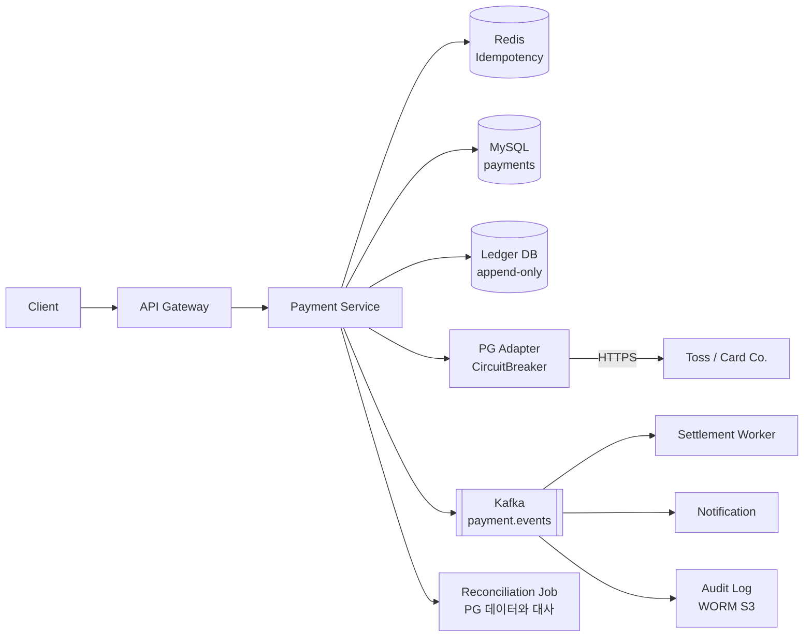
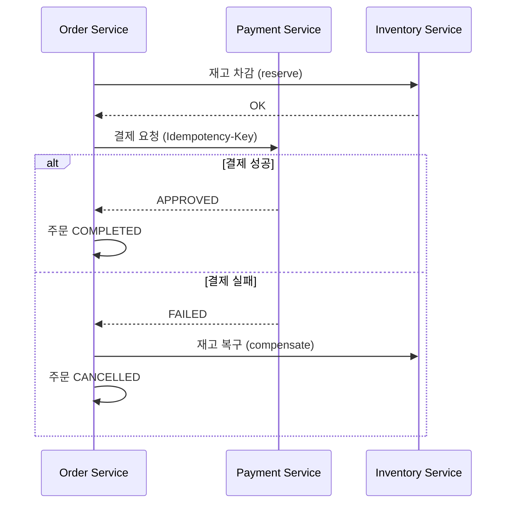

# 05. Payment System — 결제 시스템

> Tier 1 시스템. **멱등성, 분산 트랜잭션(SAGA), Ledger(복식부기), PG 장애 복구** 4대 축이 모두 등장한다. 한 곳도 못 잘라낸다.

---

## 1. 요구사항

### Functional

1. 결제 요청 (카드/계좌이체/간편결제)
2. 결제 승인 / 실패 / 취소 / 부분취소
3. 환불
4. 결제 내역 조회
5. 정산(Settlement) — 가맹점 별 일/월 정산

### Non-Functional

| 항목 | 목표 |
|---|---|
| Availability | 99.99% (10년차 면접 기준 99.999%까지 요구 가능) |
| Latency P99 | 결제 승인 3s (PG 의존), 조회 100ms |
| Consistency | **Strong** (잔액·정산은 절대 손실 X) |
| Durability | 영구 (10년 이상, 법적 의무) |
| **Idempotency** | 동일 요청 100회 = 1회 (필수) |
| Auditability | 모든 거래 immutable log |

### Out of scope

- 실제 PG 인터페이스 디테일
- KYC / AML
- Foreign exchange

---

## 2. 용량 산정

```
DAU = 1천만
1인 일 결제 = 평균 0.5건
일 결제 = 5M 건
write QPS (Queries Per Second, 초당 쿼리 수) = 5M / 86400 ≈ 60 (피크 ×5 = 300)
read QPS  = 결제 후 조회 평균 5회 → 25M / 86400 ≈ 300 (피크 1500)

Storage:
  결제 1건 평균 2KB (메타 + 거래 detail)
  연 5M × 365 × 2KB = 3.6TB / 년 → 10년 36TB
```

> Read/Write QPS는 의외로 작다. 진짜 도전은 **0% 손실 보장 + PG 장애 복구**.

---

## 3. API

```
POST /api/v1/payments
  Headers: Idempotency-Key: {client-uuid}      ← 의무
  Body: {
    "orderId": "...",
    "amount": 50000,
    "currency": "KRW",
    "method": "CARD",
    "cardToken": "tok_abc"
  }
  Response: { "paymentId": "p_xyz", "status": "APPROVED" }

GET    /api/v1/payments/{id}
POST   /api/v1/payments/{id}/cancel    {amount: 50000}
POST   /api/v1/payments/{id}/refund    {amount: 30000, reason: "..."}
```

**중요**: 응답 status는 `APPROVED / PENDING / FAILED / TIMEOUT`. **TIMEOUT은 절대 FAILED로 처리하지 않는다** (PG에 실제 승인됐을 수 있음 → 별도 확인 필요).

---

## 4. High-Level Architecture



**핵심 설계**:
- **Idempotency가 첫 관문** — 모든 요청은 Redis SETNX 통과해야 PG 호출
- **Ledger 분리** — payments 테이블과 별도, append-only, 잔액 계산은 ledger sum
- **CircuitBreaker** — PG 장애 시 빠른 fail (본 msa ADR (Architecture Decision Record, 아키텍처 결정 기록)-0015)
- **Reconciliation** — 매일 새벽 PG 거래 내역 download + DB 대사

---

## 5. 핵심 알고리즘

### 5-1. Idempotency (3중 방어)

```kotlin
@PostMapping("/payments")
fun pay(
    @RequestHeader("Idempotency-Key") key: String,
    @RequestBody req: PaymentRequest
): PaymentResponse {
    // 1) Redis SETNX (24h TTL) — 빠른 거절
    val acquired = redis.setIfAbsent("idempo:$key", "PROCESSING", Duration.ofDays(1))
    if (!acquired) {
        return waitForResult(key)   // 진행중이면 polling 또는 stored result
    }

    return try {
        // 2) DB unique 제약 (idempotency_key UNIQUE INDEX)
        val payment = paymentRepo.create(req, key)
        // 3) PG 호출
        val pgResult = pgAdapter.charge(payment, req.cardToken)
        payment.applyResult(pgResult)
        paymentRepo.update(payment)
        ledger.append(payment.toEntries())
        kafka.publish(PaymentApproved(payment))
        PaymentResponse(payment)
    } catch (e: Exception) {
        // 절대 idempo 키 삭제 X — 재시도 시 같은 결과 반환
        handleFailure(key, e)
    }
}
```

> **3중 방어 이유**: Redis 다운 시 DB UNIQUE, DB 다운 시 PG 자체 idempotency_key 사용.

### 5-2. SAGA — Order ↔ Payment 분산 트랜잭션

본 msa의 order 서비스가 payment를 호출하는 구조.



**보상 트랜잭션 원칙**:
- 모든 단계는 **idempotent** (재시도 안전)
- 실패 시 역순으로 보상 호출
- 보상도 실패하면 → **DLQ (Dead Letter Queue, 데드 레터 큐) + 운영자 alert**
- 본 msa Order.cancel()은 PENDING만 가능 → COMPLETED 후엔 별도 환불 플로우

### 5-3. Ledger (복식부기)

각 거래는 **2개 이상의 entry**로 기록 (차변 + 대변).

```sql
CREATE TABLE ledger_entries (
    id              BIGINT PRIMARY KEY AUTO_INCREMENT,
    transaction_id  VARCHAR(36) NOT NULL,        -- 같은 거래는 같은 id
    account_id      VARCHAR(36) NOT NULL,
    amount          DECIMAL(20,4) NOT NULL,      -- 음수=차변, 양수=대변
    currency        CHAR(3),
    type            VARCHAR(32),                  -- PAYMENT, REFUND, FEE, ...
    metadata        JSON,
    created_at      DATETIME(3),
    INDEX idx_account_created (account_id, created_at),
    INDEX idx_tx (transaction_id)
);

-- 핵심 invariant: 한 transaction_id의 amount 합계 = 0
```

```sql
-- 결제 1건 (사용자 A가 가맹점 B에 50,000원 지불, 수수료 1,500)
INSERT INTO ledger_entries VALUES
  (NULL, 'tx-001', 'user-A',     -50000, 'KRW', 'PAYMENT',     ...),
  (NULL, 'tx-001', 'merchant-B',  48500, 'KRW', 'PAYMENT',     ...),
  (NULL, 'tx-001', 'platform',     1500, 'KRW', 'FEE',         ...);
-- 합계 0 ✓

-- 잔액 = SUM(amount) WHERE account_id = ?
```

**왜 복식부기?**: 단식(잔액 컬럼 직접 update)은 race condition 위험 + audit 불가. 복식은 append-only → 재계산 가능 + 무결성 검증 자동화.

---

## 6. DB 스키마

```sql
CREATE TABLE payments (
    id                BIGINT PRIMARY KEY AUTO_INCREMENT,
    payment_id        VARCHAR(36) NOT NULL UNIQUE,    -- p_xyz
    idempotency_key   VARCHAR(64) NOT NULL UNIQUE,    -- ★ 핵심 방어
    order_id          VARCHAR(36) NOT NULL,
    user_id           VARCHAR(36) NOT NULL,
    amount            DECIMAL(20,4) NOT NULL,
    currency          CHAR(3) NOT NULL,
    method            VARCHAR(32),
    status            VARCHAR(16),                    -- PENDING/APPROVED/FAILED/CANCELLED
    pg_provider       VARCHAR(32),
    pg_transaction_id VARCHAR(64),
    failure_reason    VARCHAR(255),
    created_at        DATETIME(3),
    updated_at        DATETIME(3),
    INDEX idx_order (order_id),
    INDEX idx_user_created (user_id, created_at)
);

CREATE TABLE payment_state_history (
    id           BIGINT PRIMARY KEY AUTO_INCREMENT,
    payment_id   VARCHAR(36),
    from_state   VARCHAR(16),
    to_state     VARCHAR(16),
    reason       VARCHAR(255),
    occurred_at  DATETIME(3)
);
```

**상태 머신**:

```
PENDING → APPROVED → CANCELLED (전액 취소)
PENDING → APPROVED → REFUNDED (부분/전액 환불)
PENDING → FAILED (재시도 가능)
PENDING → TIMEOUT (★ 재확인 필요)
```

---

## 7. PG 장애 대응 (CircuitBreaker)

```kotlin
@CircuitBreaker(
    name = "pg-toss",
    fallbackMethod = "fallbackPayment"
)
fun chargeWithToss(req: PaymentRequest): PgResult { ... }

fun fallbackPayment(req: PaymentRequest, e: Exception): PgResult {
    return when (e) {
        is CallNotPermittedException -> {
            // CB open → 다른 PG로 라우팅 또는 PENDING 적재
            kafka.publish(PaymentRetryQueue(req))
            PgResult.pending("PG_DEGRADED")
        }
        is TimeoutException -> {
            // ★ 가장 위험 — 실제 PG에 통과했을 수 있음
            // 5분 후 reconciliation 으로 확인
            PgResult.timeout()
        }
        else -> PgResult.failed(e.message)
    }
}
```

**3가지 PG 응답을 절대 헷갈리지 말 것**:

| 응답 | 의미 | 대응 |
|---|---|---|
| Success (200) | 명확히 승인 | DB update + 사용자 알림 |
| Failure (4xx) | 명확히 실패 | DB update + 재시도 안 함 |
| **Timeout / 5xx** | **불명** | **PENDING 유지, 5분 후 PG 조회로 확정** |

---

## 8. Reconciliation (대사)

매일 새벽 PG가 제공하는 거래 내역 다운로드 → DB와 대사.

```kotlin
@Scheduled(cron = "0 30 3 * * *")  // 새벽 3:30
fun reconcile() {
    val date = LocalDate.now().minusDays(1)
    val pgRecords = pgClient.downloadDailySettlement(date)   // ~수십만 건
    val dbRecords = paymentRepo.findByDate(date)

    val pgMap = pgRecords.associateBy { it.pgTransactionId }
    val dbMap = dbRecords.associateBy { it.pgTransactionId }

    // 1) DB에는 있는데 PG 에 없음 → TIMEOUT 으로 잘못 처리된 케이스
    val ghosts = dbMap.keys - pgMap.keys
    // 2) PG 엔 있는데 DB 에 없음 → 응답 누락
    val missing = pgMap.keys - dbMap.keys
    // 3) 금액 불일치
    val mismatched = dbMap.entries.filter { (k, v) -> pgMap[k]?.amount != v.amount }

    alertOps(ghosts, missing, mismatched)
}
```

> 정산 차이 1원이라도 alert. 운영자 수동 처리 + 사후 자동화.

---

## 9. Trade-off 박스

| 결정 | 선택 | 포기 |
|---|---|---|
| Idempotency | 3중 방어 (Redis + DB + PG) | 단순성 |
| 분산 트랜잭션 | SAGA + 보상 | 2PC (Two-Phase Commit, 2단계 커밋) (성능/가용성 안 됨) |
| Ledger | 복식부기 append-only | 단순 잔액 컬럼 (race condition) |
| PG 장애 | CircuitBreaker + 다중 PG | 단일 PG (장애 시 전체 정지) |
| Consistency | Strong (잔액) | Eventual (정산은 D+1 OK) |

---

## 10. 장애 시나리오

| 장애 | 대응 |
|---|---|
| Redis 다운 (idempotency) | DB UNIQUE 제약으로 fallback |
| MySQL primary 다운 | Read-only 모드, write retry queue |
| PG 단일 장애 | CB open, 다른 PG 라우팅 또는 큐 적재 |
| **이중 결제 의심** | 사용자 알림 + 24h 자동 환불 |
| 정산 mismatch | 운영자 alert, 수동 보정 + 원인 분석 |
| Region 다운 | Multi-region active-passive (active 결제 중단, passive 승격) |

---

## 11. 실제 시스템 사례

| 서비스 | 특징 |
|---|---|
| **Toss Payments** | 멀티 PG 라우팅, idempotency_key 의무화 |
| **Stripe** | 강력한 idempotency + webhook + retry, ledger DB Spanner-like |
| **PayPal** | Saga + outbox pattern, 자체 거래 ID |
| **Korean Card 회사** | VAN 사 + PG 다층 구조, 정산 D+2 |

---

## 12. 면접 30초 요약

> "Payment는 Tier 1 시스템. 핵심 4축: (1) Idempotency 3중 방어 (Redis SETNX + DB UNIQUE + PG key), (2) SAGA 패턴으로 order/inventory와 분산 트랜잭션 (보상 호출 idempotent), (3) Ledger append-only 복식부기로 audit + 잔액 재계산 가능, (4) PG 장애는 CircuitBreaker + 다중 PG + Reconciliation 으로 0% 손실. TIMEOUT은 절대 FAILED 처리 안 함. 본 msa의 order ↔ inventory ↔ external PG 패턴이 그대로 매핑됩니다."

---

## 부록 A. 흔한 함정

1. **TIMEOUT을 FAILED로 처리** → 이중결제, 가장 큰 사고
2. **idempotency_key 미강제** → 클라 retry 시 중복 결제
3. **잔액 컬럼 직접 update** → race condition + audit 불가
4. **PG 단일** → 장애 시 결제 전체 마비
5. **2PC 시도** → 가용성 폭락, SAGA로 풀어야
6. **결제 상태를 PG에서만 조회** → 자체 SSOT 유지 필수
