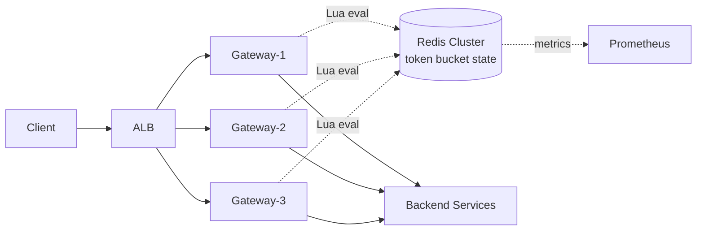

# 06. Rate Limiter

> 본 msa **gateway/RateLimiterConfig.kt** 가 실제로 동작하는 코드. 면접에서 "본 프로젝트에서 구현한 경험"을 그대로 풀어낼 수 있다.

---

## 1. 요구사항

### Functional

1. **Per-User**, **Per-IP**, **Per-API** 단위 호출 제한
2. 초과 시 **HTTP 429 Too Many Requests** + `Retry-After` 헤더
3. 화이트리스트 (운영자, 내부 서비스)
4. **Burst 허용**: 평균 100 RPS (Requests Per Second, 초당 요청 수)인데 초당 200까지 일시 폭증 허용
5. 동적 변경 (Flash Sale 시 throttle 강화)

### Non-Functional

| 항목 | 목표 |
|---|---|
| Decision latency | P99 < 5ms |
| Accuracy | ±10% (분산 환경 자연 오차) |
| Availability | 99.99% (Rate Limiter 다운 시 트래픽 폭주) |
| Memory | 사용자당 ~100 bytes |

---

## 2. 4가지 알고리즘 비교 (★ 단골 면접)

### 2-1. Token Bucket

```
- bucket 용량: capacity (예: 200)
- 초당 보충: refillRate (예: 100)
- 요청마다 1 token 차감, 부족하면 429
```

**그림**:
```
   refillRate (100/s)
        ↓
   ┌──[●●●●●●...]──┐  ← capacity 200
   │   bucket      │
   └──────┬────────┘
          ↓ 요청 1개당 1 token 소비
```

**장점**: Burst 허용 + 단순. AWS, Stripe, **본 msa gateway** 채택.
**단점**: 분산 환경에서 토큰 동기화 비용.

### 2-2. Leaky Bucket

```
- queue 용량: capacity
- 일정 속도(leakRate)로 처리 (out)
- 가득 차면 거절
```

**장점**: 출력이 일정 (smooth)
**단점**: Burst 불가, 큐 메모리 비용

### 2-3. Fixed Window

```
- 1분 윈도우 (00:00~00:59)
- 윈도우 내 N개 요청 카운트, 초과 시 거절
- 윈도우 갱신 시 카운터 리셋
```

**장점**: 가장 단순 (Redis INCR + EXPIRE)
**단점**: 윈도우 경계 burst 문제 (00:59에 100 + 01:00에 100 = 200/2초)

### 2-4. Sliding Window Log / Counter

```
Sliding Log: ZSET에 timestamp 저장, 60초 이전 제거 후 count
Sliding Counter: 이전 윈도우 + 현재 윈도우의 weighted sum
```

**장점**: 정확도 높음, burst 방어
**단점**: ZSET 메모리 (사용자당 N entry), Lua script 필수

### 비교 표

| 알고리즘 | Burst 허용 | 정확도 | 메모리 | 구현 복잡도 |
|---|---|---|---|---|
| Token Bucket | ✅ | 중 | 작음 | 중 |
| Leaky Bucket | ❌ | 높음 | 중 | 중 |
| Fixed Window | ✅ (경계) | 낮음 | 매우 작음 | 매우 낮음 |
| Sliding Window | △ | 높음 | 큼 | 높음 |

> **현실 정답**: Token Bucket (대부분 시스템). Sliding Window는 정확한 SLA (Service Level Agreement, 서비스 수준 협약) 검증이 필요할 때.

---

## 3. msa gateway 실제 코드 분석

### 3-1. RateLimiterConfig.kt (실제 코드)

```kotlin
// gateway/src/main/kotlin/com/kgd/gateway/config/RateLimiterConfig.kt
@Configuration
class RateLimiterConfig {

    @Bean
    fun ipKeyResolver(): KeyResolver = KeyResolver { exchange ->
        Mono.just(exchange.request.remoteAddress?.address?.hostAddress ?: "unknown")
    }

    @Bean
    @Primary
    fun userKeyResolver(): KeyResolver = KeyResolver { exchange ->
        Mono.just(
            exchange.request.headers.getFirst("X-User-Id")
                ?: exchange.request.remoteAddress?.address?.hostAddress
                ?: "unknown"
        )
    }

    /**
     * Redis Token Bucket Rate Limiter.
     * replenishRate: 100 tokens/sec
     * burstCapacity: 200 tokens (allows short bursts)
     * requestedTokens: 1 token per request
     */
    @Bean
    fun redisRateLimiter(): RedisRateLimiter =
        RedisRateLimiter(100, 200, 1)
}
```

**해석**:
- `replenishRate = 100`: 초당 100 token 보충 (정상 처리율)
- `burstCapacity = 200`: 최대 200까지 누적 가능 (burst 2초분 흡수)
- `requestedTokens = 1`: 요청 1개 = token 1개
- KeyResolver는 **userKeyResolver(@Primary)** 가 기본. X-User-Id 우선, fallback IP.

### 3-2. GatewayRouteConfig.kt (실제 적용 위치)

```kotlin
// 본 코드에서 발췌
.route("inventory-service") { r ->
    r.path("/api/inventories/**")
        .filters { f ->
            f.filter(authFilter.apply(sellerConfig()))
                .requestRateLimiter { config ->
                    config.setRateLimiter(redisRateLimiter)
                    config.setKeyResolver(userKeyResolver)
                    config.setDenyEmptyKey(false)
                }
                .stripPrefix(0)
        }
        .uri("http://inventory:8085")
}
```

**관찰 포인트**:
1. **inventory에만 적용**, 나머지 라우트는 미적용 → 재고 차감 API가 가장 폭주 위험
2. `setDenyEmptyKey(false)` → key 누락 시 통과 (보수적 운영)
3. **Per-route, Per-user** 적용 (X-User-Id 헤더 기반)
4. WebFlux 기반 (gateway 만 reactive — 본 msa CLAUDE.md 규칙)

### 3-3. Spring Cloud Gateway 내부 동작

`RedisRateLimiter`는 Lua script 사용 (atomic 보장):

```lua
-- request_rate_limiter.lua (Spring Cloud Gateway 내장)
local tokens_key = KEYS[1]
local timestamp_key = KEYS[2]

local rate     = tonumber(ARGV[1])  -- replenishRate
local capacity = tonumber(ARGV[2])  -- burstCapacity
local now      = tonumber(ARGV[3])
local requested = tonumber(ARGV[4])

local fill_time = capacity / rate
local ttl = math.floor(fill_time * 2)

local last_tokens = tonumber(redis.call("get", tokens_key))
if last_tokens == nil then
    last_tokens = capacity
end

local last_refreshed = tonumber(redis.call("get", timestamp_key))
if last_refreshed == nil then
    last_refreshed = 0
end

local delta = math.max(0, now - last_refreshed)
local filled_tokens = math.min(capacity, last_tokens + (delta * rate))
local allowed = filled_tokens >= requested
local new_tokens = filled_tokens

if allowed then
    new_tokens = filled_tokens - requested
end

redis.call("setex", tokens_key, ttl, new_tokens)
redis.call("setex", timestamp_key, ttl, now)

return { allowed and 1 or 0, new_tokens }
```

**핵심**: Lua script는 Redis 단일 스레드 위에서 atomic. 분산 환경에서 race condition 없음.

---

## 4. High-Level Architecture (분산 Rate Limiter)



**중앙 Redis가 SPOF가 안 되도록**:
- Redis Cluster (3 master + 3 replica)
- Sentinel auto-failover
- Local cache fallback (Redis 다운 시 local Caffeine 으로 degrade)

---

## 5. 분산 환경의 핵심 이슈

### 5-1. 왜 단순 in-memory 카운터로는 안 되나

```
Gateway 3대 운영, 사용자 X가 100 RPS 한도
  → 각 게이트웨이는 자신만 보면 33 RPS면 OK 라고 판단
  → 실제 총합 99 RPS (X3 사용자) ≈ 한도 임박, 단일 게이트웨이는 모름
  → Burst 시 한도 초과
```

**해결**:
- 옵션 1: 중앙 Redis (위 코드 — 본 msa 채택)
- 옵션 2: Local + Sync (gossip protocol — 복잡)
- 옵션 3: Quota 분배 (각 게이트웨이에 ratio 할당 — fair 안 됨)

### 5-2. Redis 장애 대응

```kotlin
// 의사 코드
fun isAllowed(key: String): Boolean {
    return try {
        redisLuaCheck(key)
    } catch (e: RedisException) {
        // Fallback: local Caffeine (정확도 떨어지지만 가용성 우선)
        localBucket.tryConsume(key)
    }
}
```

**선택 필요**:
- Fail-open: 차단 안 함 (가용성 우선)
- Fail-closed: 모두 차단 (보안 우선)

본 msa는 명시적 fallback 없음 — Redis 다운 시 Spring Cloud Gateway 기본 동작 (요청 통과 또는 에러). 개선 후보로 12번 문서에 기록.

### 5-3. Hot user / DDoS

특정 사용자 + IP가 폭주 → Redis 단일 키 hot.

**대응**:
- Key suffix 분산 (`user:123:shard0`, `user:123:shard1` ...) — fan-in으로 합산
- IP 기반 1차 차단 (CloudFlare / AWS WAF)
- 자동 차단 (1분 1000 req → 1시간 ban)

---

## 6. 데이터 모델

```
Redis Token Bucket per key:
  KEY  request_rate_limiter.{routeId}.{userId}.tokens          → 현재 token 수
  KEY  request_rate_limiter.{routeId}.{userId}.timestamp       → 마지막 갱신 시각
  TTL  fill_time × 2 (Spring Cloud Gateway 자동 설정)

Quota Tier (선택):
  HSET user:tier:{userId} tier "PREMIUM" rps 1000 burst 2000
```

---

## 7. Tier 별 차등 정책

```kotlin
// 동적 RateLimiter 선택
fun rateLimiterForUser(tier: UserTier): RedisRateLimiter = when (tier) {
    FREE     -> RedisRateLimiter(10,   20,  1)
    BASIC    -> RedisRateLimiter(100,  200, 1)
    PREMIUM  -> RedisRateLimiter(1000, 2000,1)
    INTERNAL -> NoOpRateLimiter()       // 무제한
}
```

> 본 msa 는 단일 limiter (100/200) 사용. tier 도입은 12번 improvements 후보.

---

## 8. Trade-off 박스

| 결정 | 선택 | 포기 |
|---|---|---|
| 알고리즘 | Token Bucket | Sliding Window 정확도 |
| 저장소 | Redis 중앙 | Local cache 단순성 |
| 키 전략 | userId 우선 + IP fallback | 정확도 (인증 전 IP) |
| Burst | 200 (2초분) | 엄격한 평균 보장 |
| Fail mode | Fail-open (Spring 기본) | 보안 (DDoS 시 위험) |

---

## 9. 장애 시나리오

| 장애 | 대응 |
|---|---|
| Redis 다운 | Local Caffeine fallback (개선 후보) |
| Hot key (인기 API) | Key suffix 분산 |
| DDoS | 외부 WAF 1차 + Rate Limiter 2차 |
| 정상 사용자 차단 (false positive) | 화이트리스트 + Tier 상향 + 로그 |
| Replenish lag (Redis 지연) | Lua script atomic으로 방어 |

---

## 10. 실제 시스템 사례

| 회사 | 알고리즘 | 비고 |
|---|---|---|
| AWS API Gateway | Token Bucket | per-API + burst |
| Stripe | Token Bucket | per-key + tier |
| Cloudflare | Sliding Window | edge에서 차단 |
| Twitter | Token Bucket | per-user + per-app |
| **본 msa** | Token Bucket (Spring Cloud Gateway) | inventory 라우트만 |

---

## 11. 면접 30초 요약

> "Rate Limiter는 4가지 알고리즘 (Token Bucket / Leaky Bucket / Fixed / Sliding Window) 중 Token Bucket이 burst 허용 + 단순으로 가장 보편적입니다. 본 msa gateway에서 Spring Cloud Gateway의 RedisRateLimiter(100, 200, 1) 로 inventory 라우트에만 적용 — replenishRate 100 RPS에 burstCapacity 200으로 2초간 burst 흡수. 분산 환경에서는 중앙 Redis + Lua script로 atomic 보장이 핵심. Redis 장애 시 fail-open vs fail-closed 결정이 trade-off."

---

## 부록 A. 흔한 함정

1. **In-memory 카운터** → 분산에서 부정확
2. **EXPIRE 없는 Redis 키** → 메모리 누수
3. **Lua script 없이 INCR + GET** → race condition
4. **IP만 키로** → NAT 뒤 다수 사용자 한꺼번에 차단
5. **인증 전 라우팅** → user 키 못 씀, IP만 사용
6. **Retry-After 누락** → 클라이언트가 즉시 재시도 → 폭주 가속

## 부록 B. 본 msa 개선 후보 (→ 12번 문서)

- [ ] User tier 별 차등 limiter
- [ ] Redis 다운 시 Local Caffeine fallback
- [ ] 메트릭 / 알림 (429 비율 추적)
- [ ] Sliding Window 옵션 (정확한 SLA 검증용)
- [ ] inventory 외 다른 라우트 적용 검토 (order, payment)
