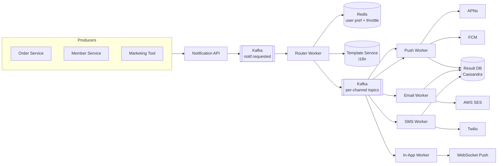

# 07. Notification System

> 채널 추상화, 템플릿 엔진, 사용자 선호, throttle. **메시지 폭주 방어**와 **Quiet Hours** 가 면접의 함정.

---

## 1. 요구사항

### Functional

1. 채널: **Push (APNs/FCM), Email (SES/Sendgrid), SMS (Toast/Twilio), In-App**
2. 사용자 선호 (채널별 on/off, Quiet Hours)
3. 템플릿 (다국어, 변수 치환)
4. 발송 종류: 즉시 / 예약 / 트리거 (이벤트 기반) / 캠페인 (대량)
5. 발송 결과 추적 (delivered / failed / bounced)

### Non-Functional

| 항목 | 목표 |
|---|---|
| 즉시 발송 latency | P99 5s |
| 캠페인 throughput | 1M / 분 |
| Reliability | At-least-once + dedup |
| Availability | 99.9% |
| Throttle | 사용자당 시간당 최대 N개 |

---

## 2. 용량 산정

```
DAU = 1천만
1인 일 평균 push = 10개
1인 일 평균 email = 1개

일 push   = 100M / 일 → QPS (Queries Per Second, 초당 쿼리 수) 1,200 (피크 ×5 = 6,000)
일 email  = 10M  / 일 → QPS 120
캠페인 (마케팅): 분당 100만 (피크)

저장:
  notification 1건 평균 1KB (메타 + 결과)
  일 110M × 1KB = 110GB / 일 → 1년 40TB (콜드 스토리지 이관)
```

---

## 3. API

```
POST /api/v1/notifications
  Body: {
    "userId": "u1",
    "templateCode": "ORDER_COMPLETED",
    "variables": {"orderId": "12345"},
    "channels": ["PUSH", "EMAIL"],
    "scheduledAt": null,
    "priority": "NORMAL"        // CRITICAL / NORMAL / LOW
  }

POST /api/v1/notifications/campaigns      # 대량 발송
GET  /api/v1/notifications/{id}/status
PUT  /api/v1/users/{id}/preferences
```

---

## 4. High-Level Architecture



**핵심 분리**:
1. **Producer ↔ Notification 분리** — Order 서비스는 알림 디테일 모름
2. **Router** — 사용자 선호 + Throttle + 템플릿 적용 → 채널별 토픽으로 fan-out
3. **Channel Worker** — 채널별 독립 스케일 (push 폭주가 email에 영향 없음)
4. **Result DB** — 발송 결과 저장, 분석/재발송용

---

## 5. 핵심 알고리즘

### 5-1. Throttle (사용자 보호)

```
사용자당 시간당 최대 N개:
  Redis ZSET → key = "throttle:{userId}", score = ts, member = notifId
  ZREMRANGEBYSCORE 1시간 이전 제거
  ZCARD 조회 → N 이상이면 drop (low priority) 또는 queue (high priority)
```

```kotlin
fun shouldThrottle(userId: String, priority: Priority): Boolean {
    val now = System.currentTimeMillis()
    val key = "throttle:$userId"
    redis.zremrangeByScore(key, 0, now - 3_600_000)
    val count = redis.zcard(key)
    return when (priority) {
        CRITICAL -> false                       // 결제 완료 등 — 항상 통과
        NORMAL   -> count >= 20
        LOW      -> count >= 5
    }
}
```

### 5-2. Quiet Hours

```
사용자 timezone 기반 22:00 ~ 08:00 → push 전송 X
  CRITICAL 은 통과
  NORMAL/LOW 는 다음 날 09:00로 reschedule
```

```kotlin
fun shouldSuppress(user: UserPref, priority: Priority, now: ZonedDateTime): Boolean {
    if (priority == CRITICAL) return false
    val local = now.withZoneSameInstant(user.timezone)
    val hour = local.hour
    return user.quietHoursEnabled && (hour >= 22 || hour < 8)
}
```

### 5-3. Dedup (이벤트 폭주 방어)

같은 사용자 + 같은 templateCode + 같은 keyId (예: orderId) 가 5분 내 중복 → drop.

```
Redis SETNX dedup:{userId}:{templateCode}:{keyId} EX 300
```

### 5-4. Campaign (대량 발송)

```
1. CSV/세그먼트 → S3 업로드
2. Spark/Beam job → 사용자 ID 추출 (수백만)
3. Kafka 분할 발행 (partition 100개)
4. Router가 사용자 선호 + throttle 적용 후 channel topic으로
5. APNs/FCM rate limit 고려해 worker 자체 throttle (예: 10k/s)
```

---

## 6. 데이터 모델

```sql
-- 사용자 선호
CREATE TABLE user_notification_pref (
    user_id            VARCHAR(36) PRIMARY KEY,
    push_enabled       BOOLEAN DEFAULT TRUE,
    email_enabled      BOOLEAN DEFAULT TRUE,
    sms_enabled        BOOLEAN DEFAULT FALSE,
    marketing_opt_in   BOOLEAN DEFAULT FALSE,
    timezone           VARCHAR(64) DEFAULT 'Asia/Seoul',
    quiet_hours_enabled BOOLEAN DEFAULT TRUE,
    updated_at         DATETIME(3)
);

-- 디바이스 토큰
CREATE TABLE device_tokens (
    id            BIGINT PRIMARY KEY AUTO_INCREMENT,
    user_id       VARCHAR(36),
    platform      VARCHAR(16),     -- IOS / ANDROID / WEB
    push_token    VARCHAR(255) UNIQUE,
    device_id     VARCHAR(64),
    last_active   DATETIME(3),
    INDEX idx_user (user_id)
);

-- 템플릿
CREATE TABLE notification_template (
    code          VARCHAR(64),
    locale        VARCHAR(8),       -- ko_KR, en_US
    title         VARCHAR(255),
    body          TEXT,
    variables     JSON,             -- ["orderId", "userName"]
    PRIMARY KEY (code, locale)
);
```

```cql
-- Cassandra: 발송 이력 (대량)
CREATE TABLE notification_history (
    user_id      text,
    bucket       int,
    notif_id     timeuuid,
    channel      text,
    template     text,
    status       text,             -- SENT / DELIVERED / OPENED / FAILED
    failure_reason text,
    PRIMARY KEY ((user_id, bucket), notif_id)
) WITH CLUSTERING ORDER BY (notif_id DESC);
```

---

## 7. 채널별 특수성

### 7-1. Push

- **APNs**: 기존은 1 connection per app, HTTP/2로 변경 시 다중 stream
- **FCM**: Topic / Device / Group 메시징
- **Token rotation**: 디바이스 토큰 만료 시 invalid_token 콜백 → DB 정리
- **Silent push**: data-only, 백그라운드 동기화용

### 7-2. Email

- **SPF / DKIM / DMARC**: 도메인 인증
- **Bounce handling**: hard bounce → 영구 차단 리스트
- **Unsubscribe link**: 법적 의무 (CAN-SPAM, GDPR)
- **Warmup**: 신규 IP/도메인은 점진적 발송량 증가

### 7-3. SMS

- 비용 비싸므로 **OTP, 결제 알림** 등 critical 만
- 통신사 제한 (한국: 90 byte 한 건, 분당 limit)
- Delivery report (DLR) 처리

---

## 8. Scale-out

### 8-1. Kafka 파티션 전략

- `notif.requested`: userId 기반 partitioning (순서 보장)
- 채널별 토픽: `notif.push`, `notif.email`, `notif.sms`
- 파티션 100 → consumer 100대 병렬

### 8-2. APNs / FCM rate limit

- APNs: 연결당 ~수천 RPS (Requests Per Second, 초당 요청 수) (HTTP/2 multiplexing)
- FCM: per-app 1M/분
- Worker 자체에 token bucket (out-bound throttle)

### 8-3. Hot user

- 마케팅 한 번에 1억 사용자 → Kafka 100 partition으로 균등 분산
- 특정 user는 자연스럽게 분산 (key = userId)

---

## 9. Trade-off 박스

| 결정 | 선택 | 포기 |
|---|---|---|
| Producer ↔ Notif | Kafka 비동기 | 즉시 결과 확인 (eventual) |
| Storage | Cassandra (history) | 트랜잭션 |
| 채널 추상화 | 단일 API | 채널 특화 기능 (트레이드오프) |
| Dedup | 5분 window | 정확한 dedup (timeuuid가 안전) |
| Quiet Hours | sender 측 검사 | 클라이언트 검사 (덜 정확) |

---

## 10. 장애 시나리오

| 장애 | 대응 |
|---|---|
| APNs 다운 | Kafka backlog 누적 → autoscale + retry |
| Email bounce 폭증 | warmup IP, DKIM 점검, ISP 화이트리스트 |
| Spam 신고 폭증 | sender reputation 보호, 즉시 발송 중단 + 분석 |
| 잘못된 템플릿 배포 | 즉시 rollback, 발송 이력 확인 + 사과 |
| **마케팅 실수 (전체 발송)** | Kill switch (admin API로 즉시 중단) |

---

## 11. 실제 시스템 사례

| 회사 | 특징 |
|---|---|
| **Twitter notification svc** | Kafka + 채널 worker fanout, dedup 정교 |
| **Pinterest** | 사용자별 throttle, 시간대 학습 ML |
| **카카오 알림톡** | 비즈니스 메시지, 친구 등록 기반 |
| **Slack notification** | 채널별 mute + DND (Do Not Disturb) |

---

## 12. 면접 30초 요약

> "Notification은 채널 추상화 + 사용자 보호 시스템. Producer는 Kafka에 발행, Router 워커가 (1) 사용자 선호, (2) Quiet Hours, (3) Throttle, (4) Dedup 4단계 필터 후 채널별 토픽으로 fan-out. 채널 워커는 외부 API rate limit 고려한 자체 throttle. 마케팅 캠페인은 S3 + Spark + Kafka 분할 발행. 본 msa는 chatbot/notification 도메인 미구현 — 향후 ADR (Architecture Decision Record, 아키텍처 결정 기록) 후보."

---

## 부록 A. 흔한 함정

1. **Producer가 채널 직접 호출** → 결합도 폭발, retry 분산
2. **Throttle 없음** → 사용자가 spam으로 인식, 차단
3. **Quiet Hours 무시** → 새벽 알림으로 unsubscribe 폭증
4. **Bounce 무시** → IP reputation 망가져 전체 email 차단
5. **단일 PG/Provider** → 장애 시 전체 마비, 다중 provider 필수
6. **Dedup 없음** → 이벤트 재발행 시 사용자에게 같은 알림 100번
