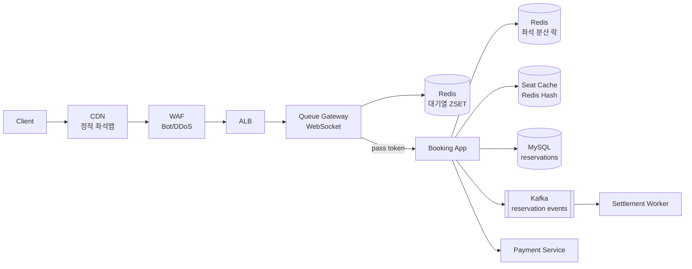

# 08. Ticketing System

> 시스템 설계 시나리오 중 **가장 동시성이 극한**인 케이스. **대기열, 좌석 선점 TTL, 오버셀링 방지**가 3대 난제. 한국 인터파크/티켓링크 폭주 트래픽 사례 단골.

---

## 1. 요구사항

### Functional

1. 공연/이벤트 등록, 좌석 배치
2. 좌석 조회 (실시간 잔여)
3. **좌석 선점 (5분 TTL)** + 결제 → 확정
4. 결제 실패 시 좌석 복구
5. 매진 알림

### Non-Functional

| 항목 | 목표 |
|---|---|
| 오픈 동시 접속 | 100만 (BTS 콘서트급) |
| 좌석 잔여 조회 P99 | 100ms |
| 좌석 선점 P99 | 500ms |
| **Zero overselling** | 절대 |
| Availability | 99.99% (오픈 시간 결정적) |

---

## 2. 용량 산정

```
이벤트 = 5만 좌석
오픈 동시 접속 = 100만 (좌석의 20배)
오픈 후 30초간 폭주

피크 QPS:
  - 좌석 조회: 100만 × 1 req/s = 1M RPS
  - 좌석 선점 시도: 100만 × 0.1 = 100k RPS
  - 실제 성공 = 5만 / 30초 = 1,700 / s

평소:
  - 일반 read QPS = 100~1000
  - 일반 write QPS = 10~50
```

> 100만 동시는 **단일 서버 절대 불가**. CDN + 대기열 + 분산 락이 필수.

---

## 3. API

```
GET   /api/v1/events/{id}/seats             # 잔여 좌석 (캐시)
POST  /api/v1/events/{id}/reservations      # 좌석 선점 (5분 TTL)
        Body: { "seatIds": [...], "userId": "..." }
        Response: { "reservationId": "...", "expiresAt": "..." }
POST  /api/v1/reservations/{id}/confirm     # 결제 후 확정
DELETE /api/v1/reservations/{id}            # 취소

WebSocket /ws/queue/{eventId}                # 대기열 진입 + 순번 통지
```

---

## 4. High-Level Architecture



**핵심 컴포넌트**:
1. **CDN**: 정적 좌석맵 (HTML/이미지) 미리 캐시 → 1M RPS 대부분 흡수
2. **Queue Gateway**: WebSocket 기반 대기열 진입 → 순번 부여 → token 발급 후 booking에 진입
3. **Booking App**: 좌석 선점 처리 (Redis 분산 락)
4. **Seat Cache**: 좌석 상태 (AVAILABLE / HELD / SOLD) Redis Hash로 즉시 조회

---

## 5. 핵심 알고리즘

### 5-1. 대기열 (Queue Gateway)

```
이벤트 오픈 시:
  1) 사용자 접속 → Queue Gateway가 ZADD queue:{eventId} {ts} {userId}
  2) 순번 알려줌: ZRANK queue:{eventId} {userId} → "당신은 12,345번째"
  3) 진입 token 발급 속도: 초당 N명 (예: 1,000)
  4) 토큰을 받은 사용자만 booking app에 진입
  5) WebSocket으로 매 5초 순번 갱신 → "5분 남음 → 진입 가능"
```

```kotlin
// 대기열 진입
fun enqueue(userId: String, eventId: Long): QueueTicket {
    val now = System.currentTimeMillis()
    redis.zadd("queue:$eventId", now.toDouble(), userId)
    val rank = redis.zrank("queue:$eventId", userId) ?: 0
    return QueueTicket(
        userId = userId,
        position = rank + 1,
        estimatedWaitSec = (rank / 1000) * 1   // 초당 1000명 진입 가정
    )
}

// 백엔드에서 초당 1000명씩 token 발급 (별도 worker)
@Scheduled(fixedRate = 1000)
fun grantTokens(eventId: Long) {
    val ids = redis.zpopmin("queue:$eventId", 1000)
    for (id in ids) {
        val token = JWT.create().withClaim("uid", id).withExpiresAt(...)
        redis.set("entry:${id}", token, Duration.ofMinutes(10))
        // WebSocket으로 push
    }
}
```

### 5-2. 좌석 선점 (분산 락)

```kotlin
fun reserveSeat(eventId: Long, seatId: String, userId: String): Reservation {
    // 1) Redis 분산 락 (SETNX + TTL)
    val lockKey = "seat:lock:$eventId:$seatId"
    val locked = redis.setIfAbsent(lockKey, userId, Duration.ofSeconds(5))
        ?: throw SeatLockTimeout()

    return try {
        // 2) Seat 상태 확인 (Redis Hash)
        val state = redis.hget("seats:$eventId", seatId)
        if (state != "AVAILABLE") throw SeatTaken()

        // 3) HELD 로 표시 + TTL 5분 (별도 ZSET으로 만료 추적)
        redis.hset("seats:$eventId", seatId, "HELD")
        redis.zadd("hold:$eventId", (now + 300_000L).toDouble(), seatId)

        // 4) DB에 reservation 기록 (TTL 5분)
        val reservation = reservationRepo.create(userId, eventId, seatId, ttl = 5min)
        kafka.publish(SeatHeld(reservation))
        reservation
    } finally {
        redis.delete(lockKey)
    }
}
```

> **Redis 분산 락 주의**: SETNX + 짧은 TTL + 본인만 unlock (Lua script로 확인). Redlock은 논쟁 있음.

### 5-3. TTL 만료 처리

```kotlin
// 1초마다 만료된 hold 회수
@Scheduled(fixedRate = 1000)
fun expireHolds(eventId: Long) {
    val now = System.currentTimeMillis().toDouble()
    val expired = redis.zrangebyscore("hold:$eventId", 0.0, now)
    for (seatId in expired) {
        // 다시 AVAILABLE 로
        redis.hset("seats:$eventId", seatId, "AVAILABLE")
        redis.zrem("hold:$eventId", seatId)
        // DB의 reservation도 EXPIRED 처리
        reservationRepo.markExpired(eventId, seatId)
    }
}
```

### 5-4. 결제 확정 → SOLD

```kotlin
fun confirm(reservationId: String, paymentToken: String): Reservation {
    val r = reservationRepo.find(reservationId)
    require(r.status == HELD) { "Already expired" }

    // 결제 호출 (Idempotency-Key = reservationId)
    val payResult = paymentService.charge(r, paymentToken)

    // 좌석 SOLD 처리
    redis.hset("seats:${r.eventId}", r.seatId, "SOLD")
    redis.zrem("hold:${r.eventId}", r.seatId)
    reservationRepo.markConfirmed(reservationId)
    return r
}
```

### 5-5. 오버셀링 방어 4중

1. **Redis 분산 락** — 첫 관문
2. **Redis Hash atomic** — HSETNX 또는 Lua script
3. **DB UNIQUE 제약** — `(event_id, seat_id, status='SOLD')` 부분 인덱스
4. **재고 카운터 분리 (선택)** — Redis INCR로 잔여 수 추적

---

## 6. 데이터 모델

```sql
CREATE TABLE events (
    id            BIGINT PRIMARY KEY AUTO_INCREMENT,
    title         VARCHAR(255),
    venue_id      BIGINT,
    open_at       DATETIME(3),
    total_seats   INT,
    available_seats INT
);

CREATE TABLE seats (
    id            BIGINT PRIMARY KEY AUTO_INCREMENT,
    event_id      BIGINT,
    seat_no       VARCHAR(16),       -- A-12, VIP-3
    grade         VARCHAR(16),       -- VIP / R / S / A
    price         DECIMAL(10,2),
    UNIQUE (event_id, seat_no),
    INDEX idx_event_grade (event_id, grade)
);

CREATE TABLE reservations (
    id            VARCHAR(36) PRIMARY KEY,
    event_id      BIGINT,
    seat_id       BIGINT,
    user_id       VARCHAR(36),
    status        VARCHAR(16),       -- HELD / CONFIRMED / EXPIRED / CANCELLED
    held_until    DATETIME(3),
    confirmed_at  DATETIME(3),
    UNIQUE KEY uk_seat_active (seat_id, status)   -- 좌석당 active 1개만
);

-- Redis schema
HSET seats:{eventId} {seatId} "AVAILABLE|HELD|SOLD"
ZADD queue:{eventId} {ts} {userId}
ZADD hold:{eventId}  {expiresAt} {seatId}
```

> `UNIQUE (seat_id, status)` 는 status가 ACTIVE일 때만 적용해야 → MySQL 8 generated column or partial index 필요. MariaDB는 별도 트리거.

---

## 7. CDN / 정적 자원 캐시

오픈 시간 1분 전 1억 새로고침 → CDN으로 99% 흡수.

```
GET /events/{id}/page         → CDN 30s TTL
GET /events/{id}/seatmap.json → CDN 5s TTL (잔여 약간 stale 허용)
GET /events/{id}/realtime     → Origin (실시간, 캐시 X)
```

---

## 8. Scale-out 전략

### 8-1. Read 폭주

- 좌석 잔여 = Redis Hash 1회 조회
- CDN edge cache로 95% 흡수
- WebSocket으로 push (poll 대신)

### 8-2. Write 폭주 (1700 reservation/s)

- DB 단일 → Insert UNIQUE 제약으로 row-level lock 자연 직렬화
- 더 많은 좌석 (10만) → DB sharding by event_id

### 8-3. Hot event (인기 공연)

- Event 별 Redis Cluster shard 분산 (slot manual)
- Stage 분리: VIP 오픈 → 일반 오픈 (시간차)

### 8-4. Bot 차단

- WAF + reCAPTCHA + 1회용 토큰 + 행동 분석
- 한 IP/계정 동시 N개 좌석 제한

---

## 9. Trade-off 박스

| 결정 | 선택 | 포기 |
|---|---|---|
| 좌석 상태 | Redis (속도) | DB SSOT (이벤트 발생 후 sync) |
| 분산 락 | Redis SETNX | Redlock (복잡 + 논쟁) |
| TTL | 5분 | 더 짧으면 결제 시간 부족 |
| 대기열 | Queue Gateway | DB 트래픽 폭주 |
| Strong consistency | DB UNIQUE 최종 검증 | Redis만 의존 |

---

## 10. 장애 시나리오

| 장애 | 대응 |
|---|---|
| Redis 다운 | DB로 폴백 (P99 폭증, 불가피) — 사전 readiness 강화 |
| MySQL primary 다운 | 즉시 read-only, 대기열로 throttle |
| 결제 PG 장애 | 좌석 hold 연장 (10분) + 사용자 알림 |
| **봇 폭주** | WAF 차단 + 재CAPTCHA + 임시 IP ban |
| **선점 후 결제 실패 폭증** | 자동 hold 회수 + DLQ |
| 좌석 데이터 inconsistency (Redis ↔ DB) | 주기적 reconcile (1분마다) |

---

## 11. 실제 시스템 사례

| 회사 | 특징 |
|---|---|
| **인터파크 티켓** | 대기열 분리 시스템 (NetFunnel), 자체 라우팅 |
| **티켓링크** | 멀티 데이터센터 + 정적 캐시 적극 |
| **Ticketmaster** | Verified Fan (사전 인증), Bot 검출 강력 |
| **Eventbrite** | 일반 이벤트는 단순, 인기 이벤트는 별도 인프라 |
| **본 msa inventory** | Redis 분산 락 + DB UNIQUE 패턴 가능 (재고 동시성) |

---

## 12. 면접 30초 요약

> "티켓팅은 시스템 설계 시나리오 중 동시성 극한. 핵심 3축: (1) 대기열 (Queue Gateway + Redis ZSET) 으로 100만 동시 접속을 초당 1,000명씩 throttle, (2) 좌석 선점은 Redis 분산 락 + Hash atomic + DB UNIQUE 4중 방어로 zero overselling, (3) 5분 TTL hold + ZSET 만료 worker로 자동 회수. CDN + WebSocket + WAF로 read 트래픽 흡수. 본 msa의 inventory + Redis 분산 락 패턴이 그대로 적용 가능."

---

## 부록 A. 흔한 함정

1. **DB 트랜잭션만으로 동시성** → 5만 row contention, 폭사
2. **대기열 없음** → 1초 만에 매진, 대부분 사용자 불만
3. **TTL 없는 hold** → 결제 안 한 사용자 좌석 영구 점유
4. **Redis만 의존** → 다운 시 좌석 SSOT 손실
5. **Bot 무방비** → 매크로가 좌석 싹쓸이
6. **결제 후 좌석 확정 누락** → 결제는 됐는데 좌석 없음 (가장 심각한 사고)
