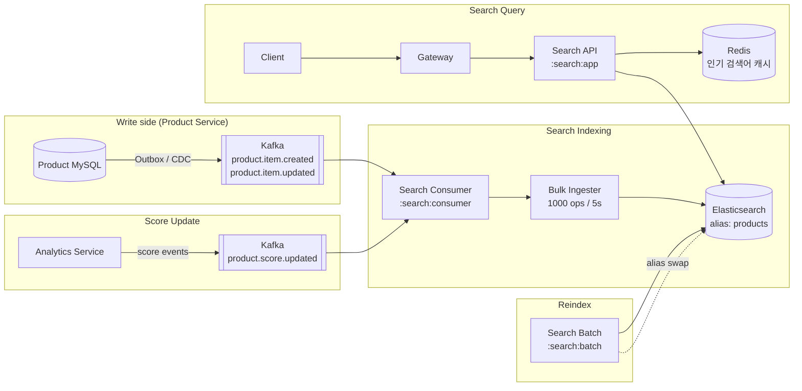

# 09. Search System

> 본 msa **search/{domain, app, consumer, batch}** 4모듈이 그대로 표준 모범. 색인 파이프라인, 랭킹, alias swap 무중단 reindex가 핵심.

---

## 1. 요구사항

### Functional

1. 키워드 검색 (full-text, 한국어 형태소)
2. 필터 (가격, 카테고리, 상태)
3. 정렬 + 랭킹 (관련성, 인기도, CTR)
4. Autocomplete (검색어 자동완성)
5. Typo tolerance (오타 허용)
6. 검색어 추천 / 인기 검색어

### Non-Functional

| 항목 | 목표 |
|---|---|
| 검색 P99 latency | 200ms |
| Indexing lag (event → 검색 노출) | < 5초 |
| Availability | 99.9% (검색 다운 시 카탈로그 못 봄) |
| Scale | 1억 product, 1000 QPS |

---

## 2. 용량 산정

```
catalog = 1억 product
평균 product document = 2KB → ES storage 200GB (raw) × replica 3 = 600GB
검색 QPS = 1,000 (피크 5,000)
색인 QPS:
  - 일 변경 1M event → 12 / s (피크 60)
  - 신규 출시 batch reindex: 시간당 100k

ES Cluster:
  Data nodes: 6 (각 4core, 32GB heap, 1TB SSD)
  Master nodes: 3 (HA)
  Coordinating: 2
  Replica = 1 (read scale + 가용성)
  Shard = 12 (data node 2배수)
```

---

## 3. API

```
GET /api/v1/search/products?q=노트북&category=electronics&sort=relevance&page=0&size=20
GET /api/v1/search/autocomplete?prefix=노트
GET /api/v1/search/popular                       # 인기 검색어 (Redis ZSET)
POST /api/v1/search/suggest                      # 추천 (out of scope)
```

---

## 4. msa search 모듈 분석 (실제 코드 grounding)

### 4-1. 4-모듈 구조 (CLAUDE.md 발췌)

| Gradle path | 역할 | Port |
|---|---|---|
| `:search:domain` | Pure Kotlin 도메인 (검색 모델, 포트) | - |
| `:search:app` | REST API 서버 | 8083 |
| `:search:consumer` | Kafka → ES 실시간 색인 | 8084 |
| `:search:batch` | 전체 reindex 배치 | 8085 |

> **분리 이유**: API 서버 부하와 색인 파이프라인 부하가 다름. 배치는 IO 집약, API는 CPU/네트워크.

### 4-2. 도메인 모델 (`ProductDocument.kt`)

```kotlin
data class ProductDocument(
    val id: String,
    val name: String,
    val price: BigDecimal,
    val status: String,
    val createdAt: LocalDateTime = LocalDateTime.now(),
    val popularityScore: Double = 0.0,
    val ctr: Double = 0.0,
    val cvr: Double = 0.0,
    val scoreUpdatedAt: Long = 0
)
```

- 도메인은 ES 의존 없음 (Pure Kotlin) → 테스트 용이
- 인프라 어댑터 (`ProductEsDocument.kt`) 가 ES 어노테이션 부착

### 4-3. ES 매핑 (`ProductEsDocument.kt`)

```kotlin
@Document(indexName = "products")
data class ProductEsDocument(
    @Id val id: String,
    @Field(type = FieldType.Text, analyzer = "nori") val name: String,    // ★ 한국어 형태소
    @Field(type = FieldType.Double) val price: BigDecimal,
    @Field(type = FieldType.Keyword) val status: String,
    @Field(type = FieldType.Date, ...)
    val createdAt: LocalDateTime,
    @Field(type = FieldType.Double) val popularityScore: Double = 0.0,
    @Field(type = FieldType.Double) val ctr: Double = 0.0,
    @Field(type = FieldType.Double) val cvr: Double = 0.0,
    @Field(type = FieldType.Long) val scoreUpdatedAt: Long = 0
)
```

**핵심 설계**:
- `nori` 분석기: 한국어 형태소 분석 (Elastic 공식)
- `Keyword` (status): 정확 일치, 필터용
- `Text` (name): full-text 분석
- 점수 필드 (popularityScore, ctr, cvr): function_score에서 가중치

### 4-4. 검색 쿼리 (`ProductSearchAdapter.kt`)

```kotlin
val query = NativeQuery.builder()
    .withQuery { q ->
        q.functionScore { fs ->
            fs.query { inner ->
                inner.bool { b ->
                    b.must { m -> m.match { it.field("name").query(keyword) } }
                    b.filter { f -> f.term { it.field("status").value("ACTIVE") } }
                }
            }
            fs.functions { fn ->
                fn.fieldValueFactor { fvf ->
                    fvf.field("popularityScore")
                        .factor(rankingProperties.popularityWeight)
                        .modifier(FieldValueFactorModifier.Log1p)
                        .missing(0.0)
                }
            }
            fs.functions { fn ->
                fn.fieldValueFactor { fvf ->
                    fvf.field("ctr")
                        .factor(rankingProperties.ctrWeight)
                        .modifier(FieldValueFactorModifier.Log1p)
                }
            }
            fs.scoreMode(FunctionScoreMode.Sum)
            fs.boostMode(FunctionBoostMode.Sum)
        }
    }
    .withPageable(pageable)
    .build()
```

**해석**:
- `bool.must(match)` → 텍스트 매칭으로 base score
- `bool.filter(term)` → ACTIVE 상태 필터 (score 영향 X)
- `function_score` → popularityScore + ctr 가중 합산 (log1p로 saturate)
- `boostMode = Sum`: query score + function score 합산

> 본 msa는 이미 **상용 ES 랭킹 패턴**을 구현. CTR / CVR / popularity의 3-요소 가중 모델은 amazon, naver 와 거의 동일.

### 4-5. 색인 파이프라인 (`ProductIndexingConsumer.kt`)

```kotlin
@KafkaListener(
    topics = ["product.item.created", "product.item.updated"],
    groupId = "\${kafka.consumer.group-id}",
    containerFactory = "productEventListenerContainerFactory"
)
fun consume(event: ProductIndexEvent) {
    bulkProcessor.processDocument(indexAlias, ProductDocument(...))
}
```

**핵심**:
- product 서비스 → Kafka → search consumer (CDC 패턴)
- `indexAlias` 사용 (직접 인덱스명 X) → reindex 시 무중단 swap
- consumer group: `search-indexer`
- 멱등성 (ADR-0012): 같은 productId가 두 번 와도 ES upsert 동작

### 4-6. Bulk Indexer (`EsBulkDocumentProcessor.kt`)

```kotlin
primaryIngester = BulkIngester.of { b ->
    b.client(esClient)
     .maxOperations(1000)        // 1000개씩 묶어 전송
     .flushInterval(5, TimeUnit.SECONDS)
     .listener(primaryListener())
}

retryIngester = BulkIngester.of { b ->
    b.client(esClient)
     .maxOperations(500)
     .flushInterval(3, TimeUnit.SECONDS)
}
```

**관찰**:
- **Primary + Retry 2단 ingester** → 실패 자동 retry (afterBulk에서 retryIngester.add)
- 1000건 또는 5초 단위 flush → throughput vs latency 균형
- Hot path 직접 ES write 안 함 → consumer가 큐로 동작

### 4-7. Alias Swap Reindex (`IndexAliasManager.kt`)

```kotlin
fun updateAliasAndCleanup(alias: String, newIndexName: String, maxRetention: Int = 2) {
    val existingIndices = getIndicesForAlias(alias)
    esClient.indices().updateAliases { req ->
        req.actions { action ->
            existingIndices.forEach { old -> action.remove { r -> r.index(old).alias(alias) } }
            action.add { a -> a.index(newIndexName).alias(alias) }
        }
    }
    // 보관 정책 초과 인덱스 삭제
    existingIndices.sortedDescending().drop(maxRetention).forEach { ... }
}
```

**무중단 Reindex 절차**:
1. `products_20260501120000` 새 인덱스 생성
2. batch가 전체 데이터를 새 인덱스에 색인 (수십분~시간)
3. alias `products` 를 새 인덱스로 atomic swap
4. 이전 인덱스는 보관 (rollback용) → 2개 초과 시 삭제

> 매핑 변경, 분석기 변경 시 필수 패턴. ES의 표준.

---

## 5. High-Level Architecture



---

## 6. 핵심 알고리즘

### 6-1. Autocomplete

**옵션 A: ES completion suggester**
```json
{ "suggest": { "name_complete": { "prefix": "노트", "completion": { "field": "name_suggest" } } } }
```

**옵션 B: Trie + Redis (sorted set)**
```
ZADD ac:{prefix} {weight} {term}
ZREVRANGE ac:노트 0 9       # 가중치 상위 10개
```

옵션 B가 더 빠름 (P99 < 10ms) — 검색량 가중치 직접 제어 가능.

### 6-2. Typo tolerance (Fuzzy)

```json
{ "match": { "name": { "query": "lopto", "fuzziness": "AUTO" } } }
```

- `fuzziness: AUTO` → 길이 기반 edit distance (3 chars: 0, 4-5: 1, 6+: 2)
- 비용: 인덱스 추가 메모리 + 쿼리 시간 증가

### 6-3. 인기 검색어

```kotlin
// 쿼리 들어올 때마다 카운트
fun search(keyword: String) {
    redis.zincrby("popular:keywords", 1.0, keyword)
    redis.expire("popular:keywords", 3600)
    ...
}

// 시간당 새 ZSET → 5분 윈도우 평균 계산
@Scheduled(fixedRate = 60_000)
fun aggregatePopular() {
    val now = LocalDateTime.now()
    val key = "popular:${now.format("yyyyMMddHHmm")}"
    redis.zunionstoreWithLast5Min(key, ...)
}
```

### 6-4. CTR / CVR Score Update

```
사용자 검색 → 클릭 → 구매 이벤트 → analytics → product.score.updated 발행
search consumer → ES partial update (popularityScore 갱신)
```

본 msa의 **ProductScoreUpdateConsumer** 가 이 역할 담당.

---

## 7. ES 인덱스 설계

### 7-1. Settings

```json
{
  "settings": {
    "number_of_shards": 12,
    "number_of_replicas": 1,
    "refresh_interval": "5s",        // 색인 → 검색 노출 5초
    "analysis": {
      "analyzer": {
        "nori_analyzer": {
          "type": "custom",
          "tokenizer": "nori_tokenizer",
          "filter": ["nori_part_of_speech", "lowercase", "synonym"]
        }
      }
    }
  }
}
```

**튜닝 포인트**:
- `refresh_interval`: 짧을수록 lag 적지만 부하 ↑. 본 msa는 5s.
- shard 수 = data node × 2 (rule of thumb)
- replica 1 → read scale 2배 + 1대 다운 견딤

### 7-2. Mapping

```json
{
  "properties": {
    "name":  { "type": "text", "analyzer": "nori_analyzer", "fields": { "keyword": { "type": "keyword", "ignore_above": 256 } } },
    "price": { "type": "double" },
    "status":{ "type": "keyword" },
    "popularityScore": { "type": "double" },
    "ctr":  { "type": "double" }
  }
}
```

`name.keyword` 멀티필드 → 정렬, 집계용.

---

## 8. Scale-out 전략

### 8-1. Read

- Replica 추가 → query 부하 분산
- Query cache (ES filter cache)
- Application-level Redis cache (인기 검색어 결과)

### 8-2. Write

- Bulk size 튜닝 (1000 → 5000)
- refresh_interval 늘리기 (5s → 30s, batch 모드)
- 재색인 중에는 replica = 0 (속도 ×2)

### 8-3. Hot keyword 문제

- 동일 키워드 1초 1만 호출 → 캐시 hit 99% (Redis 결과 캐시 5초 TTL)
- ES 쿼리 cache hot key 비활성화 시 application 레벨 캐시 필수

---

## 9. Trade-off 박스

| 결정 | 선택 | 포기 |
|---|---|---|
| 색인 트리거 | Kafka CDC (비동기) | Strong consistency (5초 lag) |
| 분석기 | nori (한국어) | 영어 검색 정확도 (보완 필요) |
| 점수 모델 | function_score 합산 | LTR (ML) — 별도 인프라 |
| Autocomplete | Redis ZSET | ES completion (관리 단순) |
| Reindex | Alias swap | rolling update (불가) |
| Bulk size | 1000 / 5s | 즉시 노출 (SSE 등으로 trade-off) |

---

## 10. 장애 시나리오

| 장애 | 대응 |
|---|---|
| ES master 다운 | quorum 유지 (master 3대), failover 자동 |
| Kafka consumer lag 폭증 | autoscale + alert, primary ingester 튜닝 |
| 잘못된 매핑 배포 | alias 이전 인덱스로 즉시 rollback |
| Hot shard | shard rebalance + 적절한 routing |
| ES cluster 전체 다운 | DB fallback search (간단 LIKE) — degraded |

---

## 11. 실제 시스템 사례

| 회사 | 특징 |
|---|---|
| **Amazon** | A9 검색엔진, 자체 LTR + ES 혼합 |
| **네이버 쇼핑** | nori + 자체 형태소 + 머신러닝 랭킹 |
| **쿠팡** | OpenSearch + Solr 마이그레이션 |
| **Airbnb** | ES + ML feature store, geo + price 다층 |
| **본 msa** | ES + nori + function_score + alias swap (위 분석) |

---

## 12. 면접 30초 요약

> "Search는 OLAP-like 시스템. 본 msa search는 4모듈 분리 (domain/app/consumer/batch) 가 모범. 색인은 Kafka CDC + BulkIngester (1000ops/5s) + retry 2단 ingester 로 신뢰성 확보. 검색은 ES function_score로 텍스트 매칭 + popularityScore + CTR 가중 합산. Reindex는 alias swap으로 무중단. 한국어 nori + Redis 기반 인기 검색어. Hot keyword는 application 캐시 5초 TTL."

---

## 부록 A. 흔한 함정

1. **ES에 직접 write API** → 백프레셔 없음, 폭주
2. **인덱스명 hard-code** → 매핑 변경 시 다운타임
3. **refresh_interval 1초** → 부하 폭증, 5초+ 권장
4. **replica 0** → 단일 장애로 검색 다운
5. **`_doc` 단일 type 안 씀** → 7.x deprecated
6. **`text` 만 사용 (keyword 없음)** → 정렬/집계 불가
7. **Score 가중치 hard-code** → A/B 테스트 불가, properties로 외부화 필수 (본 msa는 이미 RankingProperties 분리)
