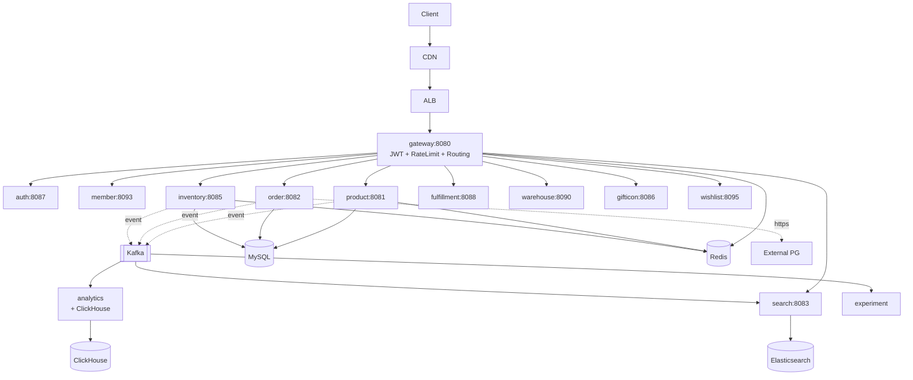

# 10. e-Commerce System

> 본 시나리오는 **본 msa 프로젝트 자체가 답안**. 면접에서 "본 프로젝트의 아키텍처 결정을 회고하고 평가" 라는 형태로 출제 대비. 잘된 부분과 한계를 정직하게 분석한다.

---

## 1. 요구사항 (msa 프로젝트 매핑)

### Functional

1. 상품 카탈로그 (등록, 조회, 검색)
2. 주문 + 결제 (PG 연동)
3. 재고 관리 (예약/차감/복구)
4. 풀필먼트 (출고)
5. 회원, 위시리스트, 기프티콘
6. 검색 (한국어 형태소)
7. 분석 / 추천
8. 백오피스 (admin)

본 msa 서비스 매핑:

```
gateway · auth · member ────┐
                             │
product (SSOT) ──────────────┤
                             │
order ──────────────────────┤── 사용자 흐름
                             │
inventory · fulfillment ────┤
warehouse ──────────────────┤
                             │
gifticon · wishlist ────────┘

search · analytics · experiment ── 부가 기능
chatbot · code-dictionary · charting · quant ── 독립 도메인
```

### Non-Functional (ADR-0025 Latency Budget)

| Tier | 서비스 | P99 SLA |
|---|---|---|
| 1 (Critical) | gateway, auth, order, payment | 300ms |
| 2 (Read) | product, search, member | 500ms |
| 3 (Async) | analytics, recommend | 5s |

---

## 2. 본 msa 아키텍처 평가

### 2-1. 잘된 결정 (TOP 5)

#### ① Clean Architecture + Nested Submodule (ADR-0001)

```
{service}/
  domain/   ← Pure Kotlin, 프레임워크 없음
  app/      ← Spring Boot
```

**평가**: ★★★★★
- 도메인 테스트가 Spring context 없이 < 1초 실행
- 인프라 교체 시 도메인 변경 0
- 면접 답변 시 "포트와 어댑터" 패턴 그대로 설명 가능

**한계**:
- 모듈 수 증가 → 빌드 시간 증가
- 신규 개발자 학습 곡선

#### ② API Gateway 패턴 (gateway 서비스)

- Spring Cloud Gateway, JWT 검증, Rate Limiting, Routing 한 곳
- WebFlux로 reactive (높은 동시성)

**평가**: ★★★★☆
- 인증을 모든 서비스가 분산 구현하지 않음
- Rate Limiter도 중앙에서 제어 (위 06번 문서)

**한계**:
- 단일 게이트웨이 → SPOF 가능 (HPA + multi-AZ로 완화)
- 비즈니스 라우팅 로직이 코드로 hard-code (DB 기반 동적 라우팅 미적용)

#### ③ Event-driven (Kafka) + Outbox (ADR-0011)

```
Order COMPLETED → Kafka outbox → product.score.update / search index / analytics
```

**평가**: ★★★★★
- 서비스 간 강결합 회피 (CDC + Debezium)
- 멱등성 패턴 (ADR-0012)으로 At-least-once 안전
- 본 msa search consumer가 모범 사례

**한계**:
- 흐름 추적 어려움 (분산 트레이싱 강화 필요)
- DLQ 정책 일관되지 않음 (서비스마다 다름)

#### ④ Search 분리 (ADR-0008, 0009)

- ES 읽기 모델, MySQL OLTP 분리
- Consumer (실시간) + Batch (alias swap) 양립
- nori 한국어 분석기

**평가**: ★★★★★
- 검색 P99 200ms 달성 가능 구조
- Reindex 무중단 (alias swap)
- 점수 모델 외부화 (RankingProperties)

**한계**:
- LTR (ML 랭킹) 미적용
- 영어/다국어 지원 약함

#### ⑤ K8s 전환 (ADR-0019)

- Eureka 제거 → K8s DNS
- Jib 이미지 빌드 (Dockerfile 없음)
- k3s-lite (개발) vs prod-k8s (운영) 이원화

**평가**: ★★★★☆
- 클라우드 native 지향
- Service mesh 도입 여지

**한계**:
- Service mesh 미도입 → 보안 정책, 가시성 약함
- HPA만 사용, KEDA 미도입

### 2-2. 아쉬운 결정 (Top 3)

#### ① 단일 MySQL Auto-Increment

- 모든 서비스가 단일 MySQL 인스턴스 + Auto-Increment PK
- 샤딩 미적용 → 1억 row 도달 시 문제

**왜 아쉬운가**: 면접관이 "DAU 100x 시?" 질문하면 답변 어려움.

**개선안**:
- Snowflake / KSUID 도입
- 서비스별 DB 분리 (현재는 schema 분리만)

#### ② SAGA Choreography (Orchestrator 없음)

- order ↔ inventory ↔ payment 가 이벤트 chain
- 흐름 추적 어려움

**왜 아쉬운가**: 결제 실패 + 보상 실패 시 운영 디버깅 비용.

**개선안**:
- 분산 트레이싱 (OpenTelemetry) + Saga 단계별 메트릭
- 또는 Temporal/Cadence 도입

#### ③ Notification 서비스 미구현

- 결제 완료, 주문 상태 변경 시 사용자 알림 미통합
- 각 서비스가 직접 구현하면 결합도↑

**개선안**: 위 07번 문서의 Notification System 도입.

---

## 3. 시나리오별 매핑

### 3-1. 트래픽 폭주 (BTS 굿즈 오픈)

**현재 가능 여부**:
- gateway Rate Limiter (100/200 token bucket) → 단일 limiter로 제한적
- inventory가 Optimistic Lock → 동시성 제어 가능
- product 캐시 (Redis) → 조회 부하 흡수

**부족**:
- 대기열 (Queue Gateway) 없음 → 8번 ticketing 패턴 필요
- CDN 적극 활용 미정 (정적 자원)
- Multi-region 미지원

### 3-2. 결제 폭주 (블프 세일)

**현재**:
- order → payment 동기 호출 + CircuitBreaker (ADR-0015)
- Outbox로 이벤트 발행 보장

**부족**:
- Idempotency-Key 명시적 강제 (현재 부분 적용)
- Multi-PG 라우팅
- 정산 reconciliation 자동화

### 3-3. 상품 검색 트래픽

**현재**: ★★★★★ (위 09번에서 분석한 search 모듈이 모범)

**개선 후보**:
- Autocomplete 별도 (Redis ZSET)
- 인기 검색어 실시간 트렌드
- A/B 테스트 기반 ranking 튜닝

---

## 4. 데이터 모델 회고

### 4-1. 서비스별 DB

| 서비스 | DB | PK | 비고 |
|---|---|---|---|
| product | MySQL | Auto-Increment | SSOT |
| order | MySQL | Auto-Increment | OrderStatus 상태머신 |
| inventory | MySQL | Auto-Increment | Optimistic Lock |
| search | Elasticsearch | UUID/string | products alias |
| analytics | MySQL + ClickHouse | Auto-Increment / hash | OLTP + OLAP |

**원칙 준수**: 서비스 간 DB 공유 X (CLAUDE.md 명시)

### 4-2. Cross-service 데이터 동기화

```
product → product.item.created/updated (Kafka)
  → search consumer (ES 색인)
  → analytics consumer (메트릭)
  → recommend consumer (협업필터링)
```

> **Eventual consistency 합의**: 5초 내 동기화 목표.

---

## 5. High-Level Architecture (msa 전체)



---

## 6. Trade-off 박스 (msa 결정)

| 결정 | 선택 | 포기 | 평가 |
|---|---|---|---|
| 통신 | 동기 REST (read) + 비동기 Kafka (mutation) | 단순 동기 | ★★★★★ |
| Discovery | K8s DNS | Eureka | ★★★★★ |
| Architecture | Clean + Nested Module | 단일 모듈 | ★★★★☆ |
| DB | 서비스별 MySQL | 단일 거대 DB | ★★★★☆ |
| Saga | Choreography | Orchestrator | ★★★☆☆ (트레이싱 부족) |
| Search | ES + 4모듈 | DB LIKE | ★★★★★ |
| ID | Auto-Increment | Snowflake | ★★☆☆☆ (확장성 약점) |
| Auth | JWT + Gateway | Session | ★★★★☆ |
| Cache | Cache-aside | Write-through | ★★★★☆ |
| Notification | (미구현) | - | ★☆☆☆☆ (gap) |

---

## 7. 면접 화법 (이 프로젝트 사용)

### 7-1. "본 프로젝트에서는..." 패턴

> "본 msa 프로젝트에서 비슷한 문제를 해결한 경험이 있습니다.
> Order 서비스에서 결제 시 Inventory에 동기 호출 + CircuitBreaker로 PG 장애 격리, Kafka Outbox 패턴으로 product.score.updated 같은 이벤트의 유실을 방지했습니다.
> 다만 Saga Choreography를 채택해 흐름 추적이 어려운 한계가 있어, 분산 트레이싱 강화가 다음 과제였습니다."

### 7-2. "이걸 다시 한다면..."

> "다시 설계한다면 (1) PK는 Snowflake로 채번해 서비스별 샤딩 가능성을 열어두고, (2) Notification 서비스를 1차 분리해 channel abstraction을 일찍 마련하고, (3) Service Mesh (Istio) 도입으로 보안 정책을 코드 밖으로 빼겠습니다."

---

## 8. 장애 시나리오 회고

| 장애 | 현재 대응 | 개선 필요 |
|---|---|---|
| MySQL primary 다운 | replica 승격 (수동) | 자동 failover (RDS Multi-AZ) |
| Redis 다운 | DB 직접 (성능 저하) | Cluster 도입, Stampede 방어 |
| Kafka 다운 | DB outbox로 buffer | DLQ 일원화 |
| PG 장애 | CircuitBreaker | Multi-PG 자동 라우팅 |
| Region 다운 | 미대응 | Multi-region active-passive |
| 인기 상품 hot key | 부분 캐시 | Local cache + jitter |

---

## 9. 비교: 본 msa vs 표준 e-Commerce 시나리오

| 항목 | 표준 답안 | 본 msa | 평가 |
|---|---|---|---|
| 서비스 분리 | Catalog/Cart/Order/Payment/Search | Product/Order/Inventory/Search/Fulfillment | 동등 |
| 재고 동시성 | Redis Lua + DB lock | Optimistic + (Phase 2 Redis Lua) | 진행중 |
| 검색 | ES | ES (4모듈) | 모범 |
| 결제 | Saga + ledger | Saga (ledger 없음) | 부족 |
| 분석 | OLAP DB | ClickHouse | 모범 |
| Notification | Async fanout | 미구현 | 부족 |
| Geo | 위치 기반 (out of scope) | 미고려 | N/A |

---

## 10. 면접 30초 요약

> "본 msa 프로젝트는 Clean Architecture + Nested Submodule + Kafka 이벤트 + ES 검색 + K8s 전환으로 표준 e-Commerce 시나리오를 거의 그대로 구현한 사례입니다. 잘된 결정은 (1) 서비스별 도메인 분리, (2) Outbox + CDC 패턴, (3) 검색 4모듈 구조. 한계는 (1) 단일 MySQL Auto-Increment 의존, (2) Saga Choreography의 가시성 부족, (3) Notification 미구현. 다시 설계한다면 Snowflake ID, Saga Orchestrator (Temporal), Service Mesh를 우선 도입하겠습니다."

---

## 11. 다음 단계 → 12번 improvements

회고에서 도출한 개선 후보를 다음 문서에 정리:

1. PK 채번 전략 (Snowflake)
2. Saga 가시성 (Orchestrator or 트레이싱)
3. Notification 서비스 신설
4. Multi-PG 라우팅
5. Multi-region (Active-Passive)
6. Service Mesh (Istio)
7. Rate Limiter 고도화 (Tier별)
8. Stampede 방어
9. LTR (Search ML)
10. DLQ 일원화
