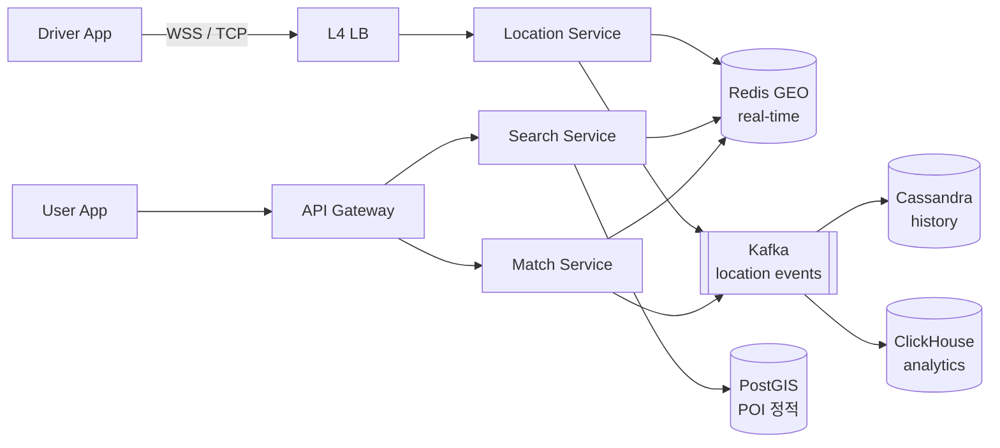
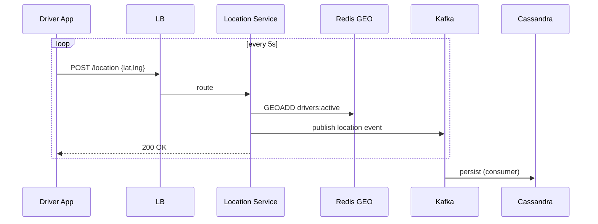

# 11. Map / Geo System

> **위치 기반 서비스**의 핵심: geohash / quadtree / R-tree 같은 공간 인덱스 + 실시간 위치 갱신. 면접에서 자주 등장하는 "근처 5km 매장 검색", "근처 운전자 매칭" 시나리오.

---

## 1. 요구사항

### Functional

1. 매장/POI 검색: "내 위치 5km 이내 카페"
2. 실시간 위치 추적 (운전자, 배달원)
3. 근처 매칭 (가장 가까운 운전자)
4. ETA 계산 (도착 예상 시간)
5. (선택) 경로 안내

### Non-Functional

| 항목 | 목표 |
|---|---|
| 위치 갱신 빈도 | 4-10초마다 (운전자) |
| 검색 P99 | 100ms |
| 위치 검색 정확도 | ±50m |
| 동시 운전자 | 100k (서울 기준) |
| 동시 사용자 검색 | 50k QPS (Queries Per Second, 초당 쿼리 수) |

### Out of scope

- Routing engine (OSRM/Google Maps API 외부 의존)
- 지도 타일 렌더링 (CDN (Content Delivery Network, 콘텐츠 전송 네트워크)으로 분리)

---

## 2. 용량 산정

```
운전자 100k × 위치 갱신 5초마다 = 20k QPS write
사용자 검색 50k QPS read

위치 데이터 1건 = 32 bytes (id, lat, lng, ts)
일 위치 갱신 = 100k × (86400/5) = 1.7B / 일 → cold storage 필요

검색 쿼리: 위치 × 반경 → 후보 50개 평균
```

---

## 3. 핵심 자료구조: 공간 인덱스 비교

### 3-1. Geohash

지구 표면을 격자로 나눠 string 인코딩.

```
좌표 (37.5665, 126.9780) → geohash "wydq8" (5자, ~5km 격자)
좌표 (37.5666, 126.9781) → geohash "wydq8" (인접하므로 같은 prefix)
```

**프리픽스 매칭 = 근접**:
- 5자 → 약 5km
- 6자 → 약 1.2km
- 7자 → 약 150m
- 8자 → 약 19m
- 9자 → 약 2.4m

**한계**: **경계 문제** — 인접한 두 점이 다른 geohash prefix일 수 있음 (격자 경계).
**해결**: 검색 시 8개 이웃 cell 함께 조회.

```
Redis: ZADD locations:{geohash5} {ts} {driverId}
       ZADD locations:{geohash5_neighbor1} ...
```

### 3-2. Quadtree

지역을 4분할 → 분할된 region에 N개 이상의 포인트가 있으면 또 4분할.

```
       ┌─────────┐
       │  NW │ NE │
       ├──────────┤
       │  SW │ SE │
       └─────────┘
```

**장점**: 밀집 지역 자동 세분화 (서울 강남 vs 강원도 산골)
**단점**: 트리 갱신 비용, 전체 rebalance 필요

### 3-3. R-tree

직사각형 bounding box 계층. PostGIS 기본.

**장점**: 면적/도형 검색 가능
**단점**: 갱신 비용 큼

### 3-4. S2 (Google)

지구를 6면 cube projection → Hilbert curve로 정렬. uber에서 차용.

**장점**: 정확도 + 인접 query 우수
**단점**: 학습 곡선

### 비교 표

| 자료구조 | 점 검색 | 갱신 | 구현 | 사용처 |
|---|---|---|---|---|
| **Geohash** | O(1) prefix | O(1) | Redis ZSET | 배달, 매장 검색 |
| **Quadtree** | O(log N) | 중간 | 직접 구현 | 게임, 시뮬레이션 |
| **R-tree** | O(log N) | 비쌈 | PostGIS | GIS, 도형 |
| **S2** | O(1) | O(1) | Lib | Uber |

> **현실 정답**: 단순 시나리오는 **Redis GEO (내부적으로 geohash 사용)** + **PostGIS** 조합.

---

## 4. API

```
GET /api/v1/places/nearby?lat=37.5&lng=127.0&radius=5000&category=cafe
GET /api/v1/drivers/nearby?lat=37.5&lng=127.0&radius=2000

POST /api/v1/drivers/{id}/location              # 운전자 위치 갱신
  Body: { "lat": 37.5, "lng": 127.0, "ts": 1715000000 }

POST /api/v1/match                              # 매칭 요청 (사용자 ↔ 운전자)
  Body: { "userLocation": {...}, "destination": {...} }
```

---

## 5. High-Level Architecture



**핵심 분리**:
1. **Location Service** — 운전자 위치 갱신 (write-heavy)
2. **Search Service** — 매장/POI 검색 (read-heavy)
3. **Match Service** — 사용자 ↔ 운전자 매칭 (실시간)
4. Storage:
   - Redis GEO: 실시간 위치 (ms 단위 갱신)
   - PostGIS: 정적 POI (가게, 도로, 행정구역)
   - Cassandra: 위치 history (분석/감사)

---

## 6. 핵심 알고리즘

### 6-1. Redis GEO 명령어 (geohash 기반)

```redis
GEOADD drivers:active 127.0 37.5 driver-1
GEOADD drivers:active 127.01 37.51 driver-2

# 좌표 (127.0, 37.5)에서 5km 반경 내 운전자
GEOSEARCH drivers:active FROMLONLAT 127.0 37.5 BYRADIUS 5 km ASC COUNT 50
```

**내부 구현**: ZSET + geohash score 변환. O(N + log(M)) where N=결과, M=총.

### 6-2. Geohash Prefix 검색 (옵션)

```kotlin
fun nearby(lat: Double, lng: Double, radiusKm: Double): List<Place> {
    val precision = when {
        radiusKm <= 1   -> 7   // ~150m
        radiusKm <= 5   -> 5   // ~5km
        else            -> 4   // ~40km
    }
    val centerHash = Geohash.encode(lat, lng, precision)
    val neighbors = Geohash.neighbors(centerHash)   // 8개

    val candidates = (listOf(centerHash) + neighbors).flatMap { hash ->
        redis.zrange("places:$hash", 0, -1)
    }

    // 정확한 거리 계산으로 필터
    return candidates
        .map { Place.parse(it) }
        .filter { haversine(lat, lng, it.lat, it.lng) <= radiusKm * 1000 }
        .sortedBy { haversine(lat, lng, it.lat, it.lng) }
}
```

### 6-3. Haversine 거리 (구면 거리)

```kotlin
fun haversine(lat1: Double, lng1: Double, lat2: Double, lng2: Double): Double {
    val R = 6_371_000.0  // 지구 반지름 m
    val dLat = Math.toRadians(lat2 - lat1)
    val dLng = Math.toRadians(lng2 - lng1)
    val a = sin(dLat/2).pow(2) +
            cos(Math.toRadians(lat1)) * cos(Math.toRadians(lat2)) *
            sin(dLng/2).pow(2)
    val c = 2 * atan2(sqrt(a), sqrt(1-a))
    return R * c   // m
}
```

### 6-4. 운전자 매칭 (Uber 스타일)

```kotlin
fun match(userLat: Double, userLng: Double): Driver? {
    // 1) Redis GEO로 5km 반경 후보 추출
    val candidates = redis.geosearch("drivers:active",
        userLat, userLng, 5000.0, count = 20)

    // 2) ETA 계산 (간단한 직선 거리 + 평균 속도)
    val sorted = candidates.map { d ->
        val distance = haversine(userLat, userLng, d.lat, d.lng)
        val etaSec = distance / 8.0  // 평균 8m/s (~30km/h)
        d.copy(etaSec = etaSec)
    }.sortedBy { it.etaSec }

    // 3) 1순위 운전자에게 push, accept 받으면 ASSIGN
    for (driver in sorted) {
        if (pushOffer(driver) == ACCEPTED) {
            redis.zrem("drivers:active", driver.id)  // 매칭됨
            return driver
        }
    }
    return null
}
```

---

## 7. 데이터 모델

### 7-1. Redis (실시간)

```
GEOADD drivers:active {lng} {lat} {driverId}
GEOADD drivers:idle   {lng} {lat} {driverId}

# 매칭 실패 카운터 (driver별 fairness)
HINCRBY driver:stats:{driverId} declined 1

# 사용자 검색 캐시 (10초)
SET search:cache:{lat}:{lng}:{radius} <result> EX 10
```

### 7-2. PostGIS (정적 POI)

```sql
CREATE TABLE places (
    id          BIGINT PRIMARY KEY,
    name        VARCHAR(255),
    category    VARCHAR(64),
    geom        GEOGRAPHY(POINT, 4326),    -- WGS84
    address     TEXT,
    rating      DECIMAL(2,1),
    INDEX (category)
);
CREATE INDEX idx_places_geom ON places USING GIST (geom);

-- 5km 반경 카페
SELECT id, name, ST_Distance(geom, ST_MakePoint(127.0, 37.5)::geography) AS dist
FROM places
WHERE category = 'CAFE'
  AND ST_DWithin(geom, ST_MakePoint(127.0, 37.5)::geography, 5000)
ORDER BY dist
LIMIT 50;
```

### 7-3. Cassandra (history)

```cql
CREATE TABLE driver_locations (
    driver_id   text,
    bucket      int,            -- 일별
    ts          timeuuid,
    lat         double,
    lng         double,
    speed       double,
    heading     double,
    PRIMARY KEY ((driver_id, bucket), ts)
) WITH CLUSTERING ORDER BY (ts DESC);
```

---

## 8. 위치 갱신 파이프라인



**최적화**:
- TCP / WebSocket 사용 (HTTP overhead 제거)
- batch 갱신 (5건씩 묶기)
- 정지 시 갱신 빈도 1/10 (geofence)

---

## 9. Scale-out 전략

### 9-1. Geographic sharding

운전자 ID 기반 hash 샤딩보다 **위치 기반** 샤딩이 효율적:
- 서울 = shard-1
- 부산 = shard-2
- 단, 운전자가 도시 간 이동 시 처리 필요 (re-shard)

### 9-2. Hot region (강남, 홍대)

```
GEOSEARCH "drivers:active" 강남 BYRADIUS 1km
→ 수천 명 후보 → CPU 부하

해결:
  - 결과를 Redis 캐시 (10초 TTL (Time To Live, 생존 시간), 위치 기반 key)
  - 이미 매칭 시도 중인 driver는 별도 set으로 격리
```

### 9-3. Read replica

PostGIS를 read replica 다수 → POI 검색 분산.

---

## 10. Trade-off 박스

| 결정 | 선택 | 포기 |
|---|---|---|
| 공간 인덱스 | Redis GEO (geohash) | 정밀도 (경계 문제 8-cell) |
| POI 저장 | PostGIS | 단순 RDB (geo query 약함) |
| 갱신 주기 | 5초 | 1초 (부하 5배) |
| Sharding | Geographic | Driver-ID hash (불균형) |
| Match 정렬 | Haversine 거리 | 실제 도로 거리 (외부 API) |
| Push offer | 1명씩 sequential | 동시 N명 (race condition 위험) |

---

## 11. 장애 시나리오

| 장애 | 대응 |
|---|---|
| Redis GEO 다운 | Cassandra fallback (성능 저하) |
| 위치 갱신 지연 (network) | client-side buffering + bulk send |
| Hot region 폭주 | 캐시 TTL 5초로 흡수 |
| GPS jitter (운전자 위치 튐) | Kalman filter, 마지막 N개 평균 |
| 부정 운전자 (위치 조작) | speed/jump 검증 + 재인증 |

---

## 12. 실제 시스템 사례

| 회사 | 특징 |
|---|---|
| **Uber** | H3 (자체 hex grid) + Cassandra + Redis |
| **배달의민족** | 자체 자료구조, 권역 기반 라우팅 |
| **Google Maps** | S2 + Bigtable, 자체 도로 그래프 |
| **Yelp** | PostGIS + ES, geohash 5자 |
| **Foursquare** | MongoDB geo + geofence |

---

## 13. 면접 30초 요약

> "Map/Geo는 공간 인덱스가 핵심. 실시간 위치는 Redis GEO (geohash 기반) 으로 GEOADD/GEOSEARCH O(log N), 정적 POI는 PostGIS GIST 인덱스. 운전자 매칭은 5km 반경 후보 → Haversine 거리 정렬 → push offer sequential. 5초마다 위치 갱신, 정지 시 1/10 throttle. Hot region은 캐시로 흡수. 위치 history는 Cassandra (driver_id, bucket) 파티션. Geographic sharding이 user-id hash보다 효율적."

---

## 부록 A. 흔한 함정

1. **단순 lat/lng range query** → 인덱스 안 탐, 100k row scan
2. **Geohash 경계 무시** → 인접 점 누락, 8-cell 검색 필수
3. **위치 history를 OLTP DB에** → 1B row 후 폭사
4. **GPS jitter 무시** → 운전자 1초마다 50m씩 점프
5. **거리 계산 Euclidean** → 위경도는 구면, Haversine 필수
6. **Match 동시 N명에게 push** → race condition (한 운전자가 2개 수락)
