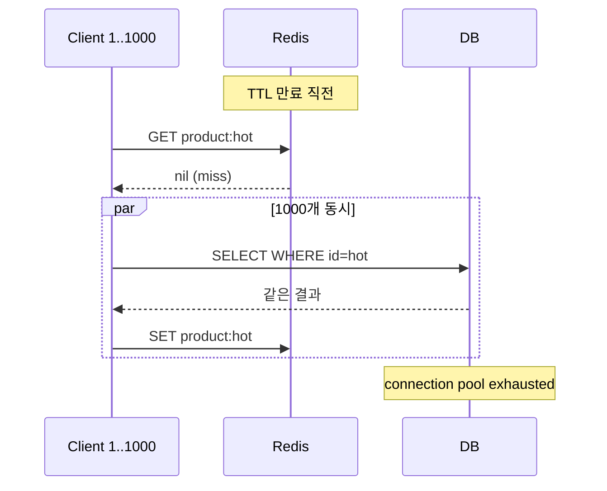

# 11 — Cache Stampede 방어

## 한줄 요약

Cache Stampede (Dog-pile) = "**hot key 가 만료되는 순간 모든 동시 요청이 cache miss → DB 동시 폭주**". 4가지 방어가 표준: (1) **TTL jitter**, (2) **분산 락 (single-flight)**, (3) **Probabilistic Early Recomputation (XFetch)**, (4) **Refresh-Ahead background**. 한 가지로 안 되고 조합해야 한다.

## 1. 문제 정의

### 1.1 시나리오

```
T0: hot key "product:hotitem" 이 캐시에 있음 (TTL 60s)
T59.999: 1000 reqs/sec 가 GET product:hotitem
T60.000: TTL 만료, cache miss
T60.001 ~ T60.500:
   1000개 요청이 동시에 DB 조회 (lock 없음)
   DB 가 1000개 동일 query 처리 + connection pool 고갈
   다른 요청들도 대기 → 전체 latency 솟구침
T60.500: 누군가 cache.set 완료 → 이후 요청은 정상
```

DB 부담이 평소 1 query → 순간 1000 query, 그리고 모두 같은 결과를 가져옴.

### 1.2 mermaid



## 2. 방어 1: TTL Jitter

가장 단순. 모든 키에 같은 TTL 을 주지 않고 ±10% jitter:

```kotlin
val ttl = baseTtl + Random.nextLong(-baseTtl / 10, baseTtl / 10)
redis.set(key, value, Duration.ofSeconds(ttl))
```

이걸로:
- 동일 시점 만료가 분산됨
- 단일 hot key 의 stampede 자체는 못 막지만, 여러 키가 동시에 만료되며 일어나는 cascade 는 막음

→ **base 방어**. 다른 방법과 항상 같이 사용.

## 3. 방어 2: 분산 락 (Single-Flight)

cache miss 시 한 인스턴스만 DB 조회, 나머지는 대기.

### 3.1 흐름

```
1. cache.get(key) → miss
2. SET lock:key uuid NX EX 5
3. lock 획득자 → DB 조회 → cache.set → DEL lock
4. lock 실패자 → 짧게 sleep + cache.get 재시도
```

### 3.2 코드 (Kotlin)

```kotlin
fun getProduct(id: Long): Product {
    val key = "product:$id"
    val cached = redis.opsForValue().get(key)
    if (cached != null) return parse(cached)

    val lockKey = "lock:$key"
    val lockToken = UUID.randomUUID().toString()
    val acquired = redis.opsForValue()
        .setIfAbsent(lockKey, lockToken, Duration.ofSeconds(5)) ?: false

    if (acquired) {
        try {
            // double-check after lock (다른 사람이 이미 채웠을 수 있음)
            redis.opsForValue().get(key)?.let { return parse(it) }

            val product = productRepository.findById(id) ?: throw NotFound()
            redis.opsForValue().set(key, serialize(product), Duration.ofMinutes(10))
            return product
        } finally {
            // owner token 검증 후 release (12 파일 참고)
            unlockSafely(lockKey, lockToken)
        }
    } else {
        // 짧게 sleep 후 cache 재조회
        repeat(10) {
            Thread.sleep(50)
            redis.opsForValue().get(key)?.let { return parse(it) }
        }
        // fallback: lock 못 잡고도 결국 직접 조회 (DB 부하 일부 발생)
        return productRepository.findById(id) ?: throw NotFound()
    }
}
```

### 3.3 함정

- lock 획득자가 OOM / pause 등으로 죽으면 TTL 만료까지 대기자들이 stuck (TTL = 5s 정도로 짧게).
- lock 실패자의 retry 가 너무 짧으면 polling 오버헤드. 너무 길면 latency.
- DEL 시 owner token 검증 안 하면 다른 owner 락 풀어버림 (12 파일).

## 4. 방어 3: Probabilistic Early Recomputation (XFetch)

가장 우아한 알고리즘. **TTL 만료 전부터 호출자가 확률적으로 본인이 refresh**:

```
let ttl = 만료까지 남은 시간 (sec)
let delta = 평균 DB 조회 시간
let beta = 1.0 (튜닝)

P(refresh now) = exp((-ttl / delta) * beta * random())
   if random() < P(refresh now):
       호출자가 직접 DB 조회 + cache 갱신
   else:
       cache 값 그대로 반환
```

### 4.1 동작 직관

- TTL 이 길게 남았으면 P 작음 → 거의 cache hit
- TTL 만료 가까울수록 P 커짐 → 일부 호출자가 미리 refresh
- 만료 정확히 도달하기 전에 누군가 cache 가 새값으로 채워짐
- 결과: 동시 cache miss 자체가 거의 발생 안 함

### 4.2 Kotlin 의사코드

```kotlin
fun getProductXFetch(id: Long, beta: Double = 1.0): Product {
    val key = "product:$id"
    val (value, expiresAt, computeMs) = redis.getWithMeta(key) ?: return refreshAndStore(id)

    val now = System.currentTimeMillis()
    val ttlLeftMs = expiresAt - now
    val xfetchTime = now - computeMs * beta * ln(Random.nextDouble())

    return if (xfetchTime >= expiresAt) {
        // 본인이 미리 refresh
        refreshAndStore(id)
    } else {
        // cache 값 그대로
        parse(value)
    }
}

private fun refreshAndStore(id: Long): Product {
    val start = System.currentTimeMillis()
    val product = productRepository.findById(id) ?: throw NotFound()
    val computeMs = System.currentTimeMillis() - start
    redis.setWithMeta(
        "product:$id",
        serialize(product),
        Duration.ofMinutes(10),
        computeMs,
    )
    return product
}
```

### 4.3 장단점

| 장점 | 단점 |
|---|---|
| lock 없음 → simpler | 구현이 cache 메타데이터 (compute time) 저장 필요 |
| stampede 거의 완전 방어 | beta 튜닝 |
| latency 안정 | 완전한 정확성 X (drift 가능) |

→ 면접에서 "Probabilistic Early Recomputation 알아요?" 가 자주 나옴. **antirez 도 추천하는 패턴**.

## 5. 방어 4: Refresh-Ahead Background

별도 백그라운드 작업이 hot key 를 주기적으로 refresh:

```kotlin
@Scheduled(fixedDelay = 30_000)
fun refreshHotProducts() {
    hotProductIds.forEach { id ->
        val product = productRepository.findById(id) ?: return@forEach
        redis.set("product:$id", serialize(product), Duration.ofMinutes(10))
    }
}
```

장점: 만료 자체를 거의 발생 안 함.
단점: hot key 식별이 필요 + cold key 는 못 잡음 + 모든 인스턴스가 동시에 refresh 하면 또 stampede (lock 필요).

## 6. SingleFlight 패턴 (인스턴스 내)

분산 락보다 가벼운 in-process 동일 키 deduplication. Go 의 `singleflight.Group` 이 대표.

JVM 에서:

```kotlin
class SingleFlight<K, V> {
    private val inFlight = ConcurrentHashMap<K, CompletableFuture<V>>()

    fun execute(key: K, fn: () -> V): V {
        val future = inFlight.computeIfAbsent(key) {
            CompletableFuture.supplyAsync {
                try { fn() } finally { inFlight.remove(key) }
            }
        }
        return future.join()
    }
}
```

같은 인스턴스 내 동일 key 의 동시 호출은 1개로 dedup. 분산 락보다 빠름 (Redis RTT 없음).

→ 분산 락 + SingleFlight 조합이 강력. 인스턴스 내에선 SingleFlight 가 흡수, 인스턴스 간엔 분산 락이 흡수.

## 7. 종합 방어 레시피

대규모 read-heavy 시스템:

```
1. 모든 cache TTL 에 ±10% jitter (TTL Jitter)
2. hot key 식별 (top 100) → background refresh (Refresh-Ahead)
3. 일반 키 → XFetch (probabilistic early)
4. fallback: 분산 락 (lock 시도 후 polling)
5. 인스턴스 내 동일 key dedup → SingleFlight
```

규모 작은 시스템 (TPS 100 이하): TTL jitter + 분산 락 만으로 충분.

## 8. msa 적용 검토

`analytics/ScoreCacheAdapter.cacheProductScore()`:

```kotlin
redis.opsForValue().set(
    "score:product:${score.productId}",
    objectMapper.writeValueAsString(score),
    Duration.ofSeconds(productTtl)            // 7200s 균등, jitter 없음
)
```

문제:
- jitter 없음 → 동일 batch (Kafka Streams 윈도우) 로 적재된 키들이 7200초 후 동시 만료 가능
- stampede 방어 없음
- batch refresh 가 별도 스케줄로 들어와 자연스럽게 cover 되긴 하나 명시적이지 않음

→ 18 improvements 에서:
1. TTL 에 jitter 적용
2. hot product (조회 빈도 top N) 는 explicit refresh-ahead
3. read path 에 XFetch 도입 검토

## 9. Lua 스크립트로 atomic XFetch

```lua
-- KEYS[1] = key
-- ARGV[1] = now_ms
-- ARGV[2] = beta
-- ARGV[3] = random in [0,1) (client side)
-- ARGV[4] = ln(random) — client side (Lua 가 random 미지원)
-- 반환: { value, should_refresh }

local data = redis.call('HGETALL', KEYS[1])
if #data == 0 then
    return { nil, 1 }
end

-- HASH 에 value, expires_at, compute_ms 저장 가정
local map = {}
for i = 1, #data, 2 do map[data[i]] = data[i+1] end

local expires_at = tonumber(map.expires_at)
local compute_ms = tonumber(map.compute_ms)
local now = tonumber(ARGV[1])
local beta = tonumber(ARGV[2])
local ln_rand = tonumber(ARGV[4])
local xfetch_time = now - compute_ms * beta * ln_rand

if xfetch_time >= expires_at then
    return { map.value, 1 }
else
    return { map.value, 0 }
end
```

호출자는 should_refresh=1 이면 본인이 DB 조회 후 cache 갱신.

## 10. 면접 포인트

- "Cache Stampede 가 뭐고 발생 조건?" → hot key TTL 만료 + 동시 요청 폭주.
- "방어 방법 4가지?" → TTL jitter, 분산 락, XFetch, refresh-ahead.
- "XFetch 의 핵심 직관?" → TTL 가까워질수록 호출자가 확률적으로 본인이 미리 refresh. lock 없이 동시 cache miss 거의 0.
- "분산 락만으로 부족한가?" → lock 획득자 죽으면 TTL 동안 stuck. 짧은 TTL + 락 acquire 실패자 fallback 필요.
- "TTL jitter 의 한계?" → 단일 hot key stampede 는 못 막음 (그 키만 만료될 때 폭주). 다른 방어 필요.
- "Single-Flight vs 분산 락?" → SingleFlight 는 in-process, 분산 락은 cross-instance. 둘 조합 권장.

## 11. 다음 파일 연결

분산 락은 stampede 방어 외에도 race condition 차단 용도로 자주 쓰이지만, **올바른 분산 락은 어렵다**. SETNX 의 한계 → RedLock → Kleppmann 비판 → 펜싱 토큰 흐름은 12, 13 에서.
