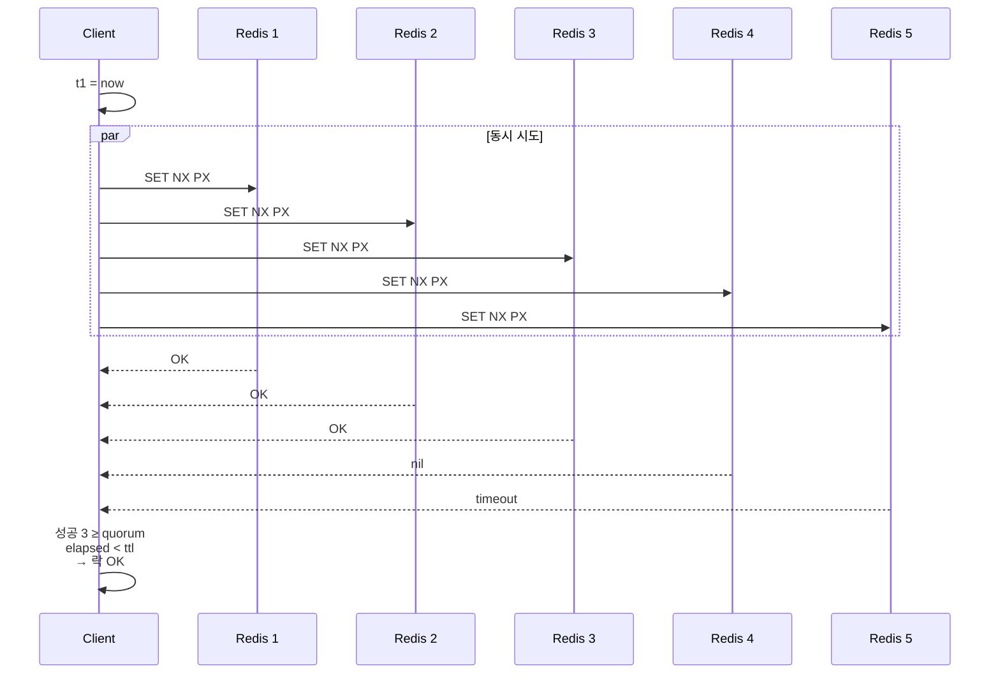
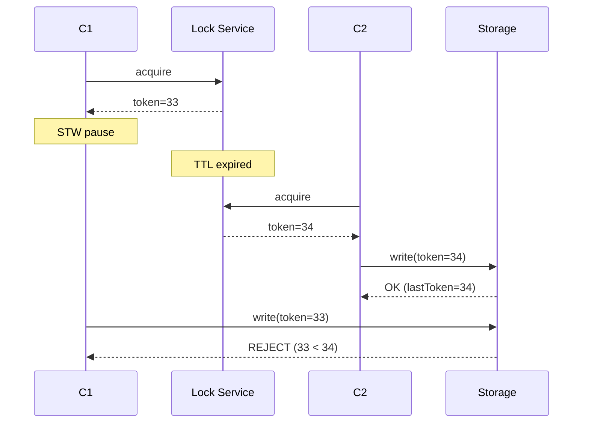

# 13 — 분산 락 ② RedLock + Kleppmann 비판 + Fencing Token

## 한줄 요약

RedLock 은 **5개 독립 Redis 마스터에 동시 락 시도 + 과반 성공이면 락 인정** 하는 antirez 의 알고리즘. 단일 master 의 async replication 문제를 우회하지만 **Martin Kleppmann 이 시계 / GC pause 가정을 비판** — 그가 제시한 답이 **펜싱 토큰 (단조 증가 시퀀스)**. 결론: **mutual exclusion 이 정말 critical 하면 ZooKeeper / Etcd / 또는 DB 의 token 이 진짜 답**, Redis 락은 best-effort.

## 1. RedLock 알고리즘

### 1.1 기본 아이디어

단일 master 가 죽고 replica promote 시 락 데이터 미전파 → 새 owner 가 동일 락을 잡을 수 있는 게 SETNX 의 한계. 그래서 **여러 독립 마스터에 락 시도, 과반 성공 + 시간 안에 끝났으면 락 OK**.

### 1.2 절차 (5개 마스터, quorum=3)

```
1. client 가 현재 시각 t1 기록
2. 5개 마스터 모두에게 동시에 SET lock:key <uuid> NX PX <ttl_ms>
3. timeout (예: 50ms) 내 응답 받음
4. 성공 응답 카운트
5. t2 = 현재 시각, elapsed = t2 - t1
6. if (성공 ≥ 3) and (elapsed < ttl_ms):
       락 획득 인정
       valid_ttl = ttl_ms - elapsed - drift  (시간 보정)
   else:
       락 실패 → 모든 5개에 release 명령 전송 (Lua + owner)
```

`drift` 는 시계 drift 보정 (보통 ttl_ms × 0.01).

### 1.3 mermaid



## 2. RedLock 의 의도와 한계

### 2.1 antirez 의 의도

- 단일 마스터의 async replication 문제 우회
- replication 없이 **마스터 5개를 독립 운영** → 한 마스터 죽어도 4개 중 3개로 락 가능
- "RedLock 은 강한 일관성 보장" 이라고 주장

### 2.2 Kleppmann 의 비판 ("How to do distributed locking", 2016)

핵심 비판 2가지:

#### A. 시계 (Clock) 가정의 위험

```
1. C1 이 락 획득 (5초 TTL, t1=10:00:00)
2. 노드들의 시계가 비동기 (NTP 점프, leap second, VM live migration)
3. 한 노드의 시계가 갑자기 1분 뛰면 그 노드 입장에서 락은 즉시 만료
4. 다른 client C2 가 락 획득
5. 결과: C1 과 C2 가 동시에 락 가졌다고 믿음 → mutual exclusion 깨짐
```

RedLock 은 **monotonic clock 가정**이지만 OS / VM 환경에서 항상 보장 안 됨.

#### B. STW (Stop-the-world) 의 위험

```
1. C1 이 락 획득
2. C1 이 STW GC 로 30초 정지
3. 락 TTL 만료
4. C2 가 락 획득
5. C1 깨어남 → 자기가 락 가졌다고 믿고 critical section 진입
6. 동시 진입 → 데이터 깨짐
```

이건 RedLock 만의 문제가 아니라 **TTL 기반 모든 분산 락의 본질적 한계**. SETNX 도 동일.

### 2.3 antirez 의 반박

- 시계: NTP 차이 정도는 drift 보정으로 흡수 가능
- STW: TTL 을 충분히 크게 설정하면 됨
- 결국 "**완벽한 안전 보장은 어떤 분산 락도 못 한다**" — RedLock 도 마찬가지지만 best-effort 로 충분히 좋다

→ Kleppmann 도 인정: **best-effort efficiency** (불필요한 중복 작업 줄이기) 용도라면 RedLock OK. **correctness** (이중 결제 방지 등) 용도라면 RedLock 도 위험.

## 3. 펜싱 토큰 (Fencing Token)

Kleppmann 의 답: **공유 자원 측에서 토큰의 단조 증가를 검증**.

### 3.1 흐름

```
1. C1 이 lock service 에 락 요청 → token=33 발급
2. C1 이 storage 에 write 시 "token=33" 함께 보냄
3. STW pause
4. C2 가 lock service 에 락 요청 → token=34 발급
5. C2 가 storage 에 write 시 "token=34"
6. C1 깨어남 → storage 에 write 시 "token=33"
7. storage 가 마지막 본 token 보다 작으면 거부 → C1 의 stale write 차단
```

### 3.2 mermaid



### 3.3 핵심

- lock service 가 "단조 증가 token" 을 발급
- 공유 자원 (storage) 이 token 을 받아 단조 증가 검증
- mutual exclusion 이 깨져도 **stale write 자체는 차단**

### 3.4 단조 token 발급 방법

- ZooKeeper / Etcd: `czxid` (생성 transaction id, 단조 증가)
- DB sequence
- Redis 의 `INCR fencing:counter` (단, Redis 가 SSOT 면 단일 master 죽을 때 또 같은 문제)

## 4. Redisson 의 안전성

Redisson 의 `RLock`:
- 단일 master 모드 (`getLock`) — SETNX 와 같은 한계, 다만 watchdog renewal + cluster topology 인지로 운영 부담 ↓
- RedLock 모드 (`getMultiLock`) — RedLock 알고리즘 구현
- **fencing token 자동 발급 X** — 사용자가 별도로 구현해야

Redisson 으로 efficiency 락은 충분, correctness 까지 필요하면 token 검증 추가:

```kotlin
val lock = redisson.getLock("order:42")
lock.lock(10, TimeUnit.SECONDS)
try {
    val token = redisson.getAtomicLong("fencing:order:42").incrementAndGet()
    storageService.write(orderId, payload, fencingToken = token)
} finally {
    lock.unlock()
}
```

storage 가 단조 token 검증하면 안전.

## 5. ZooKeeper / Etcd vs Redis 락

| 항목 | Redis | ZooKeeper / Etcd |
|---|---|---|
| 일관성 | async, eventual | strong (Raft / ZAB) |
| 락 모델 | TTL 기반 | session 기반 (ephemeral node) |
| latency | µs (메모리) | ms (consensus) |
| 적합한 용도 | best-effort, performance | correctness, infra coordination |

Kleppmann 권장: correctness 가 핵심이면 Redis 락 대신 **ZooKeeper / Etcd / Consul** 의 lock primitives.

## 6. msa 적용 추천

현재 msa 는 분산 락 직접 사용 없음 (12 파일). 도입 시 결정 트리:

```
1. mutual exclusion 이 correctness 인가 (틀리면 데이터 깨짐) ?
   YES → ZooKeeper / Etcd 또는 DB transaction (SELECT FOR UPDATE)
   NO  → Redis 락 OK (best-effort)
2. Redis 락 이라면 single master? RedLock?
   single (Redisson getLock) → 운영 단순, 거의 항상 충분
   RedLock → 운영 부담 큼, 거의 같은 위험, 도입 ROI 낮음
3. fencing token 필요한가?
   외부 storage 에 write 하는 락이라면 → 펜싱 token 추가
   in-memory critical section 만이면 → 불필요
```

→ msa 의 경우:
- inventory 재고 차감 → DB transaction + Redis Lua atomic (이미 적용)
- 결제 idempotent → idempotency key + DB unique constraint (분산 락 X)
- batch single execution → Redisson `RLock` 단순 사용 OK

## 7. 결론: "올바른 분산 락" 은 어렵다

- RedLock: efficiency 용도면 OK, correctness 면 부족
- 단일 마스터 SETNX: 운영 단순, 같은 한계
- 펜싱 토큰: TTL 기반 락의 본질적 한계 보완하는 유일한 방법
- 진짜 mutual exclusion: ZooKeeper / Etcd 또는 ACID DB

**한국 면접에서 이 흐름 (RedLock → Kleppmann → 펜싱 토큰) 을 이해하고 있으면 "분산 락 한계?" 질문에 큰 점수**.

## 8. 면접 포인트

- "RedLock 알고리즘?" → N개 독립 마스터 동시 시도 + 과반 + elapsed < ttl.
- "Kleppmann 의 비판?" → clock drift, STW pause 시 TTL 기반은 항상 mutual exclusion 깨짐 가능.
- "펜싱 토큰?" → 단조 증가 token 을 storage 에 함께 전달 → stale write 차단.
- "Redisson 의 watchdog?" → 락 TTL 의 1/3 마다 자동 갱신, GC pause 길지 않으면 안전.
- "ZooKeeper / Etcd 와 Redis 차이?" → consensus (Raft) vs async replication. correctness 가 중요하면 전자.
- "RedLock vs 단일 master?" → RedLock 도 같은 한계 (clock, STW). 운영 복잡도 증가에 비해 이득 작음. 대부분 단일 master + 펜싱 token 으로 충분.

## 9. 코드베이스 적용 권고

18 improvements 에서:
1. ADR 신규: "Redis 분산 락 정책" — Redisson 단일 master + 펜싱 token (외부 storage write 시) 채택, RedLock 미사용 명시
2. 결제 / 동시 자원 수정 use case 발견 시 token 발급 패턴 적용
3. Redis 가 죽어도 mutual exclusion 이 깨지면 안 되는 use case 는 ZooKeeper / Etcd 검토 (ADR 결정)

## 10. 다음 파일 연결

분산 락 끝. 이제 메시지 큐 영역의 Redis Stream 으로 — Kafka 와 비교. 14 에서.
