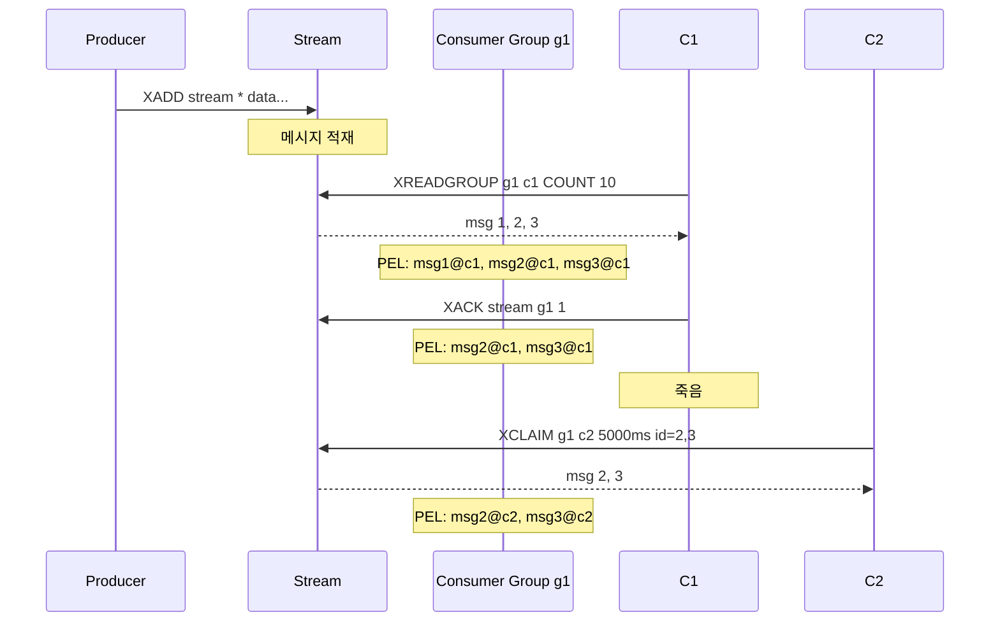

# 14 — Redis Stream + Consumer Group (Kafka 의 라이트 버전)

## 한줄 요약

Redis Stream 은 **append-only log + Consumer Group + ACK + Pending Entries List (PEL)** 로 만들어진 영속 메시지 큐. Pub/Sub 의 휘발성과 List 큐의 ack 부재를 한꺼번에 해결한다. 단일 노드 영속성, 적당한 처리량 (수만 msg/s), 단순한 운영이 매력. **Kafka 보다 작고 가볍지만 처리량 / 보존 / 멀티 broker 확장은 못 따라간다**.

## 1. 핵심 명령

| 명령 | 용도 |
|---|---|
| `XADD stream * field value ...` | append (`*` 는 자동 ID `<ms>-<seq>`) |
| `XREAD COUNT N STREAMS stream lastId` | consumer 단일 read |
| `XGROUP CREATE stream group $ MKSTREAM` | consumer group 생성 |
| `XREADGROUP GROUP g consumer COUNT N STREAMS stream >` | group 내 read |
| `XACK stream group id` | ack — PEL 에서 제거 |
| `XPENDING stream group` | unacked 메시지 (PEL) 조회 |
| `XCLAIM stream group consumer min-idle id` | 다른 consumer 의 미처리 ack 가져오기 |
| `XAUTOCLAIM stream group consumer min-idle 0 COUNT N` | XCLAIM 자동화 (Redis 6.2+) |
| `XLEN`, `XINFO`, `XTRIM`, `XDEL` | 운영 |

## 2. Stream ID

```
1714521600123-0     # ms 시각 - sequence
1714521600123-1
1714521600124-0
```

- 단조 증가 보장 (시계 역행 시 0 추가)
- `*` 으로 server-generated, 또는 직접 명시 가능

## 3. Consumer Group + PEL

### 3.1 흐름



### 3.2 PEL (Pending Entries List)

각 consumer 별로 "**받았지만 ACK 안 한 메시지 목록**". consumer 가 죽거나 처리 실패하면 PEL 에 남아있고, **다른 consumer 가 XCLAIM 으로 가져갈 수 있음**.

```
XPENDING mystream mygroup
> 1) "5"                   # 총 pending
   2) "1714521600100-0"   # 가장 오래된 ID
   3) "1714521605200-0"   # 가장 최근 ID
   4) 1) "consumer1" "3"   # consumer1 이 3개
      2) "consumer2" "2"

XPENDING mystream mygroup IDLE 5000 - + 10
> 5초 이상 idle 한 pending 메시지 10개
```

### 3.3 XCLAIM / XAUTOCLAIM

```
# 5초 이상 미처리된 메시지를 c2 가 가져옴
XCLAIM mystream mygroup c2 5000 1714521600100-0 1714521600101-0

# 자동화 (Redis 6.2+)
XAUTOCLAIM mystream mygroup c2 5000 0 COUNT 10
```

이게 Stream 의 핵심 — **consumer 장애 복구가 자동화 가능**. List 큐엔 없는 기능.

## 4. Stream vs Kafka 비교

| 항목 | Redis Stream | Kafka |
|---|---|---|
| 영속성 | RDB+AOF | 디스크 log |
| 처리량 | 수만 msg/s 단일 노드 | 수십만~수백만 msg/s 클러스터 |
| 보존 | XTRIM, MAXLEN (개수) / MINID (시각) | 시간/크기 retention |
| Consumer Group | ✓ | ✓ (더 성숙) |
| 분산 / 파티션 | ✗ (cluster 의 단일 슬롯) | ✓ (topic partition) |
| ack | ✓ (XACK + PEL) | ✓ (commit offset) |
| 메시지 size | 작은-중간 | 작은-매우 큰 (compacted log) |
| 운영 부담 | 낮음 (Redis 와 같은 인프라) | 높음 (broker / Zookeeper / KRaft) |
| 적합 | 사이즈 작은 작업 큐, 이벤트, dedicated stream | 데이터 파이프라인 / streaming / event sourcing 대규모 |

핵심 결정 지표:

- **데이터 양**: TB / 수백만 events/s → Kafka
- **이미 Redis 인프라 있음** + 수천-수만 msg/s → Stream
- **Consumer 가 단순** (1-2개 worker pool, 단일 노드) → Stream

## 5. Stream vs Pub/Sub vs List

| 항목 | Pub/Sub | List | Stream |
|---|---|---|---|
| 영속성 | ✗ (구독자 다운 = 유실) | RDB/AOF | RDB/AOF |
| 다중 consumer | broadcast (전부) | 1명 | group (분산) 또는 broadcast |
| ack | ✗ | ✗ | ✓ |
| consumer 장애 복구 | ✗ | ✗ | ✓ (XCLAIM) |
| 메시지 retain | ✗ | LTRIM 수동 | XTRIM (MAXLEN/MINID) |
| 시간 기반 조회 | ✗ | ✗ | XRANGE BY id |

→ "Pub/Sub 를 메시지 큐로 쓰면 안 되는 이유" 는 **영속성과 ack 가 없어서**. 구독자가 잠시 끊겨도 메시지 유실. Stream 으로 대체.

## 6. 실전 Stream 사용 예 (Kotlin)

### 6.1 Producer

```kotlin
@Component
class EventPublisher(private val redis: StringRedisTemplate) {
    fun publish(event: DomainEvent) {
        val record = MapRecord.create(
            "events.product",
            mapOf(
                "type" to event.type,
                "payload" to event.toJson(),
                "ts" to System.currentTimeMillis().toString(),
            ),
        )
        redis.opsForStream<String, String>().add(record)
    }
}
```

### 6.2 Consumer (Spring Data Redis Stream listener)

```kotlin
@Component
class EventConsumer(private val factory: RedisConnectionFactory) {
    @PostConstruct
    fun start() {
        val container = StreamMessageListenerContainer.create(
            factory,
            StreamMessageListenerContainer.StreamMessageListenerContainerOptions
                .builder()
                .pollTimeout(Duration.ofSeconds(1))
                .targetType(String::class.java)
                .build(),
        )
        container.receive(
            Consumer.from("group-product", "consumer-1"),
            StreamOffset.create("events.product", ReadOffset.lastConsumed()),
        ) { record ->
            try {
                process(record.value)
                redis.opsForStream<String, String>().acknowledge("group-product", record)
            } catch (e: Exception) {
                log.error(e) { "process failed for ${record.id}, will be reclaimed" }
                // ack 안 함 → PEL 남음
            }
        }
        container.start()
    }
}
```

### 6.3 Pending recovery (XAUTOCLAIM)

```kotlin
@Scheduled(fixedDelay = 60_000)
fun reclaimStuckMessages() {
    val msgs = redis.execute { conn ->
        // Lettuce 직접 호출 (Spring Data Redis API 가 부족)
        conn.streamCommands().xAutoClaim(
            "events.product",
            "group-product",
            "consumer-1",
            Duration.ofMinutes(5),     // 5분 이상 idle 한 메시지
            "0-0",
            10,                         // 최대 10개
        )
    }
    msgs.forEach { /* 재처리 */ }
}
```

## 7. Stream 의 한계

- **단일 슬롯 (cluster)** — 한 키이므로 한 master 에만. partition 같은 분산 처리 불가.
  - 우회: stream 키를 여러개로 나누고 (`events.product:0`, `:1`, ...) consumer 가 round-robin.
- **메시지 retention 정책 한계** — `XADD MAXLEN 10000` 또는 `XTRIM MINID time` 으로 직접 관리. Kafka 의 자동 retention 만큼 정교하지 않음.
- **오래된 메시지 보관 비용** — Redis 메모리. 디스크 기반 Kafka 와 비교 안 됨.

## 8. msa 도입 검토

현재 msa 는 Stream 미사용. Kafka 가 표준 메시지 인프라 (`product → search` 등). Stream 을 별도로 둘 가치는 다음 케이스:

| 시나리오 | Stream 후보? |
|---|---|
| 이미 모든 게 Kafka 인 큰 비즈니스 이벤트 | ✗ (Kafka 유지) |
| 일회성 / 짧은 보존 / consumer 1-2개 | ✓ |
| Real-time notification / WebSocket 트리거 | ✓ |
| Saga / DLQ / dead-letter | △ (Kafka 가 더 안정) |
| In-memory worker queue (분산 cron 등) | ✓ |

→ msa 의 경우 가능한 도입 후보:
- **Notification fanout**: gateway 가 SSE / WebSocket push 하기 위한 in-memory event stream (휘발 OK)
- **Cache invalidation 이벤트** (cross-service): product 캐시 invalidation 같은 짧은 보존 / 빠른 fanout

18 improvements 에서 검토.

## 9. 면접 포인트

- "Redis Stream 의 핵심?" → append-only log + consumer group + PEL + XACK + XCLAIM.
- "Kafka 와 차이?" → 영속성/ack 는 동일, 분산 partition 없음, 처리량 작음, 운영 부담 작음.
- "Pub/Sub 와 차이?" → 영속성과 ack 가 있어서 구독자 다운에도 유실 없음.
- "PEL 이 뭐고 왜 필요?" → consumer 가 받았지만 ack 안 한 메시지 목록. consumer 장애 시 다른 consumer 가 XCLAIM 으로 가져옴.
- "Stream 의 cluster 한계?" → 한 stream 키는 한 master. partition 효과 원하면 키를 여러개로 분산.
- "언제 Stream, 언제 Kafka?" → 데이터 양 + consumer 복잡도. 작으면 Stream, 크면 Kafka.

## 10. 다음 파일 연결

Pub/Sub 는 Stream 의 비교 맥락에서 짧게 다뤘다. 그 외 Pipeline / Lua / Function 같은 명령 실행 메커니즘 + Pub/Sub 한계 정리는 15 에서.
