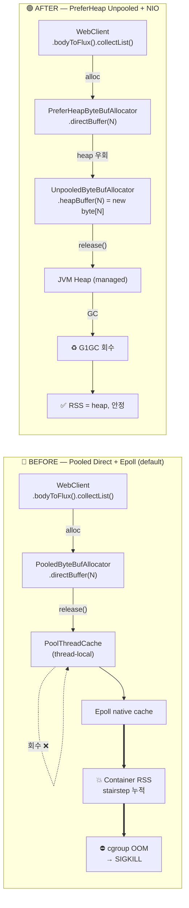

# 외부 연동 API를 일별 처리 배치프로세스에서 수행시 pods RSS 메모리 부하로이한 OOM 이슈

> Spring Batch 기반 채널링 동기화 잡이 컨테이너 RSS 14 GiB 까지 도달하며 K8s 에 의해 SIGKILL 된
> incident 의 분석과 대응. 단발성 사고가 아닌 **6일에 걸친 stairstep 누적**의 정체를
> **WebClient full aggregation × pooled direct buffer retention × ConnectionProvider 분산**의
> 결합 가설로 정리하고, maintainer 권장 setup (PreferHeap + non-native NIO) 으로 1차 mitigation
> 적용한 과정. NMT 증거 부재로 단일 root cause 단정은 보류.

| 항목 | 값 |
|---|---|
| 발생 일자 | 2026-05-13 |
| 서비스 | `channel-sync-batch` (Kotlin / Spring Boot 3.5.9 / Java 25) |
| 영향 | 배치 잡 1회 중단 (executionId=2012, chunk #2 진행 중 SIGKILL) |
| 데이터 손실 | 없음 — chunk #1 의 100건 commit 은 보존, 미처리 790건은 다음 sync 가 catch-up |
| 사용자 영향 | 없음 (배치 잡 단독, API 영향 무) |
| Time to detect | 즉시 (Slack chunk 알림 끊김 + Datadog Container Restart 알림) |
| Time to mitigate | ~85 min (분석 → fix 적용 → 빌드 검증 완료) |
| Time to root cause confidence | 부분 — 코드 정황·외부 사례 정합 확인, 운영 검증 별도 |

---

## TL;DR

- **현상**: JVM `-Xmx4096M` 설정인데 컨테이너 RSS 가 **14.19 GiB** 도달 후 K8s `OOMKilled`.
- **원인 (다중 요인 결합 가설)**:
  - 가장 큰 기여 추정: **`.bodyToFlux().collectList().awaitSingle()` full aggregation** ×
    `max-in-memory-size: 50 MB` × concurrency 30 = 매 배치 in-flight peak 가 GB 단위
  - 보조 기여: PooledByteBufAllocator 의 thread-local cache retention + 다수 ConnectionProvider
    의 arena 분산 → 그 peak 가 high-water mark 로 보관됨
  - 결합으로 **6일 stairstep 누적** (3 GB → 7.5 GB → 14 GiB 임계)
- **fix (이번 PR)**: 배치 fan-out WebClient 들에 한해 `PreferHeapByteBufAllocator(Unpooled.DEFAULT)`
  + 공유 NIO LoopResources (non-native) 를 opt-in 적용. **근본 원인 제거 가 아닌 pragmatic
  mitigation** — retention/native cache 면적은 줄이지만 aggregation 패턴 자체는 그대로.
- **calibration**:
  - "Reactor Netty 버그 확정" ❌, "조합 조건 일치 + 보수적 대응" ✓
  - "PooledByteBufAllocator 만으로 14 GiB" ❌, "aggregation × retention × 분산 의 합성" ✓
  - **사고 당시 NMT 증거 부재**가 본 분석의 최대 약점. 차회 deploy 의 NMT 출력으로 비중 재검증
    필수.

---

## Timeline

| 시각 (KST) | 사건 | 출처 |
|---|---|---|
| `2026-05-07~13` | 컨테이너 RSS 가 ~3 GB → 7.5 GB 로 단조 증가 (stairstep) | Datadog Memory Usage by Pod |
| `2026-05-13 02:02:01` | Provider A FULL sync 시작 (executionId=2012, 890건 / 9 chunk) | Slack `team notification bot` |
| `02:02:42` | chunk #1 완료 (41s, 100건 처리, 110건 event upsert) | Slack chunk alert |
| `02:02:42 ~ 02:06:30` | chunk #2 진행 중 컨테이너 SIGKILL — Slack chunk #2 알림 없음 | (관측 부재가 신호) |
| `02:06:30` | Spring Boot 신규 기동 (PID 1, JVM cold start, 새 `runtime_id`) | 컨테이너 stderr |
| `~02:08` | 메모리 14.19 GiB 피크 마커 + Container OOM Killed 패널 점등 | Datadog Pods Overview |

---

## Background — 시스템 구조

```
┌───────────────────────────────────────────────────────────────────┐
│ channel-sync-batch (Spring Boot 3.5.9 / Java 25 / G1GC)     │
│                                                                   │
│  Spring Batch Job (chunk-oriented step)                           │
│    ├─ Step 1 FetchProductListTasklet  (단일 thread)                │
│    ├─ Step 2 AsyncItemProcessor + AsyncItemWriter (워커 30 thread) │
│    │     ├─ ProductFetchProcessor (worker)                        │
│    │     │     ├─ providerClient.fetchProductEvents() ──┐         │
│    │     │     └─ imageHealthChecker.filterAlive()    ──┤         │
│    │     └─ ProductPersistWriter (REQUIRES_NEW per product)       │
│    └─ Step 3 HoldNotReceivedTasklet                               │
│                                                                   │
└────────────────────────────────────────────────────────┬──────────┘
                                                         │
                                       WebClient (Reactor Netty)
                                                         │
              ┌──────────────────────────────────────────┼──────────┐
              ▼                  ▼                       ▼          ▼
        Provider A API         Provider C API         Provider B    CDN HEAD
        (응답 cap 50MB)    (50MB)                 (50MB)        (1MB)
```

- **JVM**: `-Xmx4096M`, G1GC, MaxGCPauseMillis=200, Datadog APM agent 적재
- **컨테이너**: K8s pod, memory limit 미상 (응답 14 GiB 도달까지 SIGKILL 없었음 = 비교적 큰 limit)
- **공급사 호출 패턴**: WebClient `.bodyToFlux<EventResponse>().collectList().awaitSingle()` —
  응답 전체를 메모리에 적재
- **각 공급사 별 WebClient 빈 + 자체 ConnectionProvider** (`maxConnections=200` 기본)

---

## Investigation

### Phase 1 — "재기동 맞나?" (signal triage)

첫 단서는 운영자가 Slack 의 chunk #1 알림 다음에 chunk #2 알림이 끊긴 점과,
컨테이너 로그에 새로운 Spring Boot 시작 헤더 (PID 1) 가 다시 떨어진 점이었다.

| 신호 | 해석 |
|---|---|
| `Starting BatchApplicationKt ... with PID 1` at `02:06:30` | 컨테이너 콜드 스타트 — JVM 재기동 아님, **파드 재기동** |
| Datadog tracer 의 새 `runtime_id` | 같은 JVM 이 아니라 새 JVM |
| chunk #1 (02:02:42) 직후 ~4분 갭 | chunk #2 처리 중 강제 종료 |

→ JVM 자체 OOM 가능성도 있지만, JVM OOM 이면 `-XX:+HeapDumpOnOutOfMemoryError` 로
`.hprof` 가 남았어야 함. 일단 "컨테이너 OOMKilled (SIGKILL)" 으로 가설을 잡고 다음 신호 탐색.

### Phase 2 — 파드 메트릭으로 가설 1차 검증

Datadog Pods Overview 캡처:

- **Memory Usage by Pod 피크**: `14.19 GiB` @ `02:08`
- **JVM 설정 heap 한도**: `-Xmx4096M` (4 GiB)
- → 4 GiB 의 **3.5 배가 RSS 에 잡힘** = 100% **off-heap** 누적
- `Containers OOM Killed by Pod` 패널 점등 — cgroup limit 초과로 K8s 가 SIGKILL

> **여기서 결정적이었던 reasoning**: heap 은 4 GiB 한도 내에 있을 수밖에 없다. 14 GiB 의 차이
> 10+ GiB 는 반드시 heap 밖이다. Direct memory / native / agent / metaspace / 직접 buffer 가
> 후보. JVM OOM 이 아니라 컨테이너 OOM 이면 SIGKILL 이라 종료 핸들러도 못 돌고, `.hprof` 도
> 안 남는다. 흔적 부재가 곧 단서.

이 시점 가설 분포 (정성):

| 후보 | 가능성 |
|---|---|
| Netty PooledByteBufAllocator thread-local cache | 높음 |
| WebClient 인스턴스/connection pool 누수 | 중 |
| Hibernate QueryPlanCache, metaspace 점진 증가 | 낮음 |
| Datadog agent trace buffer | 낮음 |
| glibc malloc fragmentation | 보조 가능 |

### Phase 3 — 1주 단위 추이로 "단발 vs 누적" 구분

다음 캡처 (Memory Usage by Pod, past 1 week) 에서 **6일간 ~3 GB → ~7.5 GB stairstep**
패턴 확인. 단발성 incident 라면 평탄선 + 한 번의 spike 여야 함.
**stairstep = 다회차 배치 실행마다 일부 잔류분 누적** 이라는 강력한 신호.

이로써 가설은 **장기 retention 패턴**으로 좁혀짐:
- 단발 spike (예: 큰 응답 1건이 heap 폭주) → JVM OOME 가 났어야 함
- stairstep → off-heap 의 thread-local retention 이 자연스러운 설명
- 평균 GC pressure 는 낮음 (heap 안정) — 더더욱 off-heap 쪽 의심

### Phase 4 — 코드 정밀 분석

서브에이전트로 청크 처리·WebClient 설정·LoopResources 사용 패턴 전수 조사. 의심 포인트
복수 발견:

1. **`PooledByteBufAllocator` 기본 사용** — 모든 WebClient 빈이 `WebClientHelper.create()` 경유
2. **`maxConnections=200`** + **WebClient 빈 14+개** = idle connection retention 다수
3. **`max-in-memory-size-mb: 50`** (공급사 yml) — 응답 50 MB 까지 메모리 적재 허용
4. **워커 30 + Netty event loop** = thread-local cache 다수
5. `flushChunkPostProcess` 가 throw 하면 `clearChunkUpserts` 가 안 돌아 chunkUpserts 잔류 —
   (heap 측 marginal leak)

#### ⚠ 1차 분석에서의 오류 발견 (calibration)

서브에이전트의 첫 번째 분석은 "`SyncFailureCollector` drain 안 함" 과
"`SyncJobContextRegistry` cleanup 누락" 을 P1/P2 로 제안했다. 그러나 실제 코드를 직접 읽고
검증한 결과:

- `SyncFailureCollector` 의 queue 는 **설계상** cumulative — `afterJob` 의 최종 Slack 통보와
  Redis flush 가 누적 snapshot 을 요구. **drain 하면 의미가 깨짐.**
- `SyncJobContextRegistry` cleanup 은 `afterJob` 의 `try { ... } finally { cleanup() }` 에
  이미 보장되어 있음. "early return → cleanup skip" 추정은 JVM finally 동작을 잘못 짚은 것.

→ **서브에이전트 분석을 그대로 PR 화하지 않고 코드 직접 검증으로 정정.** 이 단계가 없었다면
의미 없는 변경을 prod 에 올렸을 것.

### Phase 5 — 외부 사례로 가설 외부 검증

같은 동료가 공유한 3개 GitHub 이슈 분석:

| 이슈 | 환경 | 우리와의 유사도 |
|---|---|---|
| [reactor-netty#2590](https://github.com/reactor/reactor-netty/issues/2590) | Spring Boot + WebClient + K8s, 8~32 MB 응답 | 높음 — 같은 증상 (heap 정상, RSS 만 증가, OOM 로그 없음) |
| [spring-framework#29772](https://github.com/spring-projects/spring-framework/issues/29772) | (동일 보고자, Spring 측 트래커) | 높음 |
| [reactor-netty#3558](https://github.com/reactor/reactor-netty/issues/3558) | LoopResources=300, 5 MB 응답 → direct memory 1 GB 폭주 | 매우 높음 — fan-out × 응답 크기 누적 패턴 |

Reactor Netty 메인테이너(violetagg) 의 공식 권장 setup (issue #2590):

> "WebClient by default works with pooled direct memory."
> "You can switch it to **HEAP only unpooled** memory."
> "Also you need to **disable the Epoll** and to run with NIO."

> **단정 금지 (calibration)**: 이 이슈들은 "Reactor Netty 버그가 확정"된 사례가 아니다.
> 우리 reactor-netty 1.2.13 / netty-buffer 4.1.130.Final 은 이슈들 (1.0.x ~ 1.2.0) 보다 신규.
> **"동일 패턴 (대용량 응답 + WebClient + K8s RSS limit) 에서 OOMKill 가능"** 이라는 근거이며,
> maintainer 권장 setup 을 따른 **보수적 대응** 의 근거가 된다.

### Phase 6 — 동료 cross-check 로 누락 발견

내가 1차로 적용한 fix 에 대해 동료가 calibration 의견을 제시:

| 의견 | 검증 결과 |
|---|---|
| `ProviderBConfig.providerBPageWebClient` 도 batch fan-out 경로지만 fix 누락 | ✅ 사실 — `WebClient.builder()` 직접 사용 경로라 `WebClientHelper.create` 우회 |
| reactor-netty 1.2.13 / 이슈 1.0.x~1.2.0 버전 차이 — "같은 버그" 단정 금지 | ✅ 사실 — ADR 문구 calibrate 필요 |
| max-in-memory-size-mb: 50 + concurrency 50 위험 (Provider B 이론상 peak 2.5 GB) | ✅ 사실 — yml 직접 확인 |
| afterChunk finally cleanup 은 별개 (heap-side) — direct memory 와 분리 | ✅ 동의 — 같은 PR 에 묶지만 별개 효과 |

→ `applyHeapOnlyNio(httpClient)` 헬퍼 함수 추가하여 `WebClient.builder()` 우회 경로도
같은 정책 입히도록 보강 + ADR 언어 정정.

---

## Most Probable Root Cause + Contributing Causes

> ⚠ **Calibration**: 본 incident 는 NMT (Native Memory Tracking) 증거가 **사고 당시 확보되지
> 않아** "단일 root cause 확정" 이 불가능하다. 아래는 코드 정황·외부 사례·메트릭 패턴에 기반한
> **기여 원인의 가능성 추정**이며, 차회 deploy 의 NMT 출력으로 비중을 재검증해야 한다.

### 기여 원인 가능성 추정 (probability estimate)

| 기여 원인 | 가능성 | 근거 |
|---|:---:|---|
| **WebClient codec layer 의 large response full aggregation** | **매우 큼** | `bodyToFlux<>().collectList()` 뿐 아니라 `bodyToMono<Dto>`, `bodyToMono<String>`, `bodyToMono<ByteArray>` 모두 사실상 응답 전체를 메모리에 모음. Jackson decoder 도 JSON object/array 를 full buffering. 워커 30 × 응답 최대 50 MB = 이론상 1.5 GB direct memory peak. 가장 직접적 pressure 원인. |
| **`max-in-memory-size-mb: 50` (Spring codec cap)** | **큼** | 위 aggregation 의 상한을 너무 크게 잡음. decoded object + JSON tree + temp byte[] + gzip inflate buffer 까지 부착되면 실제 peak 가 이론값 초과. 공급사 실제 응답은 보통 수 MB → cap 자체가 too generous. |
| **concurrency 30 (AsyncProcessor)** | **큼** | 위 두 요인의 곱셈 인수. 동시 풀이 적으면 동시 in-flight memory 줄어듦. |
| **WebClient 빈 다수 → ConnectionProvider 다수** | 중간 | 14+ 빈, 각자 `ConnectionProvider` + idle connection 보유. event loop 증가 → arena 증가 → thread-local cache 면적 증가. 공유 풀이 더 효율적. |
| **Pooled direct buffer retention** | **중간** | PoolThreadCache 가 release 된 buffer 를 재사용 위해 보관. 그러나 일반적으로 plateau 후 안정화되는 경향. 6일 단조 우상향은 retention "만" 으로 설명하기엔 부족. 위 요인들과 결합되어 stairstep 을 만든다고 보는 게 정확. |
| **Reactor Netty 버그 자체** | 낮음 | 1.2.13 은 이슈 #2590/#3558 (1.0.x~1.2.0) 보다 신규. 해당 이슈들도 공식 fix 가 아닌 "권장 setup" 으로 종료. |
| **`awaitSingle()` (coroutine bridge)** | **낮음** | Netty allocator 는 coroutine suspend 와 무관하게 event loop 의 socket I/O 시점에 ByteBuf alloc/release 가 결정됨. `bodyToMono(...).block()` 으로 바꿔도 allocator 거동은 동일 — `await` 는 응답을 어떻게 기다리느냐만 다르고 buffer lifecycle 은 동일 (상세: Deep Dive §"await vs block"). |

### 누적 메커니즘 (다중 요인 결합 가설)

```
1. WebClient .bodyToFlux().collectList().awaitSingle() — full aggregation
   └─ "스트리밍 외형" 이지만 실제로는 응답 전체를 ByteBuf 들로 materialize
   └─ pooled/unpooled 여부와 무관하게 매 호출당 큰 peak 발생

2. max-in-memory-size = 50 MB × concurrency 30
   └─ 이론상 in-flight peak ≈ 1.5 GB direct memory
   └─ decoded JSON tree / temp byte[] / gzip inflate buffer 부착 시 실제 peak ↑

3. PooledByteBufAllocator + 각 worker thread 마다 PoolThreadCache
   ├─ AsyncProcessor 워커 30
   └─ Netty event loop thread (각 ConnectionProvider 별 풀)
   └─ 다양한 size class 가 골고루 잔류 → 풀 high-water mark 가 큰 값으로 고정

4. 매 배치 실행마다 새 응답 패턴 (행사 수 ↑ 상품 등) 으로 추가 할당
   └─ pooled retention 의 high-water mark 가 단계적 상승

5. WebClient 14+ 빈 × 자체 ConnectionProvider
   └─ idle connection + arena 증가 → 회수 안 되는 영역이 분산되어 다수
```

→ **단일 원인이 아닌 결합 가설**: (1)(2)(3) 의 aggregation pattern 이 매 배치마다 큰 peak 를 만들고,
(3)(4) 의 pooled retention 이 그 peak 를 high-water mark 로 보관하며, (5) 의 분산이 회수 면적을
넓힘. 6일 stairstep 은 이 요인들의 합성으로 보는 게 단일 원인 단정보다 정직하다.

⚠ **Pooled retention 만으로 14 GiB?**: 일반적으로 pooled allocator 는 어느 정도까지 커진 뒤 plateau
되는 경우가 많음 (예: 3 G → 5 G → 5.2 G → 5.1 G 안정화). 6일 단조 우상향은 retention "만" 으로
설명하기엔 부족하며, **응답 크기 × concurrency 조합 + ConnectionProvider 분산**이 결정적 기여로 추정.

### 트리거 조건 (왜 터졌나)

- 실제 incident 는 Provider A FULL sync 도중 발생 (executionId=2012, chunk #2)
- Provider A 공급사 응답 cap `max-in-memory-size-mb: 50`, concurrency `30`
- 행사 多 상품 (단일 상품에 event 40건 이상 보유) 만나면 단일 응답 수 MB → 워커 30 동시 처리 →
  순간 direct memory 수백 MB
- chunk #1 (100건) 의 thread-local 잔류분 + chunk #2 신규 할당 = 마지막 stairstep step
- 이미 누적된 RSS (7.5 GB) 위에 떨어진 마지막 짚이 cgroup limit 초과 트리거

### 왜 평소엔 안 터졌나

- 단일 배치 실행 1회는 회수 안 되어도 절대량이 한계 내 (수백 MB)
- **6일 누적되어서야** 14 GiB 도달
- 따라서 단발성 버그가 아닌 **장기 잠재 누수**. 분 단위 timeline 만 봐선 안 잡힘.

### 만약 응답이 더 작았다면?

stairstep step size 가 작아져 누적 속도가 느려졌을 것. 단순히 응답 크기를 줄이면 (예:
`max-in-memory-size-mb: 50` → `10`) **누적은 늦춰지지만 본질 해결은 아님** — 결국 어느 시점에
같은 패턴 재현. **fix 의 방향은 retention 자체 제거가 맞음.**

---

## Deep Dive — Netty ByteBuf Allocator 메커니즘

이 incident 를 이해하려면 Netty 의 `ByteBuf` 메모리 모델을 알아야 한다. 이 섹션에서는 우리가
**바꾼 것** (Pooled+Direct → Heap-only+Unpooled) 의 양쪽 메커니즘을 설명한다.

### 사전 이해 — `ByteBuf` 가 도대체 뭔가

`ByteBuf` 는 **HTTP 응답/요청의 "내용" 을 캐시하는 객체가 아니라, 네트워크 바이트를 잠시 담는
임시 메모리 버퍼**다. 비유하면:

```
HTTP response JSON          = 물
ByteBuf                     = 물을 잠깐 담는 양동이
PooledByteBufAllocator      = 양동이를 매번 새로 만들지 않고 창고에 보관했다가 재사용하는 시스템
```

#### 실제 lifecycle (요청 한 번)

```
1. socket 에서 bytes 들어옴
2. Netty 가 bytes 를 ByteBuf 에 담음            ← 여기서 ByteBuf alloc
3. HTTP decoder 가 header/body 를 파싱
4. Spring codec / Jackson 이 JSON 을 DTO 로 변환  ← 이때까지 ByteBuf 가 살아있음
5. DTO 생성 완료 → ByteBuf 는 더 이상 필요 없음
6. ByteBuf.release()                            ← Pool 에 반환 (또는 GC 대상)
```

decode 가 끝나면 ByteBuf 자체는 필요 없다. 그러나 pooled allocator 는 그 메모리 덩어리를
OS 에 바로 돌려주지 않고 **다음 네트워크 read/write 에 쓰려고 보관할 수 있다**.

#### "Direct ByteBuf 가 OS 물리 메모리를 점유하는가?" — Yes

| 종류 | 메모리 위치 | 어떻게 잡히는가 |
|---|---|---|
| **Direct ByteBuf** | OS native memory (off-heap) | `Unsafe.allocateMemory(N)` 호출 — 본질적으로 `malloc(N)`. **JVM heap 밖의 진짜 OS 메모리 주소를 점유**. cgroup memory counter 에 잡힘 |
| **Heap ByteBuf** | JVM heap | `new byte[N]` — Java 배열. JVM heap 안. -Xmx 한도 적용 |

→ "off-heap 누적" 은 진짜로 **OS 의 anonymous memory region 이 자라는 것**. cgroup OOMKill 이
이 영역을 보고 트리거됨.

#### 캐시 재사용 조건 — URL/param 무관

흔한 오해: "캐시니까 같은 URL/param 으로 요청하면 같은 ByteBuf 재사용?" → ❌

ByteBuf 풀의 재사용 조건은 **메모리 블록 단위**이지 **요청 시그니처 단위가 아니다**:

| 재사용 조건 | 의미 |
|---|---|
| 필요한 capacity 가 비슷한가 | 1 KB 요청은 풀의 1 KB 사이즈 클래스 슬롯에서 가져옴 |
| heap/direct 종류가 맞는가 | direct buffer 풀과 heap buffer 풀은 별도 |
| 같은 arena 에서 가져올 수 있는가 | Netty 의 arena (보통 cores × 2 개) 단위로 분리됨 |
| 같은 event loop thread / thread-local cache 인가 | 같은 thread 가 release 한 buffer 는 같은 thread 의 cache 큐에 우선 적재 → 같은 thread 가 재사용 시 cache hit |

→ `GET /a` 응답에 썼던 buffer 가 다음에 `POST /b` 요청에 재사용될 수 있다. **content 는 release
시점에 버려지고, 메모리 공간만 재사용**된다.

#### 그래서 우리 batch 에서 왜 문제가 되었나

```
[API 서버 — pooled 가 잘 맞는 경우]
  요청 계속 들어옴
  → pooled ByteBuf 가 계속 재사용됨
  → 풀 크기 == 활성 동시 요청 수 정도로 plateau
  → 성능상 이득 + RSS 안정

[Batch — pooled 가 안 맞는 경우]
  짧은 시간 대량 요청 (워커 30 × fan-out)
  → 큰 ByteBuf 많이 필요
  → 풀이 peak 까지 커짐
  → 배치 끝남 → 요청 거의 없음
  → 재사용 기회 없음
  → 그래도 풀/캐시가 메모리 보유 (재사용 위해 대기)
  → RSS 가 높게 유지
```

**캐시된 것은 "응답 데이터" 가 아니라 "재사용 가능한 메모리 블록"** — request URL/param 의 동일성과는
전혀 무관. batch 처럼 burst 후 idle 패턴은 풀의 재사용 가정 자체가 무너지는 워크로드.

### K8s cgroup 메모리 vs JVM heap — 왜 다른 숫자가 보이나

이 incident 분석 중 검토했던 가설 중 하나: **"Datadog/K8s 가 메모리 사용량을 잘못 측정한 것은
아닌가?"** 결론부터 — 측정 오류가 아니라 **측정 기준이 다른 것**, 그리고 **OOMKilled 이벤트가
실제로 찍혔으므로 cgroup 기준 limit 을 실제로 넘은 것이 확정**.

#### K8s 가 보는 메모리 = cgroup 전체

```
K8s/cgroup memory.current 가 포함하는 영역:
  ├─ JVM Heap (-Xmx 한계 안)
  ├─ Metaspace, JIT code cache, thread stacks
  ├─ Netty pooled/unpooled direct buffers
  ├─ JNI / native library allocation
  ├─ mmap'd files
  ├─ kernel 메모리 (slab, page tables 등)
  └─ 일부 page cache (anon 외 일부)
```

→ **JVM heap used 가 4 GB 안에서 안정** 이어도 위 영역들이 자라면 cgroup 전체는 14 GB 가 될 수 있음.

#### 흔한 오해 패턴

| 관찰 | 해석 |
|---|---|
| heap used 낮음, RSS / NMT 의 direct 높음 | **JVM native/off-heap 의 retention** ← 우리 케이스 |
| `inactive_file` 높음 | reclaim 가능한 page cache — limit 도달 시 자동 회수, OOM 사유 아님 |
| `container_memory_rss` 높음 | anonymous / native / heap 의 실제 상주 ← 진짜 메모리 사용 |
| `working_set_bytes` 만 높고 rss 낮음 | metric 해석 주의 — heuristic |
| **OOMKilled 이벤트 발생** | **cgroup limit 실제 초과 = 측정 오류 아님** |

#### 우리 incident 가 측정 오류가 아닌 근거

1. **OOMKilled 이벤트 자체가 kernel/cgroup 의 판단** — Datadog 의 그래프가 거짓이어도 kernel
   `oom_kill` 가 트리거되려면 cgroup `memory.current >= memory.max` 가 실제로 성립해야 함.
2. **K8s 가 컨테이너를 SIGKILL 했고 새 파드를 띄움** — 이는 controller 가 실제 cgroup OOM 시그널
   을 보고 reschedule 한 결과. 단순 dashboard 오표시였다면 파드 재기동이 일어나지 않음.
3. **stairstep 패턴** — 6일에 걸쳐 일관되게 증가한 그래프는 측정 노이즈로 설명되지 않음
   (노이즈면 진폭만 있고 추세는 없음).

→ "측정이 틀린 게 아니라, JVM heap 만 보고 안심하면 안 된다" 가 정확한 교훈.

#### 차회 deploy 시 동시 관측해야 할 메트릭 (확정용)

```bash
# cgroup v2 (kernel 시각)
cat /sys/fs/cgroup/memory.current        # 현재 사용량
cat /sys/fs/cgroup/memory.max            # cgroup limit
cat /sys/fs/cgroup/memory.stat           # anon / file / inactive_file 분해

# process 시각
cat /proc/1/status | egrep 'VmRSS|RssAnon|RssFile|RssShmem'
cat /proc/1/smaps_rollup

# JVM 시각
jcmd 1 GC.heap_info                      # heap 사용량
jcmd 1 VM.native_memory summary          # NMT — heap 밖 카테고리별
```

세 시각이 일치해야 진단 신뢰. 우리 fix 가 효과 있으면 `memory.current` 의 stairstep 사라지고,
`NMT` 의 Internal/Other direct buffer 영역이 안정될 것.

---

### `await` vs `block()` — allocator 레벨에선 동일

> 흔한 오해: "코루틴 `awaitSingle()` 때문에 메모리가 안 풀린다"
> 결론: 이 incident 와 무관. `PooledByteBufAllocator` 는 coroutine suspend 를 위해 만든 게
> 아니라 **Netty event loop 의 고빈도 네트워크 I/O 최적화**가 목적.

**lifecycle 비교** — 둘 다 동일한 allocator 경로:

```
bodyToMono<Foo>().awaitSingle()      bodyToMono<Foo>().block()
       │                                     │
       ▼                                     ▼
Reactor Netty I/O thread                Reactor Netty I/O thread
  ├─ socket read → ByteBuf alloc          ├─ socket read → ByteBuf alloc
  ├─ Spring codec decode → DTO            ├─ Spring codec decode → DTO
  └─ buffer release()                     └─ buffer release()
       │                                     │
       ▼                                     ▼
  ▶ PooledByteBufAllocator cache/arena retention 동일
       │                                     │
       ▼                                     ▼
  coroutine resume (호출 thread 반환)      worker thread blocking 대기
```

→ allocator 거동은 동일. `await → block` 으로 바꿔도 메모리 미반환 패턴 그대로.
오히려 worker thread blocking 구조라 thread pressure 만 더 나빠짐.

**예외**: coroutine continuation chain 이 길어지면 *heap 측* DTO retention 이 길어질 수 있음 —
하지만 이건 off-heap RSS 문제와는 별개 (heap-측 retention 영역).

### "aggregation" 의 범위 — collectList 만 문제가 아님

> 흔한 오해: "`collectList()` 만 aggregation 이고 `bodyToMono(Dto)` 는 streaming"
> 결론: 둘 다 사실상 full materialization. Spring codec layer 의 decoder 가 응답 전체를 모음.

| 호출 | 실제 동작 |
|---|---|
| `bodyToFlux<Event>().collectList()` | 명시적 aggregation — 가장 명백 |
| `bodyToMono<List<Event>>()` | Jackson 이 JSON array 를 List 로 decode — 사실상 동일 |
| `bodyToMono<String>()` | 전체 body 를 String 으로 모음 — full aggregation |
| `bodyToMono<ByteArray>()` | 전체 body 를 byte[] 로 모음 — full aggregation |
| **진짜 streaming**: `bodyToFlux<DataBuffer>()` 를 incremental consume | 또는 Jackson async parser — 거의 사용 안 함 |

→ JSON object/array 응답은 codec decode 단계에서 어쩔 수 없이 buffering 됨. **fix 의 방향은
호출 표현 (`collectList` vs `bodyToMono<Dto>`) 을 바꾸는 게 아니라, (1) `max-in-memory-size` cap
축소, (2) 실제 streaming consumer 구현, (3) 응답 크기 자체 축소 (paging) 가 본질.**

### Pooled retention — "절대 안 반환" 이 아니라 "즉각적이지 않음"

문서 다른 곳에서 "release 후에도 RSS 가 안 내려간다" 는 표현을 썼는데, 더 정확히는:

- ByteBuf `release()` 는 정상 호출됨 (Netty leak detector 가 안 잡음)
- 그러나 PoolThreadCache / arena 가 **재사용 위해 보관** → OS 에 즉시 반환 안 함
- 일부는 시간이 지나며 arena trim / cache eviction 으로 반환되기도 함
- jemalloc/glibc 의 fragmentation, JVM 의 native memory 회수 정책 차이도 영향

→ "절대 반환 안 됨" ❌, "**반환 정책이 JVM heap GC 처럼 즉각적이지 않다**" ✓

### 핵심 구분 — "진짜 leak" vs "Pooled retention"

> 흔히 혼동되는 두 개념. 우리 incident 는 **두 번째 (pooled retention)** 에 해당.

| 구분 | 의미 | 진단 방법 |
|---|---|---|
| **진짜 memory leak** | `ByteBuf.release()` 호출 누락 → active buffer 가 계속 살아 있음. 시간이 갈수록 active count 증가 | `reactor.netty.bytebuf.allocator.active.direct.memory` 단조 증가 + `-Dio.netty.leakDetection.level=PARANOID` 에서 `LEAK: ByteBuf.release()` 로그 |
| **Pooled retention** | 사용 끝났지만 allocator 가 재사용 위해 arena/thread-local cache 에 보관. **release 는 정상**, OS/RSS 관점에선 안 줄어듦 | `active.direct.memory` 는 안정 / 감소, 그러나 `used.direct.memory` (high-water mark) + 컨테이너 RSS 는 계속 우상향 |

→ "PooledByteBufAllocator 는 누수 버그가 있다" 는 단정은 부정확.
**release 가 안 된 게 아니라, 풀이 의도적으로 보관하는 것**. 우리 incident 는 이 retention 이
batch + K8s 메모리 limit 환경에 맞지 않은 것.

### 왜 PooledByteBufAllocator 가 default 인가?

Netty 는 일반적 네트워크 서버 워크로드 최적화로 `PooledByteBufAllocator.DEFAULT` 를 사용:

| 이유 | 설명 |
|---|---|
| **빈번한 작은 alloc/free** | 네트워크 I/O 는 패킷마다 buffer 가 생긴다. 매번 `Unsafe.allocateMemory` 호출하면 syscall 오버헤드 + cleaner/GC 부담이 큼 |
| **Direct buffer 의 zero-copy 이점** | socket I/O 는 OS 가 직접 읽고 쓰니, JVM heap byte[] 를 거치면 한 번 더 복사 필요. Direct 가 빠름 |
| **Arena + thread-local cache 로 재사용** | 풀에서 받아쓰면 alloc 비용 사실상 zero. RPS 높은 서버는 buffer 가 끝없이 재활용됨 |
| **공식 API 가 그 의도를 반영** | `numHeapArenas`, `numDirectArenas`, `tinyCacheSize`, `smallCacheSize`, `trimCurrentThreadCache()` 등 — 재사용·캐싱이 기본 전제 |

즉 **"메모리를 즉시 OS 에 돌려주는 allocator" 가 아니라 "재사용을 위해 보관하는 allocator"**.
이건 latency 최적화 디자인이지 버그가 아니다.

### 그런데 왜 우리에겐 안 맞았나?

| 환경 | Pooled 가 잘 맞음 | 우리 batch 가 안 맞은 이유 |
|---|---|---|
| **API 서버** | 지속적 트래픽 → 풀이 끊임없이 재사용 → RSS plateau | 배치는 burst 후 idle → idle 동안에도 풀 retention 유지됨 |
| **응답 크기** | 작고 균일 → 풀에 적은 사이즈만 캐싱 | 50 MB 까지 대용량 → 큰 chunk 가 한 번 잡히면 high-water mark 가 그대로 |
| **메모리 한계** | OS 메모리 + swap → RSS 자라도 OK | K8s cgroup limit → RSS 가 limit 초과 시 SIGKILL |
| **JVM 메트릭 만 보는 경우** | heap-주의면 충분 | heap 은 OK 인데 컨테이너가 죽음 → JVM 도구로 안 잡힘 |

→ **PooledByteBufAllocator 자체가 틀린 게 아니라, 우리 워크로드와 trade-off 가 안 맞은 것**.
"Netty 가 잘못됐다" 가 아니라 "batch 컨테이너에서는 throughput 보다 RSS 안정성이 우선" 이라 정책을 바꾼다.

### 두 축: Pooled vs Unpooled / Direct vs Heap

Netty 의 `ByteBuf` 는 두 축으로 분류된다.

|  | **Direct (off-heap)** | **Heap (on-heap)** |
|---|---|---|
| **Pooled** | `PooledByteBufAllocator.directBuffer()` (Netty 기본값) | `PooledByteBufAllocator.heapBuffer()` |
| **Unpooled** | `UnpooledByteBufAllocator.directBuffer()` | `UnpooledByteBufAllocator.heapBuffer()` |

- **Direct vs Heap**: 메모리 *위치*. Direct 는 `Unsafe.allocateMemory()` 로 JVM heap 밖에
  잡힌 native memory (= **off-heap**). Heap 은 `new byte[N]` 으로 JVM heap 내부에 잡힌 배열.
- **Pooled vs Unpooled**: 메모리 *수명*. Pooled 는 free 시 풀에 반납·재사용. Unpooled 는 매번
  새로 alloc / 즉시 free.

Reactor Netty 의 기본값은 **Pooled + Direct** (`PooledByteBufAllocator.DEFAULT`). 이 조합이
일반적으로 가장 빠르지만, 우리 incident 의 직접 원인.

### PooledByteBufAllocator — 어떻게 동작하나

```
PooledByteBufAllocator.DEFAULT
├─ Direct Arenas[N=cores×2]     (각 arena 는 PoolChunk 들의 트리)
│   └─ PoolChunk (기본 16 MB) — Buddy 알고리즘으로 sub-allocate
│       └─ PoolSubpage (8 KB 단위)
└─ Heap Arenas[N=cores×2]       (같은 구조, heap 영역에)

각 thread:
  └─ PoolThreadCache (thread-local)
      ├─ tiny / small / normal MemoryRegionCache 큐
      └─ 캐시 capacity 초과 시 일부 trim 후 arena 로 반환
```

#### 흐름 (요청 알로케이션)

1. Thread A 가 `buffer(N)` 호출 → PoolThreadCache 에서 사이즈 매칭되는 캐시 hit 시도
2. 캐시 miss → arena 에서 PoolChunk subdivide 하여 받음
3. Thread A 가 `release()` → **arena 로 안 가고 PoolThreadCache 큐에 적재**
4. 캐시 큐가 capacity 까지 차면 그제서야 일부 trim → arena 반환

→ **여기가 retention 의 핵심.** thread 가 살아있는 동안 PoolThreadCache 가 메모리를 들고 있는다.
배치처럼 thread pool 이 길게 사는 환경에서 thread 수 × cache size 만큼 잔류.

#### 왜 보통 좋은가

- 캐시 hit 시 `Unsafe.allocateMemory()` syscall 회피 → 알로케이션 latency 매우 낮음
- arena 의 chunk 가 재사용되어 fragmentation 도 낮음
- RPS 높은 API 서버처럼 동일 패턴 반복 워크로드에 최적

#### 왜 우리에겐 독이었나

- 배치 워커 30 + Netty event loop 다수 = thread 수 자체가 많음
- 매 호출 응답 크기가 들쭉날쭉 (50 MB 까지) → 다양한 size class 가 PoolThreadCache 에 골고루 적재
- thread 가 죽지 않음 → cache 도 안 죽음
- 결과: 다회차 배치 실행마다 cache 가 새 패턴으로 채워져 RSS stairstep

### UnpooledByteBufAllocator — 어떻게 동작하나

```
UnpooledByteBufAllocator.DEFAULT
├─ directBuffer(N): Unsafe.allocateMemory(N) → ByteBuf 래핑
└─ heapBuffer(N):   new byte[N] → ByteBuf 래핑

release() → Unsafe.freeMemory() 또는 byte[] 가 GC 대상
```

- **풀 없음.** 매 알로케이션마다 syscall (direct) 또는 GC 대상 객체 생성 (heap)
- **풀 retention 없음.** release 즉시 OS / GC 에 회수 신호
- 알로케이션 latency 는 Pooled 보다 높음 (syscall 또는 minor GC 비용)
- 메모리 사용량은 예측 가능 — 활성 ByteBuf 수 × 평균 크기 ≈ 실제 사용량

### PreferHeapByteBufAllocator — 데코레이터 패턴

```kotlin
new PreferHeapByteBufAllocator(UnpooledByteBufAllocator.DEFAULT)
```

`PreferHeapByteBufAllocator` 는 **다른 allocator 를 감싸는 데코레이터**다. 동작:

- `directBuffer(...)` 호출이 와도 **내부적으로 `heapBuffer(...)` 로 우회**
- `buffer(...)` (방향 미지정) 도 heap 으로 우회
- 명시적 `directBuffer()` API 만 wrap 한 allocator 의 동작을 따름

즉 `PreferHeapByteBufAllocator(UnpooledByteBufAllocator.DEFAULT)` 의 효과:

| 호출 | 결과 |
|---|---|
| `buffer(N)`, `directBuffer(N)` | **Unpooled Heap** (`new byte[N]` 후 ByteBuf 래핑) |
| `heapBuffer(N)` | **Unpooled Heap** (같음) |

→ **모든 ByteBuf 알로케이션이 JVM heap 으로 우회**. off-heap (direct memory) 사용 자체가 zero.
heap 은 `-Xmx` 한도 안에서 G1GC 가 회수 — 컨테이너 RSS 에 누적되지 않음.

#### Trade-off

- ✅ off-heap 누적 zero, RSS 예측 가능
- ✅ Reactor Netty maintainer (violetagg) 권장 setup
- ⚠ heap 사용량 증가 (이전엔 direct 였던 게 heap 으로) — `-Xmx4096M` 안에서 G1GC 가 처리 가능 추정
- ⚠ Pool hit 의 latency 이득 사라짐 (배치엔 무시 가능)
- ⚠ Direct → Heap 변환 시 일부 Netty 의 zero-copy 최적화 (예: file transfer) 가 어려워질 수 있음.
  하지만 우리는 file transfer 안 함.

### Native Transport (Epoll/io_uring) 의 추가 영향

Reactor Netty default 는 Linux 에서 `EpollEventLoopGroup` (native transport) 사용:

- Java NIO Selector 대신 Linux native `epoll_wait()` 호출
- I/O latency / throughput 우위
- **그러나 native 코드 자체가 별도 direct buffer 캐싱을 보유** — JVM heap 도 PoolThreadCache 도
  아닌 third 영역에 retention 발생
- maintainer 가 권장하는 `-Dreactor.netty.native=false` 또는 코드 `.runOn(loopResources, false)` 는
  이 native 영역까지 NIO Selector 기반으로 통일 → direct buffer 캐싱 제거

```kotlin
httpClient.runOn(sharedNioLoopResources, /* preferNative = */ false)
```

이 한 줄로:
1. 공유 LoopResources 사용 (클라이언트당 별도 풀 폭증 방지)
2. Epoll/io_uring 비활성화 (NIO Selector 사용)
3. Native 영역의 direct buffer 캐싱 제거

### 최종 메모리 흐름 비교

#### (1) Allocation flow — 호출 시 어디로 가는가



#### (2) 메모리 레이아웃 — 컨테이너 안에서 어디에 쌓이나

```
🔴 BEFORE (Pooled Direct + Epoll)                    🟢 AFTER (PreferHeap Unpooled + NIO)
═══════════════════════════════════════════         ═══════════════════════════════════════════

┌─ Container memory (cgroup limit) ──────┐          ┌─ Container memory (cgroup limit) ──────┐
│                                        │          │                                        │
│ ┌─ JVM Heap (-Xmx4096M) ─────────────┐ │          │ ┌─ JVM Heap (-Xmx4096M) ─────────────┐ │
│ │                                    │ │          │ │ ▓▓▓ ByteBuf = new byte[N]          │ │
│ │  (Java objects only)               │ │          │ │ ▓▓▓ Java objects                   │ │
│ │  ░░░ GC managed                    │ │          │ │ ░░░ G1GC managed                   │ │
│ │                                    │ │          │ │                                    │ │
│ └────────────────────────────────────┘ │          │ └────────────────────────────────────┘ │
│                                        │          │                                        │
│ ┌─ Off-heap (no limit) ──────────────┐ │          │  (off-heap 사용 zero)                  │
│ │ ▓▓▓▓▓▓▓▓▓ PoolThreadCache          │ │          │                                        │
│ │ ▓▓▓▓▓▓▓▓▓ ⚠ retention ↑↑↑          │ │          │  (NIO Selector — no native cache)      │
│ │                                    │ │          │                                        │
│ │ ▓▓▓▓ Epoll native cache            │ │          │                                        │
│ │ ▓▓▓▓ ⚠ retention ↑↑                │ │          │                                        │
│ │                                    │ │          │                                        │
│ │ ░ Datadog agent buffers (always)   │ │          │ ░ Datadog agent buffers (always)       │
│ │ ░ Metaspace / Code cache (always)  │ │          │ ░ Metaspace / Code cache (always)      │
│ └────────────────────────────────────┘ │          │                                        │
│                                        │          │                                        │
│   RSS = heap (≤4G) + off-heap (자라남) │          │   RSS ≈ heap (≤4G) + 소량 baseline    │
│                                        │          │                                        │
│           ⛔ cgroup OOM                │          │           ✅ stable                    │
└────────────────────────────────────────┘          └────────────────────────────────────────┘

  범례:  ▓ = 잔류/누적 영역    ░ = 정상 관리 영역
```

#### (3) Stairstep 누적 — 시간 축에서 본 RSS

```
Container RSS (Memory Usage by Pod, past 1 week — 실제 캡처 재현)

15 GiB ┤                                                            ┤ 14.19 ⛔ SIGKILL
       │                                                          ╱─┘
       │                                                       ╱─╱
10 GiB ┤                                                  ┌──╱
       │                                          ┌──────┘   ← 마지막 배치 1회 spike 가 cgroup 초과
       │                                  ┌──────┘
 7 GiB ┤                          ┌───────┘                ← 6일 누적 후 임계 근접
       │                  ┌───────┘
 5 GiB ┤          ┌───────┘                                ← 매 배치 실행 후 일부 잔류
       │  ┌───────┘
 3 GiB ┤──┘                                                ← 신규 deploy baseline
       └──┬─────┬─────┬─────┬─────┬─────┬─────┬─────┬─
        Wed7  Thu8  Fri9  Sat10 Sun11 Mon12 Tue13 Wed13
                                                  └─ 02:08 KST, 14.19 GiB peak

  ◆ 각 step = 배치 1회 실행 후 thread-local PoolThreadCache 에 추가 잔류
  ◆ 평탄 구간 = 배치 없는 시간 (그래도 회수 안 됨 — pooled retention 의 본질)
  ◆ Day 7 마지막 step = cgroup limit 초과 → K8s SIGKILL → 파드 재기동
```

#### (4) 한 줄 요약

> Pooled Direct ByteBuf 가 thread-local cache 로 잔류 → JVM heap 밖이라 `-Xmx` 통제 불가
> → 매 배치마다 stairstep 누적 → cgroup limit 초과 → SIGKILL.
>
> Heap-only Unpooled 로 우회하면 모든 ByteBuf 가 JVM heap 에 들어가고 G1GC 가 회수
> → RSS 가 `-Xmx` 안에서 안정.

---

## Resolution

### 본 fix 의 적합성 자기평가

> "현재 allocator 변경이 적합한 대응인가?" 에 대한 self-assessment.

#### 6개 기여 원인 중 본 fix 가 다루는 범위

| 기여 원인 | 가능성 | 본 fix 대응 |
|---|:---:|:---:|
| WebClient codec full aggregation | **매우 큼** | ❌ 미대응 |
| `max-in-memory-size-mb: 50` cap | **큼** | ❌ 미대응 |
| concurrency 30 | **큼** | ❌ 미대응 |
| ConnectionProvider 다수 | 중간 | 🟡 LoopResources 만 공유 (ConnectionProvider 분산은 그대로) |
| Pooled direct retention | 중간 | ✅ 완화 |
| Native transport caching | 중간 | ✅ 제거 |

→ "매우 큼 / 큼" 3개는 미해결. 본 fix 는 **6개 중 2개를 직접, 1개를 부분 완화** 수준.

#### 🚨 새 위험: heap 압력 이동

allocator 변경의 본질은 "off-heap → heap" 이동. 그런데:

- 이론상 in-flight peak: 워커 30 × 응답 최대 50 MB = **1.5 GB heap 추가 압력**
- `-Xmx4096M` 의 잔여 margin: ~2~2.5 GB (기존 Java 객체 + Spring Batch 메타 + agents 제외 시)
- 정상 응답 (수 MB) 은 G1GC 가 무난히 처리하지만, **큰 응답이 동시 다발하면 JVM OOME 또는 long
  GC pause 발생 가능**
- "RSS OOMKill" 이 **"JVM heap OOME" 으로 형태만 바뀔 위험**

JVM OOME 는 `.hprof` 가 남고 graceful 종료 → cgroup SIGKILL 보다는 진단·복구 친화적이지만,
빈도 늘면 운영 부담.

#### 평가 결론

| 시나리오 | 적합성 | 권장 |
|---|:---:|---|
| 현재 fix **단독** | 🟡 60% | 핫픽스 수준. 운영 RSS 즉시 완화하지만 heap OOME 모니터링 필수 |
| 현재 fix + `max-in-memory-size-mb: 50 → 5~10` | 🟢 85% | aggregation cap 축소로 heap 압력도 동시 완화. **가장 ROI 좋음** |
| 현재 fix + concurrency 축소 (30 → 10~15) | 🟢 85% | 동시 in-flight 자체 감소. 처리 시간 ↑ trade-off |
| 현재 fix revert + `max-in-memory-size` 축소만 | 🟡 70% | 안전하지만 retention 완화 효과 포기 |
| 현재 fix + streaming 리팩토링 | 🟢 95% | 근본 해결. 큰 작업, 별도 PR |

#### 회피한 함정 (자기점검)

추가 분석이 `await → block` 같은 변경을 안 한 것은 다행. `awaitSingle()` 은 root cause 와 무관:

- Netty allocator 캐시는 coroutine suspend 를 위해 만든 게 아님
- event loop 의 socket I/O 시점에 ByteBuf alloc/release 결정 → `await` 던 `block` 이던 동일
- 만약 잘못 짚었다면 효과 zero + worker thread blocking 으로 더 나빠졌을 것

(상세: Deep Dive §"`await` vs `block()` — allocator 레벨에선 동일")

#### ⚠ 표현 정확도

- ❌ "direct memory 사용 제거" → ✅ "**pooled direct pressure 완화**"
- TLS/OpenSSL · JDK socket internals · compression · Netty internals 일부는 여전히 direct memory 사용
- ❌ "release 후 RSS 안 내려감" → ✅ "**반환 정책이 JVM heap GC 처럼 즉각적이지 않음**" (arena trim / cache eviction / fragmentation 영향)

### 핵심 fix — WebClient Netty allocator 전략 변경

```kotlin
// Before: default PooledByteBufAllocator + native Epoll
WebClientHelper.create(properties, objectMapper)

// After: opt-in PreferHeap(Unpooled) + non-native NIO
WebClientHelper.create(properties, objectMapper, useHeapOnlyNio = true)
```

내부 동작:

1. **`ChannelOption.ALLOCATOR` = `PreferHeapByteBufAllocator(UnpooledByteBufAllocator.DEFAULT)`**
   - common Netty I/O buffer (`buffer()`, `ioBuffer()`) 알로케이션을 heap 으로 우회
   - heap 은 `-Xmx4096M` 안에서 G1GC 가 회수
   - ⚠ **"off-heap 사용 zero" 는 보장하지 않음** — 명시적 `directBuffer()` 호출이나 SSL/TLS native
     내부 direct allocation 까지 차단 못함. 대부분의 retention 경로 (`PoolThreadCache`) 만 차단.
   - trade-off: heap 압력 ↑ (이전엔 direct 였던 것이 heap 으로 이동)
2. **`.runOn(sharedNioLoopResources, preferNative = false)`**
   - 공유 NIO LoopResources (lazy singleton)
   - thread 수 = `LoopResources.DEFAULT_IO_WORKER_COUNT` (= `max(cores, 4)`) — Reactor Netty
     기본값 사용. 메모리 안정화가 목적이라 thread 늘릴 이유 없음.
   - 클라이언트별 별도 풀 생성 방지 (5 클라이언트 → 단일 풀)
   - Epoll/io_uring 비활성화 — native transport 의 별도 direct buffer 캐싱 제거

### 적용 범위 (공급사 무관 동등 적용)

| 클라이언트 | 적용 | 비고 |
|---|---|---|
| `providerAWebClient`, `providerATokenWebClient` | ✅ | **실제 incident 발생 경로** |
| `providerCWebClient` | ✅ | preventive |
| `providerBWebClient` | ✅ | preventive (concurrency 50 으로 잠재 max) |
| `providerBPageWebClient` | ✅ | `WebClient.builder()` 직접 경로 — `applyHeapOnlyNio` helper |
| `imageHealthCheckWebClient` | ✅ | HEAD only 지만 fan-out 효과 |
| `upsWebClient`, `searchWebClient`, `partnerWebClient` 등 API 공용 | ❌ | latency 결정적, 기본값 (pooled) 유지 |

### 보조 fix — `SyncChunkListener.afterChunk` try-finally 보장

```kotlin
override fun afterChunk(context: ChunkContext) {
    try {
        flushChunkPostProcess()                              // throw 가능
        notifyChunkDelta(context.stepContext.stepExecution, state)  // runCatching 으로 격리
        persistFailureSnapshot(state)                        // runCatching 으로 격리
    } finally {
        registry.clearChunkUpserts(jobExecutionId)           // ← lifecycle 보장
    }
}
```

- `flushChunkPostProcess` (productChangePostProcessor 호출) 가 throw 해도 chunkUpserts list 가
  다음 chunk 로 leak 되지 않도록 finally 보장
- **direct memory 문제와는 별개의 heap-측 marginal leak 경로** — 14 GiB 의 직접 원인은 아니지만
  lifecycle 정합성 개선

### ADR-0033 신규 — WebClient Netty ByteBuf Allocator 전략 (Convention)

- 결정 근거, 거부된 대안 5가지, 외부 사례 3개 링크
- "단정 금지" 박스 — 버그 확정 아닌 보수적 대응 명시
- 검증 메트릭 (Datadog `bytebuf.allocator.active.direct.memory`) 명시
- 후속 검토 항목: `max-in-memory-size-mb` 축소 / `concurrency vs maxConnections` 정합

### 의도적으로 안 한 것 (out-of-scope, 차후 PR — 우선순위 순)

> 본 fix 의 효과를 보고 단계적 적용. 1~3번은 본 incident 의 **추정 주범** 영역이라 본 fix 가
> 충분치 않으면 우선 진행.

| 우선순위 | 항목 | 이유 |
|:---:|---|---|
| **1** | **NMT (Native Memory Tracking) 도입** — `-XX:NativeMemoryTracking=summary` + `jcmd VM.native_memory` | **본 incident 의 최대 약점은 사고 당시 NMT 증거 부재**. heap 외 카테고리별 (Internal/Thread/Other) 추적 없이는 어떤 fix 가 듣는지 단정 불가 |
| **2** | **`max-in-memory-size-mb: 50 → 5~10` 축소** | 응답 실제 크기는 보통 수 MB. 50 MB cap 은 too generous. 단일 응답 alloc 상한 자체를 낮추면 모든 기여 원인에 효과 |
| **3** | **`bodyToFlux().collectList()` → 진짜 streaming consume** | **가장 큰 기여로 추정되는 full aggregation 패턴 제거.** 그러나 도메인 로직 (이벤트 normalize, persist) 와 묶여있어 큰 리팩토링 |
| **4** | `concurrency` vs `maxConnections` 정합 점검 + 공유 `ConnectionProvider` 도입 | 풀 idle retention 측정 후 결정. event loop / arena 면적 축소 효과 |
| **5** | `-Dio.netty.leakDetection.level=PARANOID` + `-XX:MaxDirectMemorySize=1G` | 진짜 release 누수 여부 확정. pooled retention 만이면 leak 로그 안 나옴 — 그것도 정보 |
| **6** | Spring Batch `BATCH_JOB_EXECUTION` 의 `executionId=2012 STARTED` 정리 | 운영 SQL — 별도 진행 |

---

## Verification Plan

코드만으로는 "이 fix 가 14 GiB 누수의 직접 원인을 잡았다" 단정 불가. 운영 1회 deploy 후 다음을 관측:

### 1차 검증 (deploy 후 24시간)

- ✅ Container RSS 가 배치 실행 후 회수되는가 (이전 stairstep step 의 잔류분 사라지는가)
- ✅ JVM heap 사용량 — 이전 direct 사용분이 heap 으로 이동했는지 (예상되는 변화, 정상)
- ✅ `Containers OOM Killed by Pod` zero 유지

### 2차 검증 (1주 추이)

- ✅ 1주 RSS 그래프가 평탄 또는 진폭만 있고 우상향 stairstep 없는지
- `reactor.netty.bytebuf.allocator.active.direct.memory` 가 GC 후 감소하는지
- `reactor.netty.bytebuf.allocator.used.direct.memory` (high-water mark) 는 감소 안 함 — 정상

### 회귀 시 (fix 가 부족하면)

- NMT 추가 (`-XX:NativeMemoryTracking=summary`) → `jcmd VM.native_memory summary` 로 카테고리 추적
- `Internal` / `Other` 가 자라면 native 영역 — Netty 외 다른 누수
- `Class` 가 자라면 클래스로더 leak (드묾, 배치엔)
- `Thread` 가 자라면 thread pool leak

---

## Lessons Learned

### 기술적 교훈

1. **`-Xmx` 는 heap 만 잡는다.**
   컨테이너 RSS limit 은 heap + direct + metaspace + JIT code cache + thread stack + native +
   agents 전체. K8s memory limit 산정 시 모든 비-heap 영역 합을 고려해야 함. JVM heap 한도 안에
   있다고 안심하면 안 됨. (상세: Deep Dive §"K8s cgroup 메모리 vs JVM heap")

2. **Pooled allocator 는 latency-결정적 워크로드에만 좋다.**
   thread-local cache 의 회수 안 됨이 latency 안정성을 주지만, 배치처럼 thread 가 길게 살면서
   다양한 패턴을 반복하는 워크로드엔 retention 이 누적되어 독이 됨. **워크로드 특성에 따라 allocator
   를 분리** 하는 것이 옳다.

3. **단발 timeline vs 다회차 추이의 분리 관찰.**
   incident 의 분 단위 timeline 만 보면 "동기화 청크 처리 중 터졌다" 까지 밖에 안 보임.
   1주일 RSS 추이로 stairstep 을 봐야 "단발 spike 가 아닌 누적 누수" 라는 본질을 발견할 수 있음.
   **시간 축을 다중 스케일로 보는 습관.**

4. **흔적 부재가 곧 단서.**
   JVM OOM 이었으면 `.hprof` 가 남는다. SIGKILL 이면 종료 핸들러도 못 돈다. **OOMKilled 면
   `.hprof` 가 없다** 는 게 cgroup 측 OOM 확정의 강한 신호.

5. **NMT 가 없으면 off-heap 누수는 추정의 영역에 머문다.**
   본 incident 의 최대 약점은 **사고 당시 `-XX:NativeMemoryTracking=summary` 미적용**. JVM heap
   밖 메모리가 자란 건 확실해도, *어디* (Direct buffer / Internal / Thread / Class / Native code)
   가 자랐는지는 NMT 없이 단정 못함. allocator/streaming/connection pool 중 어느 게 진짜 주범인지
   확정하려면 NMT 가 필수. **JVM 모니터링 baseline 에 NMT 를 default 로 두자.**

6. **"단일 root cause" 보다 "기여 원인 비중 추정" 이 정직하다.**
   처음엔 `PooledByteBufAllocator` retention 을 root cause 로 단정하려 했으나, 동료 검토에서
   `collectList()` full aggregation + 50 MB cap + ConnectionProvider 분산이 더 큰 기여일 수 있다는
   지적. **incident 의 본질이 "다중 요인의 결합"** 일 때 단일 원인 단정은 위험. 가능성 추정 표
   (probability estimate) 로 표현하는 게 정확.

### 분석 process 의 교훈

5. **서브에이전트 / LLM 분석은 검증 없이 PR 화 금지.**
   1차 서브에이전트 분석 (`SyncFailureCollector` drain, `Registry` cleanup) 은 그럴듯했지만
   코드 직접 검증 결과 부정확. **"실제 코드 검증"을 task 로 명시적으로 분리** 한 것이 의미 있는
   차단이었음.

6. **외부 사례는 단정의 근거가 아닌 정합의 근거.**
   reactor-netty#2590 / #3558 / spring-framework#29772 는 우리 incident 와 같은 패턴이지만,
   버전 차이가 있어 "동일 버그 확정" 은 못 함. **"동일 패턴 + 보수적 대응"** 으로 어조를 calibrate
   하는 게 정직.

7. **동료 cross-check 의 가치.**
   1차 fix 후 동료가 `providerBPageWebClient` 누락, 버전 단정의 문제, max-in-memory-size-mb
   수치를 짚어줌. **혼자 검토 + AI 검토 + 동료 검토** 의 세 단계가 각자 다른 종류의 오류를 잡음.

### 더 잘할 수 있었던 점

- 첫 프롬프트 부터 "verification 기준" 을 명시했으면 분석 범위가 더 빨리 좁혀졌을 것. ("가장 가능성
  높은 3개만 보고하고 멈춰" 식 exit criteria)
- 운영 모니터링 옵션(NMT, leak detection) 을 progress 사전 검토에 묶었으면, 추후 별도 PR 없이 함께
  배포 가능했을 것

---

## Appendix

### A. 코드 변경 통계

```
4 commits on fix/sync-chunk-listener-cleanup
8 files changed, +200 -50 lines (대략)
```

| 파일 | 변경 |
|---|---|
| `infrastructure/.../webclient/WebClientHelper.kt` | `useHeapOnlyNio` 파라미터 + 공유 LoopResources (`DEFAULT_IO_WORKER_COUNT`) + `applyHeapOnlyNio` helper |
| `infrastructure/.../config/WebClientConfiguration.kt` | `imageHealthCheckWebClient` 적용 |
| `infrastructure/.../client/providerA/ProviderAConfig.kt` | 토큰 + 메인 WebClient 적용 |
| `infrastructure/.../client/providerC/ProviderCConfig.kt` | 적용 |
| `infrastructure/.../client/providerB/ProviderBConfig.kt` | 메인 + page WebClient 적용 |
| `batch/.../productsync/step/SyncChunkListener.kt` | try-finally cleanup |
| `docs/adr/ADR-0033-webclient-allocator-strategy.md` | 신규 (Convention) |
| `docs/adr/README.md` | ADR-0033 인덱스 등록 |

### B. 검증 명령 (재현용)

```bash
# 빌드
./gradlew :infrastructure:compileKotlin :batch:compileKotlin

# 테스트
./gradlew :infrastructure:test :batch:test

# 운영 deploy 시 진단용 JVM 옵션 (선택)
-XX:NativeMemoryTracking=summary
-Dio.netty.leakDetection.level=PARANOID
-XX:MaxDirectMemorySize=1G

# 운영 진단 (NMT)
jcmd <pid> VM.native_memory baseline
# … 배치 1회 후 …
jcmd <pid> VM.native_memory summary.diff
```

### C. 참고 자료

- [reactor-netty #2590](https://github.com/reactor/reactor-netty/issues/2590)
- [spring-framework #29772](https://github.com/spring-projects/spring-framework/issues/29772)
- [reactor-netty #3558](https://github.com/reactor/reactor-netty/issues/3558)
- [Netty Reference Counted Objects](https://netty.io/wiki/reference-counted-objects.html)
- [Reactor Netty HTTP Client Metrics](https://projectreactor.io/docs/netty/release/reference/http-client.html#metrics)

### D. 사용된 기술 스택

- Java 25 (OpenJDK Temurin)
- Kotlin 2.x, Spring Boot 3.5.9, Spring Batch
- Reactor Netty 1.2.13, Netty 4.1.130.Final
- AWS EKS, Datadog (APM + Pods Overview), Pinpoint
- Gradle 9.3, kotlin-spring/kotlin-allopen 컴파일러 플러그인
